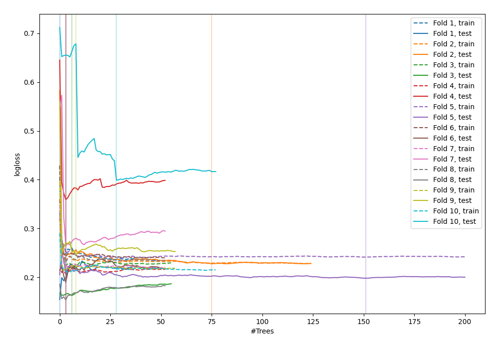
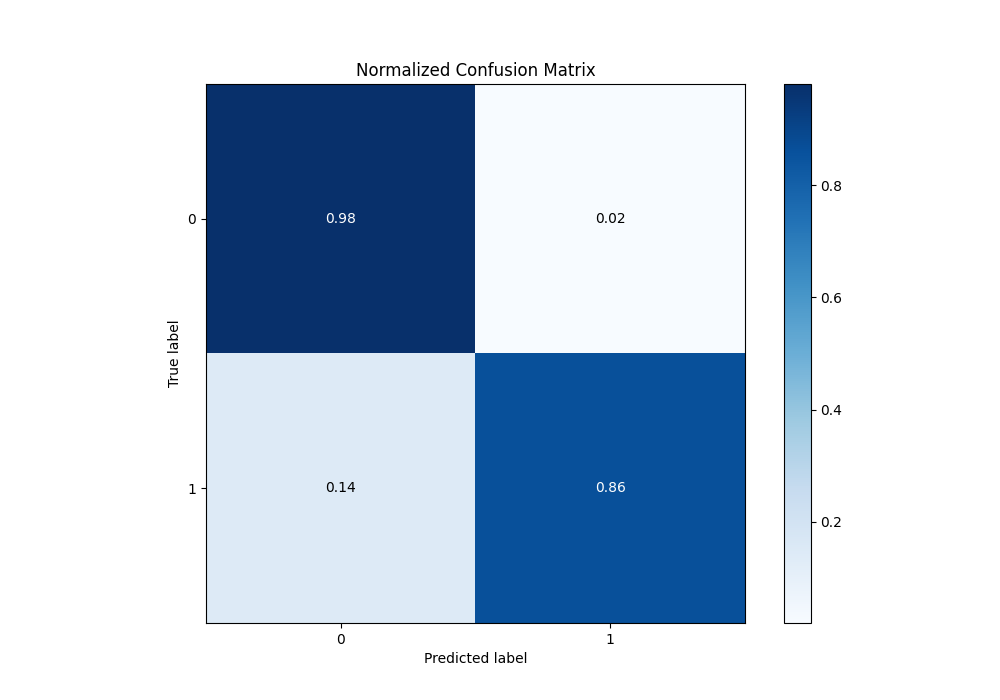
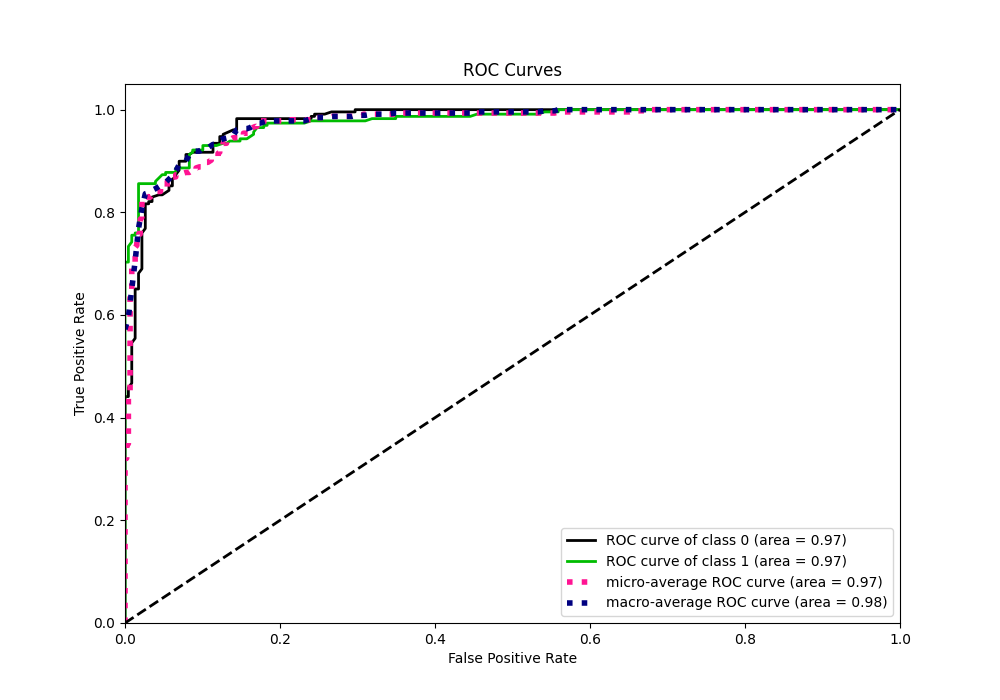
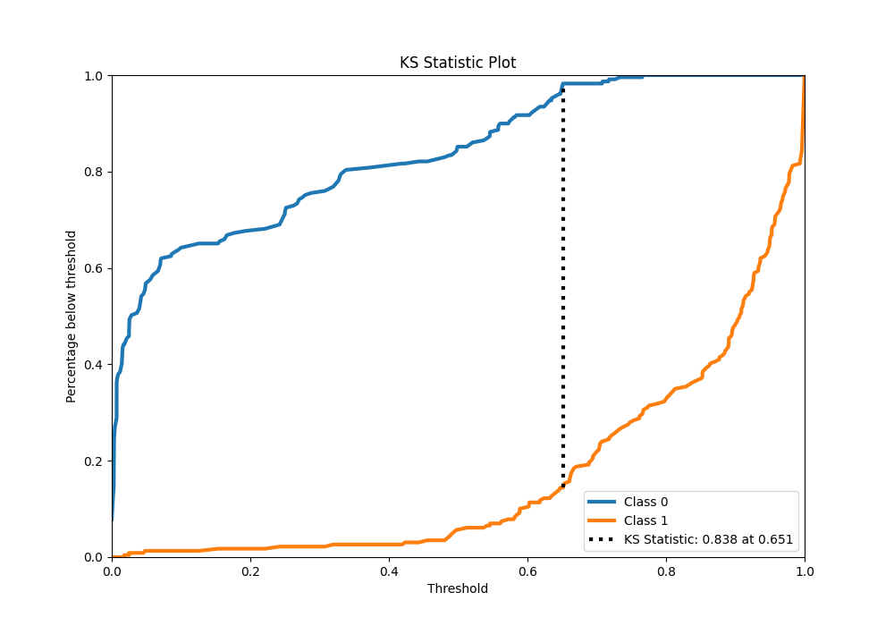
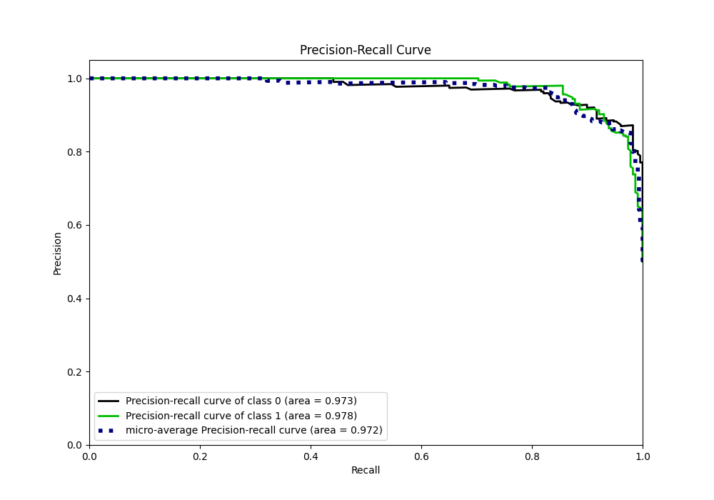
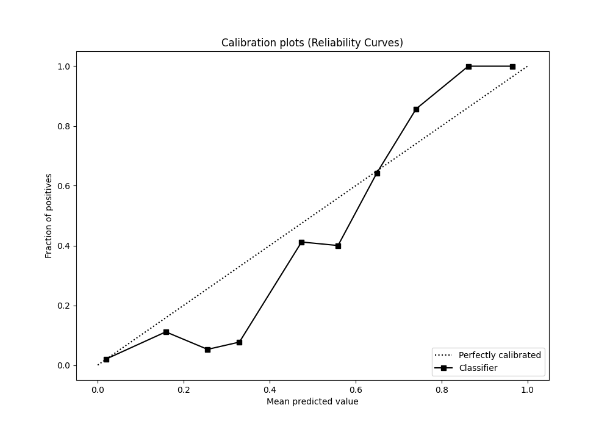
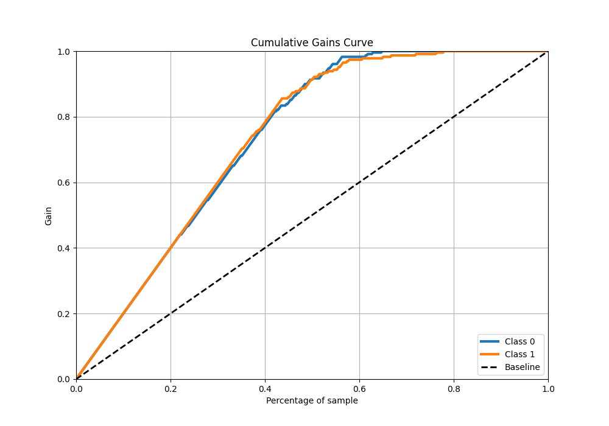
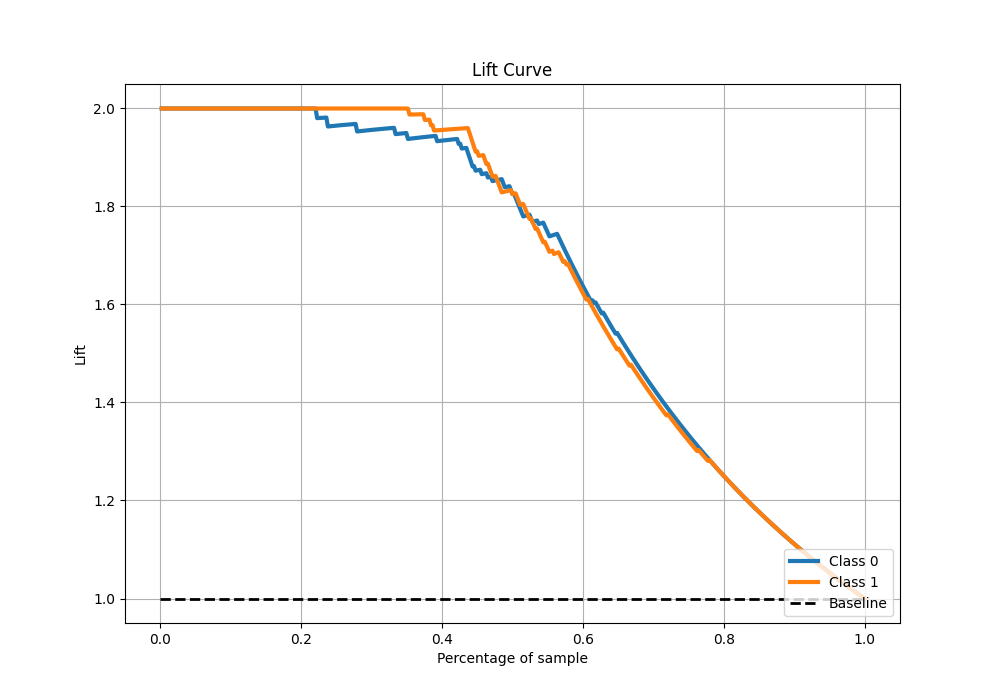

# Summary of 45_RandomForest

[<< Go back](../README.md)

## Random Forest
- **n_jobs**: -1
- **criterion**: gini
- **max_features**: 0.9
- **min_samples_split**: 40
- **max_depth**: 5
- **eval_metric_name**: logloss
- **explain_level**: 0

## Validation
 - **validation_type**: kfold
 - **shuffle**: True
 - **stratify**: True
 - **k_folds**: 10

## Optimized metric
logloss

## Training time

21.8 seconds

## Metric details
|           |    score |   threshold |
|:----------|---------:|------------:|
| logloss   | 0.235061 |  nan        |
| auc       | 0.974981 |  nan        |
| f1        | 0.914661 |    0.584058 |
| accuracy  | 0.919214 |    0.651184 |
| precision | 1        |    0.766599 |
| recall    | 1        |    0        |
| mcc       | 0.845233 |    0.651184 |

## Metric details with threshold from accuracy metric
|           |    score |   threshold |
|:----------|---------:|------------:|
| logloss   | 0.235061 |  nan        |
| auc       | 0.974981 |  nan        |
| f1        | 0.913753 |    0.651184 |
| accuracy  | 0.919214 |    0.651184 |
| precision | 0.98     |    0.651184 |
| recall    | 0.855895 |    0.651184 |
| mcc       | 0.845233 |    0.651184 |

## Confusion matrix (at threshold=0.651184)
|              |   Predicted as 0 |   Predicted as 1 |
|:-------------|-----------------:|-----------------:|
| Labeled as 0 |              225 |                4 |
| Labeled as 1 |               33 |              196 |

## Learning curves

## Confusion Matrix

## Normalized Confusion Matrix

## ROC Curve

## Kolmogorov-Smirnov Statistic

## Precision-Recall Curve

## Calibration Curve

## Cumulative Gains Curve

## Lift Curve

[<< Go back](../README.md)
