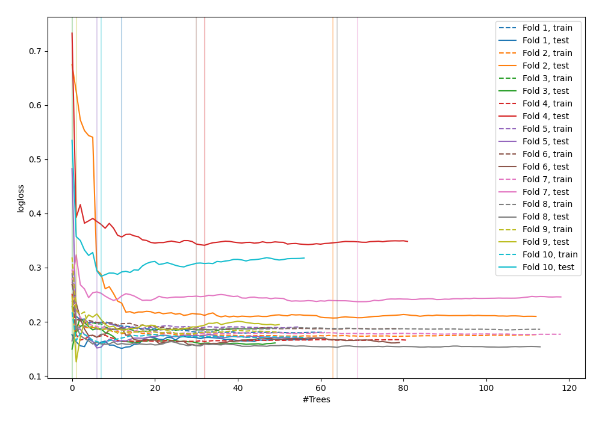
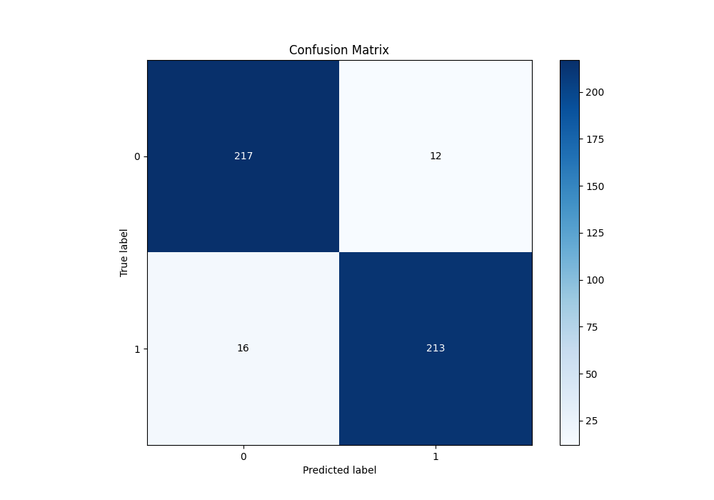
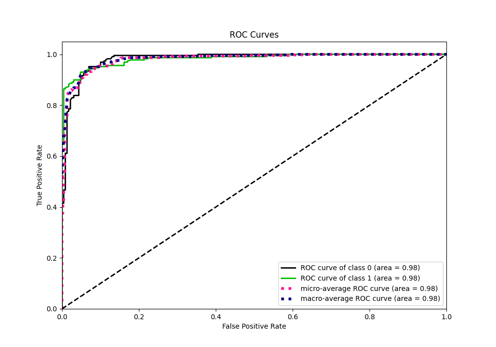
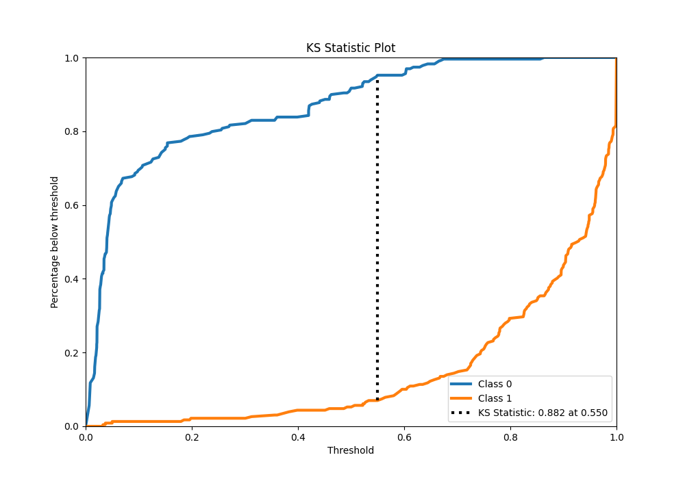
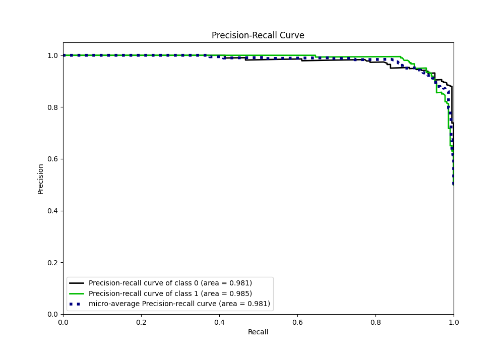
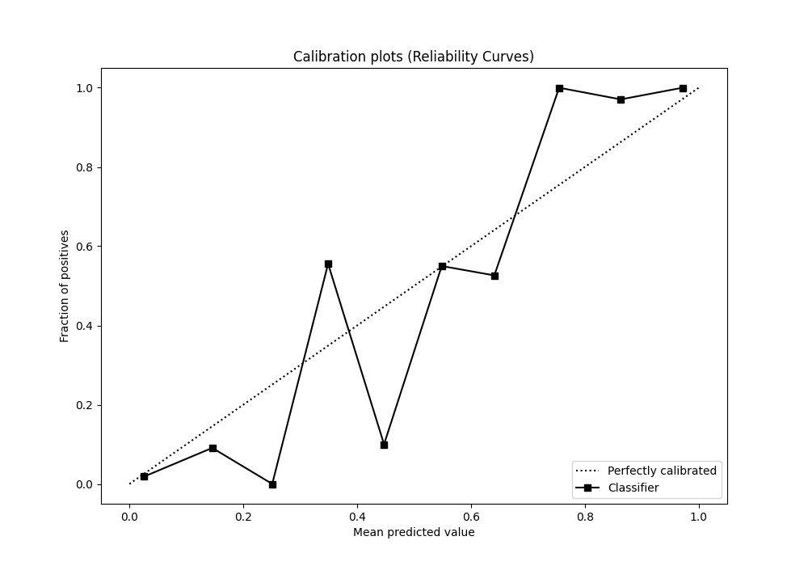
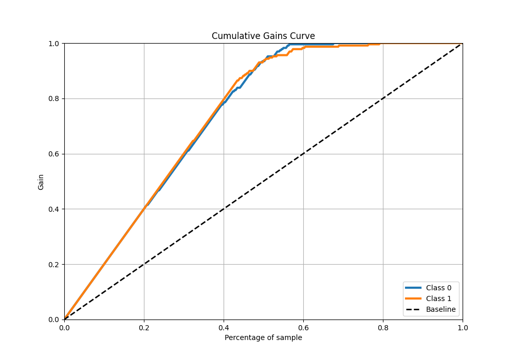
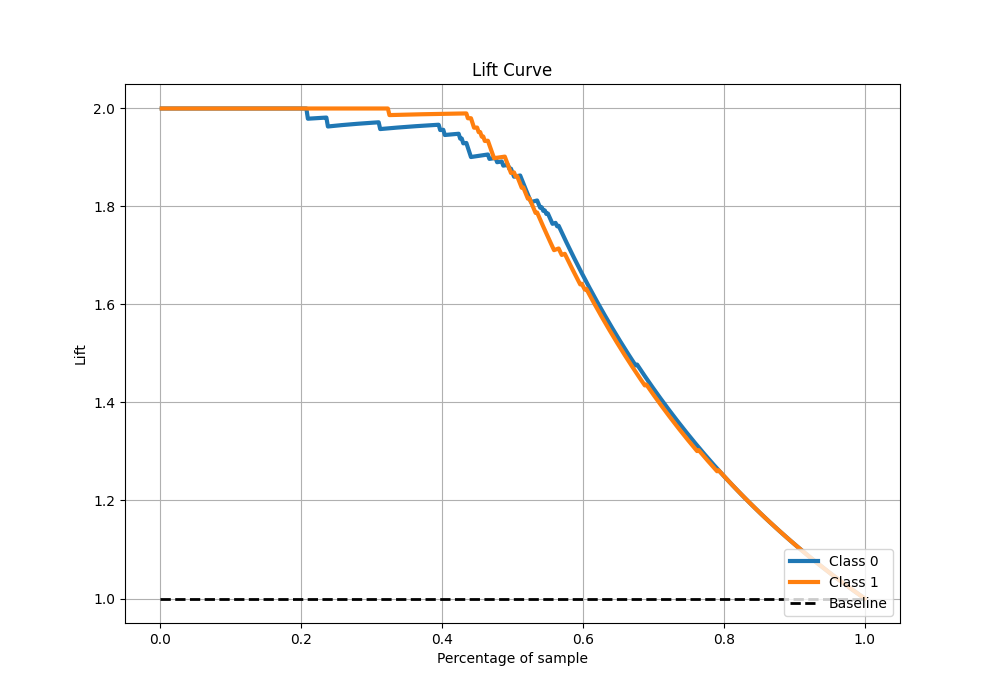

# Summary of 46_RandomForest

[<< Go back](../README.md)

## Random Forest
- **n_jobs**: -1
- **criterion**: gini
- **max_features**: 0.6
- **min_samples_split**: 20
- **max_depth**: 4
- **eval_metric_name**: logloss
- **explain_level**: 0

## Validation
 - **validation_type**: kfold
 - **shuffle**: True
 - **stratify**: True
 - **k_folds**: 10

## Optimized metric
logloss

## Training time

22.4 seconds

## Metric details
|           |    score |    threshold |
|:----------|---------:|-------------:|
| logloss   | 0.195568 | nan          |
| auc       | 0.98259  | nan          |
| f1        | 0.938326 |   0.548485   |
| accuracy  | 0.938865 |   0.548485   |
| precision | 1        |   0.870801   |
| recall    | 1        |   0.00604027 |
| mcc       | 0.877863 |   0.548485   |

## Metric details with threshold from accuracy metric
|           |    score |   threshold |
|:----------|---------:|------------:|
| logloss   | 0.195568 |  nan        |
| auc       | 0.98259  |  nan        |
| f1        | 0.938326 |    0.548485 |
| accuracy  | 0.938865 |    0.548485 |
| precision | 0.946667 |    0.548485 |
| recall    | 0.930131 |    0.548485 |
| mcc       | 0.877863 |    0.548485 |

## Confusion matrix (at threshold=0.548485)
|              |   Predicted as 0 |   Predicted as 1 |
|:-------------|-----------------:|-----------------:|
| Labeled as 0 |              217 |               12 |
| Labeled as 1 |               16 |              213 |

## Learning curves

## Confusion Matrix

## Normalized Confusion Matrix

## ROC Curve

## Kolmogorov-Smirnov Statistic

## Precision-Recall Curve

## Calibration Curve

## Cumulative Gains Curve

## Lift Curve

[<< Go back](../README.md)
