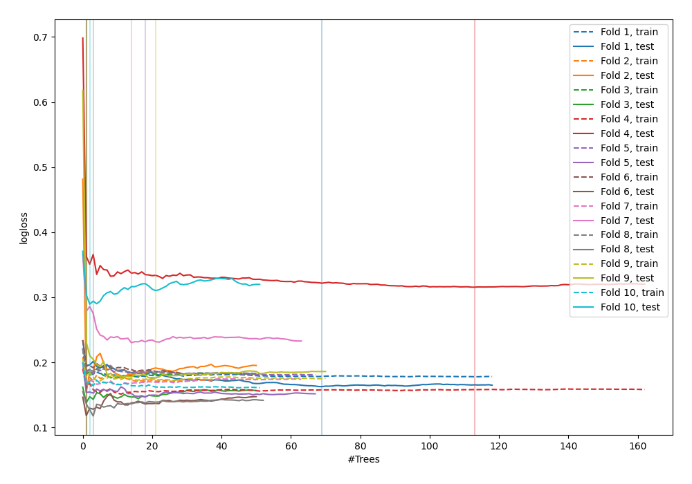
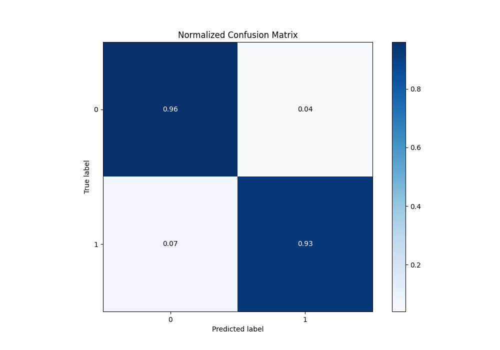
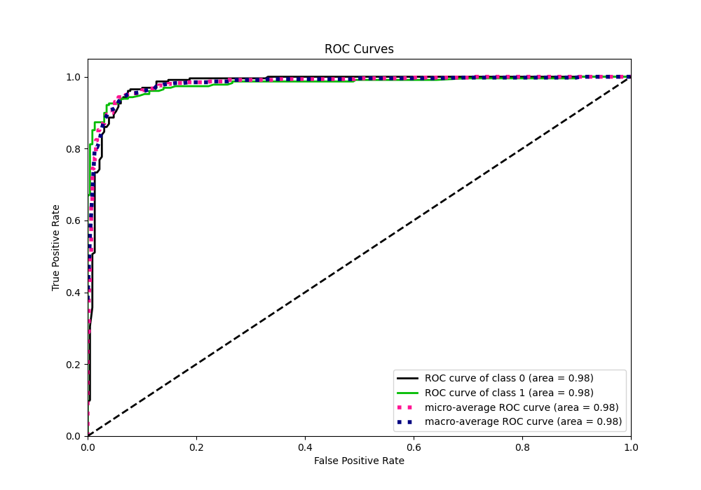
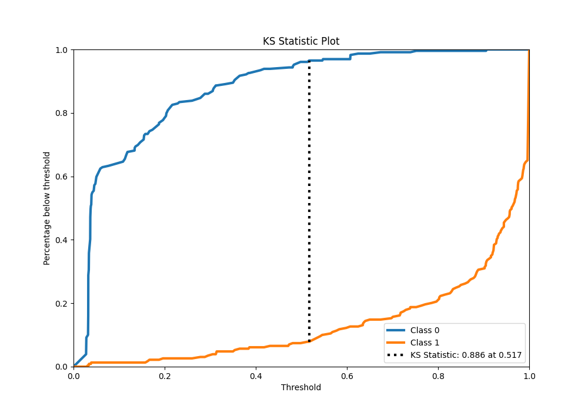
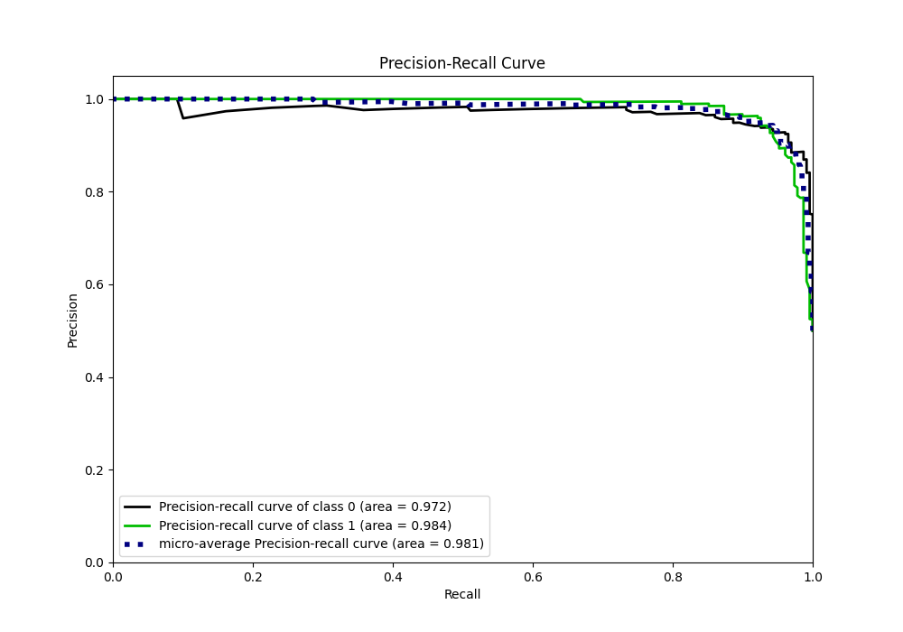
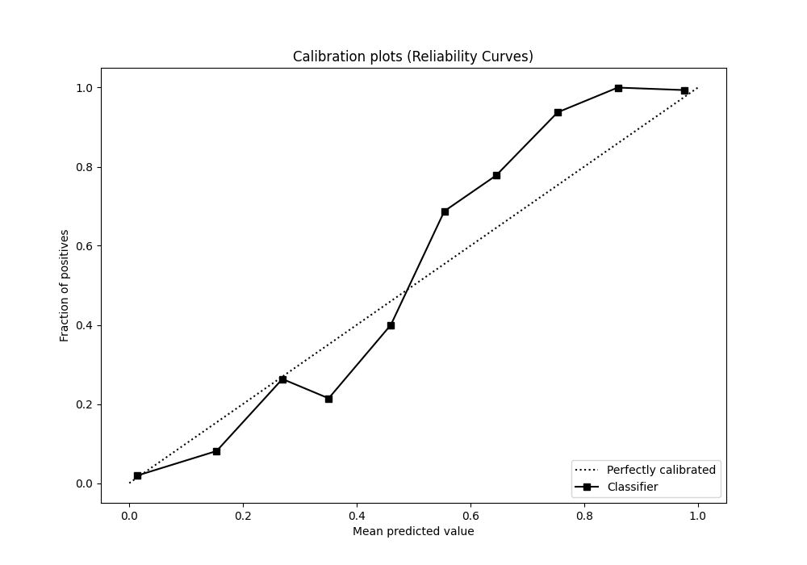
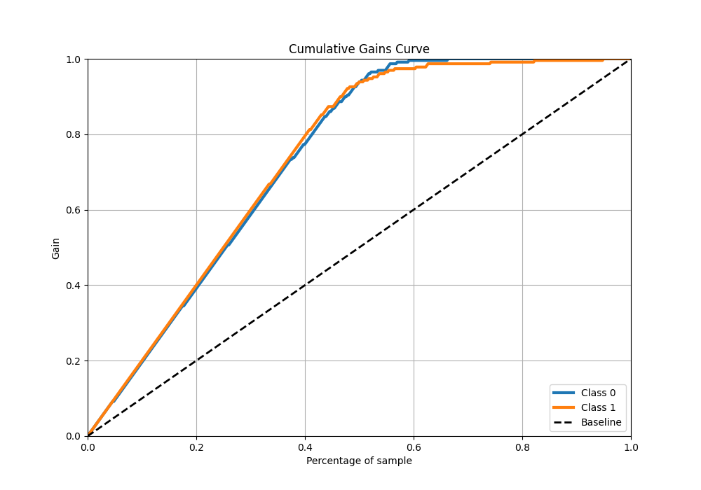
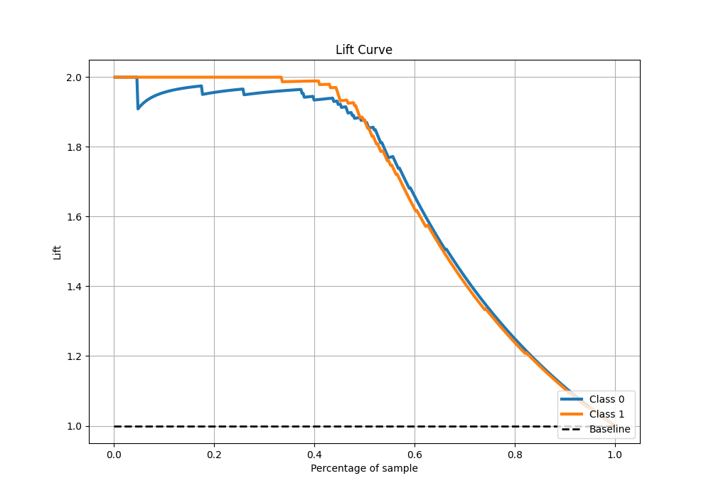

# Summary of 48_ExtraTrees

[<< Go back](../README.md)

## Extra Trees Classifier (Extra Trees)
- **n_jobs**: -1
- **criterion**: gini
- **max_features**: 0.5
- **min_samples_split**: 20
- **max_depth**: 4
- **eval_metric_name**: logloss
- **explain_level**: 0

## Validation
 - **validation_type**: kfold
 - **shuffle**: True
 - **stratify**: True
 - **k_folds**: 10

## Optimized metric
logloss

## Training time

12.2 seconds

## Metric details
|           |    score |   threshold |
|:----------|---------:|------------:|
| logloss   | 0.184721 | nan         |
| auc       | 0.979911 | nan         |
| f1        | 0.942222 |   0.505854  |
| accuracy  | 0.943231 |   0.505854  |
| precision | 1        |   0.90721   |
| recall    | 1        |   0.0248473 |
| mcc       | 0.887004 |   0.505854  |

## Metric details with threshold from accuracy metric
|           |    score |   threshold |
|:----------|---------:|------------:|
| logloss   | 0.184721 |  nan        |
| auc       | 0.979911 |  nan        |
| f1        | 0.942222 |    0.505854 |
| accuracy  | 0.943231 |    0.505854 |
| precision | 0.959276 |    0.505854 |
| recall    | 0.925764 |    0.505854 |
| mcc       | 0.887004 |    0.505854 |

## Confusion matrix (at threshold=0.505854)
|              |   Predicted as 0 |   Predicted as 1 |
|:-------------|-----------------:|-----------------:|
| Labeled as 0 |              220 |                9 |
| Labeled as 1 |               17 |              212 |

## Learning curves

## Confusion Matrix

## Normalized Confusion Matrix

## ROC Curve

## Kolmogorov-Smirnov Statistic

## Precision-Recall Curve

## Calibration Curve

## Cumulative Gains Curve

## Lift Curve

[<< Go back](../README.md)
