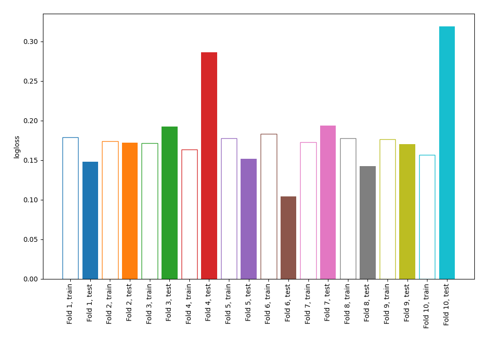

# Summary of 4_Linear

[<< Go back](../README.md)

## Logistic Regression (Linear)
- **n_jobs**: -1
- **explain_level**: 0

## Validation
 - **validation_type**: kfold
 - **shuffle**: True
 - **stratify**: True
 - **k_folds**: 10

## Optimized metric
logloss

## Training time

5.6 seconds

## Metric details
|           |    score |    threshold |
|:----------|---------:|-------------:|
| logloss   | 0.18766  | nan          |
| auc       | 0.974447 | nan          |
| f1        | 0.941176 |   0.526158   |
| accuracy  | 0.943231 |   0.526158   |
| precision | 1        |   0.89985    |
| recall    | 1        |   0.00736128 |
| mcc       | 0.888635 |   0.526158   |

## Metric details with threshold from accuracy metric
|           |    score |   threshold |
|:----------|---------:|------------:|
| logloss   | 0.18766  |  nan        |
| auc       | 0.974447 |  nan        |
| f1        | 0.941176 |    0.526158 |
| accuracy  | 0.943231 |    0.526158 |
| precision | 0.976526 |    0.526158 |
| recall    | 0.908297 |    0.526158 |
| mcc       | 0.888635 |    0.526158 |

## Confusion matrix (at threshold=0.526158)
|              |   Predicted as 0 |   Predicted as 1 |
|:-------------|-----------------:|-----------------:|
| Labeled as 0 |              224 |                5 |
| Labeled as 1 |               21 |              208 |

## Learning curves

## Confusion Matrix

## Normalized Confusion Matrix

## ROC Curve

## Kolmogorov-Smirnov Statistic

## Precision-Recall Curve

## Calibration Curve

## Cumulative Gains Curve

## Lift Curve

[<< Go back](../README.md)
