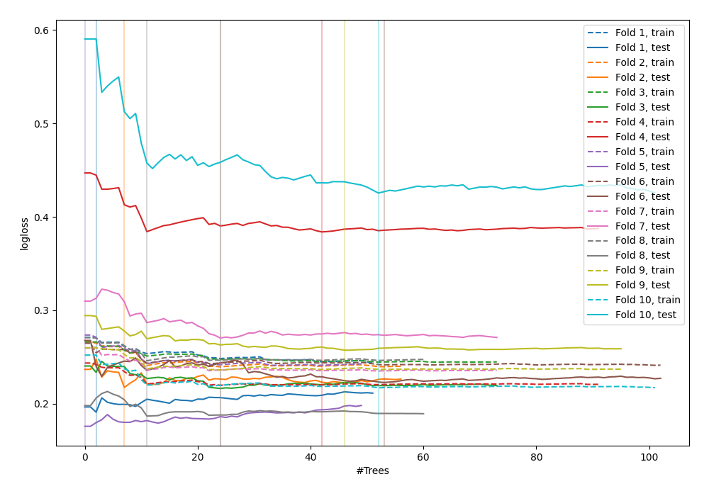
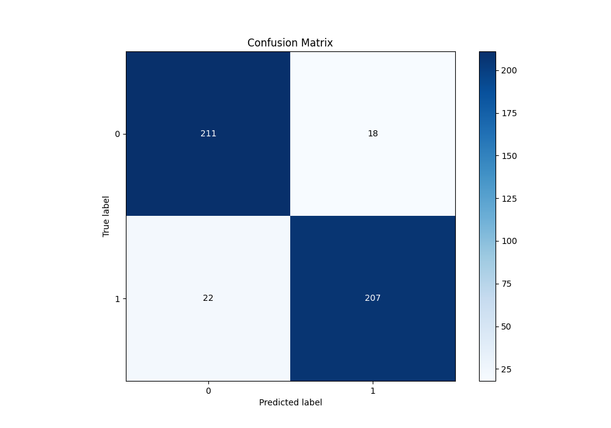
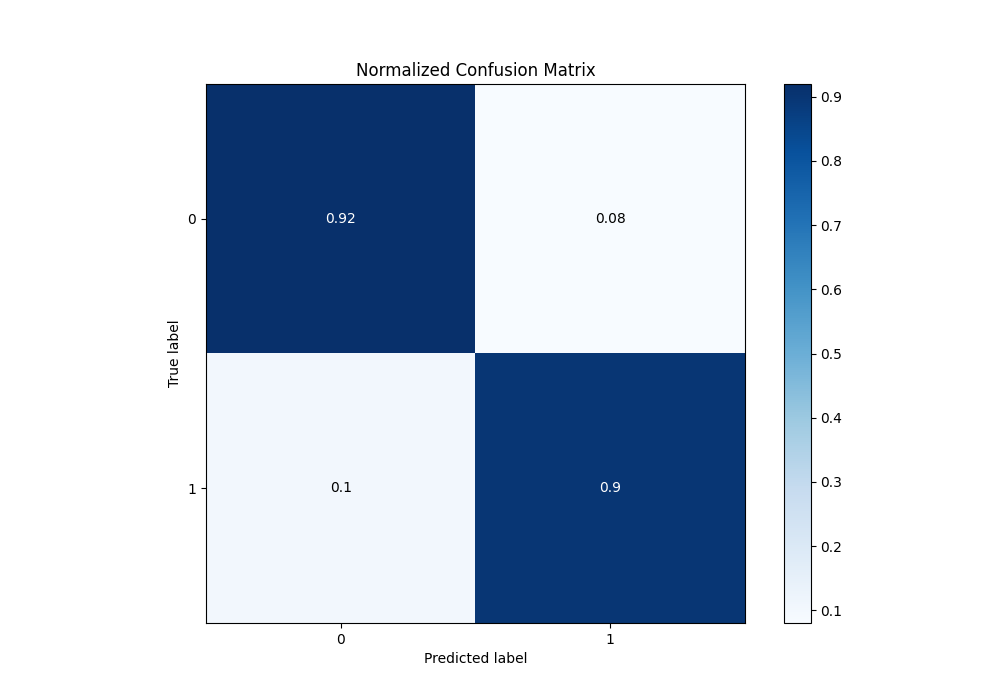
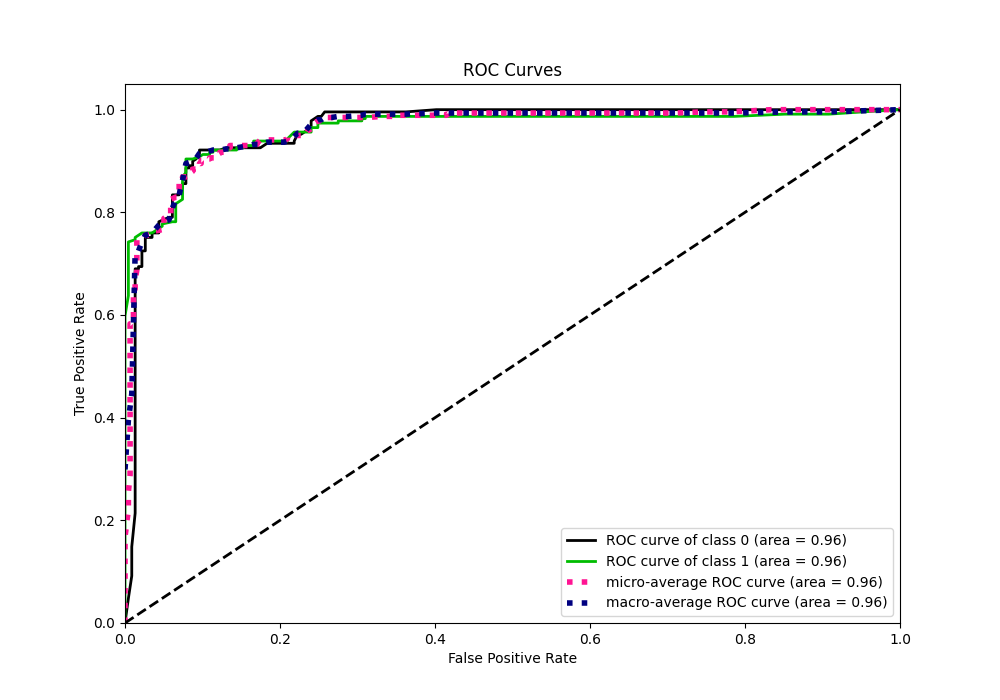
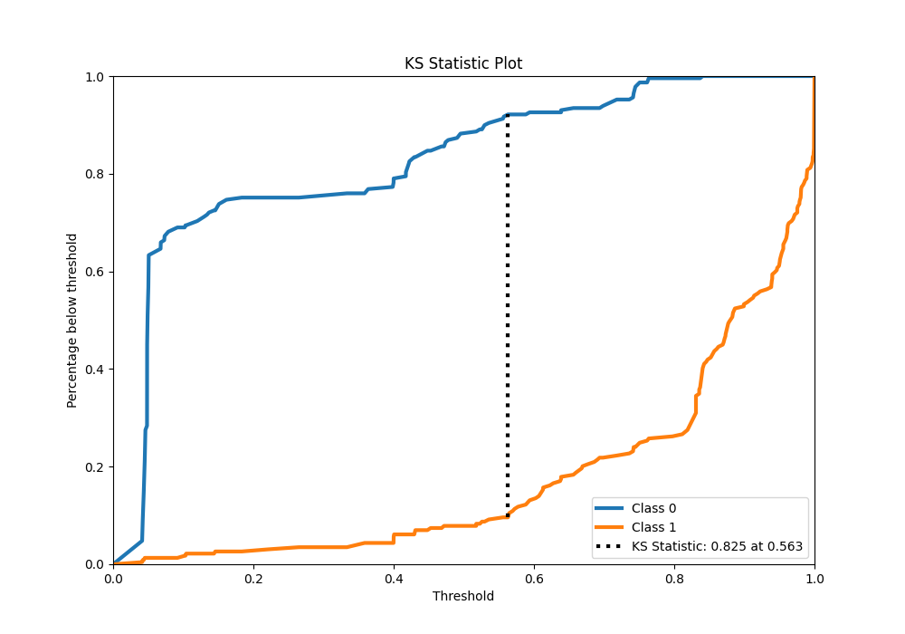
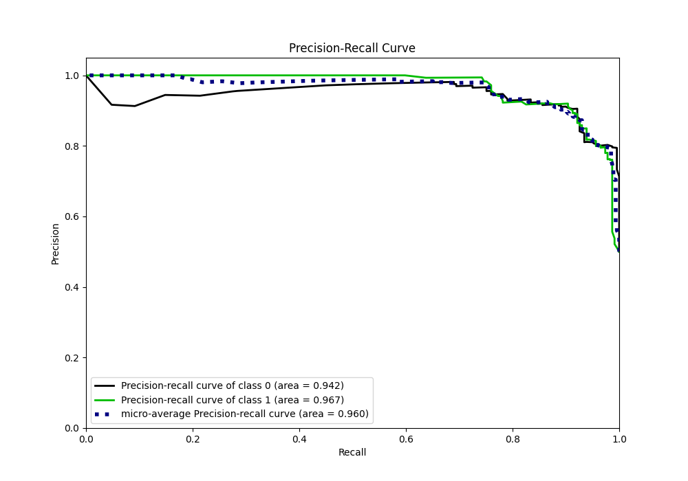
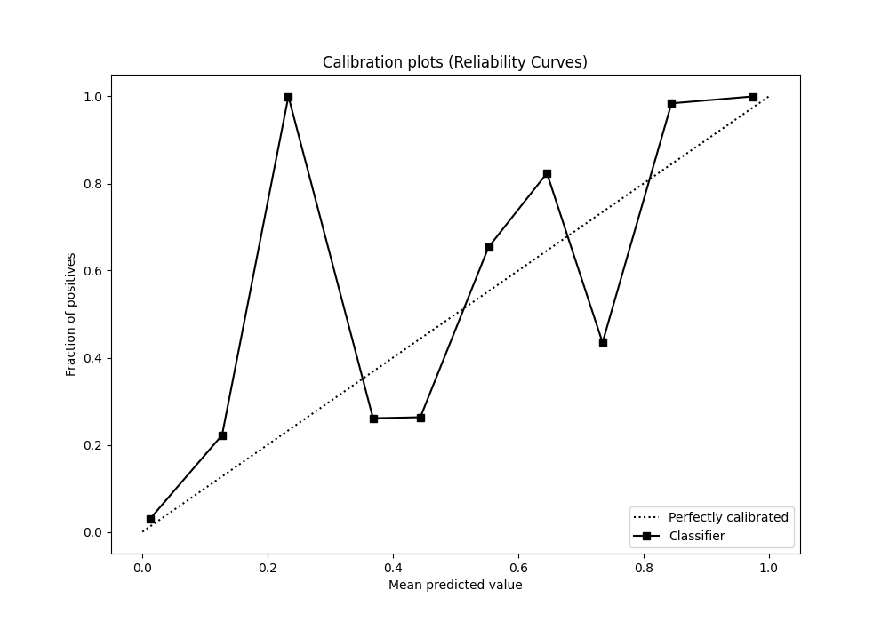
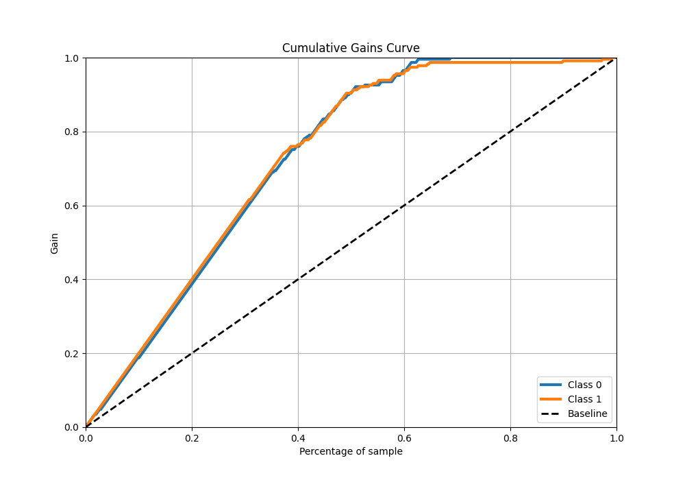
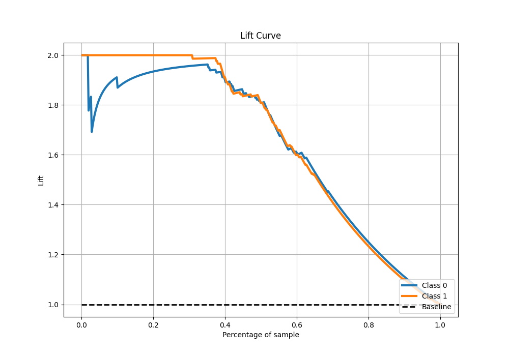

# Summary of 50_ExtraTrees

[<< Go back](../README.md)

## Extra Trees Classifier (Extra Trees)
- **n_jobs**: -1
- **criterion**: gini
- **max_features**: 0.8
- **min_samples_split**: 40
- **max_depth**: 3
- **eval_metric_name**: logloss
- **explain_level**: 0

## Validation
 - **validation_type**: kfold
 - **shuffle**: True
 - **stratify**: True
 - **k_folds**: 10

## Optimized metric
logloss

## Training time

15.4 seconds

## Metric details
|           |    score |   threshold |
|:----------|---------:|------------:|
| logloss   | 0.254352 | nan         |
| auc       | 0.961023 | nan         |
| f1        | 0.911894 |   0.56382   |
| accuracy  | 0.912664 |   0.56382   |
| precision | 1        |   0.84058   |
| recall    | 1        |   0.0372174 |
| mcc       | 0.825453 |   0.56382   |

## Metric details with threshold from accuracy metric
|           |    score |   threshold |
|:----------|---------:|------------:|
| logloss   | 0.254352 |   nan       |
| auc       | 0.961023 |   nan       |
| f1        | 0.911894 |     0.56382 |
| accuracy  | 0.912664 |     0.56382 |
| precision | 0.92     |     0.56382 |
| recall    | 0.90393  |     0.56382 |
| mcc       | 0.825453 |     0.56382 |

## Confusion matrix (at threshold=0.56382)
|              |   Predicted as 0 |   Predicted as 1 |
|:-------------|-----------------:|-----------------:|
| Labeled as 0 |              211 |               18 |
| Labeled as 1 |               22 |              207 |

## Learning curves

## Confusion Matrix

## Normalized Confusion Matrix

## ROC Curve

## Kolmogorov-Smirnov Statistic

## Precision-Recall Curve

## Calibration Curve

## Cumulative Gains Curve

## Lift Curve

[<< Go back](../README.md)
