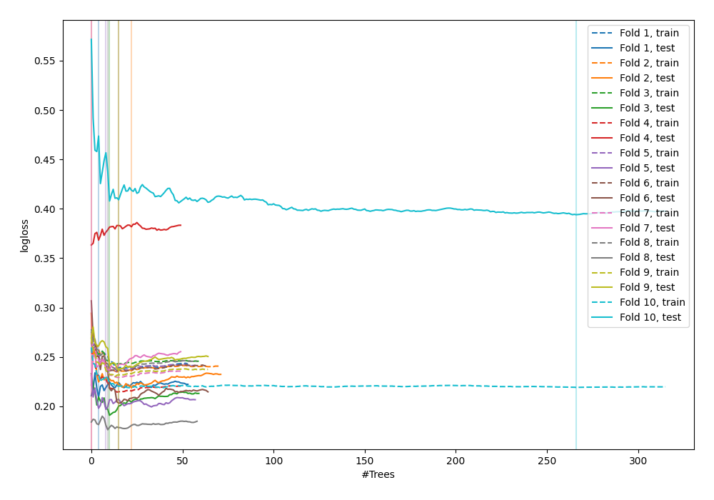
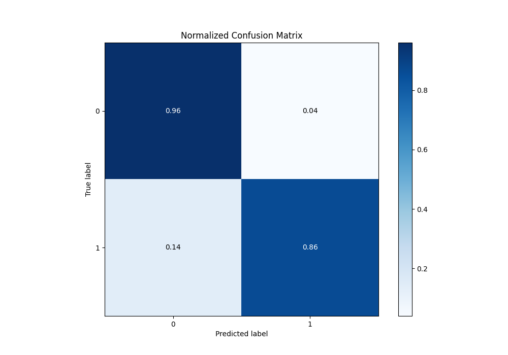
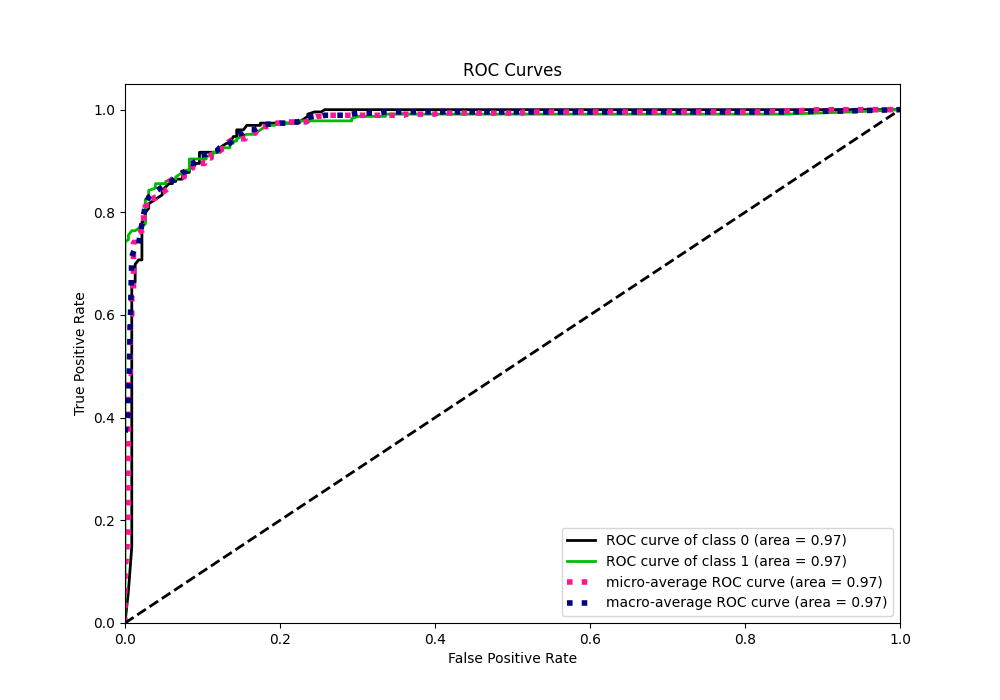
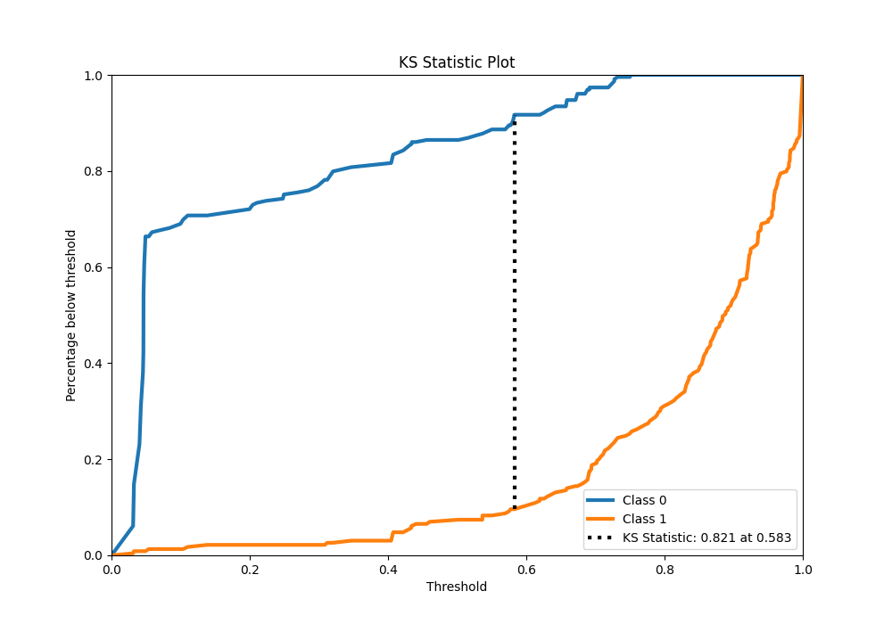
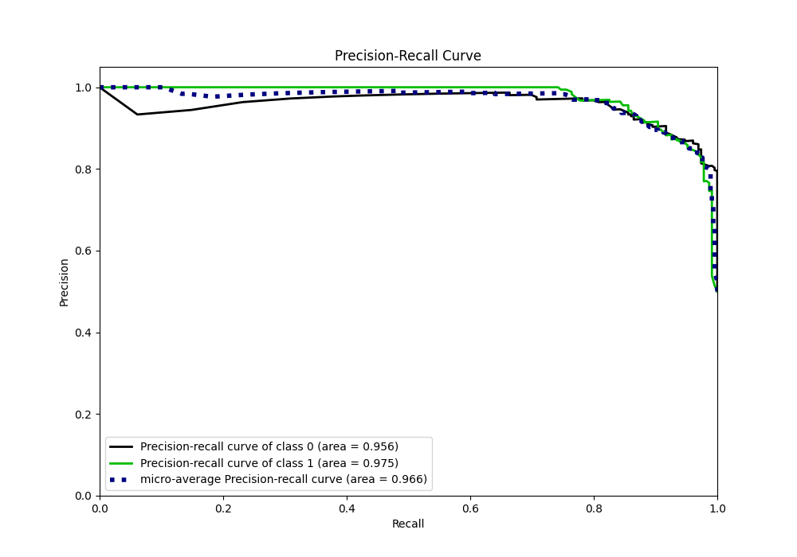
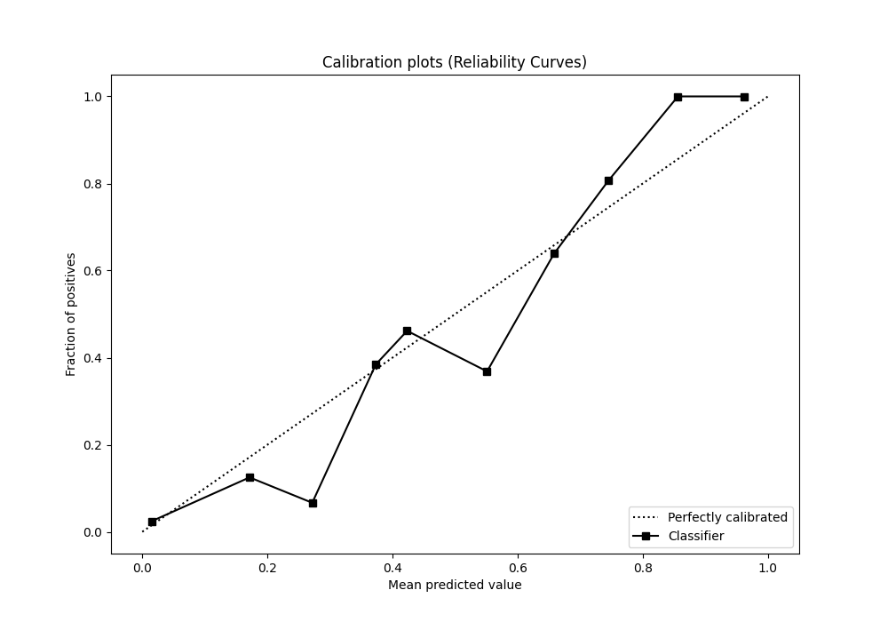
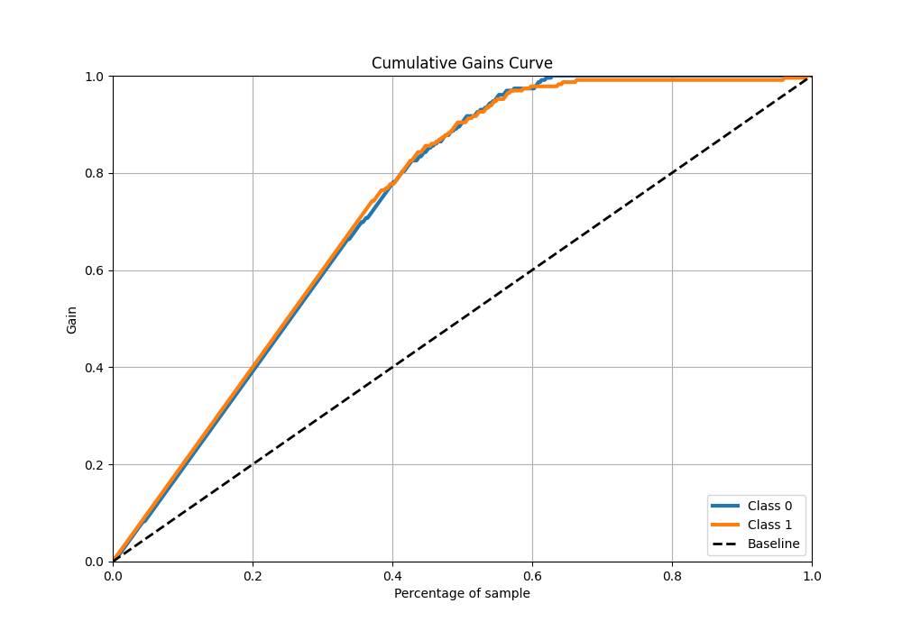
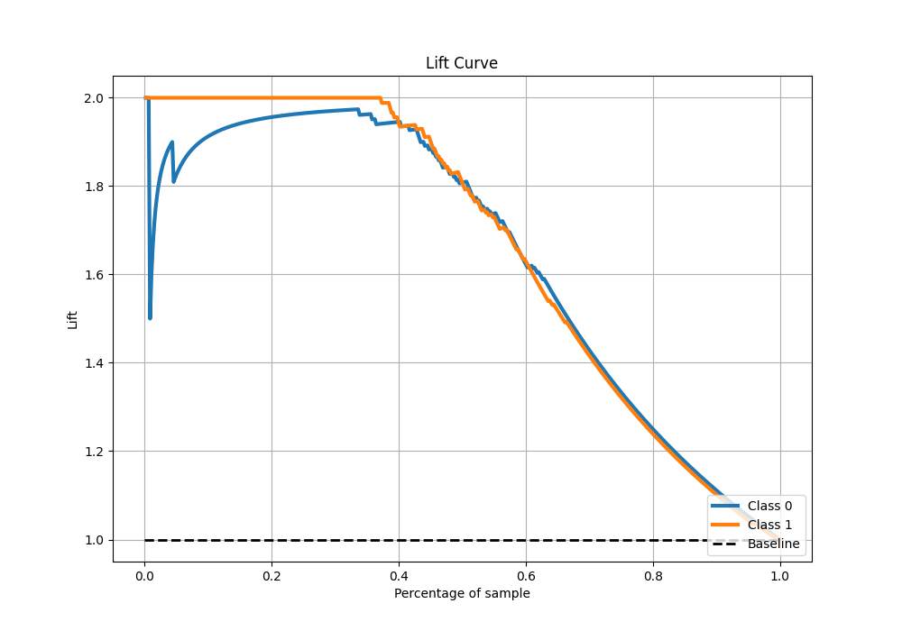

# Summary of 52_ExtraTrees

[<< Go back](../README.md)

## Extra Trees Classifier (Extra Trees)
- **n_jobs**: -1
- **criterion**: gini
- **max_features**: 0.7
- **min_samples_split**: 50
- **max_depth**: 3
- **eval_metric_name**: logloss
- **explain_level**: 0

## Validation
 - **validation_type**: kfold
 - **shuffle**: True
 - **stratify**: True
 - **k_folds**: 10

## Optimized metric
logloss

## Training time

18.5 seconds

## Metric details
|           |    score |   threshold |
|:----------|---------:|------------:|
| logloss   | 0.240711 |  nan        |
| auc       | 0.970538 |  nan        |
| f1        | 0.905077 |    0.602949 |
| accuracy  | 0.908297 |    0.677061 |
| precision | 1        |    0.764972 |
| recall    | 1        |    0.028125 |
| mcc       | 0.821116 |    0.677061 |

## Metric details with threshold from accuracy metric
|           |    score |   threshold |
|:----------|---------:|------------:|
| logloss   | 0.240711 |  nan        |
| auc       | 0.970538 |  nan        |
| f1        | 0.903226 |    0.677061 |
| accuracy  | 0.908297 |    0.677061 |
| precision | 0.956098 |    0.677061 |
| recall    | 0.855895 |    0.677061 |
| mcc       | 0.821116 |    0.677061 |

## Confusion matrix (at threshold=0.677061)
|              |   Predicted as 0 |   Predicted as 1 |
|:-------------|-----------------:|-----------------:|
| Labeled as 0 |              220 |                9 |
| Labeled as 1 |               33 |              196 |

## Learning curves

## Confusion Matrix

## Normalized Confusion Matrix

## ROC Curve

## Kolmogorov-Smirnov Statistic

## Precision-Recall Curve

## Calibration Curve

## Cumulative Gains Curve

## Lift Curve

[<< Go back](../README.md)
