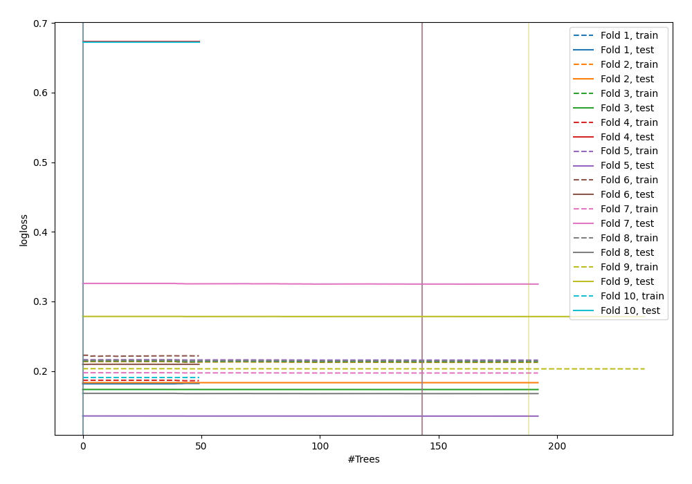
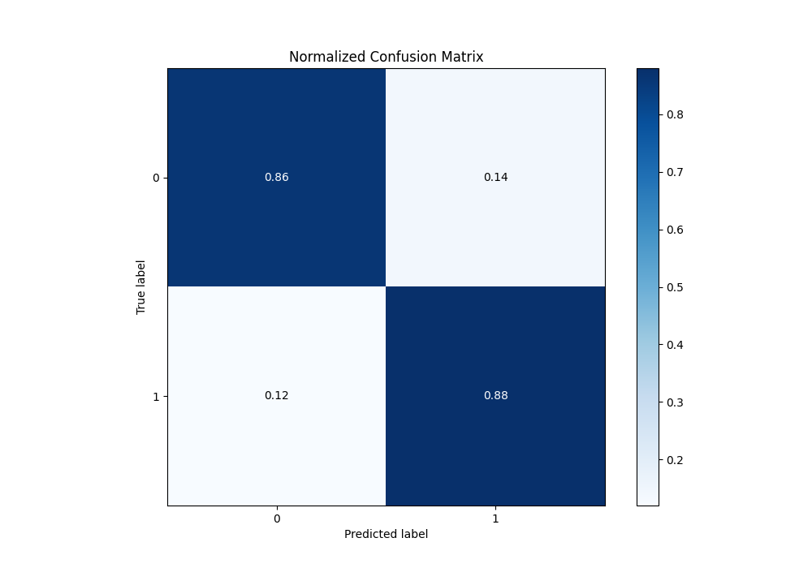
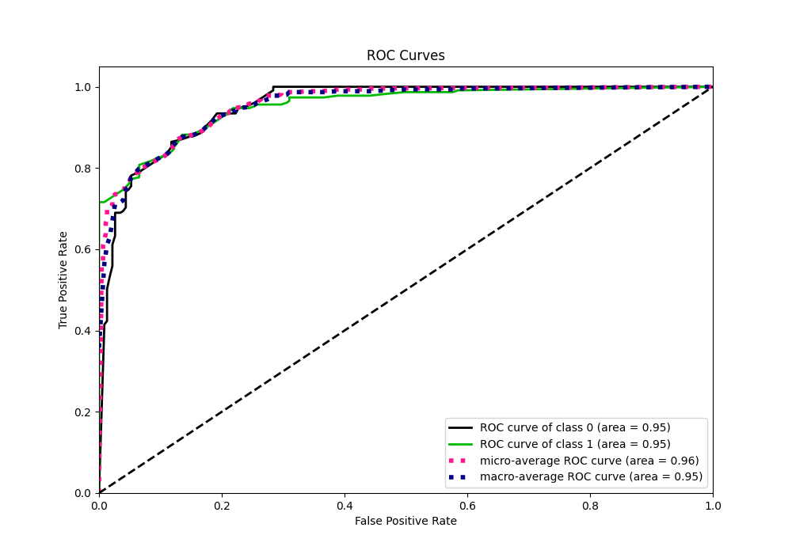
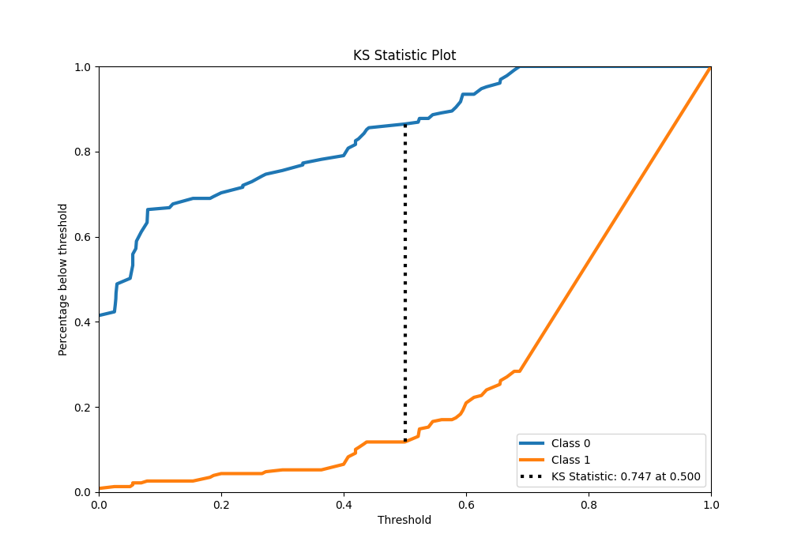
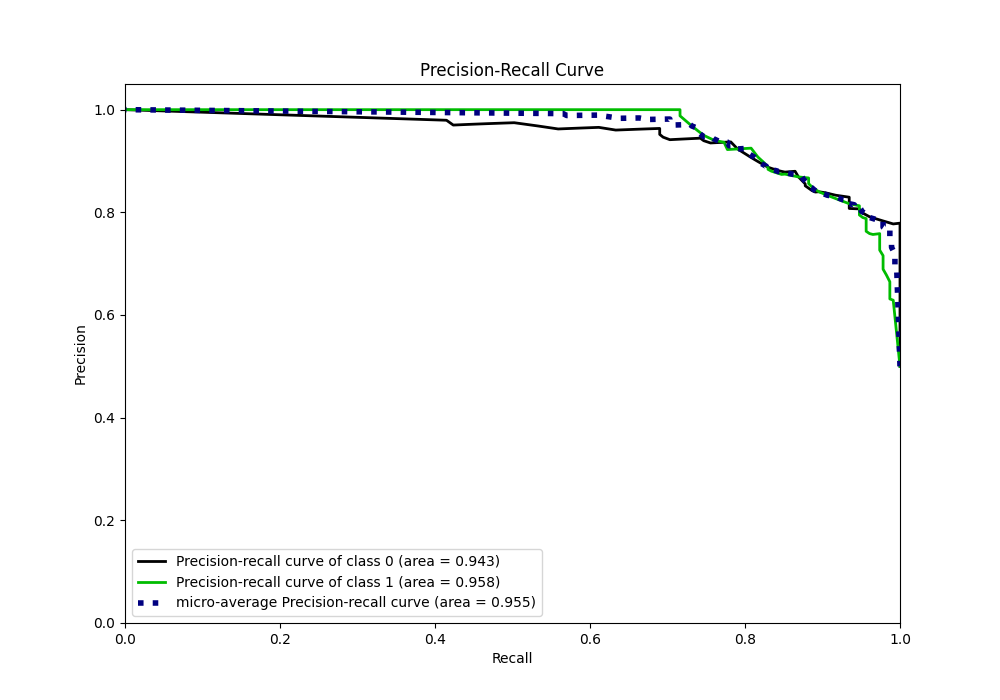
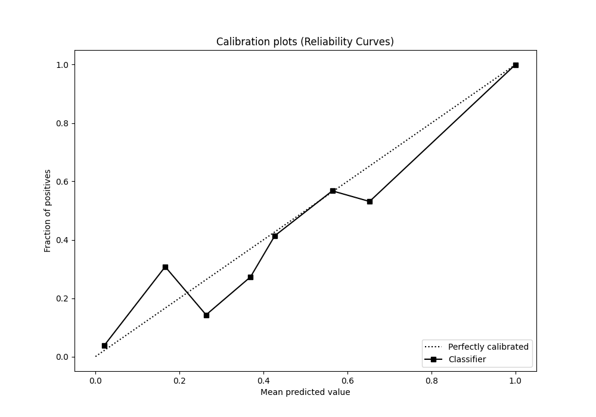
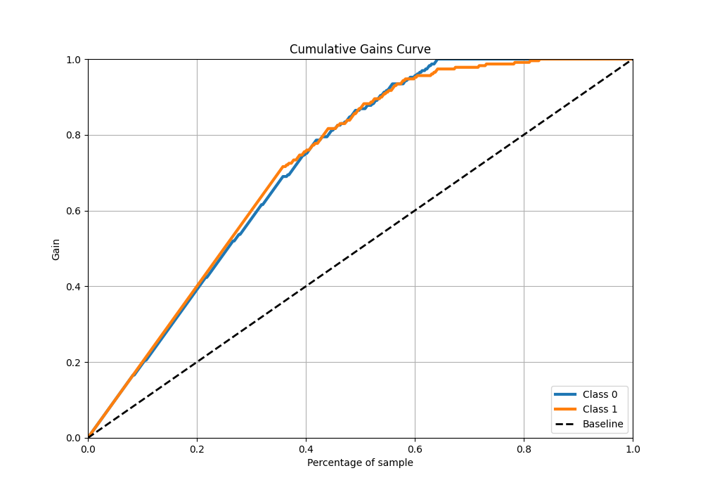
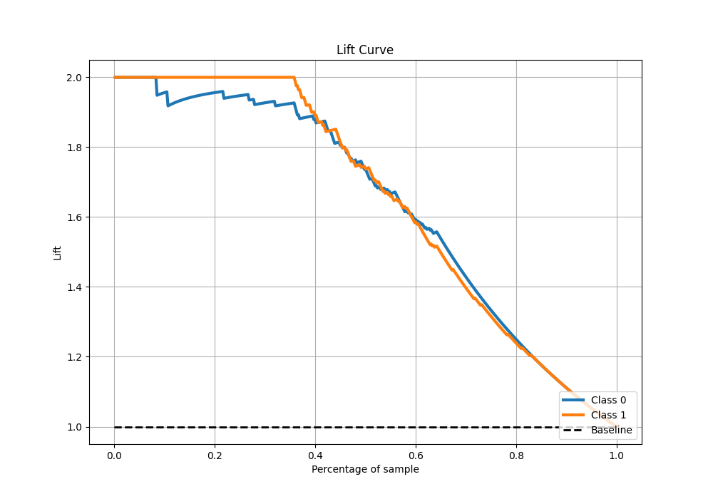

# Summary of 53_ExtraTrees

[<< Go back](../README.md)

## Extra Trees Classifier (Extra Trees)
- **n_jobs**: -1
- **criterion**: gini
- **max_features**: 1.0
- **min_samples_split**: 40
- **max_depth**: 7
- **eval_metric_name**: logloss
- **explain_level**: 0

## Validation
 - **validation_type**: kfold
 - **shuffle**: True
 - **stratify**: True
 - **k_folds**: 10

## Optimized metric
logloss

## Training time

22.2 seconds

## Metric details
|           |    score |   threshold |
|:----------|---------:|------------:|
| logloss   | 0.299218 |  nan        |
| auc       | 0.952251 |  nan        |
| f1        | 0.874459 |    0.51087  |
| accuracy  | 0.873362 |    0.51087  |
| precision | 1        |    0.6875   |
| recall    | 0.991266 |    0        |
| mcc       | 0.748383 |    0.594595 |

## Metric details with threshold from accuracy metric
|           |    score |   threshold |
|:----------|---------:|------------:|
| logloss   | 0.299218 |   nan       |
| auc       | 0.952251 |   nan       |
| f1        | 0.874459 |     0.51087 |
| accuracy  | 0.873362 |     0.51087 |
| precision | 0.866953 |     0.51087 |
| recall    | 0.882096 |     0.51087 |
| mcc       | 0.746839 |     0.51087 |

## Confusion matrix (at threshold=0.51087)
|              |   Predicted as 0 |   Predicted as 1 |
|:-------------|-----------------:|-----------------:|
| Labeled as 0 |              198 |               31 |
| Labeled as 1 |               27 |              202 |

## Learning curves

## Confusion Matrix

## Normalized Confusion Matrix

## ROC Curve

## Kolmogorov-Smirnov Statistic

## Precision-Recall Curve

## Calibration Curve

## Cumulative Gains Curve

## Lift Curve

[<< Go back](../README.md)
