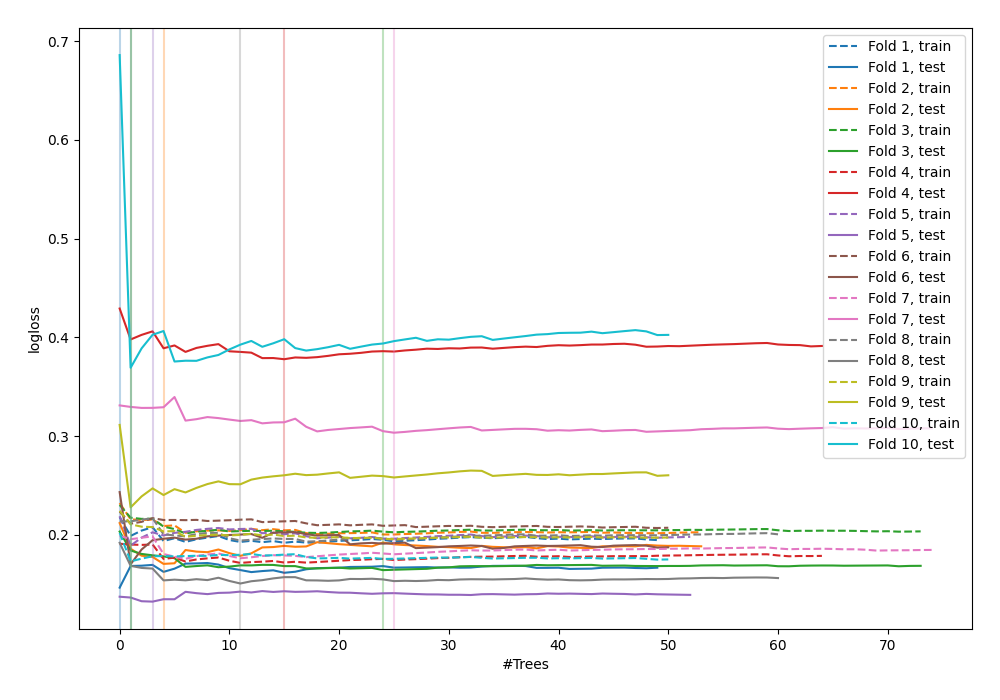
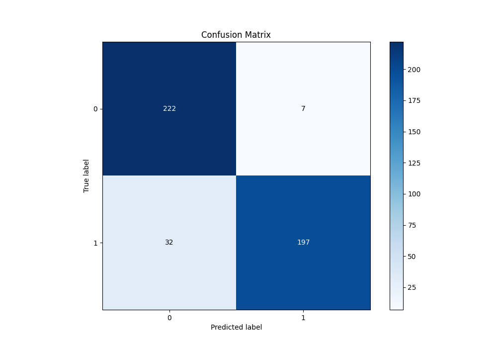
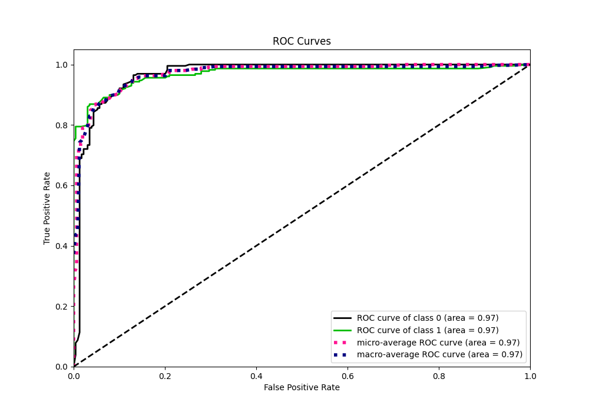
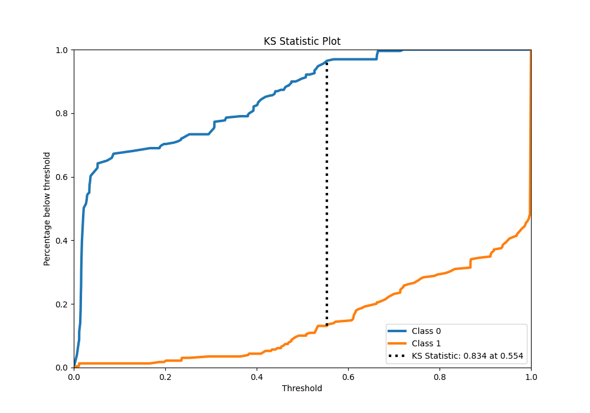
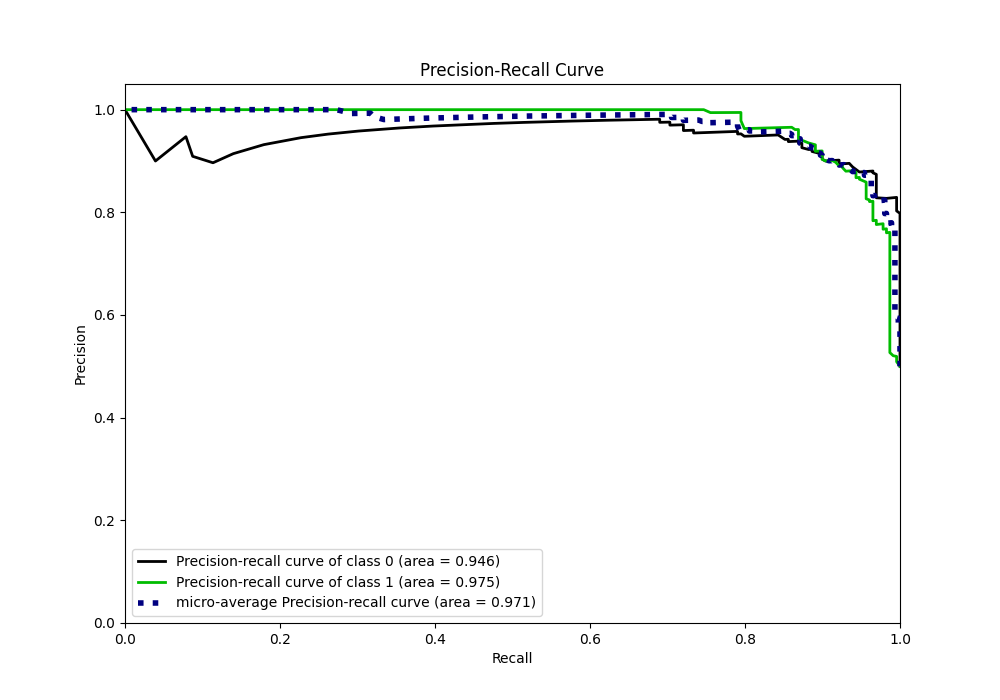
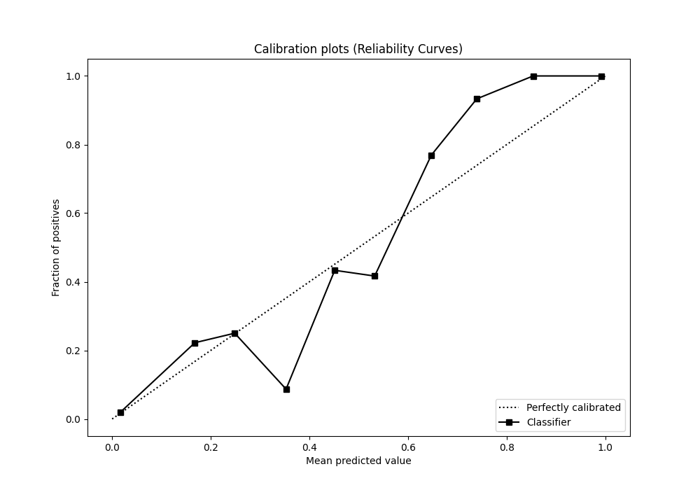
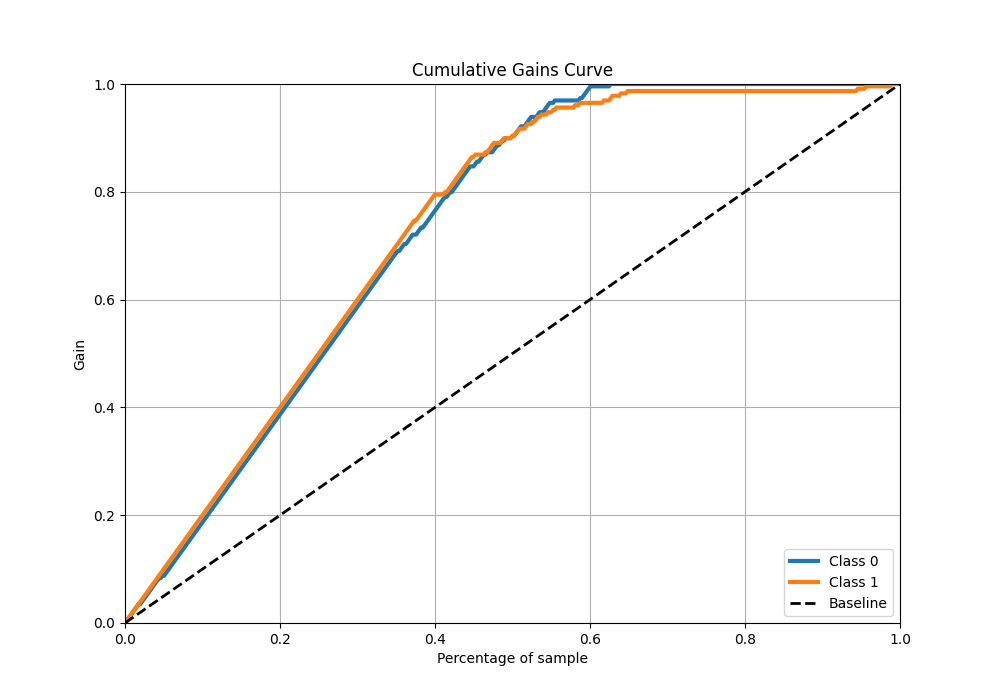
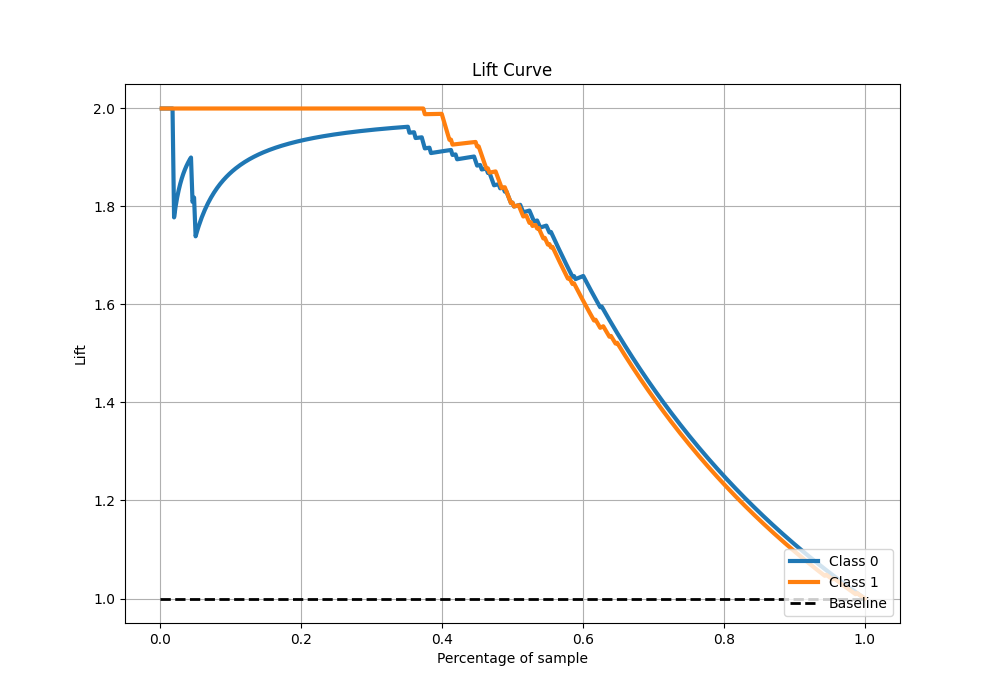

# Summary of 54_ExtraTrees

[<< Go back](../README.md)

## Extra Trees Classifier (Extra Trees)
- **n_jobs**: -1
- **criterion**: gini
- **max_features**: 0.9
- **min_samples_split**: 40
- **max_depth**: 5
- **eval_metric_name**: logloss
- **explain_level**: 0

## Validation
 - **validation_type**: kfold
 - **shuffle**: True
 - **stratify**: True
 - **k_folds**: 10

## Optimized metric
logloss

## Training time

20.4 seconds

## Metric details
|           |    score |    threshold |
|:----------|---------:|-------------:|
| logloss   | 0.220836 | nan          |
| auc       | 0.968384 | nan          |
| f1        | 0.909931 |   0.568462   |
| accuracy  | 0.914847 |   0.568462   |
| precision | 1        |   0.720656   |
| recall    | 1        |   0.00612245 |
| mcc       | 0.834683 |   0.568462   |

## Metric details with threshold from accuracy metric
|           |    score |   threshold |
|:----------|---------:|------------:|
| logloss   | 0.220836 |  nan        |
| auc       | 0.968384 |  nan        |
| f1        | 0.909931 |    0.568462 |
| accuracy  | 0.914847 |    0.568462 |
| precision | 0.965686 |    0.568462 |
| recall    | 0.860262 |    0.568462 |
| mcc       | 0.834683 |    0.568462 |

## Confusion matrix (at threshold=0.568462)
|              |   Predicted as 0 |   Predicted as 1 |
|:-------------|-----------------:|-----------------:|
| Labeled as 0 |              222 |                7 |
| Labeled as 1 |               32 |              197 |

## Learning curves

## Confusion Matrix

## Normalized Confusion Matrix

## ROC Curve

## Kolmogorov-Smirnov Statistic

## Precision-Recall Curve

## Calibration Curve

## Cumulative Gains Curve

## Lift Curve

[<< Go back](../README.md)
