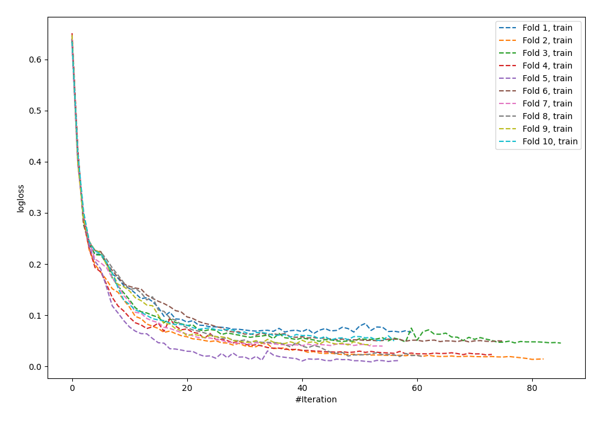
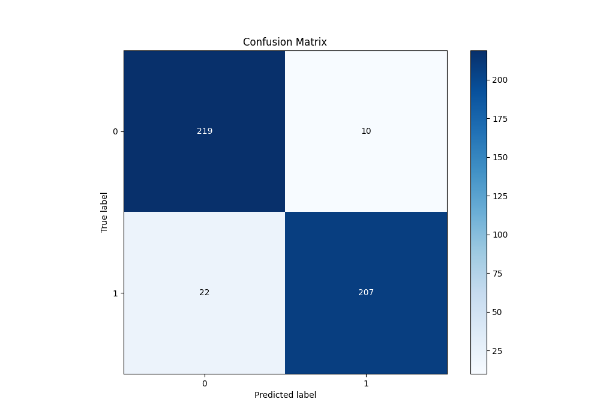
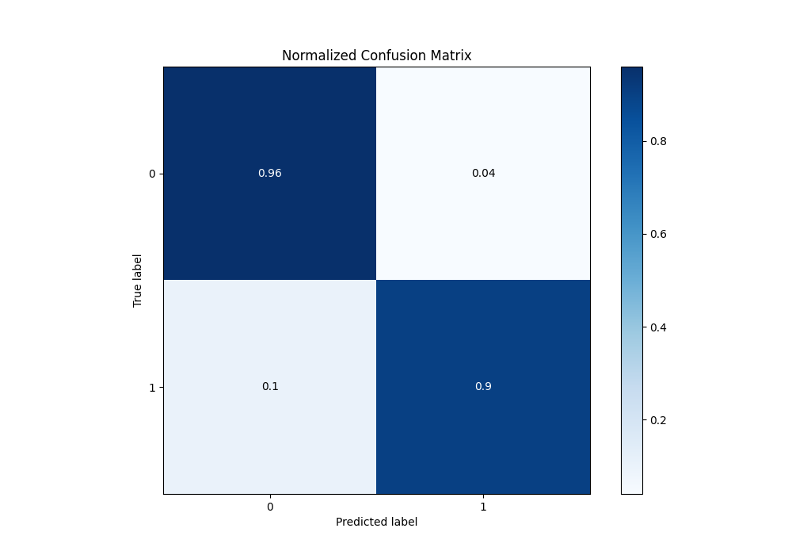
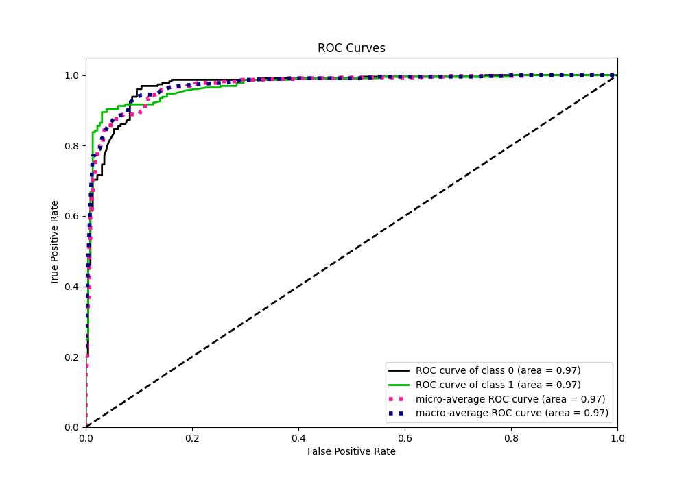
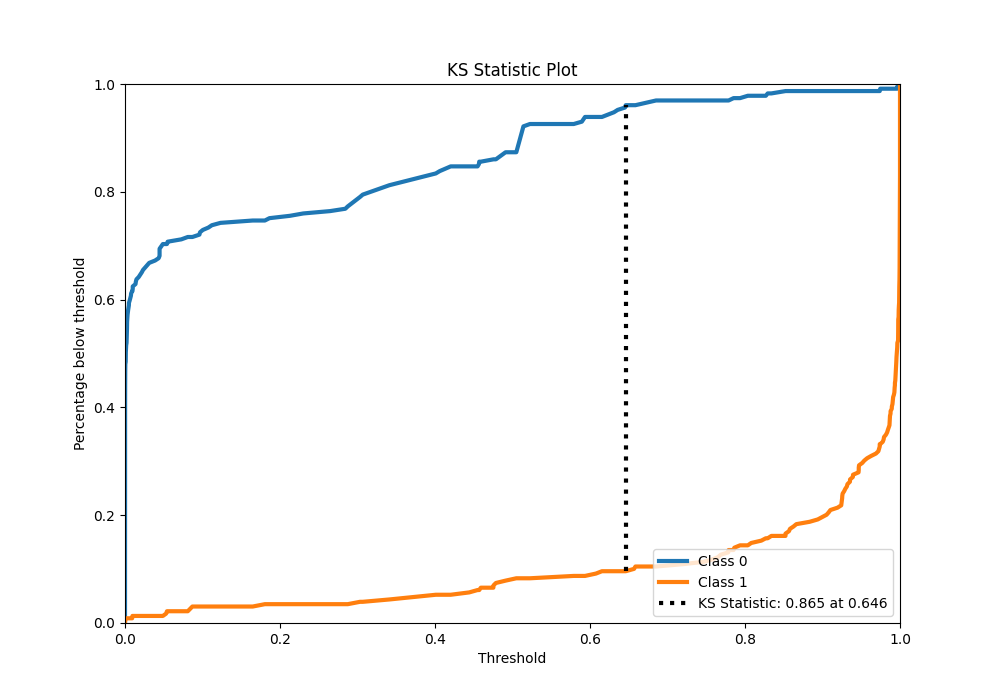
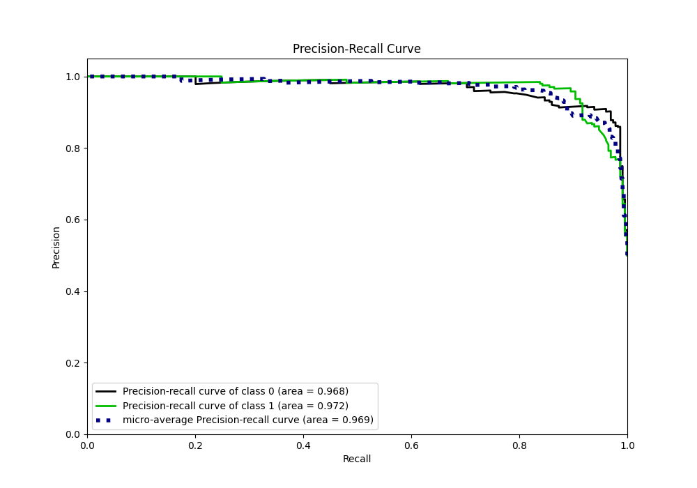
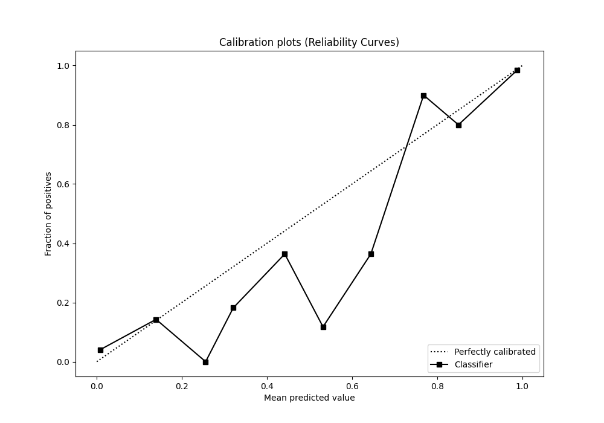
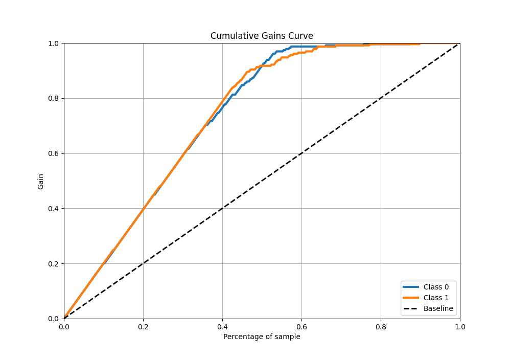
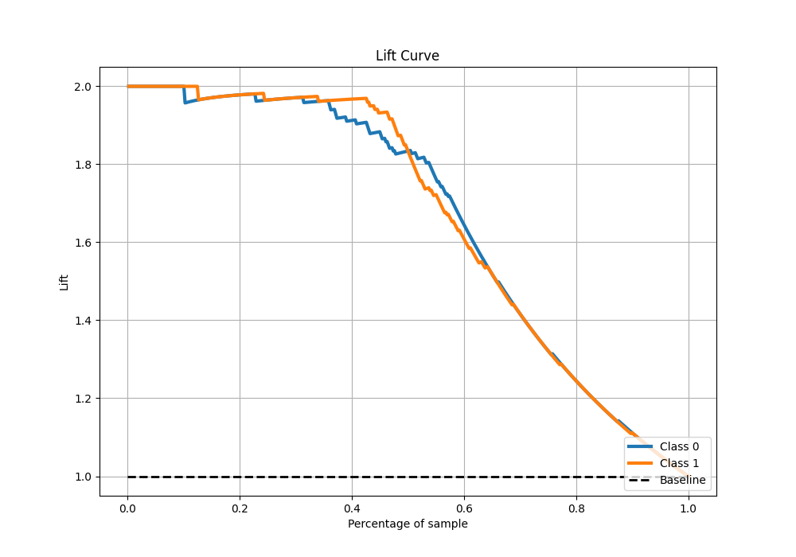

# Summary of 57_NeuralNetwork

[<< Go back](../README.md)

## Neural Network
- **n_jobs**: -1
- **dense_1_size**: 32
- **dense_2_size**: 4
- **learning_rate**: 0.05
- **explain_level**: 0

## Validation
 - **validation_type**: kfold
 - **shuffle**: True
 - **stratify**: True
 - **k_folds**: 10

## Optimized metric
logloss

## Training time

9.4 seconds

## Metric details
|           |    score |     threshold |
|:----------|---------:|--------------:|
| logloss   | 0.254356 | nan           |
| auc       | 0.970967 | nan           |
| f1        | 0.928251 |   0.645626    |
| accuracy  | 0.930131 |   0.645626    |
| precision | 0.990826 |   0.997606    |
| recall    | 1        |   8.06644e-13 |
| mcc       | 0.862369 |   0.678609    |

## Metric details with threshold from accuracy metric
|           |    score |   threshold |
|:----------|---------:|------------:|
| logloss   | 0.254356 |  nan        |
| auc       | 0.970967 |  nan        |
| f1        | 0.928251 |    0.645626 |
| accuracy  | 0.930131 |    0.645626 |
| precision | 0.953917 |    0.645626 |
| recall    | 0.90393  |    0.645626 |
| mcc       | 0.861446 |    0.645626 |

## Confusion matrix (at threshold=0.645626)
|              |   Predicted as 0 |   Predicted as 1 |
|:-------------|-----------------:|-----------------:|
| Labeled as 0 |              219 |               10 |
| Labeled as 1 |               22 |              207 |

## Learning curves

## Confusion Matrix

## Normalized Confusion Matrix

## ROC Curve

## Kolmogorov-Smirnov Statistic

## Precision-Recall Curve

## Calibration Curve

## Cumulative Gains Curve

## Lift Curve

[<< Go back](../README.md)
