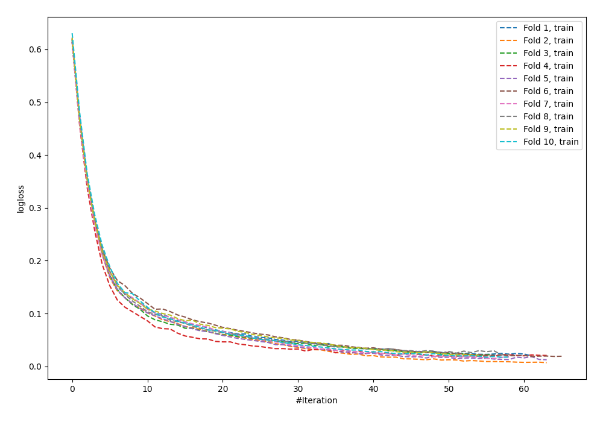
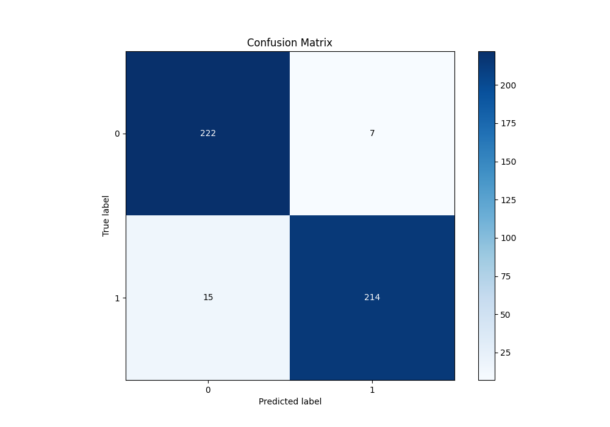
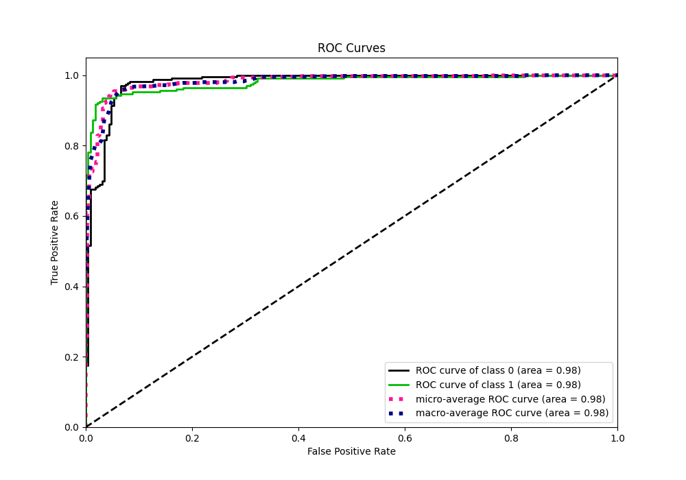
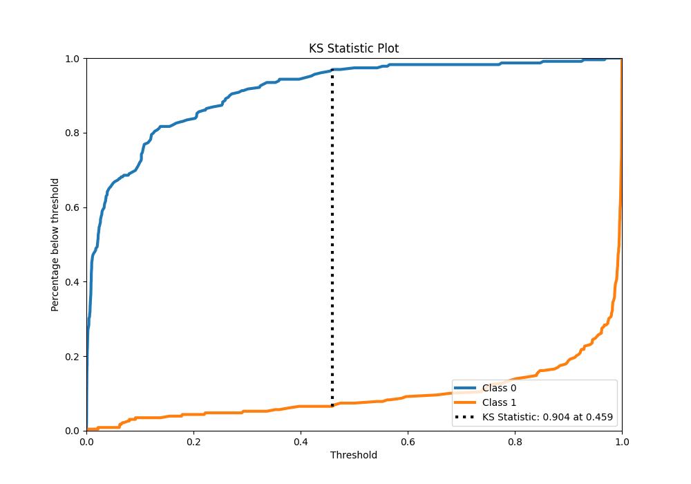
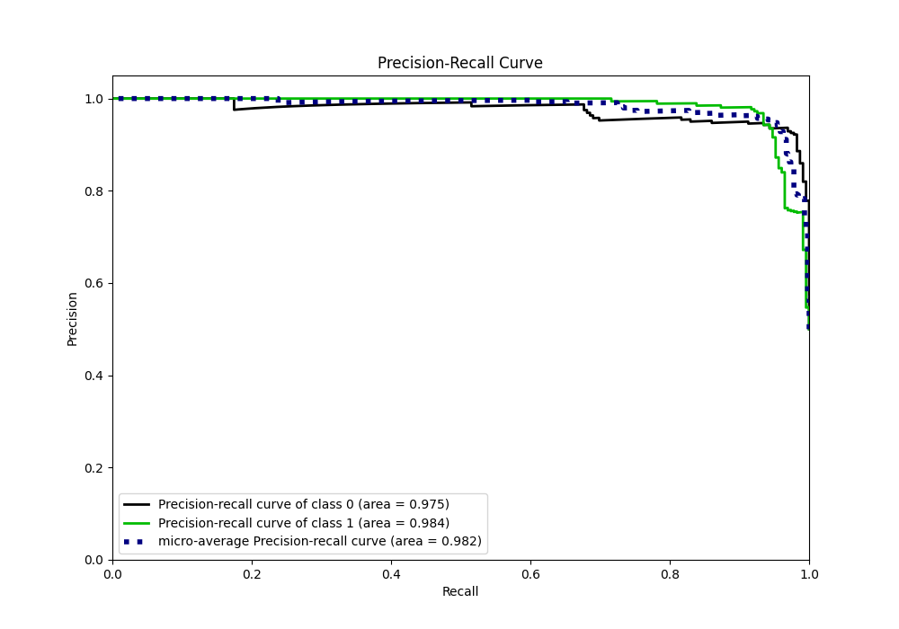
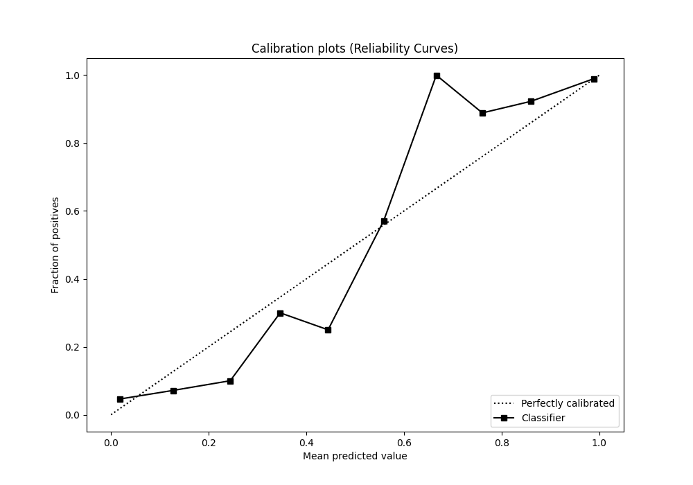
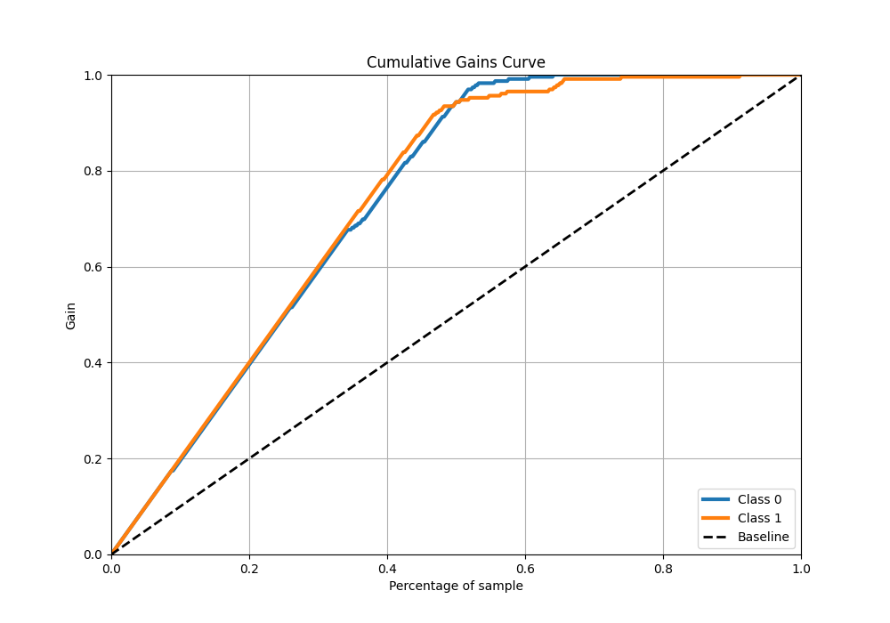
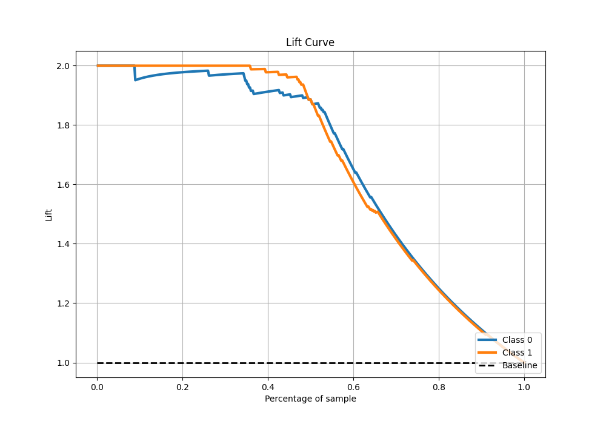

# Summary of 58_NeuralNetwork

[<< Go back](../README.md)

## Neural Network
- **n_jobs**: -1
- **dense_1_size**: 64
- **dense_2_size**: 16
- **learning_rate**: 0.01
- **explain_level**: 0

## Validation
 - **validation_type**: kfold
 - **shuffle**: True
 - **stratify**: True
 - **k_folds**: 10

## Optimized metric
logloss

## Training time

11.6 seconds

## Metric details
|           |    score |     threshold |
|:----------|---------:|--------------:|
| logloss   | 0.164998 | nan           |
| auc       | 0.980225 | nan           |
| f1        | 0.951111 |   0.461609    |
| accuracy  | 0.951965 |   0.461609    |
| precision | 1        |   0.975285    |
| recall    | 1        |   0.000176863 |
| mcc       | 0.904482 |   0.461609    |

## Metric details with threshold from accuracy metric
|           |    score |   threshold |
|:----------|---------:|------------:|
| logloss   | 0.164998 |  nan        |
| auc       | 0.980225 |  nan        |
| f1        | 0.951111 |    0.461609 |
| accuracy  | 0.951965 |    0.461609 |
| precision | 0.968326 |    0.461609 |
| recall    | 0.934498 |    0.461609 |
| mcc       | 0.904482 |    0.461609 |

## Confusion matrix (at threshold=0.461609)
|              |   Predicted as 0 |   Predicted as 1 |
|:-------------|-----------------:|-----------------:|
| Labeled as 0 |              222 |                7 |
| Labeled as 1 |               15 |              214 |

## Learning curves

## Confusion Matrix

## Normalized Confusion Matrix

## ROC Curve

## Kolmogorov-Smirnov Statistic

## Precision-Recall Curve

## Calibration Curve

## Cumulative Gains Curve

## Lift Curve

[<< Go back](../README.md)
