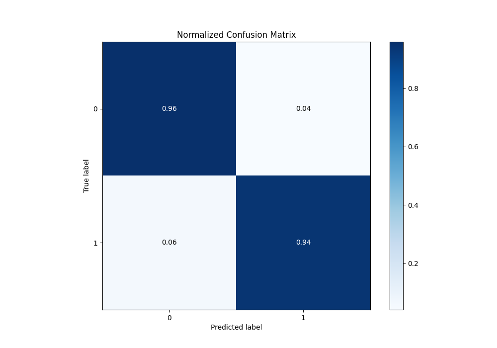

# Summary of 64_NeuralNetwork

[<< Go back](../README.md)

## Neural Network
- **n_jobs**: -1
- **dense_1_size**: 64
- **dense_2_size**: 8
- **learning_rate**: 0.1
- **explain_level**: 0

## Validation
 - **validation_type**: kfold
 - **shuffle**: True
 - **stratify**: True
 - **k_folds**: 10

## Optimized metric
logloss

## Training time

20.1 seconds

## Metric details
|           |    score |     threshold |
|:----------|---------:|--------------:|
| logloss   | 0.188742 | nan           |
| auc       | 0.977804 | nan           |
| f1        | 0.947137 |   0.352946    |
| accuracy  | 0.947598 |   0.352946    |
| precision | 1        |   0.996697    |
| recall    | 1        |   1.21043e-08 |
| mcc       | 0.895333 |   0.352946    |

## Metric details with threshold from accuracy metric
|           |    score |   threshold |
|:----------|---------:|------------:|
| logloss   | 0.188742 |  nan        |
| auc       | 0.977804 |  nan        |
| f1        | 0.947137 |    0.352946 |
| accuracy  | 0.947598 |    0.352946 |
| precision | 0.955556 |    0.352946 |
| recall    | 0.938865 |    0.352946 |
| mcc       | 0.895333 |    0.352946 |

## Confusion matrix (at threshold=0.352946)
|              |   Predicted as 0 |   Predicted as 1 |
|:-------------|-----------------:|-----------------:|
| Labeled as 0 |              219 |               10 |
| Labeled as 1 |               14 |              215 |

## Learning curves

## Confusion Matrix

## Normalized Confusion Matrix

## ROC Curve

## Kolmogorov-Smirnov Statistic

## Precision-Recall Curve

## Calibration Curve

## Cumulative Gains Curve

## Lift Curve

[<< Go back](../README.md)
