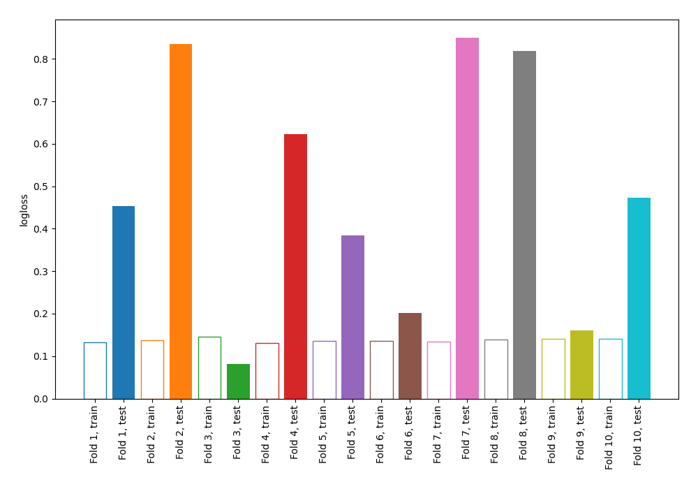

# Summary of 71_NearestNeighbors

[<< Go back](../README.md)

## k-Nearest Neighbors (Nearest Neighbors)
- **n_jobs**: -1
- **n_neighbors**: 7
- **weights**: uniform
- **explain_level**: 0

## Validation
 - **validation_type**: kfold
 - **shuffle**: True
 - **stratify**: True
 - **k_folds**: 10

## Optimized metric
logloss

## Training time

16.1 seconds

## Metric details
|           |    score |   threshold |
|:----------|---------:|------------:|
| logloss   | 0.488837 |  nan        |
| auc       | 0.966267 |  nan        |
| f1        | 0.93913  |    0.142857 |
| accuracy  | 0.938865 |    0.142857 |
| precision | 0.977941 |    0.857143 |
| recall    | 0.969432 |    0        |
| mcc       | 0.877763 |    0.142857 |

## Metric details with threshold from accuracy metric
|           |    score |   threshold |
|:----------|---------:|------------:|
| logloss   | 0.488837 |  nan        |
| auc       | 0.966267 |  nan        |
| f1        | 0.93913  |    0.142857 |
| accuracy  | 0.938865 |    0.142857 |
| precision | 0.935065 |    0.142857 |
| recall    | 0.943231 |    0.142857 |
| mcc       | 0.877763 |    0.142857 |

## Confusion matrix (at threshold=0.142857)
|              |   Predicted as 0 |   Predicted as 1 |
|:-------------|-----------------:|-----------------:|
| Labeled as 0 |              214 |               15 |
| Labeled as 1 |               13 |              216 |

## Learning curves

## Confusion Matrix

## Normalized Confusion Matrix

## ROC Curve

## Kolmogorov-Smirnov Statistic

## Precision-Recall Curve

## Calibration Curve

## Cumulative Gains Curve

## Lift Curve

[<< Go back](../README.md)
