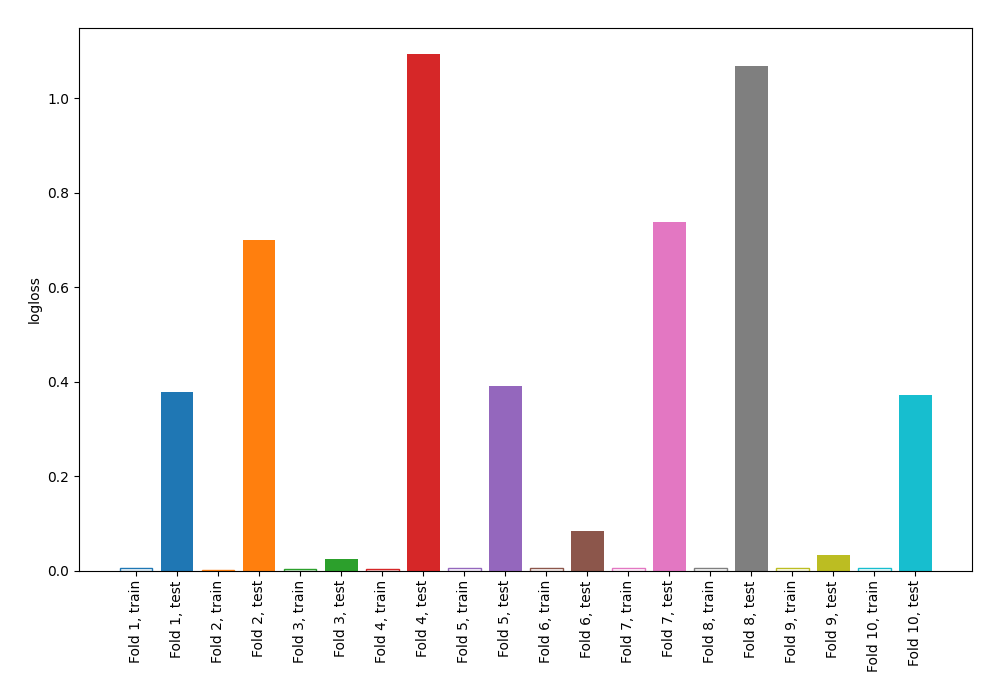
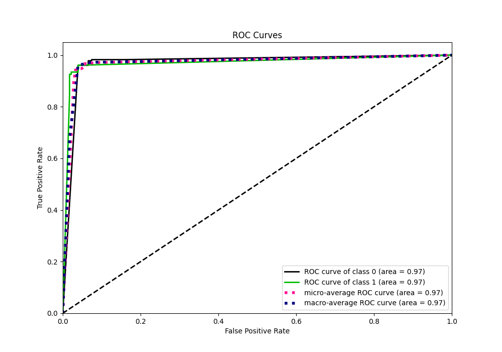
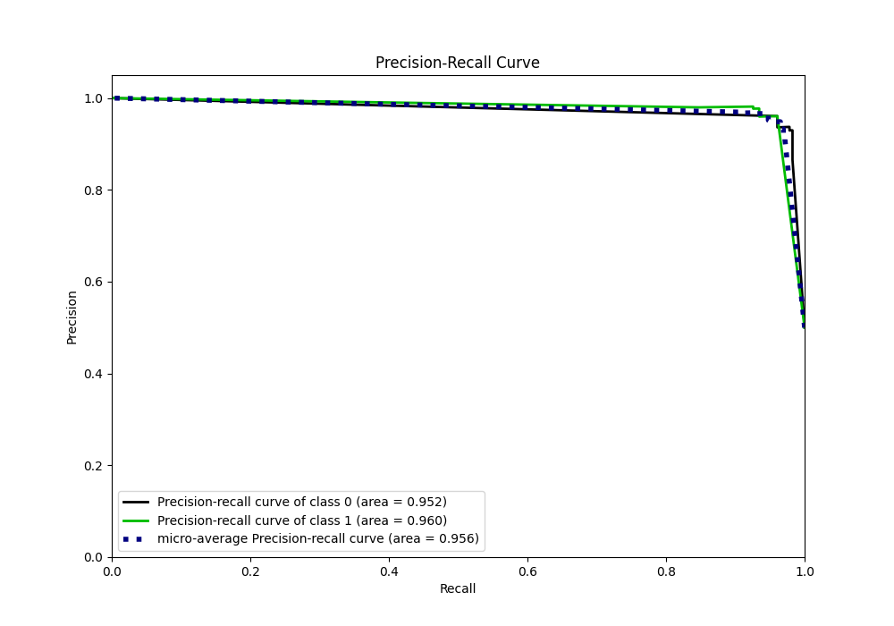

# Summary of 72_NearestNeighbors

[<< Go back](../README.md)

## k-Nearest Neighbors (Nearest Neighbors)
- **n_jobs**: -1
- **n_neighbors**: 3
- **weights**: distance
- **explain_level**: 0

## Validation
 - **validation_type**: kfold
 - **shuffle**: True
 - **stratify**: True
 - **k_folds**: 10

## Optimized metric
logloss

## Training time

17.5 seconds

## Metric details
|           |    score |   threshold |
|:----------|---------:|------------:|
| logloss   | 0.489052 |  nan        |
| auc       | 0.969585 |  nan        |
| f1        | 0.960699 |    0        |
| accuracy  | 0.960699 |    0        |
| precision | 0.981221 |    0.693078 |
| recall    | 0.960699 |    0        |
| mcc       | 0.921397 |    0        |

## Metric details with threshold from accuracy metric
|           |    score |   threshold |
|:----------|---------:|------------:|
| logloss   | 0.489052 |         nan |
| auc       | 0.969585 |         nan |
| f1        | 0.960699 |           0 |
| accuracy  | 0.960699 |           0 |
| precision | 0.960699 |           0 |
| recall    | 0.960699 |           0 |
| mcc       | 0.921397 |           0 |

## Confusion matrix (at threshold=0.0)
|              |   Predicted as 0 |   Predicted as 1 |
|:-------------|-----------------:|-----------------:|
| Labeled as 0 |              220 |                9 |
| Labeled as 1 |                9 |              220 |

## Learning curves

## Confusion Matrix

## Normalized Confusion Matrix

## ROC Curve

## Kolmogorov-Smirnov Statistic

## Precision-Recall Curve

## Calibration Curve

## Cumulative Gains Curve

## Lift Curve

[<< Go back](../README.md)
