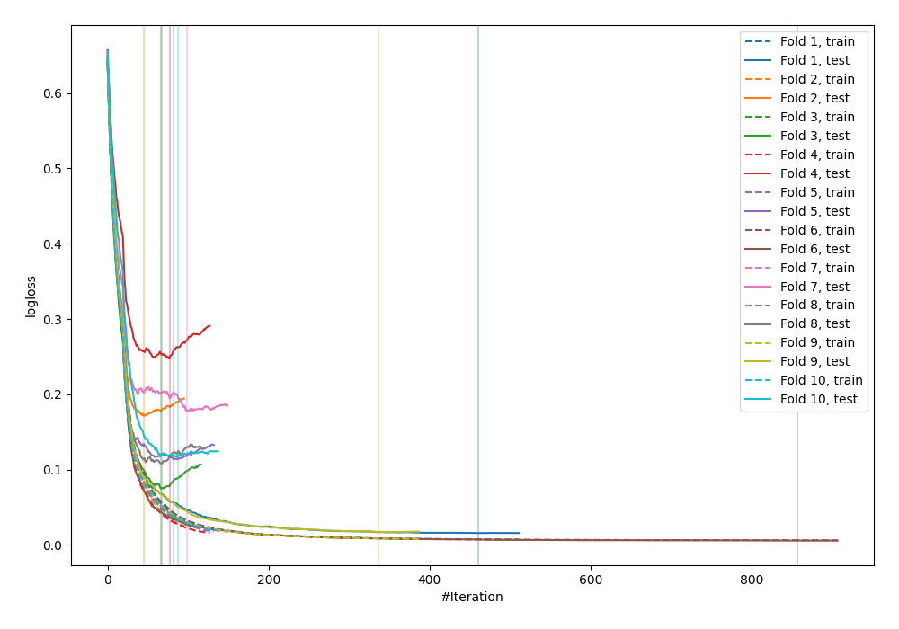
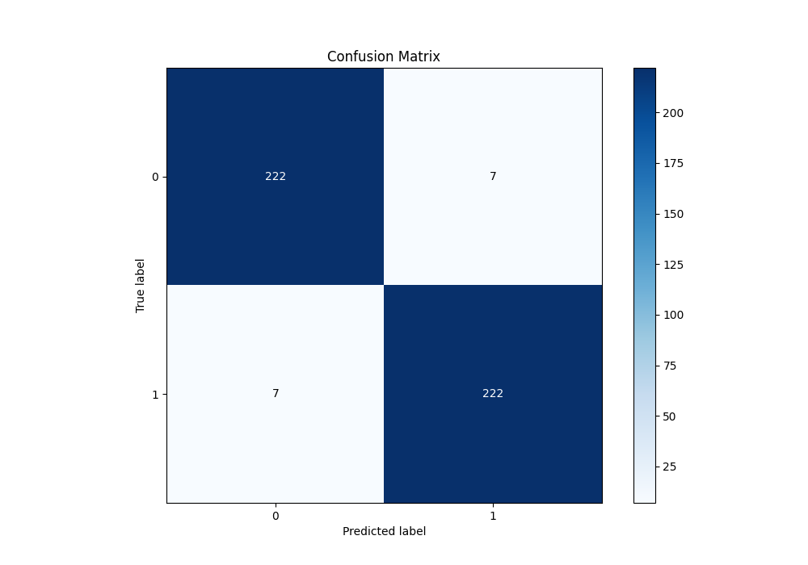
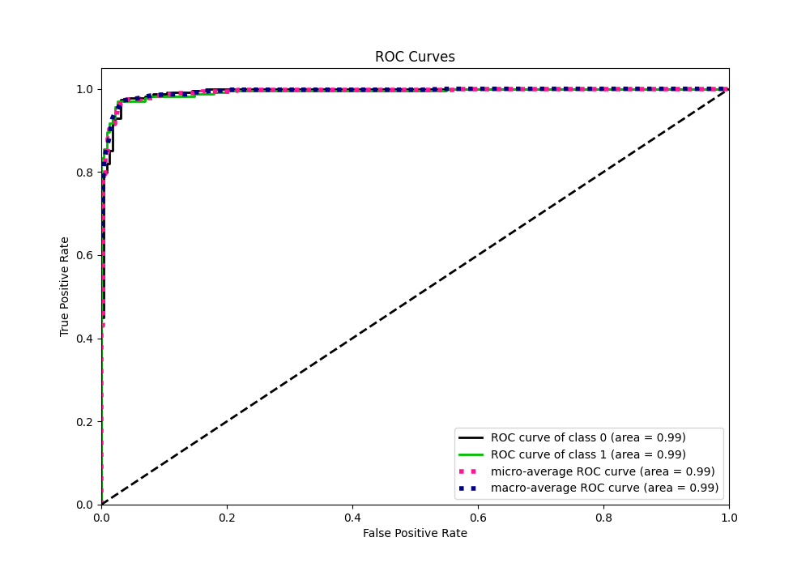
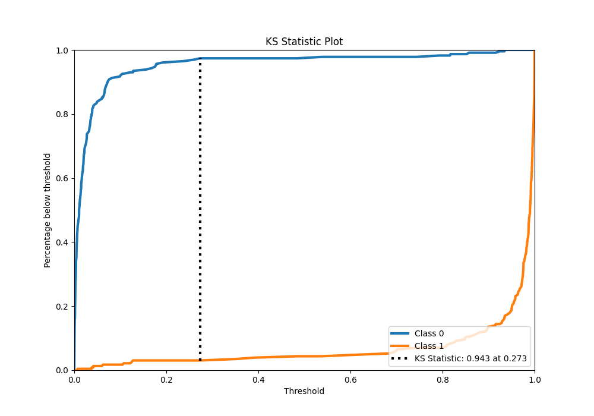
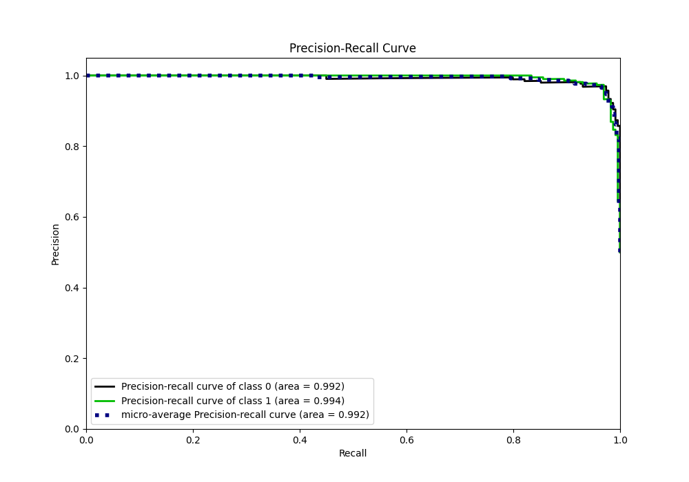
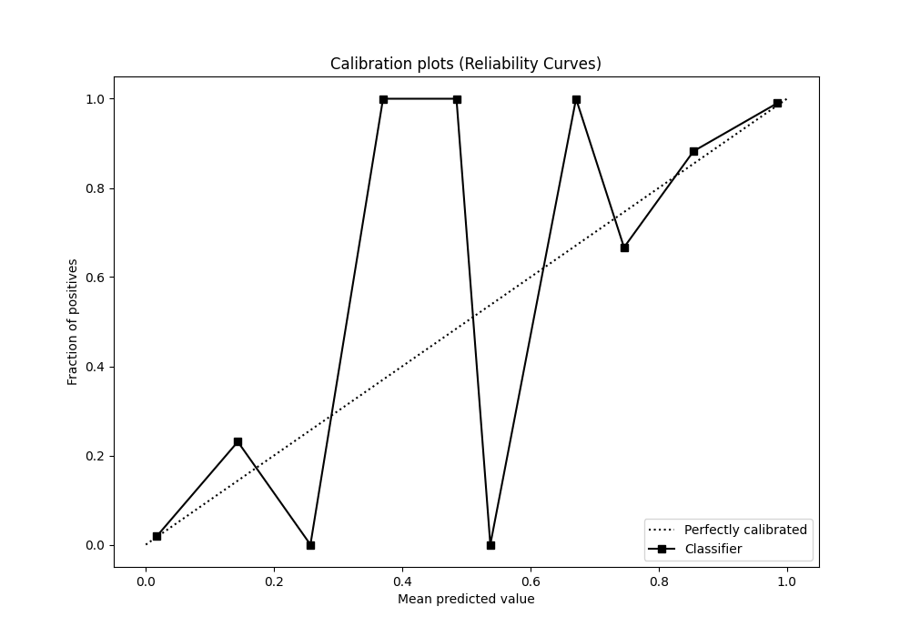
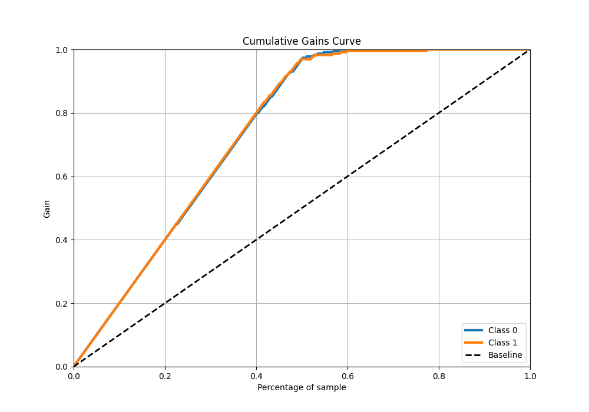
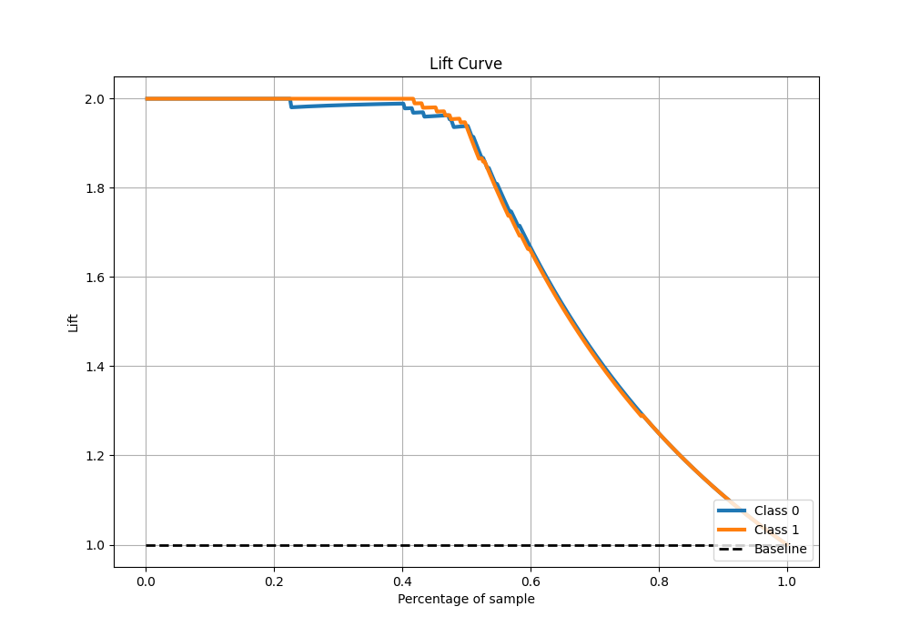

# Summary of 77_CatBoost

[<< Go back](../README.md)

## CatBoost
- **n_jobs**: -1
- **learning_rate**: 0.1
- **depth**: 5
- **rsm**: 0.7
- **loss_function**: Logloss
- **eval_metric**: Logloss
- **explain_level**: 0

## Validation
 - **validation_type**: kfold
 - **shuffle**: True
 - **stratify**: True
 - **k_folds**: 10

## Optimized metric
logloss

## Training time

24.1 seconds

## Metric details
|           |    score |    threshold |
|:----------|---------:|-------------:|
| logloss   | 0.105146 | nan          |
| auc       | 0.992487 | nan          |
| f1        | 0.969432 |   0.26613    |
| accuracy  | 0.969432 |   0.26613    |
| precision | 1        |   0.943407   |
| recall    | 1        |   2.1271e-05 |
| mcc       | 0.938865 |   0.26613    |

## Metric details with threshold from accuracy metric
|           |    score |   threshold |
|:----------|---------:|------------:|
| logloss   | 0.105146 |   nan       |
| auc       | 0.992487 |   nan       |
| f1        | 0.969432 |     0.26613 |
| accuracy  | 0.969432 |     0.26613 |
| precision | 0.969432 |     0.26613 |
| recall    | 0.969432 |     0.26613 |
| mcc       | 0.938865 |     0.26613 |

## Confusion matrix (at threshold=0.26613)
|              |   Predicted as 0 |   Predicted as 1 |
|:-------------|-----------------:|-----------------:|
| Labeled as 0 |              222 |                7 |
| Labeled as 1 |                7 |              222 |

## Learning curves

## Confusion Matrix

## Normalized Confusion Matrix

## ROC Curve

## Kolmogorov-Smirnov Statistic

## Precision-Recall Curve

## Calibration Curve

## Cumulative Gains Curve

## Lift Curve

[<< Go back](../README.md)
