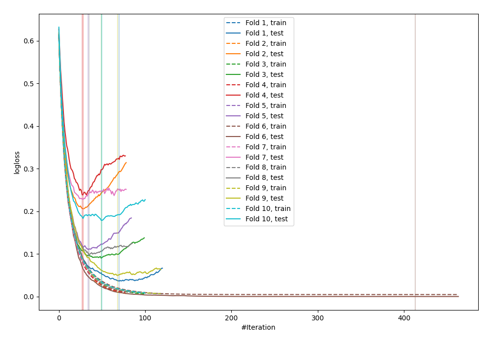
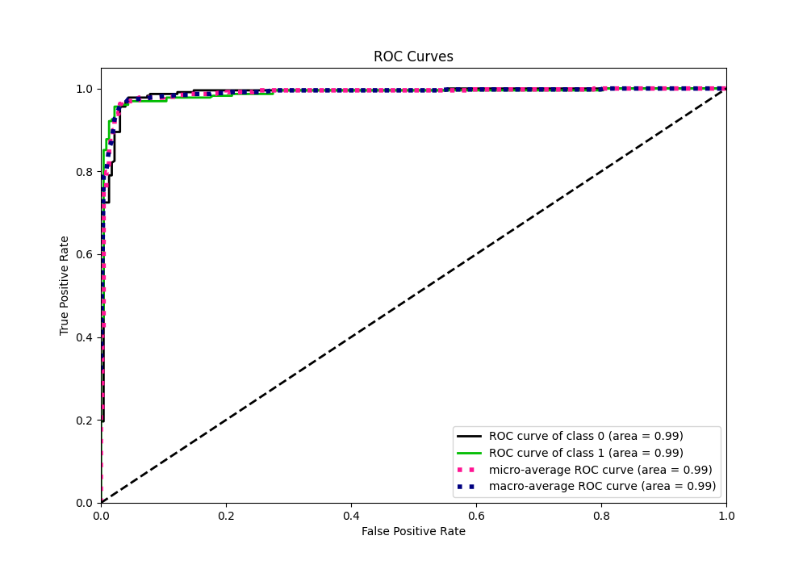
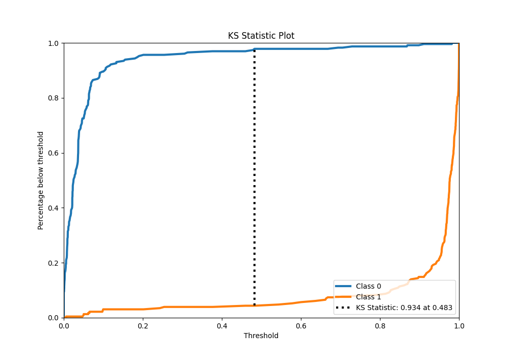
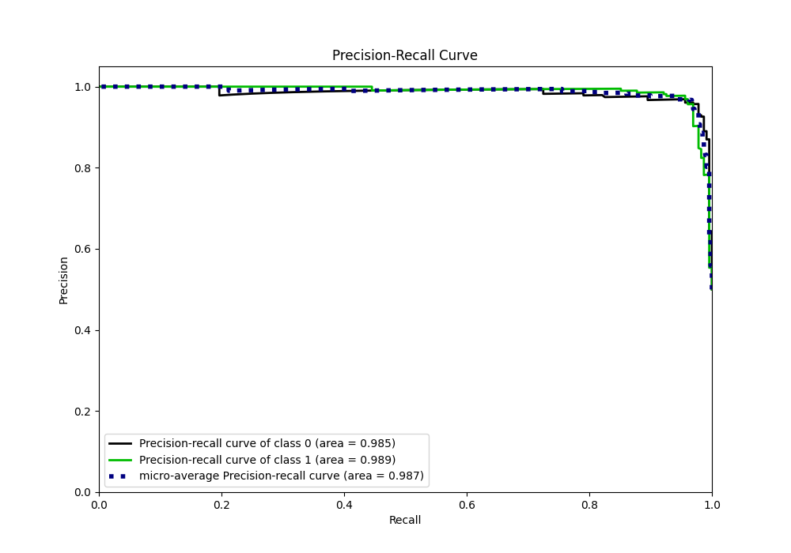
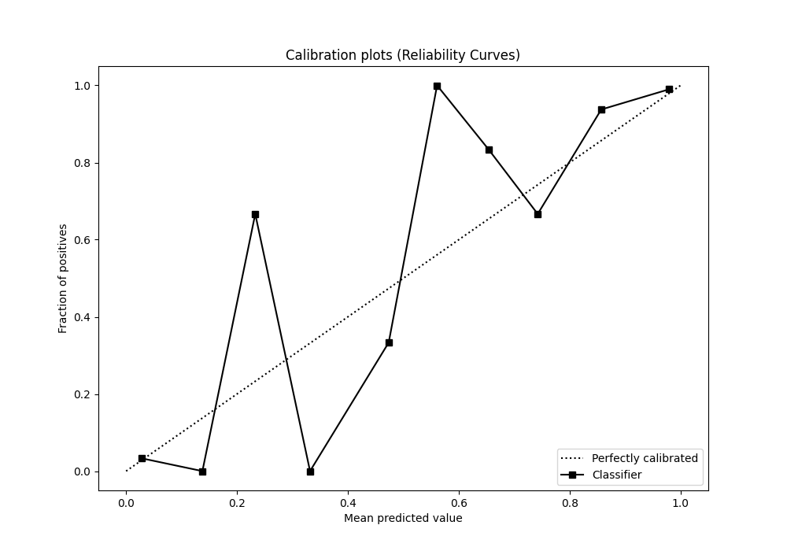
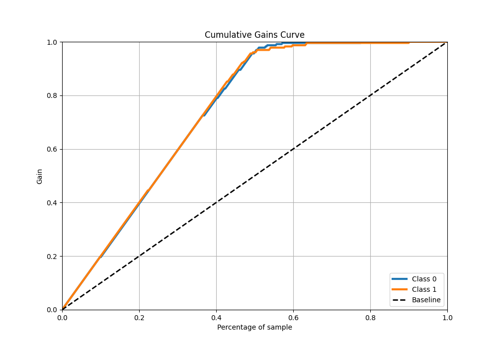
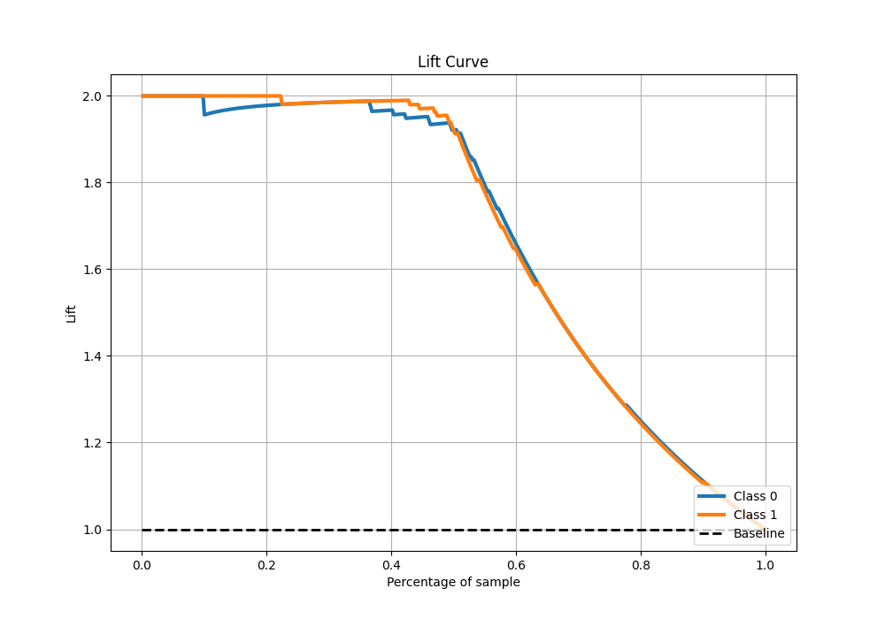

# Summary of 79_LightGBM

[<< Go back](../README.md)

## LightGBM
- **n_jobs**: -1
- **objective**: binary
- **num_leaves**: 15
- **learning_rate**: 0.1
- **feature_fraction**: 0.8
- **bagging_fraction**: 0.8
- **min_data_in_leaf**: 5
- **metric**: binary_logloss
- **custom_eval_metric_name**: None
- **explain_level**: 0

## Validation
 - **validation_type**: kfold
 - **shuffle**: True
 - **stratify**: True
 - **k_folds**: 10

## Optimized metric
logloss

## Training time

23.4 seconds

## Metric details
|           |    score |    threshold |
|:----------|---------:|-------------:|
| logloss   | 0.123575 | nan          |
| auc       | 0.987653 | nan          |
| f1        | 0.964758 |   0.480689   |
| accuracy  | 0.965066 |   0.480689   |
| precision | 1        |   0.982776   |
| recall    | 1        |   4.9947e-08 |
| mcc       | 0.930273 |   0.480689   |

## Metric details with threshold from accuracy metric
|           |    score |   threshold |
|:----------|---------:|------------:|
| logloss   | 0.123575 |  nan        |
| auc       | 0.987653 |  nan        |
| f1        | 0.964758 |    0.480689 |
| accuracy  | 0.965066 |    0.480689 |
| precision | 0.973333 |    0.480689 |
| recall    | 0.956332 |    0.480689 |
| mcc       | 0.930273 |    0.480689 |

## Confusion matrix (at threshold=0.480689)
|              |   Predicted as 0 |   Predicted as 1 |
|:-------------|-----------------:|-----------------:|
| Labeled as 0 |              223 |                6 |
| Labeled as 1 |               10 |              219 |

## Learning curves

## Confusion Matrix

## Normalized Confusion Matrix

## ROC Curve

## Kolmogorov-Smirnov Statistic

## Precision-Recall Curve

## Calibration Curve

## Cumulative Gains Curve

## Lift Curve

[<< Go back](../README.md)
