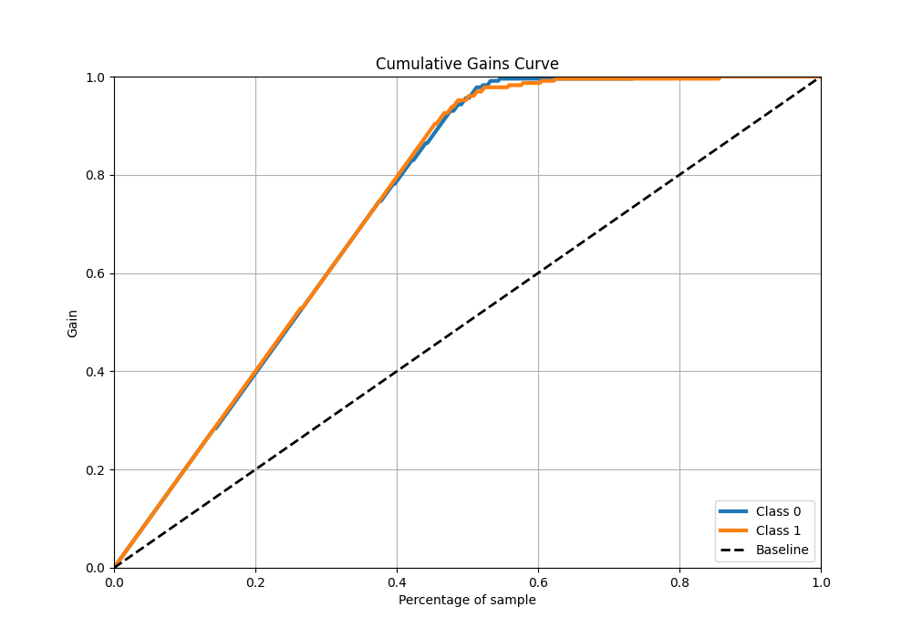

# Summary of 80_LightGBM

[<< Go back](../README.md)

## LightGBM
- **n_jobs**: -1
- **objective**: binary
- **num_leaves**: 63
- **learning_rate**: 0.1
- **feature_fraction**: 0.8
- **bagging_fraction**: 0.8
- **min_data_in_leaf**: 5
- **metric**: binary_logloss
- **custom_eval_metric_name**: None
- **explain_level**: 0

## Validation
 - **validation_type**: kfold
 - **shuffle**: True
 - **stratify**: True
 - **k_folds**: 10

## Optimized metric
logloss

## Training time

26.3 seconds

## Metric details
|           |    score |     threshold |
|:----------|---------:|--------------:|
| logloss   | 0.119156 | nan           |
| auc       | 0.989646 | nan           |
| f1        | 0.960352 |   0.512618    |
| accuracy  | 0.960699 |   0.512618    |
| precision | 1        |   0.981393    |
| recall    | 1        |   4.41866e-07 |
| mcc       | 0.92196  |   0.609892    |

## Metric details with threshold from accuracy metric
|           |    score |   threshold |
|:----------|---------:|------------:|
| logloss   | 0.119156 |  nan        |
| auc       | 0.989646 |  nan        |
| f1        | 0.960352 |    0.512618 |
| accuracy  | 0.960699 |    0.512618 |
| precision | 0.968889 |    0.512618 |
| recall    | 0.951965 |    0.512618 |
| mcc       | 0.921538 |    0.512618 |

## Confusion matrix (at threshold=0.512618)
|              |   Predicted as 0 |   Predicted as 1 |
|:-------------|-----------------:|-----------------:|
| Labeled as 0 |              222 |                7 |
| Labeled as 1 |               11 |              218 |

## Learning curves

## Confusion Matrix

## Normalized Confusion Matrix

## ROC Curve

## Kolmogorov-Smirnov Statistic

## Precision-Recall Curve

## Calibration Curve

## Cumulative Gains Curve

## Lift Curve

[<< Go back](../README.md)
