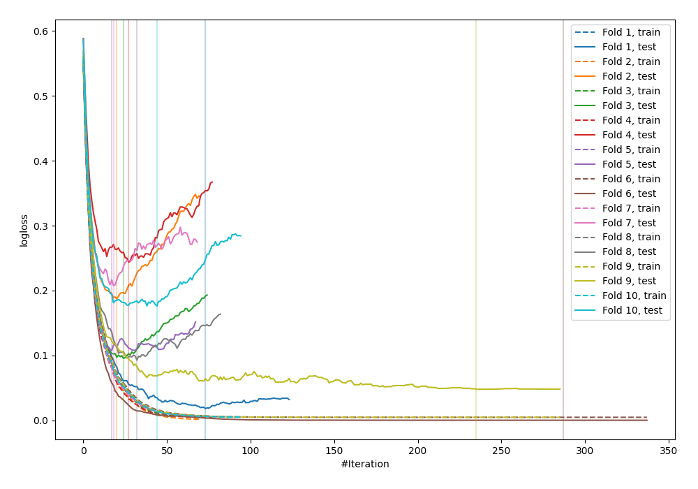
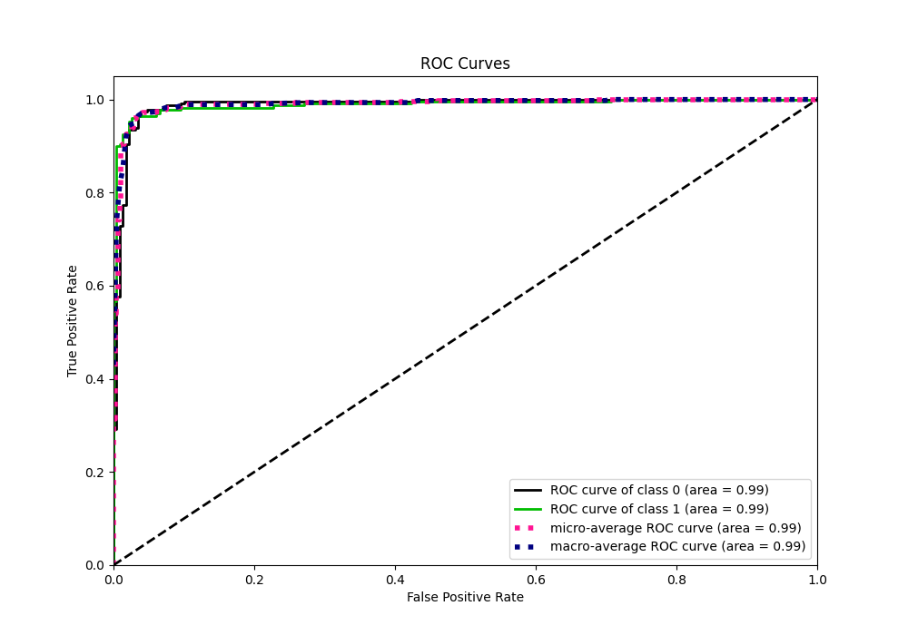
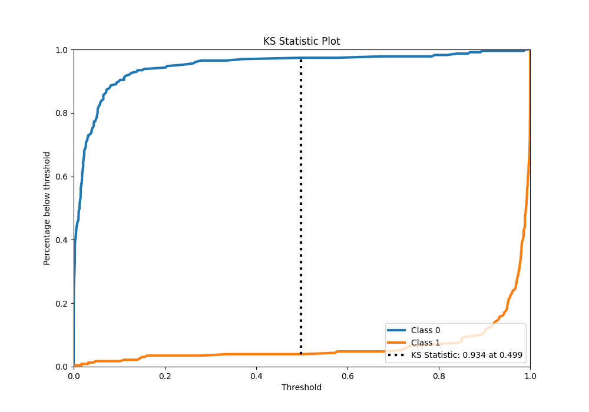
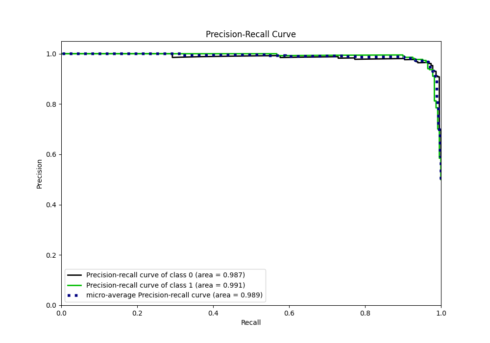
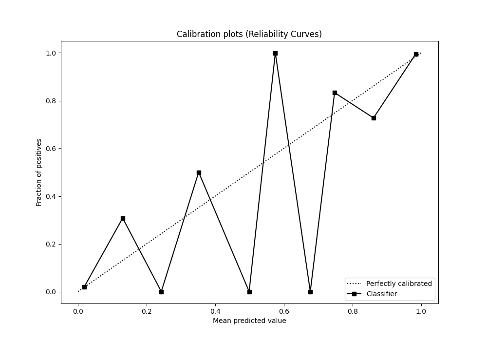
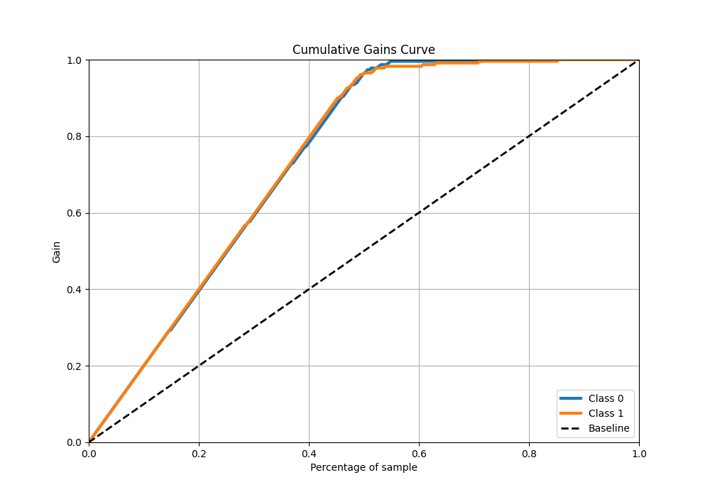
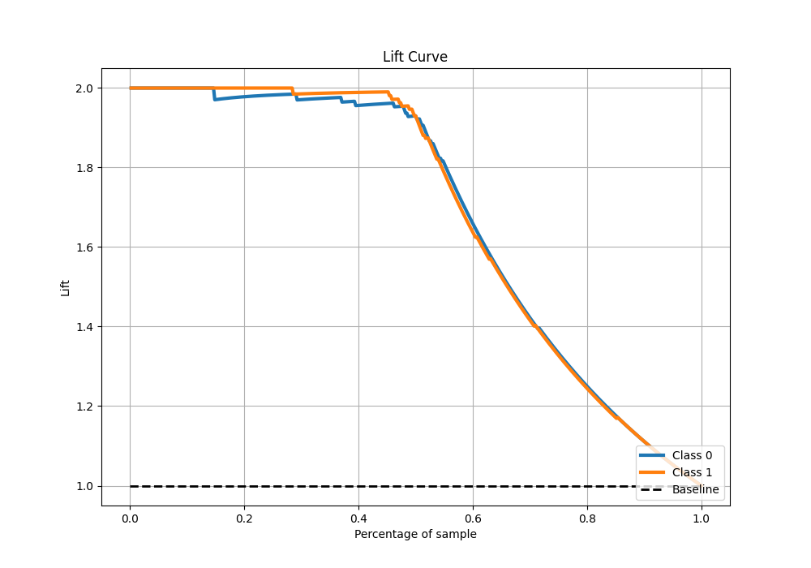

# Summary of 81_LightGBM

[<< Go back](../README.md)

## LightGBM
- **n_jobs**: -1
- **objective**: binary
- **num_leaves**: 31
- **learning_rate**: 0.2
- **feature_fraction**: 0.5
- **bagging_fraction**: 1.0
- **min_data_in_leaf**: 10
- **metric**: binary_logloss
- **custom_eval_metric_name**: None
- **explain_level**: 0

## Validation
 - **validation_type**: kfold
 - **shuffle**: True
 - **stratify**: True
 - **k_folds**: 10

## Optimized metric
logloss

## Training time

25.3 seconds

## Metric details
|           |    score |     threshold |
|:----------|---------:|--------------:|
| logloss   | 0.117737 | nan           |
| auc       | 0.988921 | nan           |
| f1        | 0.965066 |   0.306924    |
| accuracy  | 0.965066 |   0.306924    |
| precision | 1        |   0.988074    |
| recall    | 1        |   2.18611e-09 |
| mcc       | 0.930273 |   0.574991    |

## Metric details with threshold from accuracy metric
|           |    score |   threshold |
|:----------|---------:|------------:|
| logloss   | 0.117737 |  nan        |
| auc       | 0.988921 |  nan        |
| f1        | 0.965066 |    0.306924 |
| accuracy  | 0.965066 |    0.306924 |
| precision | 0.965066 |    0.306924 |
| recall    | 0.965066 |    0.306924 |
| mcc       | 0.930131 |    0.306924 |

## Confusion matrix (at threshold=0.306924)
|              |   Predicted as 0 |   Predicted as 1 |
|:-------------|-----------------:|-----------------:|
| Labeled as 0 |              221 |                8 |
| Labeled as 1 |                8 |              221 |

## Learning curves

## Confusion Matrix

## Normalized Confusion Matrix

## ROC Curve

## Kolmogorov-Smirnov Statistic

## Precision-Recall Curve

## Calibration Curve

## Cumulative Gains Curve

## Lift Curve

[<< Go back](../README.md)
