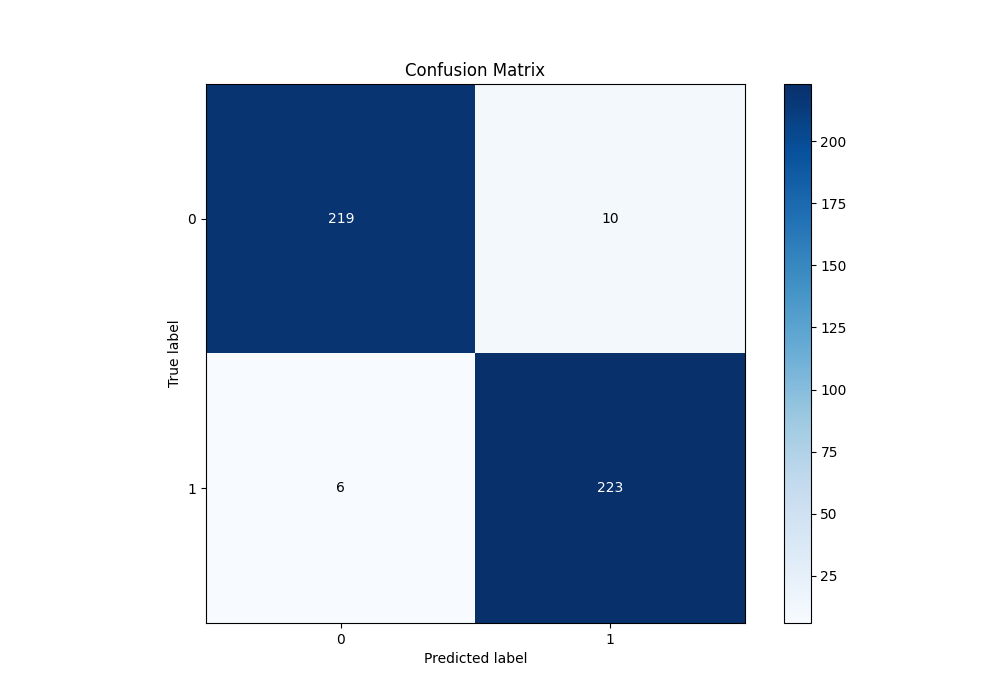
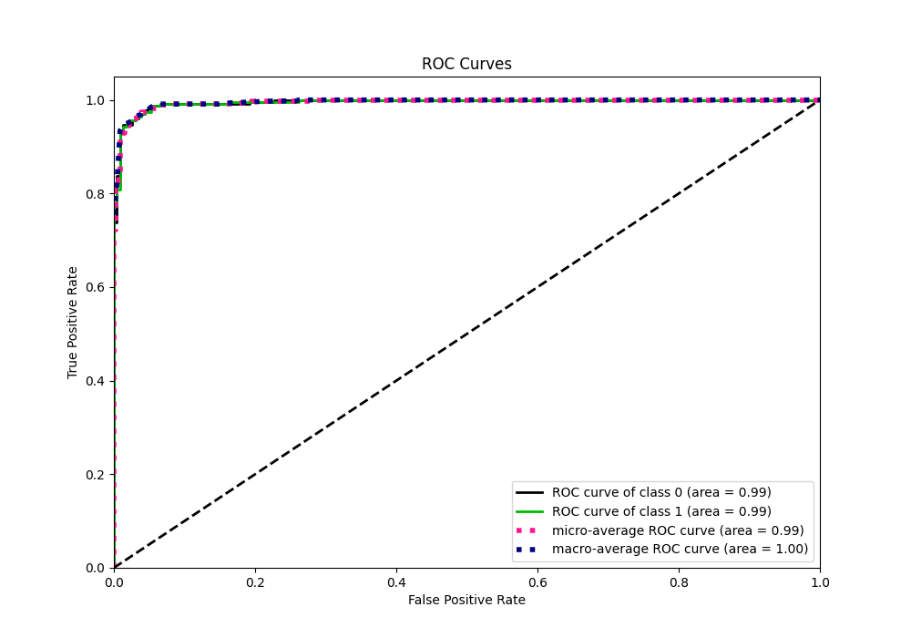

# Summary of 83_CatBoost

[<< Go back](../README.md)

## CatBoost
- **n_jobs**: -1
- **learning_rate**: 0.05
- **depth**: 7
- **rsm**: 0.7
- **loss_function**: Logloss
- **eval_metric**: Logloss
- **explain_level**: 0

## Validation
 - **validation_type**: kfold
 - **shuffle**: True
 - **stratify**: True
 - **k_folds**: 10

## Optimized metric
logloss

## Training time

40.6 seconds

## Metric details
|           |     score |    threshold |
|:----------|----------:|-------------:|
| logloss   | 0.0934722 | nan          |
| auc       | 0.994928  | nan          |
| f1        | 0.965368  |   0.179647   |
| accuracy  | 0.965066  |   0.179647   |
| precision | 1         |   0.964811   |
| recall    | 1         |   9.6435e-05 |
| mcc       | 0.930699  |   0.653869   |

## Metric details with threshold from accuracy metric
|           |     score |   threshold |
|:----------|----------:|------------:|
| logloss   | 0.0934722 |  nan        |
| auc       | 0.994928  |  nan        |
| f1        | 0.965368  |    0.179647 |
| accuracy  | 0.965066  |    0.179647 |
| precision | 0.957082  |    0.179647 |
| recall    | 0.973799  |    0.179647 |
| mcc       | 0.930273  |    0.179647 |

## Confusion matrix (at threshold=0.179647)
|              |   Predicted as 0 |   Predicted as 1 |
|:-------------|-----------------:|-----------------:|
| Labeled as 0 |              219 |               10 |
| Labeled as 1 |                6 |              223 |

## Learning curves

## Confusion Matrix

## Normalized Confusion Matrix

## ROC Curve

## Kolmogorov-Smirnov Statistic

## Precision-Recall Curve

## Calibration Curve

## Cumulative Gains Curve

## Lift Curve

[<< Go back](../README.md)
