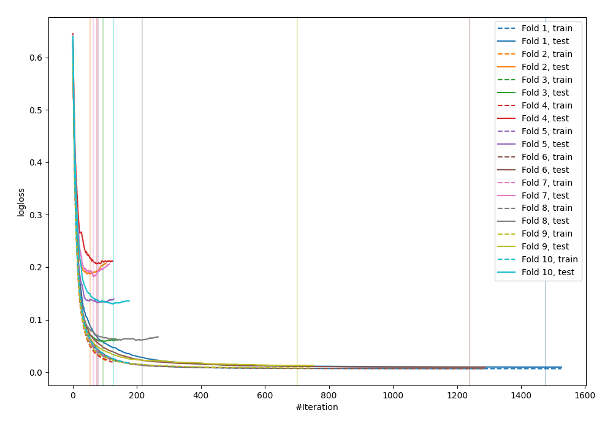
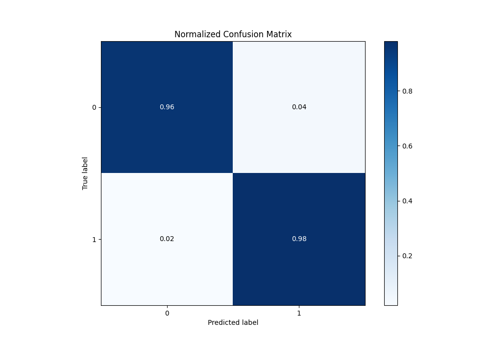
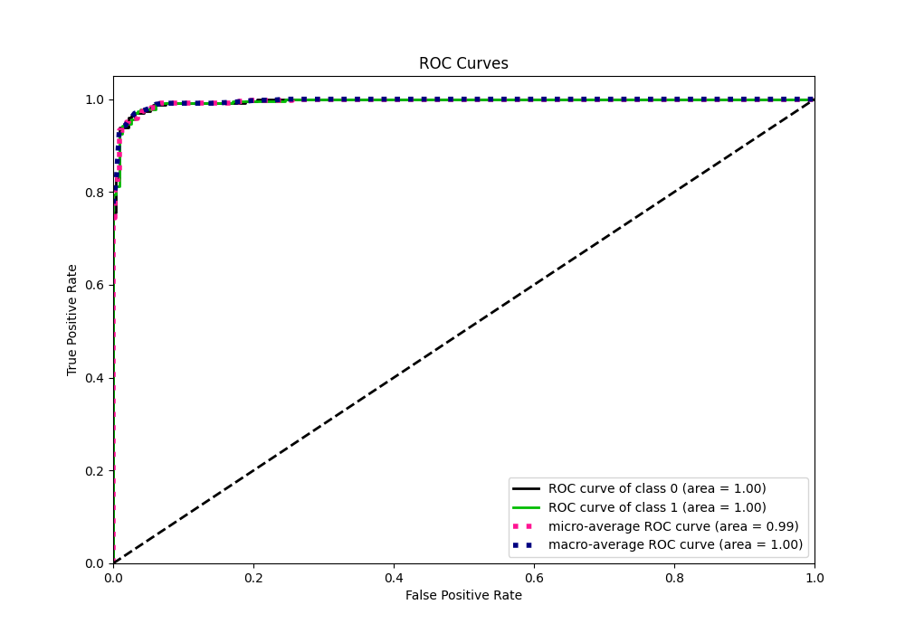
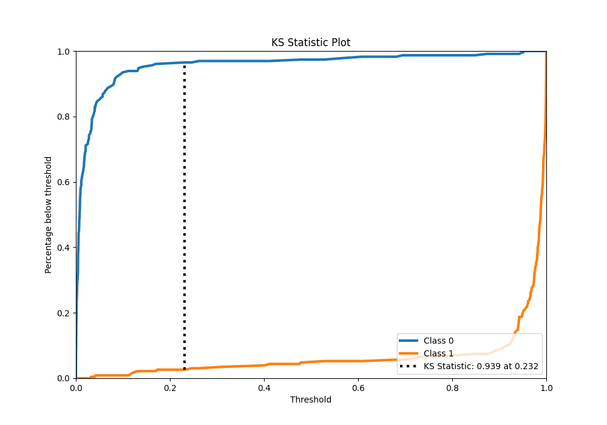
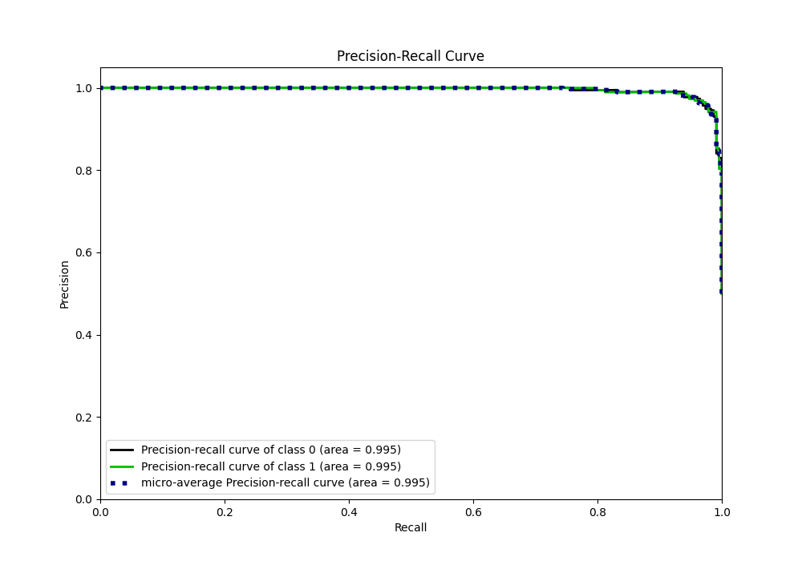
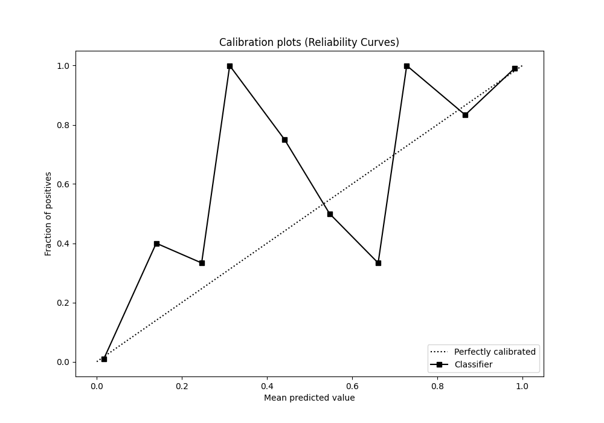
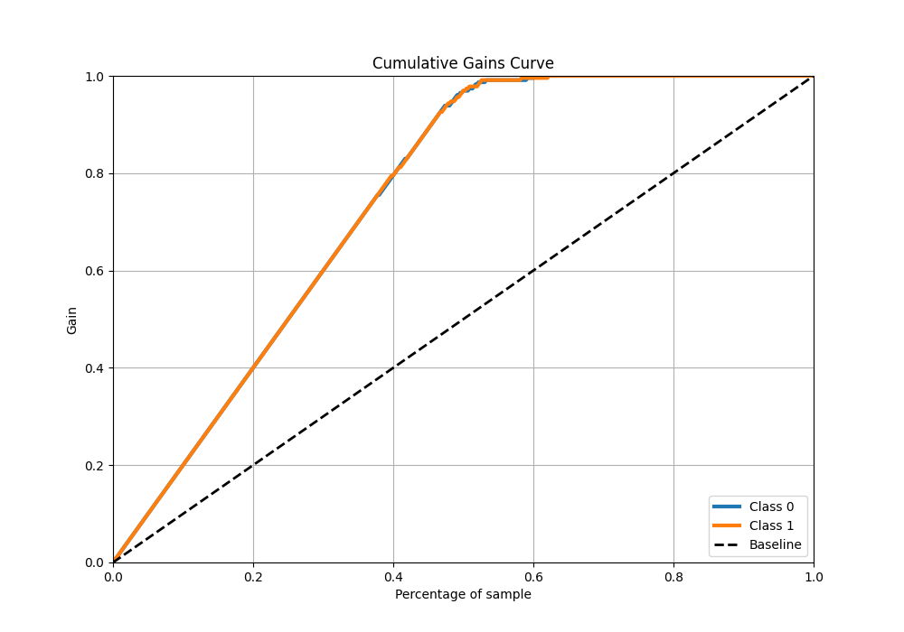
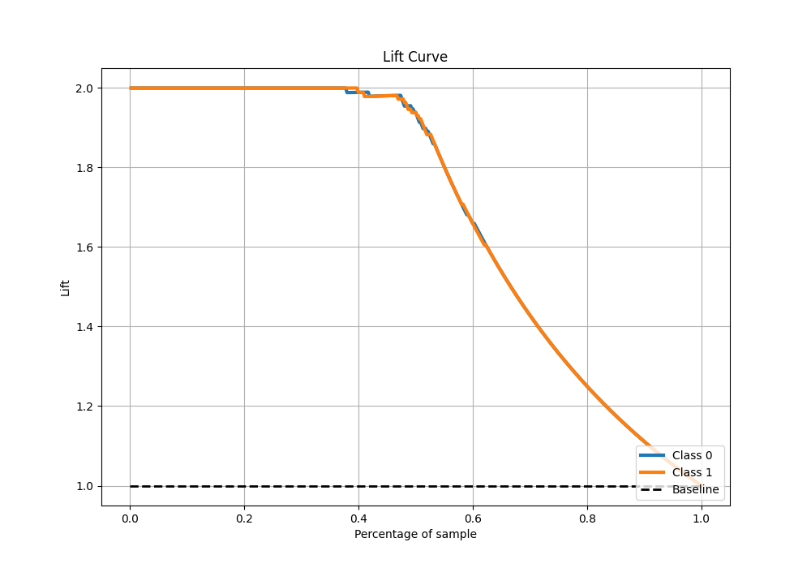

# Summary of 83_CatBoost_BoostOnErrors

[<< Go back](../README.md)

## CatBoost
- **n_jobs**: -1
- **learning_rate**: 0.05
- **depth**: 7
- **rsm**: 0.7
- **loss_function**: Logloss
- **eval_metric**: Logloss
- **explain_level**: 0

## Validation
 - **validation_type**: kfold
 - **shuffle**: True
 - **stratify**: True
 - **k_folds**: 10

## Optimized metric
logloss

## Training time

44.0 seconds

## Metric details
|           |     score |     threshold |
|:----------|----------:|--------------:|
| logloss   | 0.0933352 | nan           |
| auc       | 0.995061  | nan           |
| f1        | 0.969697  |   0.171493    |
| accuracy  | 0.969432  |   0.171493    |
| precision | 1         |   0.954979    |
| recall    | 1         |   0.000102049 |
| mcc       | 0.939008  |   0.171493    |

## Metric details with threshold from accuracy metric
|           |     score |   threshold |
|:----------|----------:|------------:|
| logloss   | 0.0933352 |  nan        |
| auc       | 0.995061  |  nan        |
| f1        | 0.969697  |    0.171493 |
| accuracy  | 0.969432  |    0.171493 |
| precision | 0.961373  |    0.171493 |
| recall    | 0.978166  |    0.171493 |
| mcc       | 0.939008  |    0.171493 |

## Confusion matrix (at threshold=0.171493)
|              |   Predicted as 0 |   Predicted as 1 |
|:-------------|-----------------:|-----------------:|
| Labeled as 0 |              220 |                9 |
| Labeled as 1 |                5 |              224 |

## Learning curves

## Confusion Matrix

## Normalized Confusion Matrix

## ROC Curve

## Kolmogorov-Smirnov Statistic

## Precision-Recall Curve

## Calibration Curve

## Cumulative Gains Curve

## Lift Curve

[<< Go back](../README.md)
