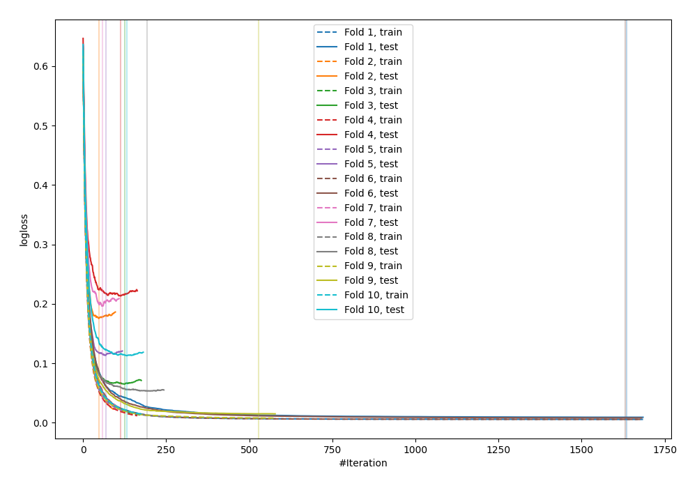
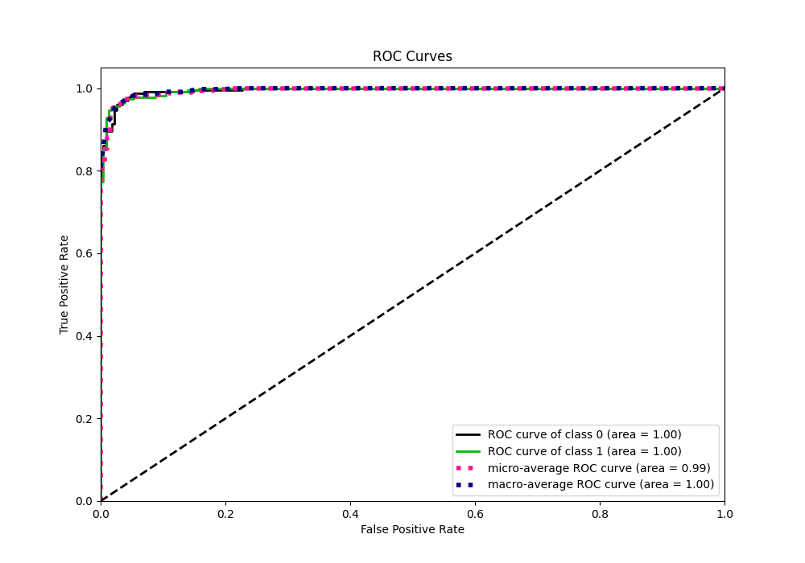
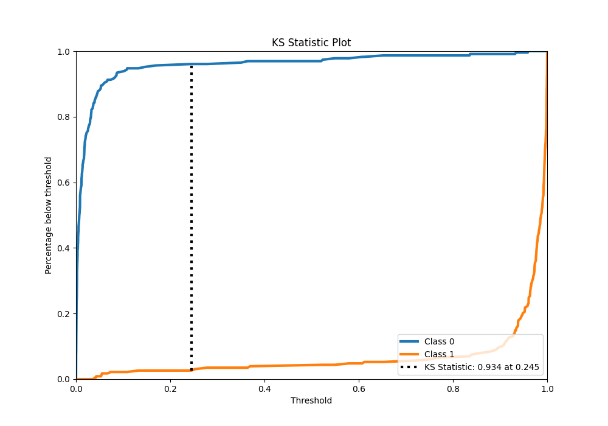
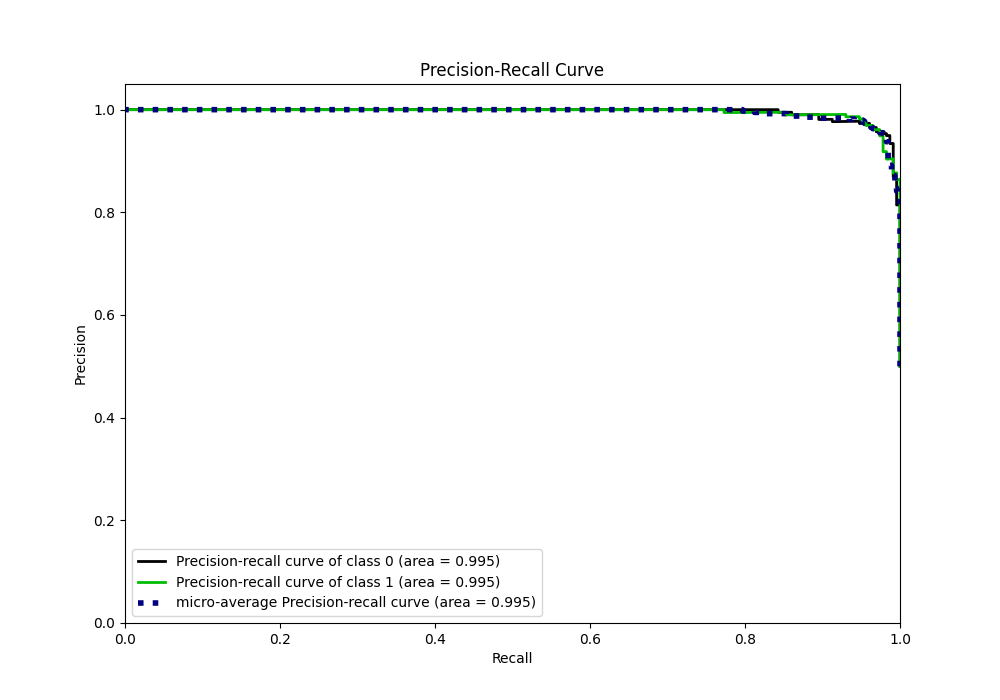
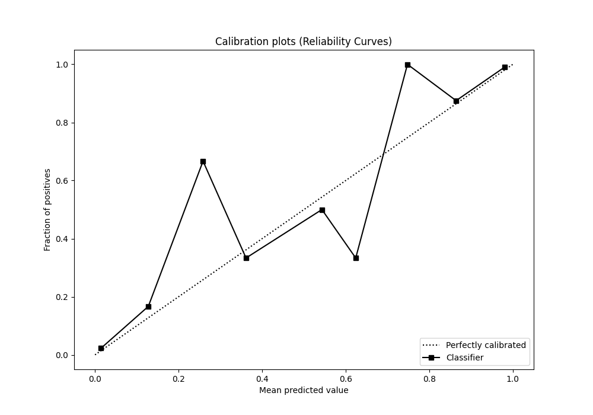
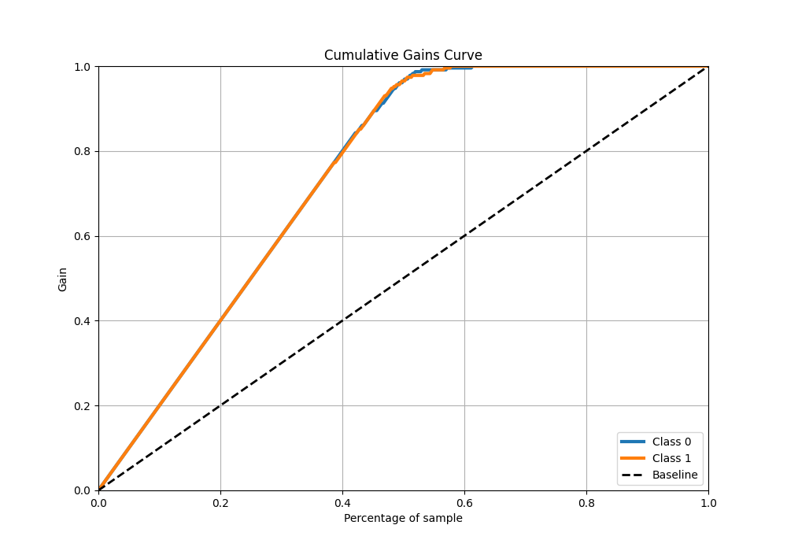

# Summary of 86_CatBoost

[<< Go back](../README.md)

## CatBoost
- **n_jobs**: -1
- **learning_rate**: 0.05
- **depth**: 8
- **rsm**: 0.7
- **loss_function**: Logloss
- **eval_metric**: Logloss
- **explain_level**: 0

## Validation
 - **validation_type**: kfold
 - **shuffle**: True
 - **stratify**: True
 - **k_folds**: 10

## Optimized metric
logloss

## Training time

57.1 seconds

## Metric details
|           |     score |     threshold |
|:----------|----------:|--------------:|
| logloss   | 0.0964026 | nan           |
| auc       | 0.995137  | nan           |
| f1        | 0.965368  |   0.20728     |
| accuracy  | 0.965066  |   0.20728     |
| precision | 1         |   0.959643    |
| recall    | 1         |   6.94756e-05 |
| mcc       | 0.930699  |   0.632217    |

## Metric details with threshold from accuracy metric
|           |     score |   threshold |
|:----------|----------:|------------:|
| logloss   | 0.0964026 |   nan       |
| auc       | 0.995137  |   nan       |
| f1        | 0.965368  |     0.20728 |
| accuracy  | 0.965066  |     0.20728 |
| precision | 0.957082  |     0.20728 |
| recall    | 0.973799  |     0.20728 |
| mcc       | 0.930273  |     0.20728 |

## Confusion matrix (at threshold=0.20728)
|              |   Predicted as 0 |   Predicted as 1 |
|:-------------|-----------------:|-----------------:|
| Labeled as 0 |              219 |               10 |
| Labeled as 1 |                6 |              223 |

## Learning curves

## Confusion Matrix

## Normalized Confusion Matrix

## ROC Curve

## Kolmogorov-Smirnov Statistic

## Precision-Recall Curve

## Calibration Curve

## Cumulative Gains Curve

## Lift Curve

[<< Go back](../README.md)
