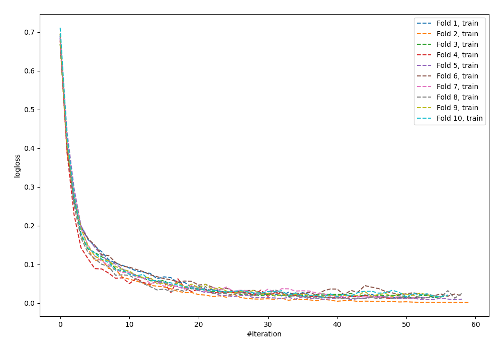
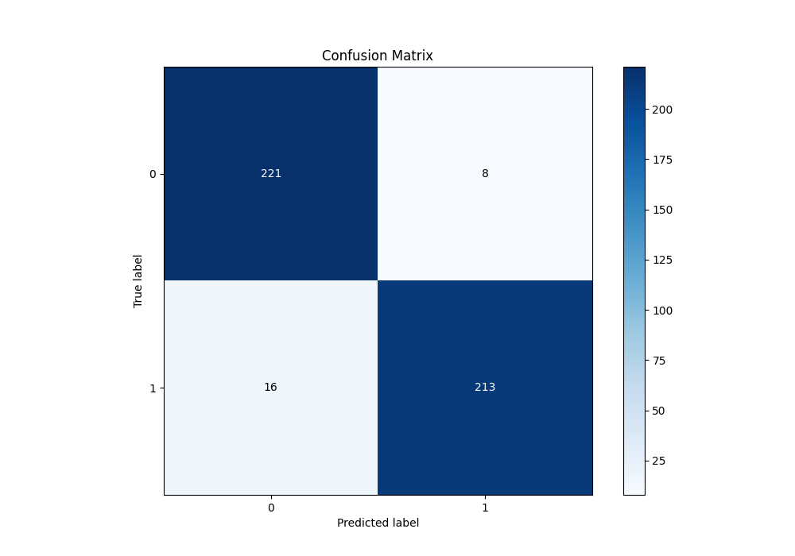
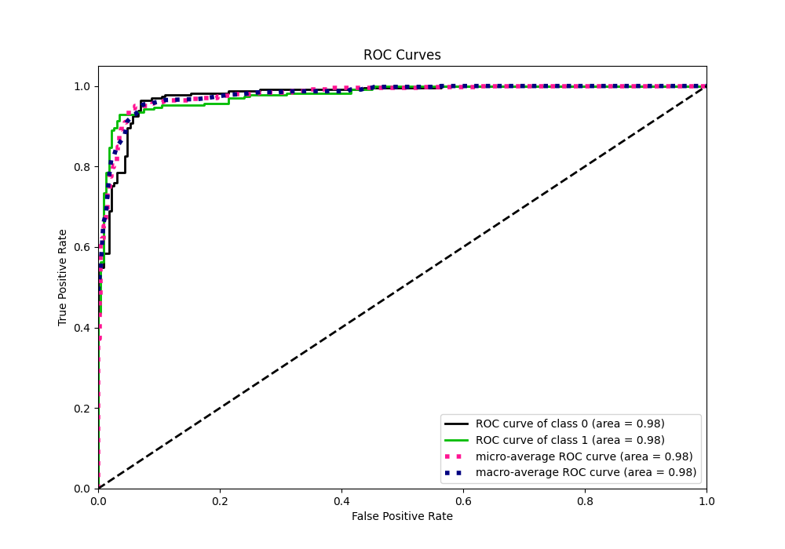
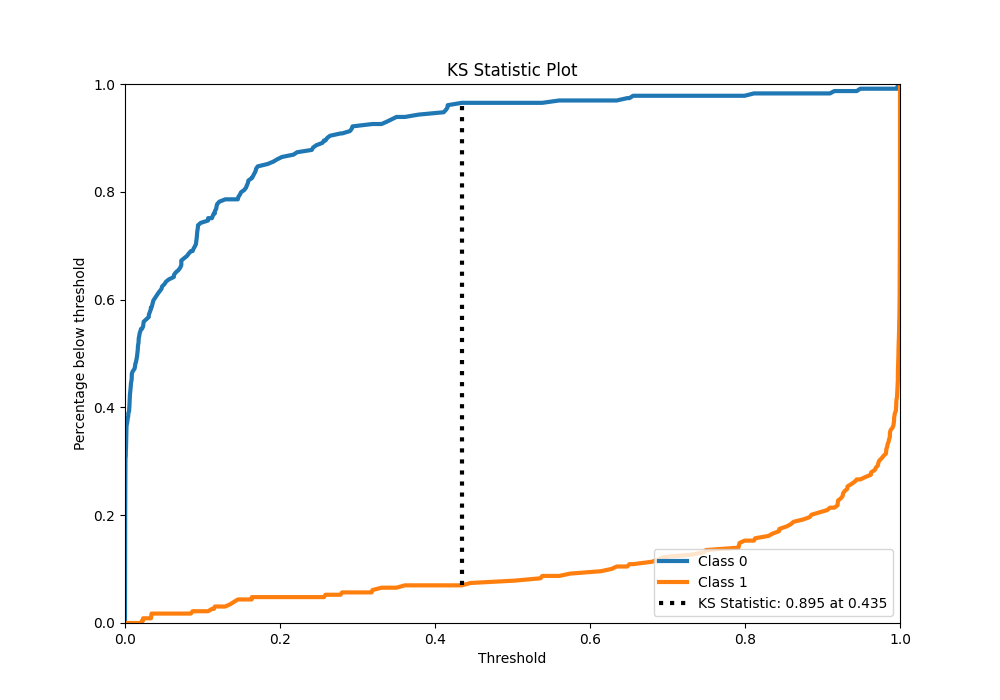
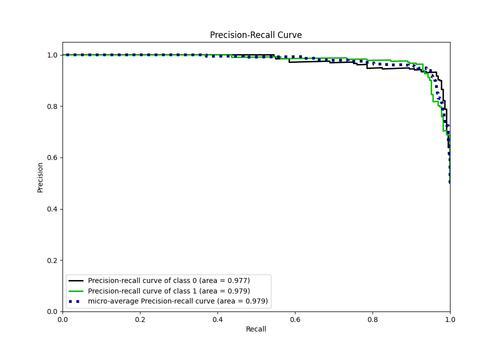
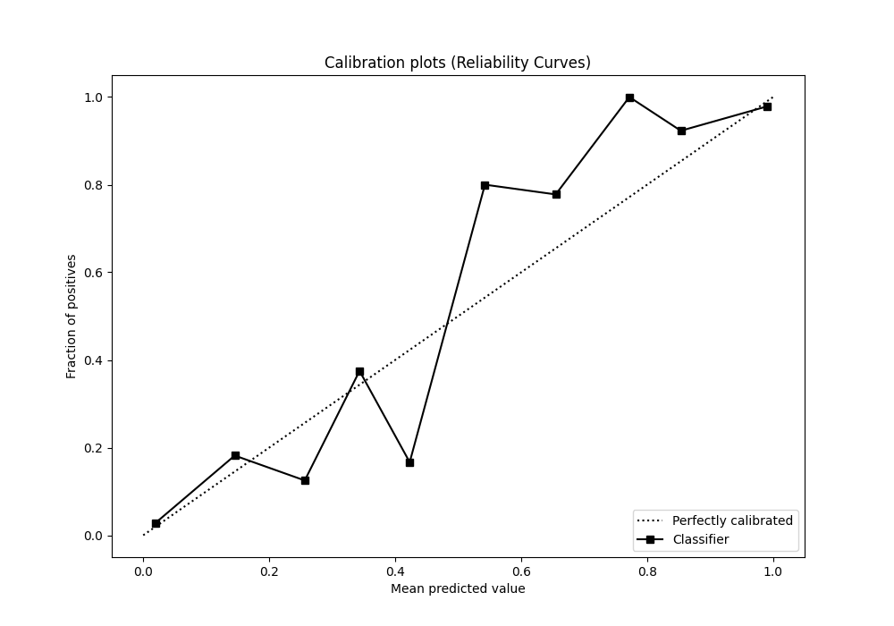
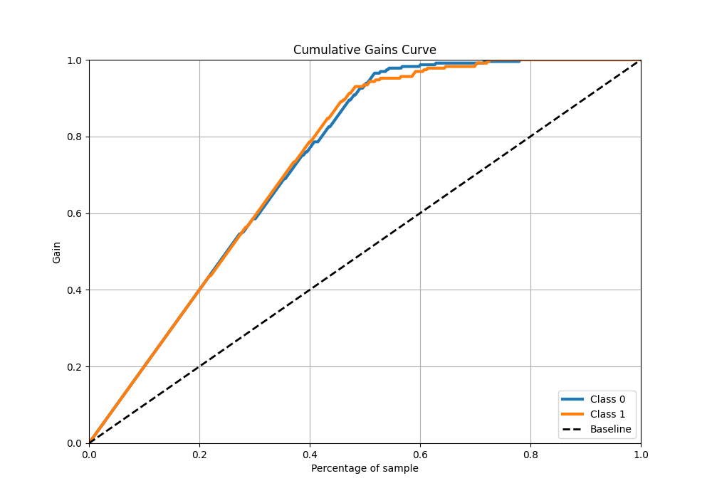
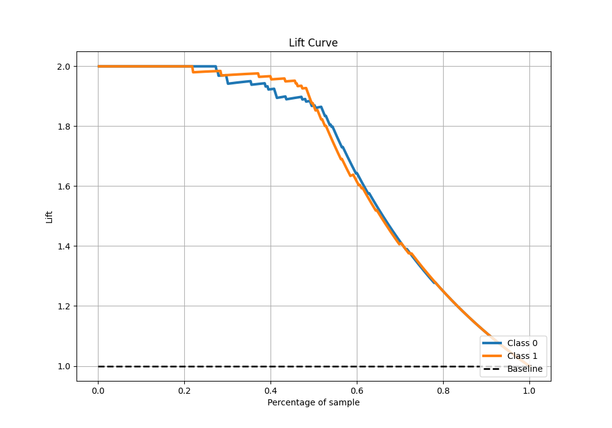

# Summary of 8_Default_NeuralNetwork

[<< Go back](../README.md)

## Neural Network
- **n_jobs**: -1
- **dense_1_size**: 32
- **dense_2_size**: 16
- **learning_rate**: 0.05
- **explain_level**: 0

## Validation
 - **validation_type**: kfold
 - **shuffle**: True
 - **stratify**: True
 - **k_folds**: 10

## Optimized metric
logloss

## Training time

7.6 seconds

## Metric details
|           |    score |     threshold |
|:----------|---------:|--------------:|
| logloss   | 0.187465 | nan           |
| auc       | 0.977594 | nan           |
| f1        | 0.946667 |   0.440257    |
| accuracy  | 0.947598 |   0.440257    |
| precision | 1        |   0.999284    |
| recall    | 1        |   1.70169e-06 |
| mcc       | 0.895743 |   0.440257    |

## Metric details with threshold from accuracy metric
|           |    score |   threshold |
|:----------|---------:|------------:|
| logloss   | 0.187465 |  nan        |
| auc       | 0.977594 |  nan        |
| f1        | 0.946667 |    0.440257 |
| accuracy  | 0.947598 |    0.440257 |
| precision | 0.963801 |    0.440257 |
| recall    | 0.930131 |    0.440257 |
| mcc       | 0.895743 |    0.440257 |

## Confusion matrix (at threshold=0.440257)
|              |   Predicted as 0 |   Predicted as 1 |
|:-------------|-----------------:|-----------------:|
| Labeled as 0 |              221 |                8 |
| Labeled as 1 |               16 |              213 |

## Learning curves

## Confusion Matrix

## Normalized Confusion Matrix

## ROC Curve

## Kolmogorov-Smirnov Statistic

## Precision-Recall Curve

## Calibration Curve

## Cumulative Gains Curve

## Lift Curve

[<< Go back](../README.md)
