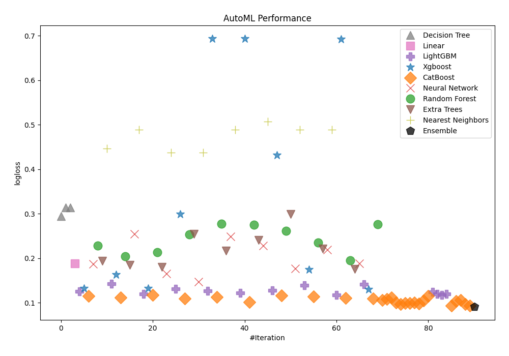

# AutoML Leaderboard

| Best model   | name                                                                 | model_type        | metric_type   |   metric_value |   train_time |
|:-------------|:---------------------------------------------------------------------|:------------------|:--------------|---------------:|-------------:|
|              | [1_DecisionTree](1_DecisionTree/README.md)                           | Decision Tree     | logloss       |      0.295041  |         5.33 |
|              | [2_DecisionTree](2_DecisionTree/README.md)                           | Decision Tree     | logloss       |      0.313541  |         5.19 |
|              | [3_DecisionTree](3_DecisionTree/README.md)                           | Decision Tree     | logloss       |      0.313541  |         5.32 |
|              | [4_Linear](4_Linear/README.md)                                       | Linear            | logloss       |      0.18766   |         6.13 |
|              | [5_Default_LightGBM](5_Default_LightGBM/README.md)                   | LightGBM          | logloss       |      0.125001  |        11.22 |
|              | [6_Default_Xgboost](6_Default_Xgboost/README.md)                     | Xgboost           | logloss       |      0.132326  |         9.43 |
|              | [7_Default_CatBoost](7_Default_CatBoost/README.md)                   | CatBoost          | logloss       |      0.114824  |        10.61 |
|              | [8_Default_NeuralNetwork](8_Default_NeuralNetwork/README.md)         | Neural Network    | logloss       |      0.187465  |         8.11 |
|              | [9_Default_RandomForest](9_Default_RandomForest/README.md)           | Random Forest     | logloss       |      0.228603  |        11.64 |
|              | [10_Default_ExtraTrees](10_Default_ExtraTrees/README.md)             | Extra Trees       | logloss       |      0.193979  |        10.97 |
|              | [11_Default_NearestNeighbors](11_Default_NearestNeighbors/README.md) | Nearest Neighbors | logloss       |      0.447072  |         7.98 |
|              | [21_LightGBM](21_LightGBM/README.md)                                 | LightGBM          | logloss       |      0.142061  |        11.57 |
|              | [12_Xgboost](12_Xgboost/README.md)                                   | Xgboost           | logloss       |      0.163252  |        10.06 |
|              | [30_CatBoost](30_CatBoost/README.md)                                 | CatBoost          | logloss       |      0.111399  |        35.02 |
|              | [39_RandomForest](39_RandomForest/README.md)                         | Random Forest     | logloss       |      0.204734  |        13.2  |
|              | [48_ExtraTrees](48_ExtraTrees/README.md)                             | Extra Trees       | logloss       |      0.184721  |        12.91 |
|              | [57_NeuralNetwork](57_NeuralNetwork/README.md)                       | Neural Network    | logloss       |      0.254356  |         9.92 |
|              | [66_NearestNeighbors](66_NearestNeighbors/README.md)                 | Nearest Neighbors | logloss       |      0.488837  |         9.7  |
|              | [22_LightGBM](22_LightGBM/README.md)                                 | LightGBM          | logloss       |      0.119728  |        12.26 |
|              | [13_Xgboost](13_Xgboost/README.md)                                   | Xgboost           | logloss       |      0.132156  |        14.02 |
|              | [31_CatBoost](31_CatBoost/README.md)                                 | CatBoost          | logloss       |      0.116745  |        22.66 |
|              | [40_RandomForest](40_RandomForest/README.md)                         | Random Forest     | logloss       |      0.213752  |        15.61 |
|              | [49_ExtraTrees](49_ExtraTrees/README.md)                             | Extra Trees       | logloss       |      0.179832  |        14.59 |
|              | [58_NeuralNetwork](58_NeuralNetwork/README.md)                       | Neural Network    | logloss       |      0.164998  |        12.16 |
|              | [67_NearestNeighbors](67_NearestNeighbors/README.md)                 | Nearest Neighbors | logloss       |      0.437341  |        11.41 |
|              | [23_LightGBM](23_LightGBM/README.md)                                 | LightGBM          | logloss       |      0.131008  |        15.33 |
|              | [14_Xgboost](14_Xgboost/README.md)                                   | Xgboost           | logloss       |      0.299213  |        12.68 |
|              | [32_CatBoost](32_CatBoost/README.md)                                 | CatBoost          | logloss       |      0.109369  |        19.88 |
|              | [41_RandomForest](41_RandomForest/README.md)                         | Random Forest     | logloss       |      0.253847  |        16.45 |
|              | [50_ExtraTrees](50_ExtraTrees/README.md)                             | Extra Trees       | logloss       |      0.254352  |        16.07 |
|              | [59_NeuralNetwork](59_NeuralNetwork/README.md)                       | Neural Network    | logloss       |      0.147187  |        13.83 |
|              | [68_NearestNeighbors](68_NearestNeighbors/README.md)                 | Nearest Neighbors | logloss       |      0.437341  |        12.07 |
|              | [24_LightGBM](24_LightGBM/README.md)                                 | LightGBM          | logloss       |      0.126845  |        15.89 |
|              | [15_Xgboost](15_Xgboost/README.md)                                   | Xgboost           | logloss       |      0.693099  |        12.81 |
|              | [33_CatBoost](33_CatBoost/README.md)                                 | CatBoost          | logloss       |      0.11248   |        20.05 |
|              | [42_RandomForest](42_RandomForest/README.md)                         | Random Forest     | logloss       |      0.277495  |        19.01 |
|              | [51_ExtraTrees](51_ExtraTrees/README.md)                             | Extra Trees       | logloss       |      0.216421  |        16.81 |
|              | [60_NeuralNetwork](60_NeuralNetwork/README.md)                       | Neural Network    | logloss       |      0.248498  |        14.5  |
|              | [69_NearestNeighbors](69_NearestNeighbors/README.md)                 | Nearest Neighbors | logloss       |      0.488837  |        13.75 |
|              | [25_LightGBM](25_LightGBM/README.md)                                 | LightGBM          | logloss       |      0.122106  |        15.44 |
|              | [16_Xgboost](16_Xgboost/README.md)                                   | Xgboost           | logloss       |      0.693123  |        14    |
|              | [34_CatBoost](34_CatBoost/README.md)                                 | CatBoost          | logloss       |      0.101761  |        19.06 |
|              | [43_RandomForest](43_RandomForest/README.md)                         | Random Forest     | logloss       |      0.27513   |        18.41 |
|              | [52_ExtraTrees](52_ExtraTrees/README.md)                             | Extra Trees       | logloss       |      0.240711  |        19.21 |
|              | [61_NeuralNetwork](61_NeuralNetwork/README.md)                       | Neural Network    | logloss       |      0.228268  |        15.97 |
|              | [70_NearestNeighbors](70_NearestNeighbors/README.md)                 | Nearest Neighbors | logloss       |      0.507229  |        15.64 |
|              | [26_LightGBM](26_LightGBM/README.md)                                 | LightGBM          | logloss       |      0.127732  |        19.15 |
|              | [17_Xgboost](17_Xgboost/README.md)                                   | Xgboost           | logloss       |      0.43164   |        15.93 |
|              | [35_CatBoost](35_CatBoost/README.md)                                 | CatBoost          | logloss       |      0.115992  |        18.36 |
|              | [44_RandomForest](44_RandomForest/README.md)                         | Random Forest     | logloss       |      0.261804  |        18.8  |
|              | [53_ExtraTrees](53_ExtraTrees/README.md)                             | Extra Trees       | logloss       |      0.299218  |        22.85 |
|              | [62_NeuralNetwork](62_NeuralNetwork/README.md)                       | Neural Network    | logloss       |      0.176633  |        17.77 |
|              | [71_NearestNeighbors](71_NearestNeighbors/README.md)                 | Nearest Neighbors | logloss       |      0.488837  |        16.6  |
|              | [27_LightGBM](27_LightGBM/README.md)                                 | LightGBM          | logloss       |      0.13886   |        19.74 |
|              | [18_Xgboost](18_Xgboost/README.md)                                   | Xgboost           | logloss       |      0.1746    |        19.75 |
|              | [36_CatBoost](36_CatBoost/README.md)                                 | CatBoost          | logloss       |      0.114289  |        51.53 |
|              | [45_RandomForest](45_RandomForest/README.md)                         | Random Forest     | logloss       |      0.235061  |        22.4  |
|              | [54_ExtraTrees](54_ExtraTrees/README.md)                             | Extra Trees       | logloss       |      0.220836  |        21.08 |
|              | [63_NeuralNetwork](63_NeuralNetwork/README.md)                       | Neural Network    | logloss       |      0.21853   |        18.39 |
|              | [72_NearestNeighbors](72_NearestNeighbors/README.md)                 | Nearest Neighbors | logloss       |      0.489052  |        18.02 |
|              | [28_LightGBM](28_LightGBM/README.md)                                 | LightGBM          | logloss       |      0.116853  |        20.88 |
|              | [19_Xgboost](19_Xgboost/README.md)                                   | Xgboost           | logloss       |      0.691893  |        18.25 |
|              | [37_CatBoost](37_CatBoost/README.md)                                 | CatBoost          | logloss       |      0.11095   |        27.31 |
|              | [46_RandomForest](46_RandomForest/README.md)                         | Random Forest     | logloss       |      0.195568  |        23.11 |
|              | [55_ExtraTrees](55_ExtraTrees/README.md)                             | Extra Trees       | logloss       |      0.175504  |        22.43 |
|              | [64_NeuralNetwork](64_NeuralNetwork/README.md)                       | Neural Network    | logloss       |      0.188742  |        20.6  |
|              | [29_LightGBM](29_LightGBM/README.md)                                 | LightGBM          | logloss       |      0.141791  |        22.05 |
|              | [20_Xgboost](20_Xgboost/README.md)                                   | Xgboost           | logloss       |      0.129838  |        23.47 |
|              | [38_CatBoost](38_CatBoost/README.md)                                 | CatBoost          | logloss       |      0.109186  |        43    |
|              | [47_RandomForest](47_RandomForest/README.md)                         | Random Forest     | logloss       |      0.276271  |        23.77 |
|              | [34_CatBoost_GoldenFeatures](34_CatBoost_GoldenFeatures/README.md)   | CatBoost          | logloss       |      0.105791  |        33.22 |
|              | [38_CatBoost_GoldenFeatures](38_CatBoost_GoldenFeatures/README.md)   | CatBoost          | logloss       |      0.10771   |        37.51 |
|              | [32_CatBoost_GoldenFeatures](32_CatBoost_GoldenFeatures/README.md)   | CatBoost          | logloss       |      0.111014  |        28.44 |
|              | [34_CatBoost_KMeansFeatures](34_CatBoost_KMeansFeatures/README.md)   | CatBoost          | logloss       |      0.100147  |        31.69 |
|              | [38_CatBoost_KMeansFeatures](38_CatBoost_KMeansFeatures/README.md)   | CatBoost          | logloss       |      0.096346  |        51.72 |
|              | [73_CatBoost](73_CatBoost/README.md)                                 | CatBoost          | logloss       |      0.0992113 |        46.54 |
|              | [74_CatBoost](74_CatBoost/README.md)                                 | CatBoost          | logloss       |      0.0989191 |        76.72 |
|              | [75_CatBoost](75_CatBoost/README.md)                                 | CatBoost          | logloss       |      0.099829  |        32.25 |
|              | [76_CatBoost](76_CatBoost/README.md)                                 | CatBoost          | logloss       |      0.098331  |        39.46 |
|              | [77_CatBoost](77_CatBoost/README.md)                                 | CatBoost          | logloss       |      0.105146  |        24.75 |
|              | [78_CatBoost](78_CatBoost/README.md)                                 | CatBoost          | logloss       |      0.11485   |        31.32 |
|              | [79_LightGBM](79_LightGBM/README.md)                                 | LightGBM          | logloss       |      0.123575  |        23.95 |
|              | [80_LightGBM](80_LightGBM/README.md)                                 | LightGBM          | logloss       |      0.119156  |        26.91 |
|              | [81_LightGBM](81_LightGBM/README.md)                                 | LightGBM          | logloss       |      0.117737  |        25.96 |
|              | [82_LightGBM](82_LightGBM/README.md)                                 | LightGBM          | logloss       |      0.119728  |        25.24 |
|              | [83_CatBoost](83_CatBoost/README.md)                                 | CatBoost          | logloss       |      0.0934722 |        41.33 |
|              | [84_CatBoost](84_CatBoost/README.md)                                 | CatBoost          | logloss       |      0.103991  |        51.4  |
|              | [85_CatBoost](85_CatBoost/README.md)                                 | CatBoost          | logloss       |      0.10591   |        33.37 |
|              | [86_CatBoost](86_CatBoost/README.md)                                 | CatBoost          | logloss       |      0.0964026 |        57.86 |
|              | [83_CatBoost_BoostOnErrors](83_CatBoost_BoostOnErrors/README.md)     | CatBoost          | logloss       |      0.0933352 |        44.61 |
| **the best** | [Ensemble](Ensemble/README.md)                                       | Ensemble          | logloss       |      0.0914001 |        29.38 |

### AutoML Performance

### AutoML Performance Boxplot

### Spearman Correlation of Models

