# Summary of 4_Default_Xgboost

[<< Go back](../README.md)

## Extreme Gradient Boosting (Xgboost)
- **n_jobs**: -1
- **objective**: binary:logistic
- **eta**: 0.075
- **max_depth**: 6
- **min_child_weight**: 1
- **subsample**: 1.0
- **colsample_bytree**: 1.0
- **eval_metric**: f1
- **explain_level**: 2

## Validation
 - **validation_type**: split
 - **train_ratio**: 0.75
 - **shuffle**: True
 - **stratify**: True

## Optimized metric
f1

## Training time

4.4 seconds

## Metric details
|           |    score |   threshold |
|:----------|---------:|------------:|
| logloss   | 0.350546 |  nan        |
| auc       | 0.994555 |  nan        |
| f1        | 0.982456 |    0.468168 |
| accuracy  | 0.982609 |    0.468168 |
| precision | 1        |    0.468168 |
| recall    | 1        |    0.223204 |
| mcc       | 0.965809 |    0.468168 |

## Metric details with threshold from accuracy metric
|           |    score |   threshold |
|:----------|---------:|------------:|
| logloss   | 0.350546 |  nan        |
| auc       | 0.994555 |  nan        |
| f1        | 0.982456 |    0.468168 |
| accuracy  | 0.982609 |    0.468168 |
| precision | 1        |    0.468168 |
| recall    | 0.965517 |    0.468168 |
| mcc       | 0.965809 |    0.468168 |

## Confusion matrix (at threshold=0.468168)
|              |   Predicted as 0 |   Predicted as 1 |
|:-------------|-----------------:|-----------------:|
| Labeled as 0 |               57 |                0 |
| Labeled as 1 |                2 |               56 |

## Learning curves
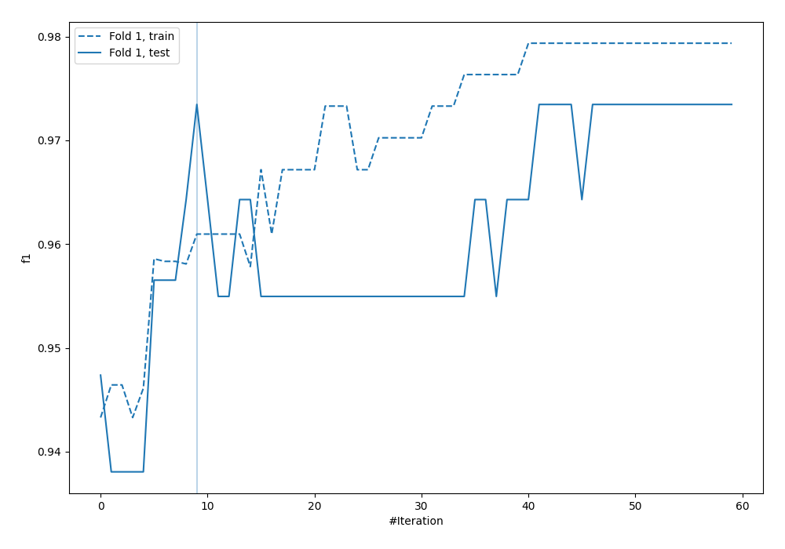

## Permutation-based Importance
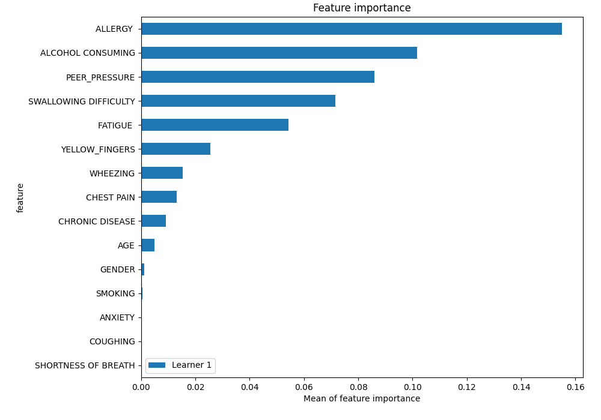
## Confusion Matrix

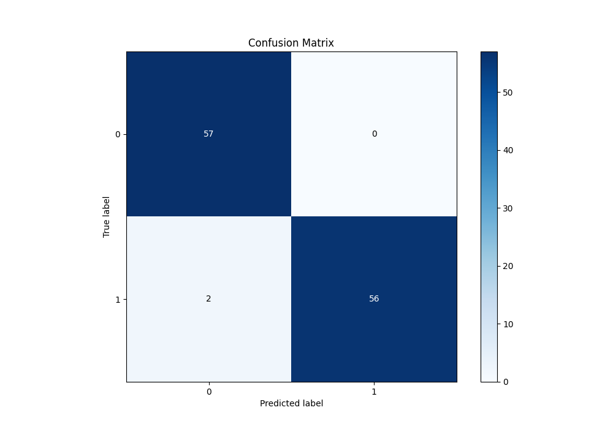

## Normalized Confusion Matrix

## ROC Curve

## Kolmogorov-Smirnov Statistic

## Precision-Recall Curve

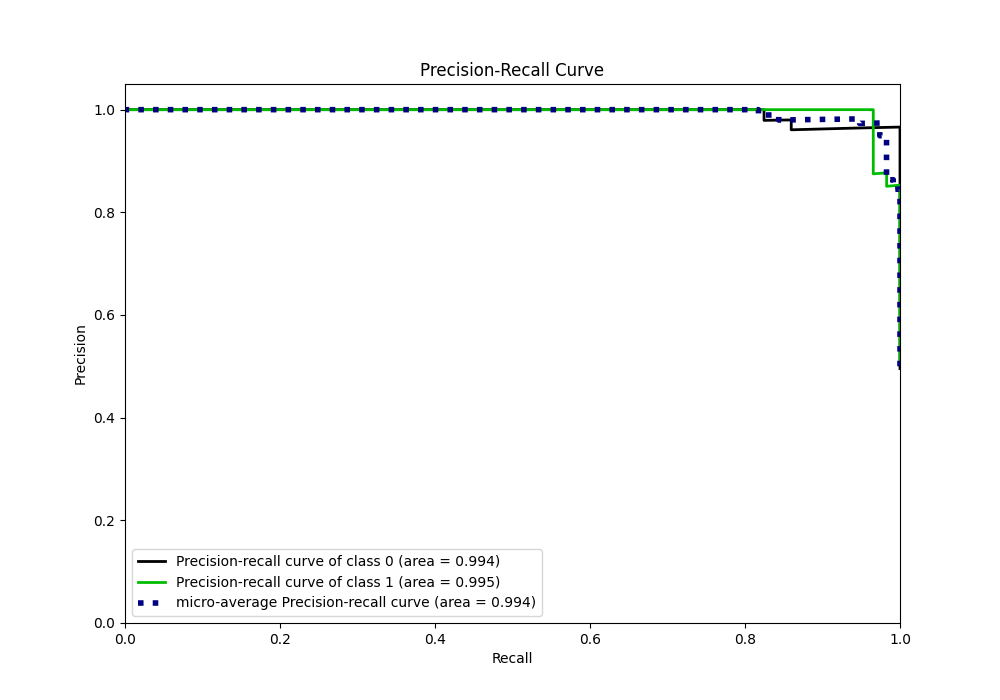

## Calibration Curve

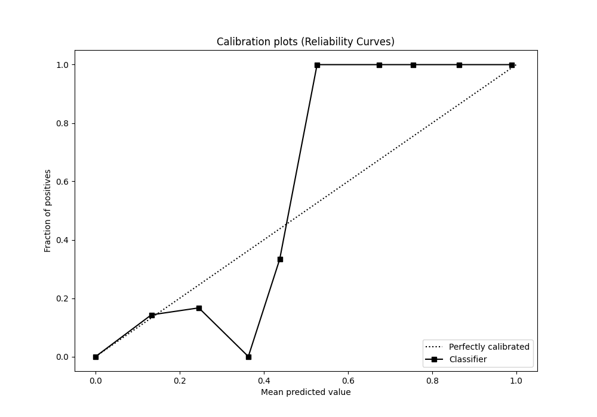

## Cumulative Gains Curve

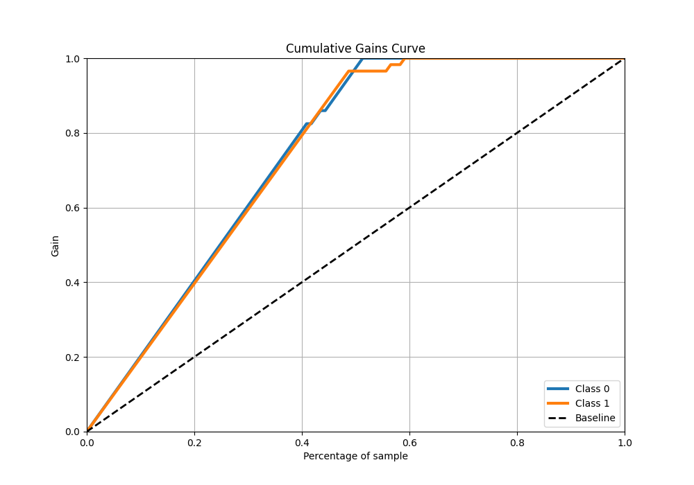

## Lift Curve

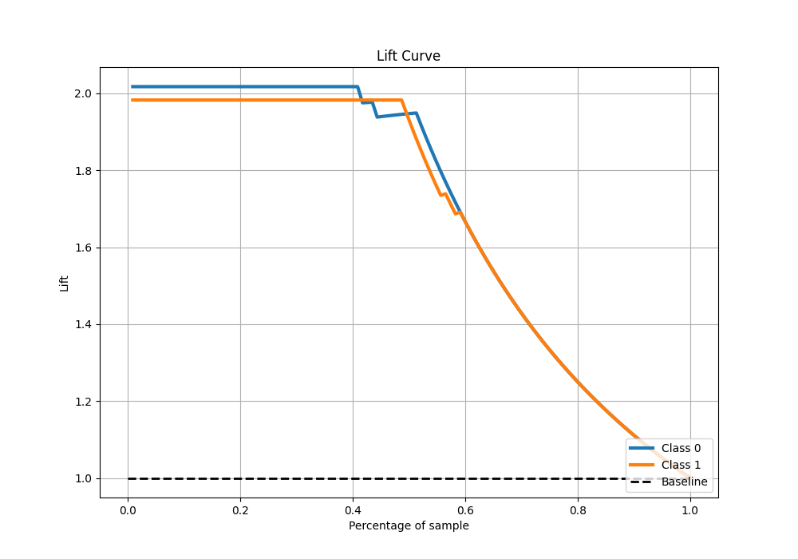

## SHAP Importance
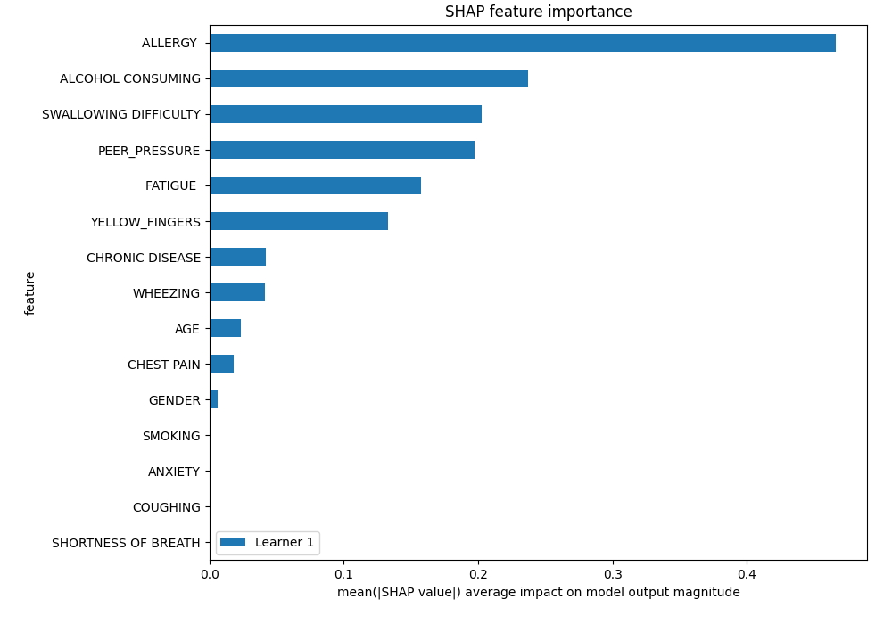

## SHAP Dependence plots

### Dependence (Fold 1)
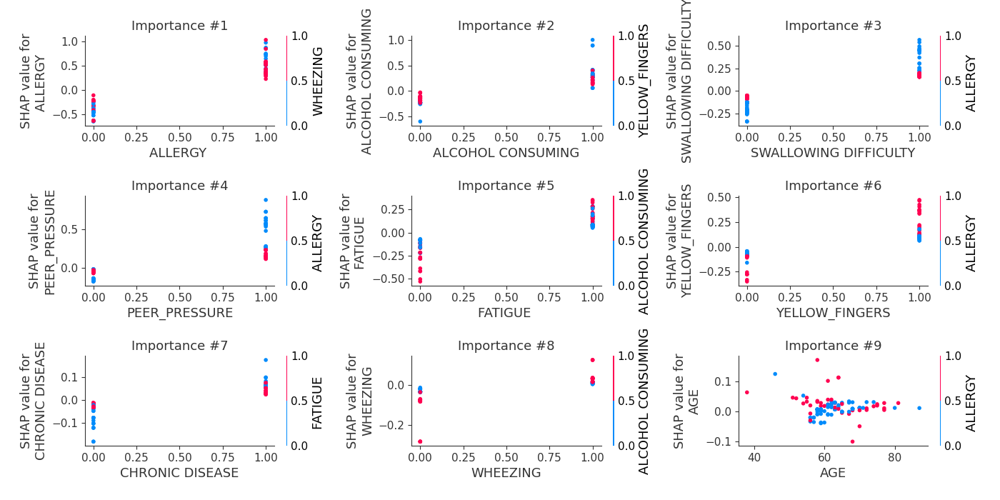

## SHAP Decision plots

### Top-10 Worst decisions for class 0 (Fold 1)

### Top-10 Best decisions for class 0 (Fold 1)
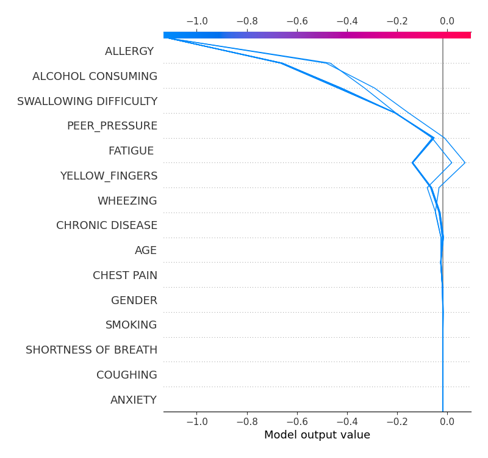
### Top-10 Worst decisions for class 1 (Fold 1)
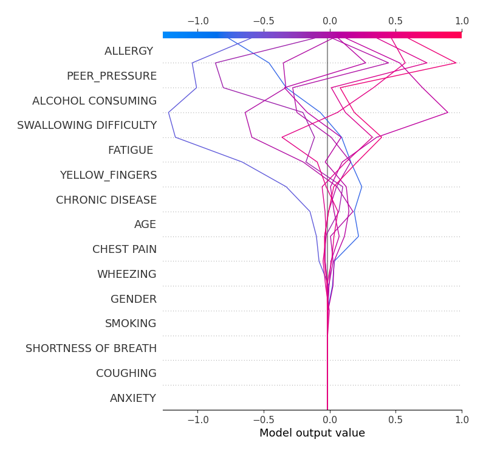
### Top-10 Best decisions for class 1 (Fold 1)
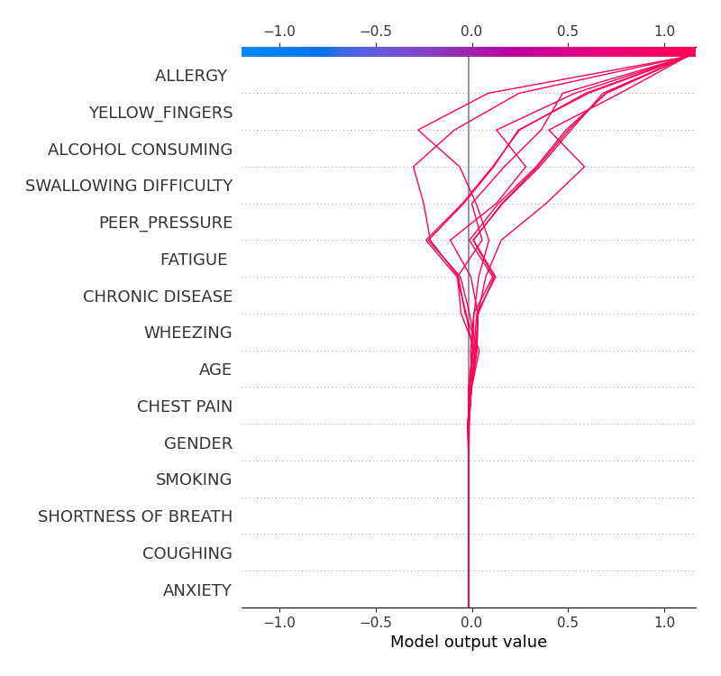

[<< Go back](../README.md)
