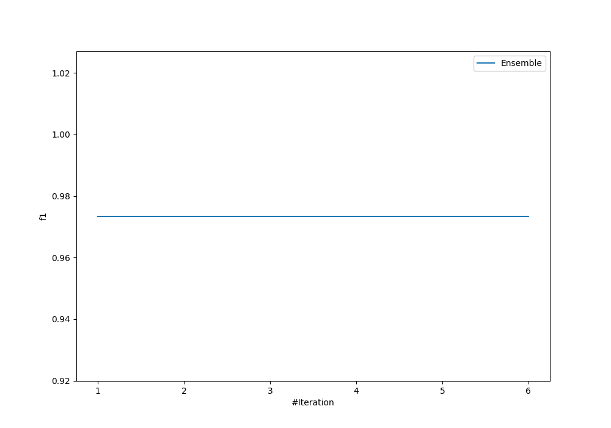
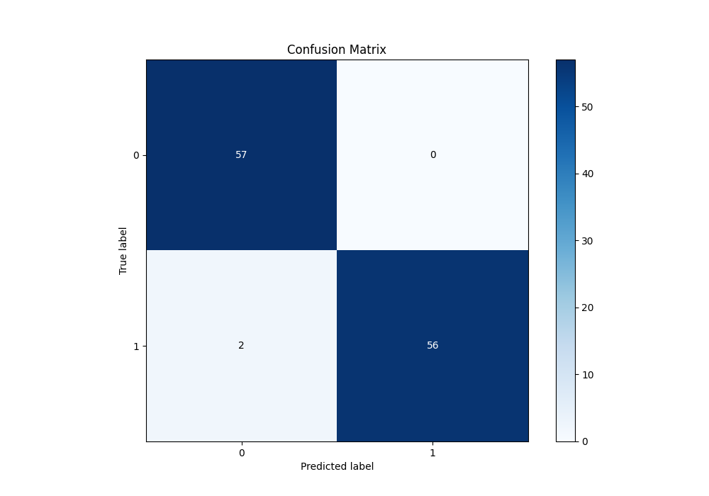
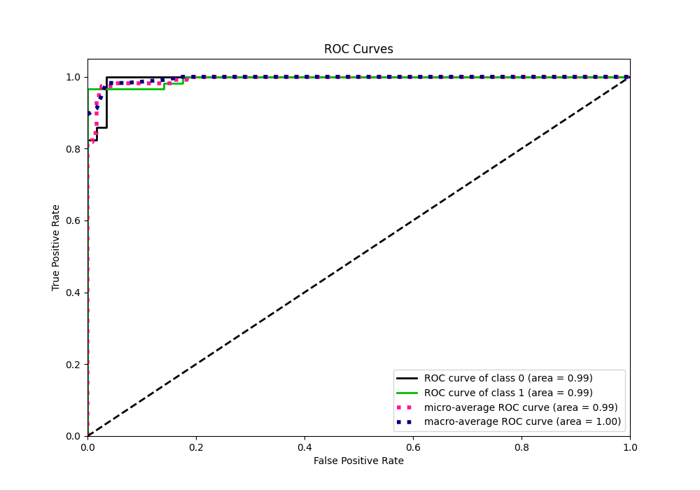
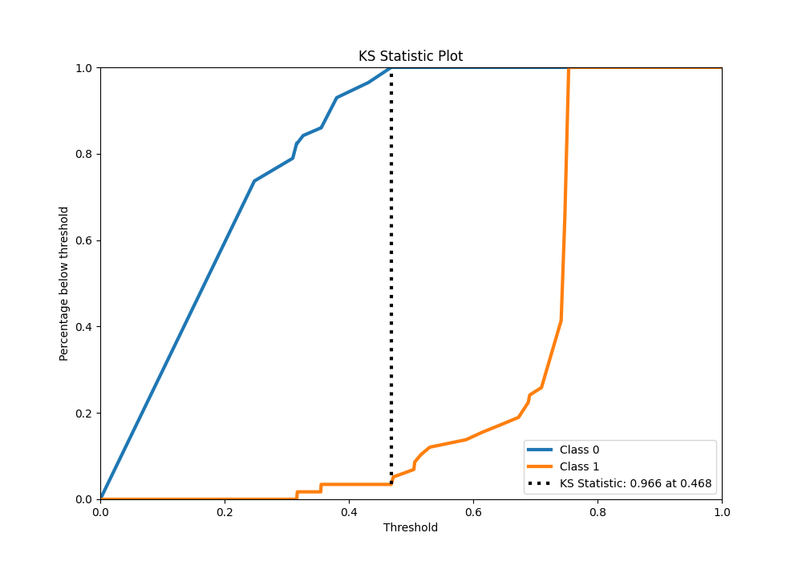

# Summary of Ensemble

[<< Go back](../README.md)

## Ensemble structure
| Model             |   Weight |
|:------------------|---------:|
| 4_Default_Xgboost |        1 |

## Metric details
|           |    score |   threshold |
|:----------|---------:|------------:|
| logloss   | 0.350546 |  nan        |
| auc       | 0.994555 |  nan        |
| f1        | 0.982456 |    0.468168 |
| accuracy  | 0.982609 |    0.468168 |
| precision | 1        |    0.468168 |
| recall    | 1        |    0.223204 |
| mcc       | 0.965809 |    0.468168 |

## Metric details with threshold from accuracy metric
|           |    score |   threshold |
|:----------|---------:|------------:|
| logloss   | 0.350546 |  nan        |
| auc       | 0.994555 |  nan        |
| f1        | 0.982456 |    0.468168 |
| accuracy  | 0.982609 |    0.468168 |
| precision | 1        |    0.468168 |
| recall    | 0.965517 |    0.468168 |
| mcc       | 0.965809 |    0.468168 |

## Confusion matrix (at threshold=0.468168)
|              |   Predicted as 0 |   Predicted as 1 |
|:-------------|-----------------:|-----------------:|
| Labeled as 0 |               57 |                0 |
| Labeled as 1 |                2 |               56 |

## Learning curves

## Confusion Matrix

## Normalized Confusion Matrix

## ROC Curve

## Kolmogorov-Smirnov Statistic

