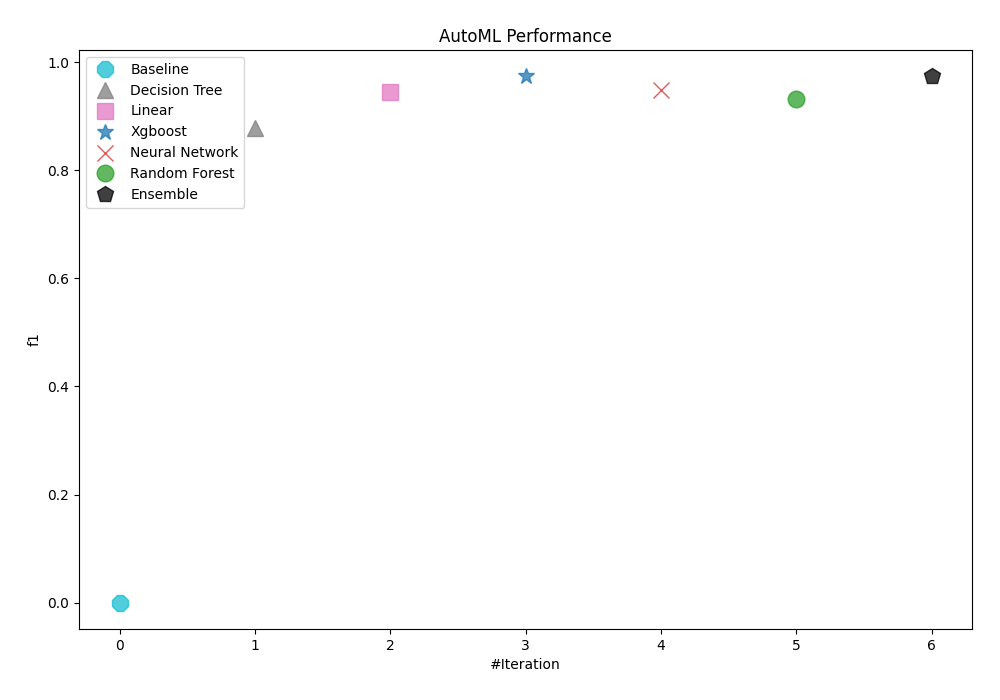
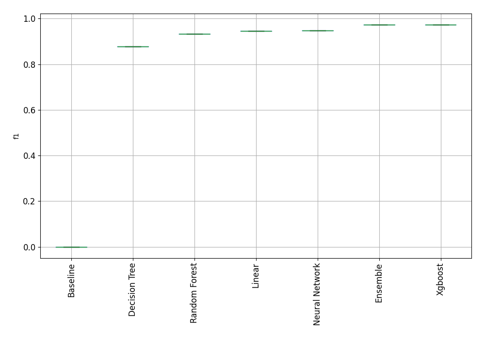

# AutoML Leaderboard

| Best model   | name                                                         | model_type     | metric_type   |   metric_value |   train_time |
|:-------------|:-------------------------------------------------------------|:---------------|:--------------|---------------:|-------------:|
|              | [1_Baseline](1_Baseline/README.md)                           | Baseline       | f1            |       0        |         1.27 |
|              | [2_DecisionTree](2_DecisionTree/README.md)                   | Decision Tree  | f1            |       0.877193 |         2.84 |
|              | [3_Linear](3_Linear/README.md)                               | Linear         | f1            |       0.945455 |         3.95 |
| **the best** | [4_Default_Xgboost](4_Default_Xgboost/README.md)             | Xgboost        | f1            |       0.973451 |         5.19 |
|              | [5_Default_NeuralNetwork](5_Default_NeuralNetwork/README.md) | Neural Network | f1            |       0.948276 |         2.59 |
|              | [6_Default_RandomForest](6_Default_RandomForest/README.md)   | Random Forest  | f1            |       0.932203 |         3.27 |
|              | [Ensemble](Ensemble/README.md)                               | Ensemble       | f1            |       0.973451 |         1.25 |

### AutoML Performance

### AutoML Performance Boxplot
