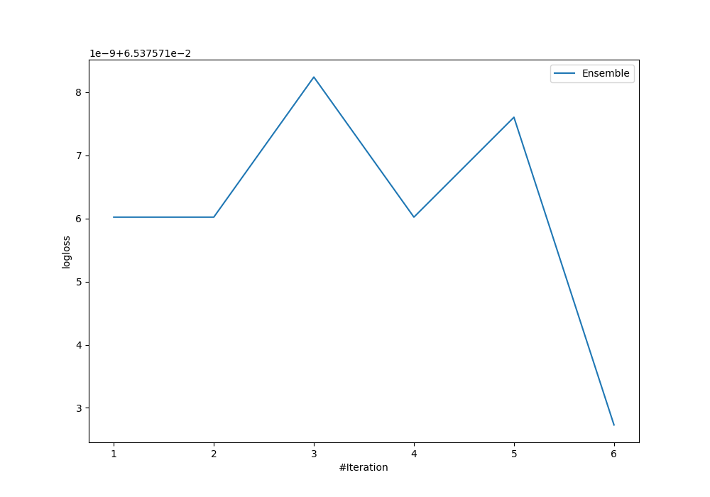
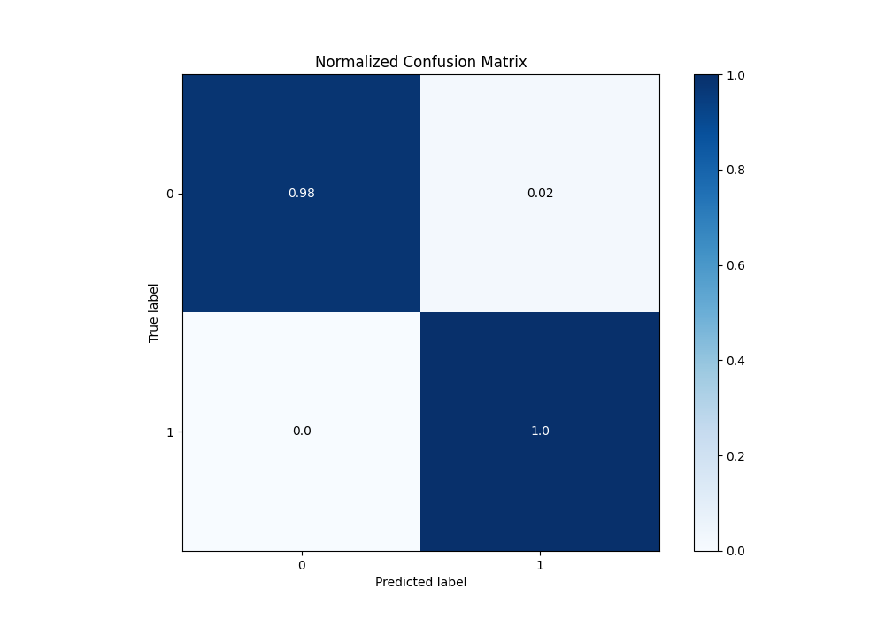
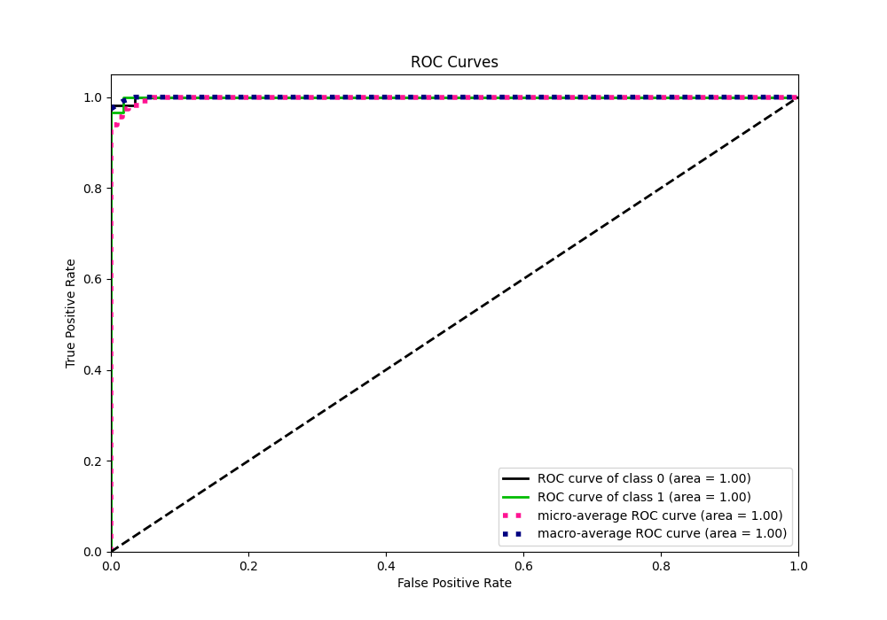
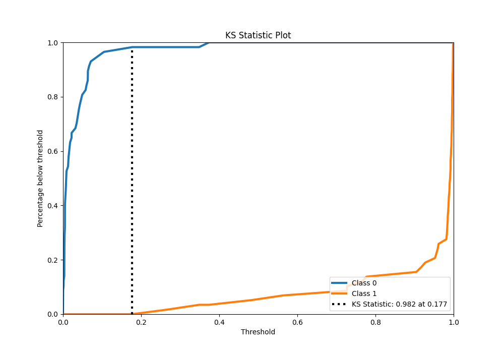
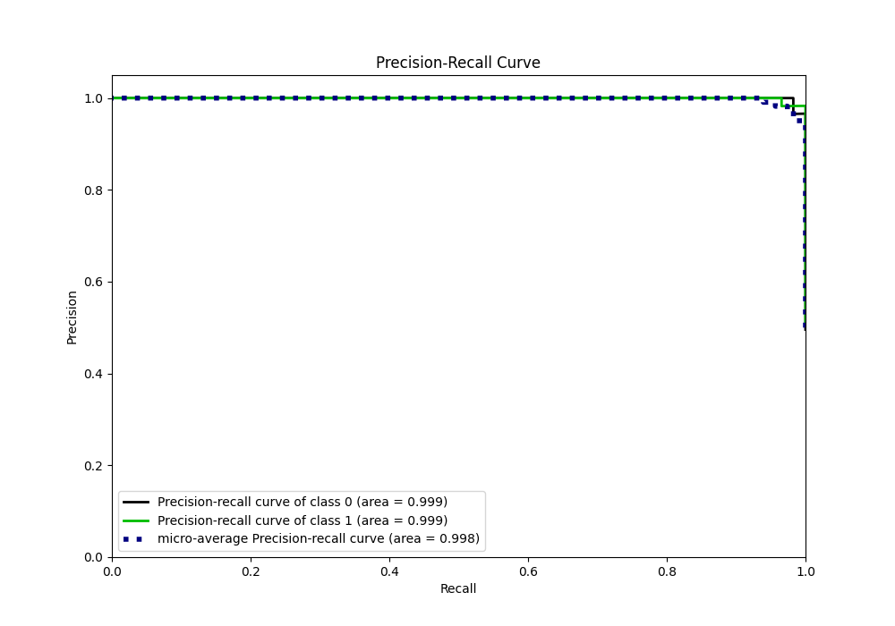
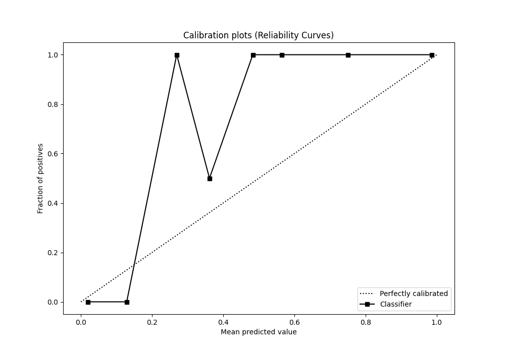
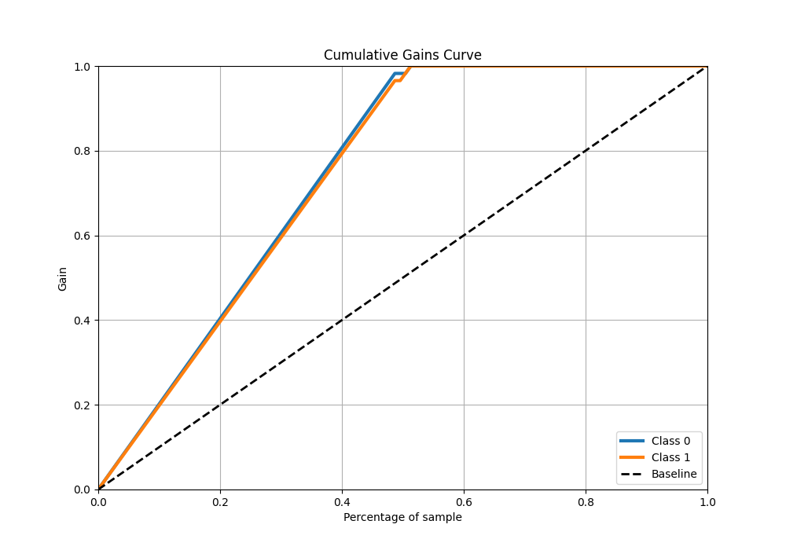
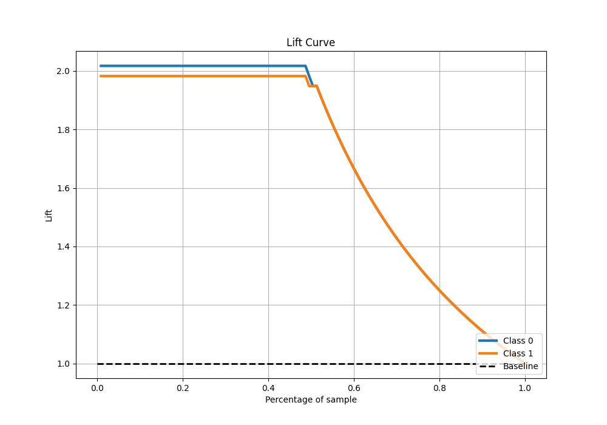

# Summary of Ensemble

[<< Go back](../README.md)

## Ensemble structure
| Model             |   Weight |
|:------------------|---------:|
| 4_Default_Xgboost |        6 |

## Metric details
|           |     score |    threshold |
|:----------|----------:|-------------:|
| logloss   | 0.0653757 | nan          |
| auc       | 0.999395  | nan          |
| f1        | 0.991453  |   0.223254   |
| accuracy  | 0.991304  |   0.223254   |
| precision | 1         |   0.428336   |
| recall    | 1         |   0.00040213 |
| mcc       | 0.982753  |   0.223254   |

## Metric details with threshold from accuracy metric
|           |     score |   threshold |
|:----------|----------:|------------:|
| logloss   | 0.0653757 |  nan        |
| auc       | 0.999395  |  nan        |
| f1        | 0.991453  |    0.223254 |
| accuracy  | 0.991304  |    0.223254 |
| precision | 0.983051  |    0.223254 |
| recall    | 1         |    0.223254 |
| mcc       | 0.982753  |    0.223254 |

## Confusion matrix (at threshold=0.223254)
|              |   Predicted as 0 |   Predicted as 1 |
|:-------------|-----------------:|-----------------:|
| Labeled as 0 |               56 |                1 |
| Labeled as 1 |                0 |               58 |

## Learning curves

## Confusion Matrix

## Normalized Confusion Matrix

## ROC Curve

## Kolmogorov-Smirnov Statistic

## Precision-Recall Curve

## Calibration Curve

## Cumulative Gains Curve

## Lift Curve

[<< Go back](../README.md)
