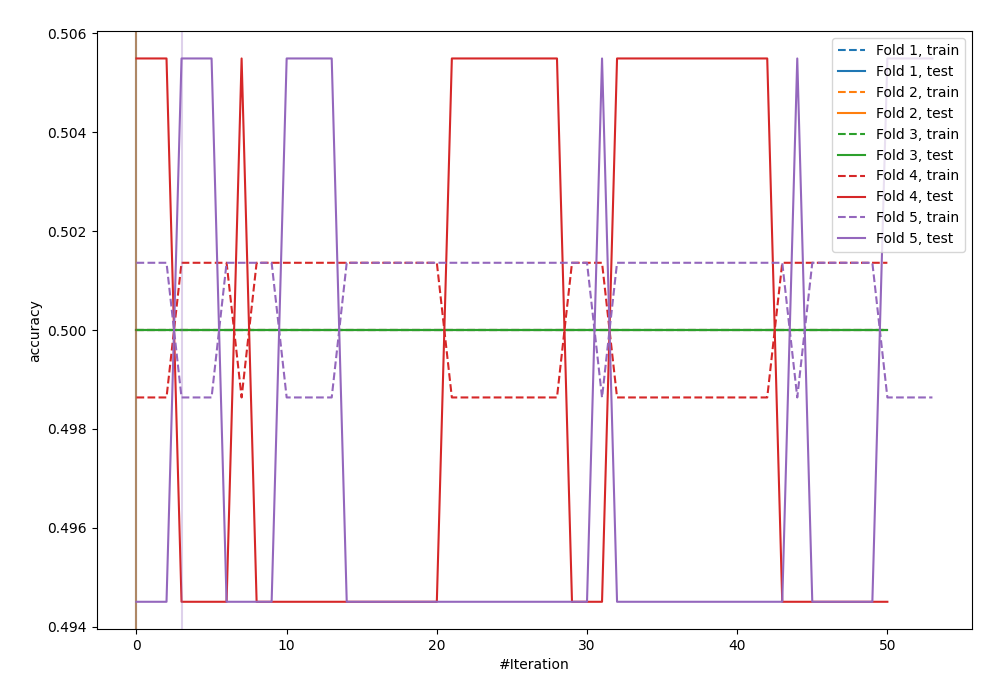
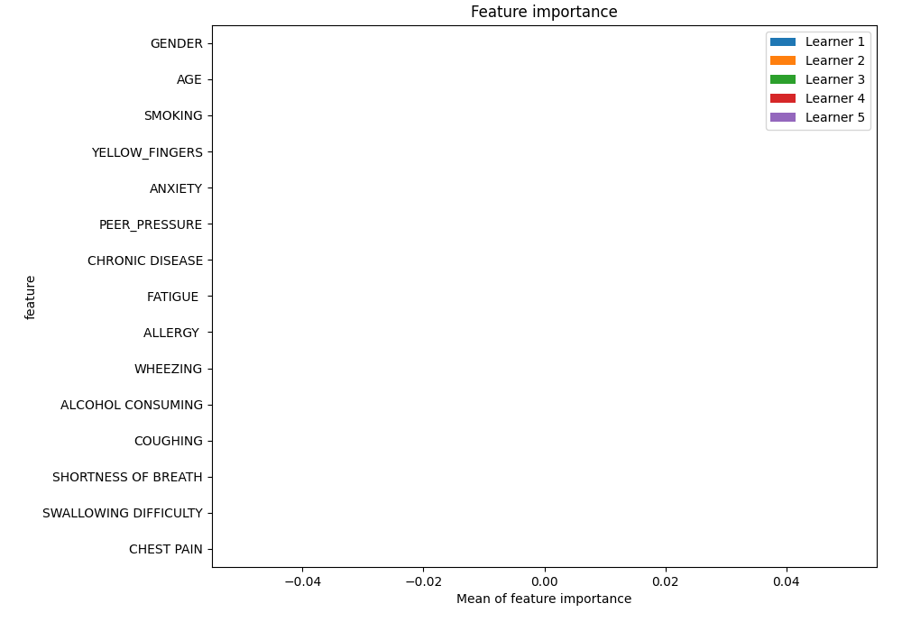
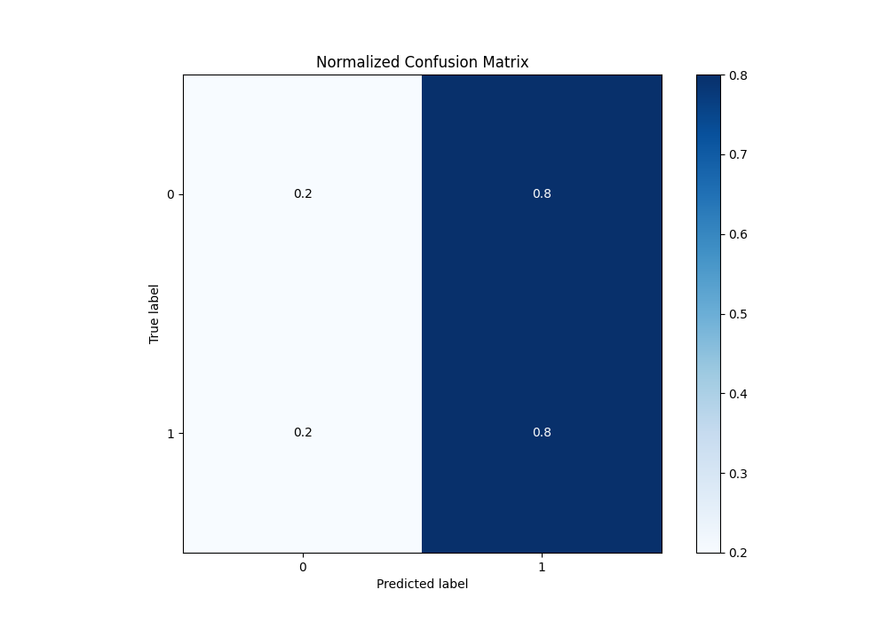
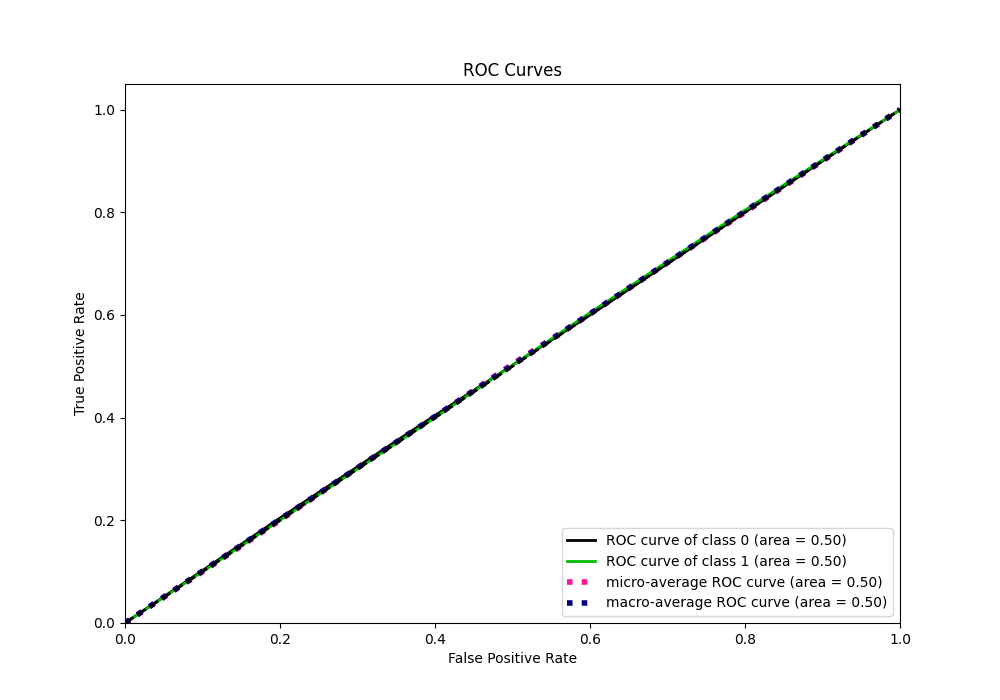
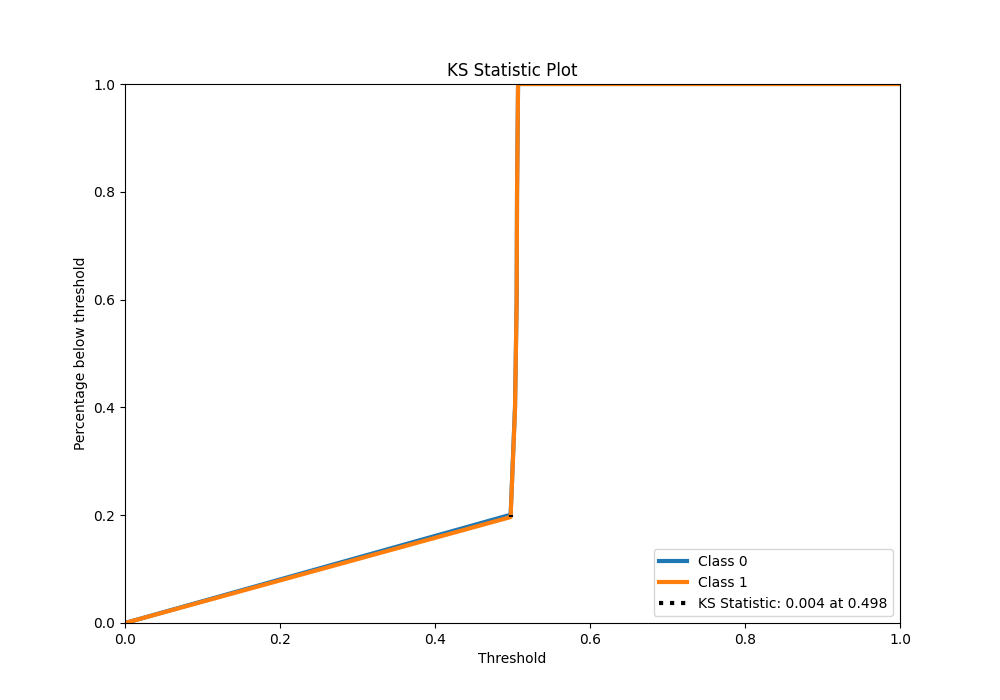
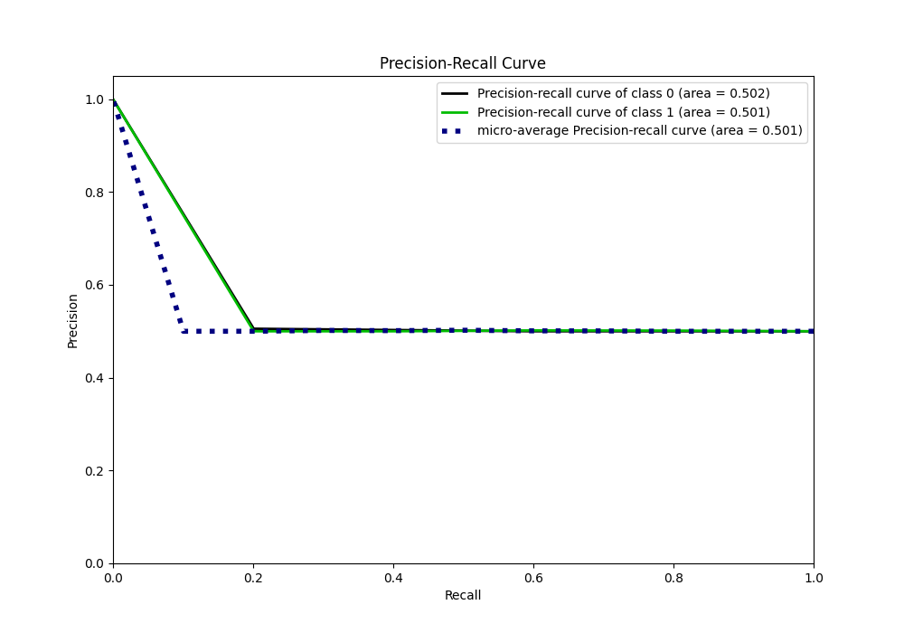
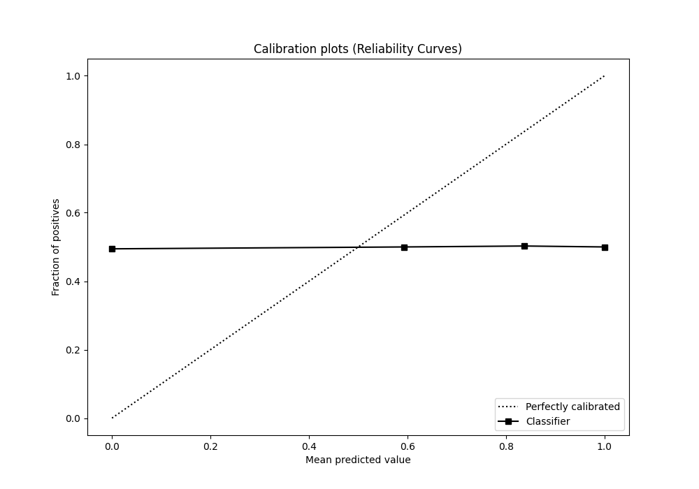
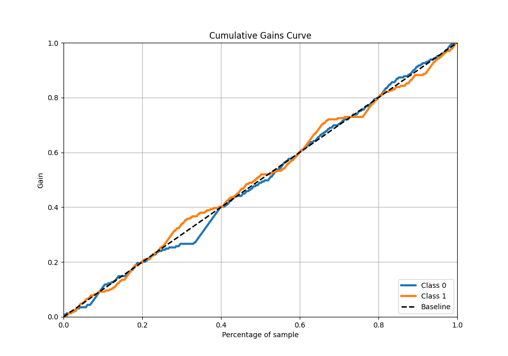
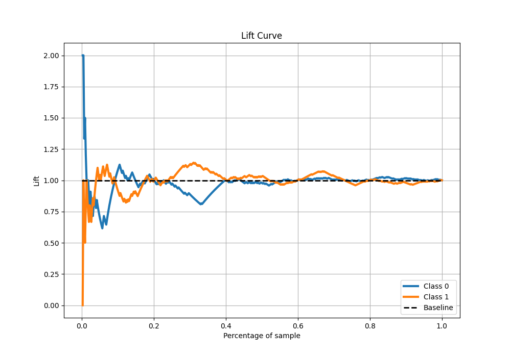

# Summary of 10_Xgboost

[<< Go back](../README.md)

## Extreme Gradient Boosting (Xgboost)
- **n_jobs**: -1
- **objective**: binary:logistic
- **eta**: 0.15
- **max_depth**: 8
- **min_child_weight**: 50
- **subsample**: 0.6
- **colsample_bytree**: 0.6
- **eval_metric**: accuracy
- **explain_level**: 1

## Validation
 - **validation_type**: kfold
 - **k_folds**: 5
 - **shuffle**: True
 - **stratify**: True

## Optimized metric
accuracy

## Training time

28.3 seconds

## Metric details
|           |    score |   threshold |
|:----------|---------:|------------:|
| logloss   | 0.693166 |  nan        |
| auc       | 0.501745 |  nan        |
| f1        | 0.666667 |    0.447816 |
| accuracy  | 0.502183 |    0.497573 |
| precision | 0.501818 |    0.503261 |
| recall    | 1        |    0.447816 |
| mcc       | 0.005472 |    0.497573 |

## Metric details with threshold from accuracy metric
|           |    score |   threshold |
|:----------|---------:|------------:|
| logloss   | 0.693166 |  nan        |
| auc       | 0.501745 |  nan        |
| f1        | 0.61745  |    0.497573 |
| accuracy  | 0.502183 |    0.497573 |
| precision | 0.501362 |    0.497573 |
| recall    | 0.803493 |    0.497573 |
| mcc       | 0.005472 |    0.497573 |

## Confusion matrix (at threshold=0.497573)
|              |   Predicted as 0 |   Predicted as 1 |
|:-------------|-----------------:|-----------------:|
| Labeled as 0 |               46 |              183 |
| Labeled as 1 |               45 |              184 |

## Learning curves

## Permutation-based Importance

## Confusion Matrix

## Normalized Confusion Matrix

## ROC Curve

## Kolmogorov-Smirnov Statistic

## Precision-Recall Curve

## Calibration Curve

## Cumulative Gains Curve

## Lift Curve

[<< Go back](../README.md)
