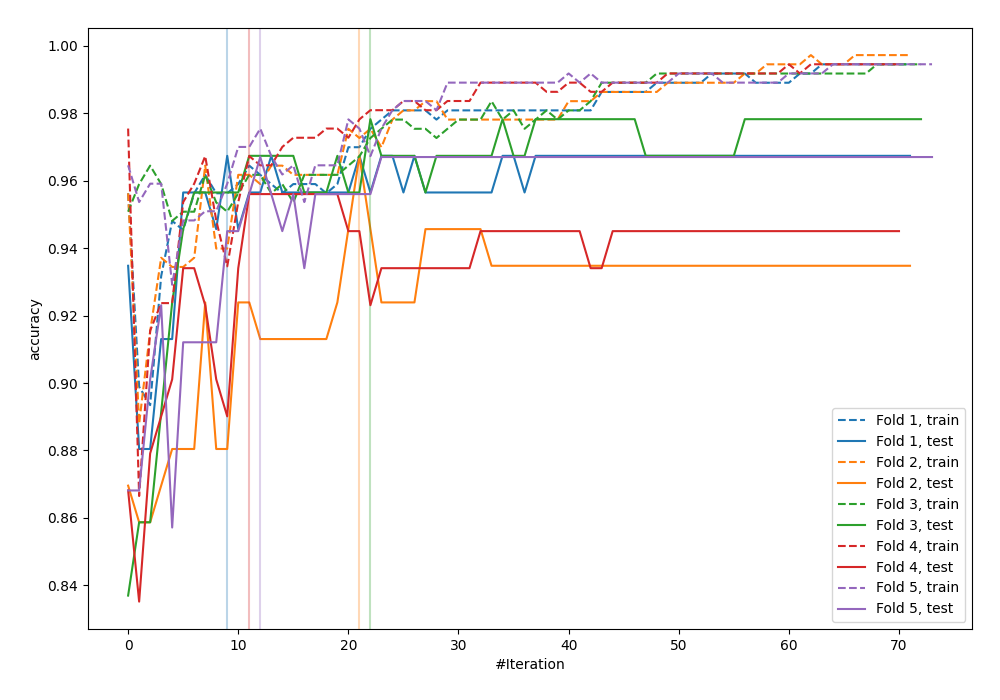
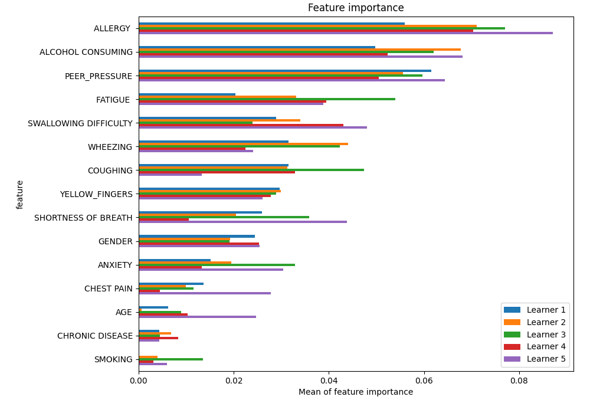
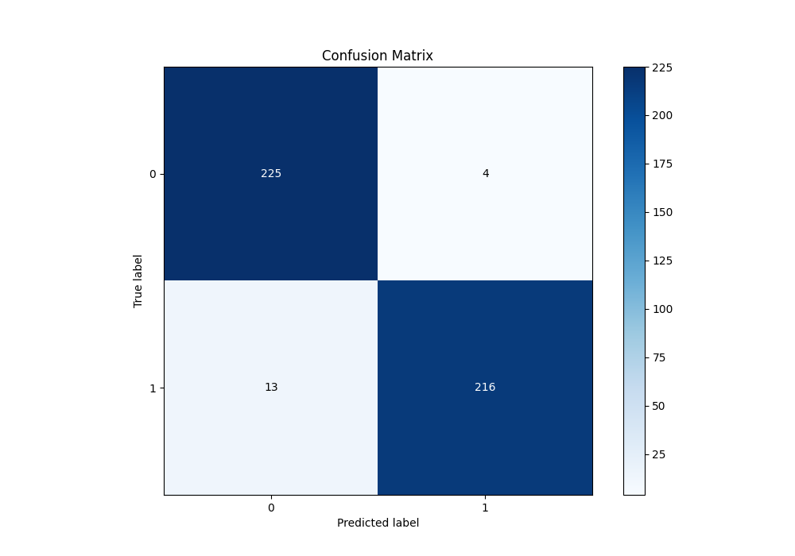
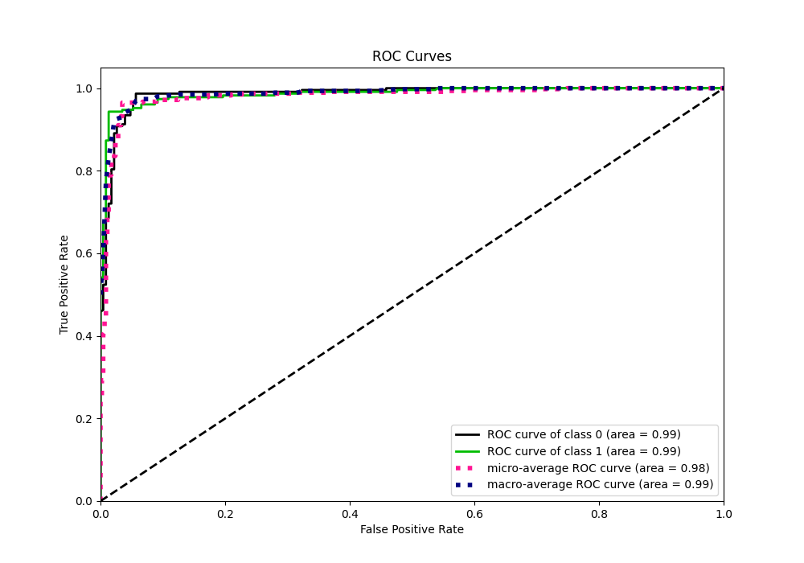
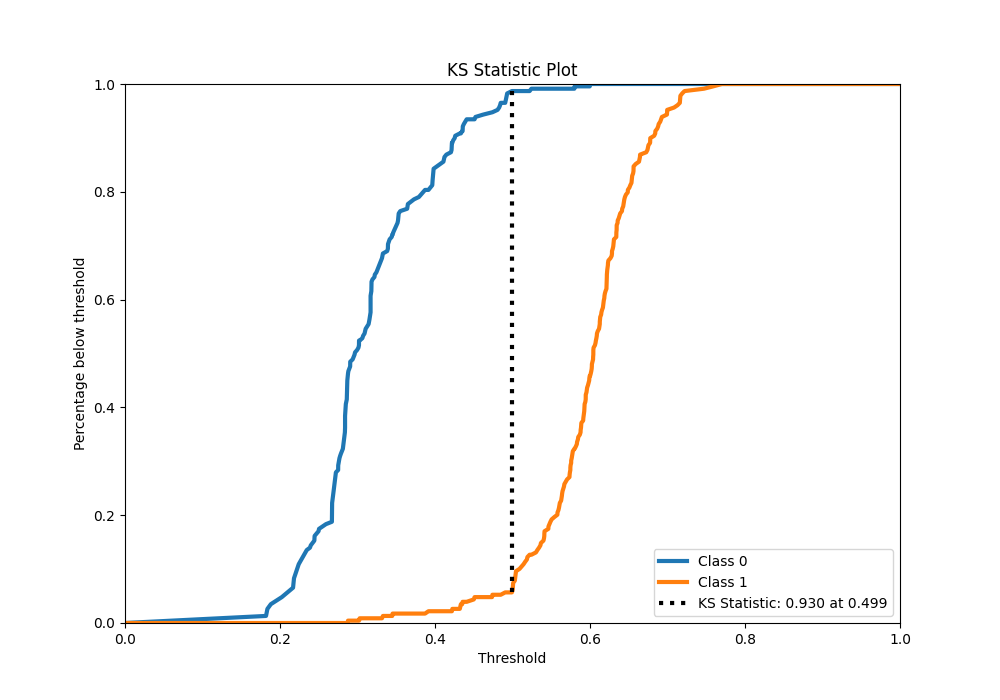
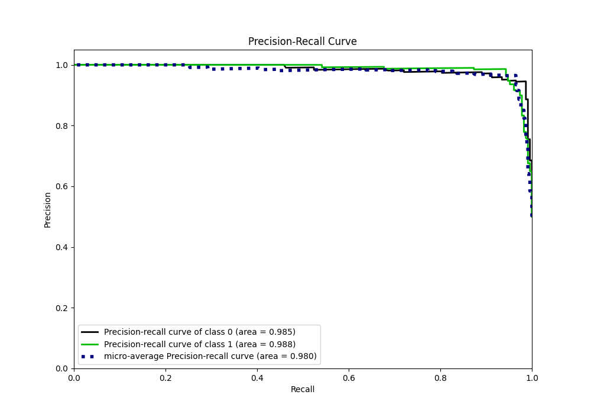
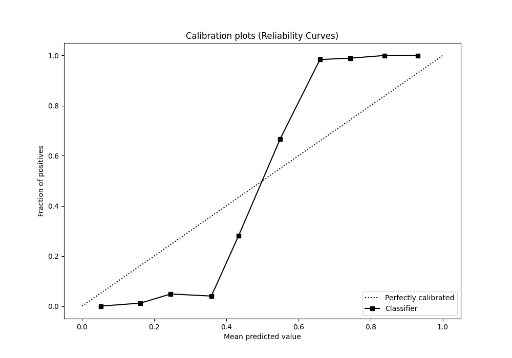
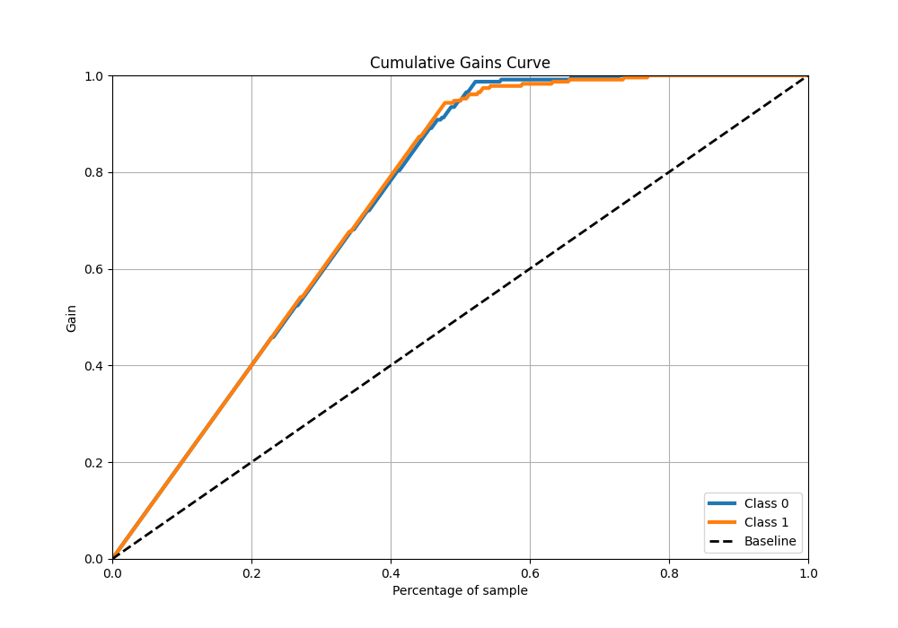
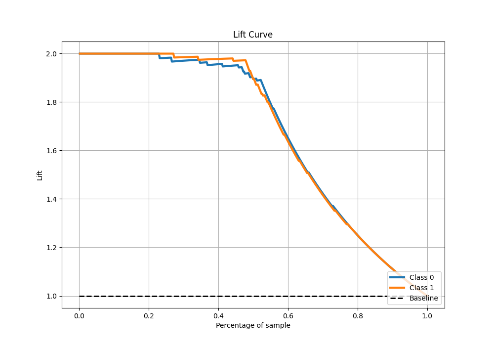

# Summary of 15_CatBoost

[<< Go back](../README.md)

## CatBoost
- **n_jobs**: -1
- **learning_rate**: 0.05
- **depth**: 8
- **rsm**: 0.8
- **loss_function**: Logloss
- **eval_metric**: Accuracy
- **explain_level**: 1

## Validation
 - **validation_type**: kfold
 - **k_folds**: 5
 - **shuffle**: True
 - **stratify**: True

## Optimized metric
accuracy

## Training time

27.5 seconds

## Metric details
|           |    score |   threshold |
|:----------|---------:|------------:|
| logloss   | 0.455814 |  nan        |
| auc       | 0.986261 |  nan        |
| f1        | 0.962138 |    0.493138 |
| accuracy  | 0.962882 |    0.493138 |
| precision | 1        |    0.602267 |
| recall    | 1        |    0.163765 |
| mcc       | 0.92648  |    0.493138 |

## Metric details with threshold from accuracy metric
|           |    score |   threshold |
|:----------|---------:|------------:|
| logloss   | 0.455814 |  nan        |
| auc       | 0.986261 |  nan        |
| f1        | 0.962138 |    0.493138 |
| accuracy  | 0.962882 |    0.493138 |
| precision | 0.981818 |    0.493138 |
| recall    | 0.943231 |    0.493138 |
| mcc       | 0.92648  |    0.493138 |

## Confusion matrix (at threshold=0.493138)
|              |   Predicted as 0 |   Predicted as 1 |
|:-------------|-----------------:|-----------------:|
| Labeled as 0 |              225 |                4 |
| Labeled as 1 |               13 |              216 |

## Learning curves

## Permutation-based Importance

## Confusion Matrix

## Normalized Confusion Matrix

## ROC Curve

## Kolmogorov-Smirnov Statistic

## Precision-Recall Curve

## Calibration Curve

## Cumulative Gains Curve

## Lift Curve

[<< Go back](../README.md)
