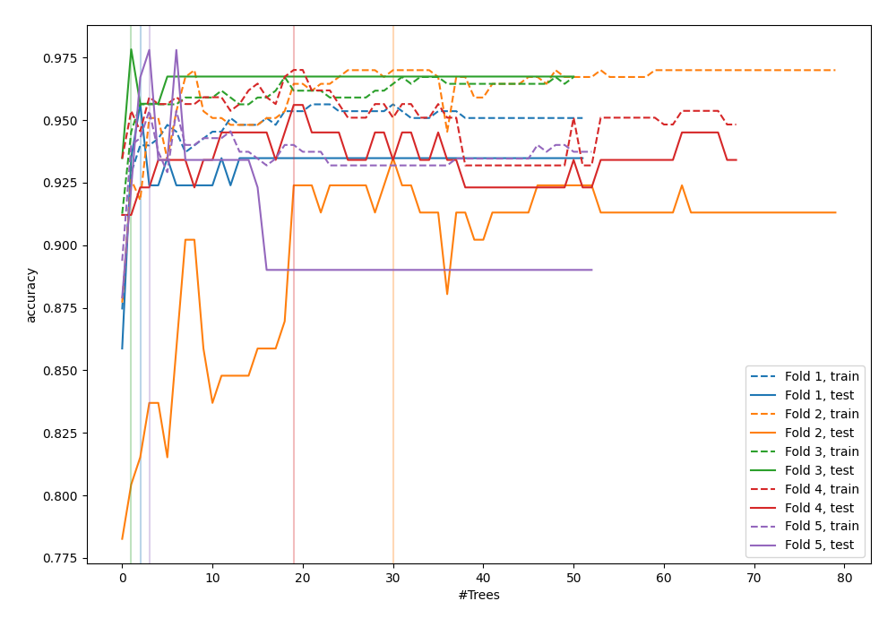
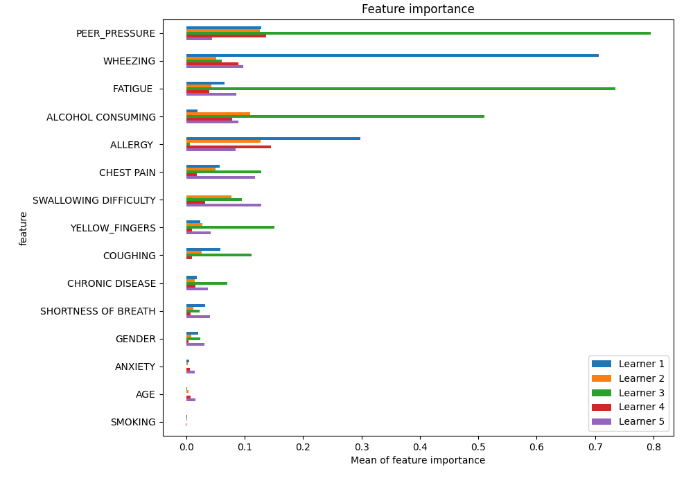
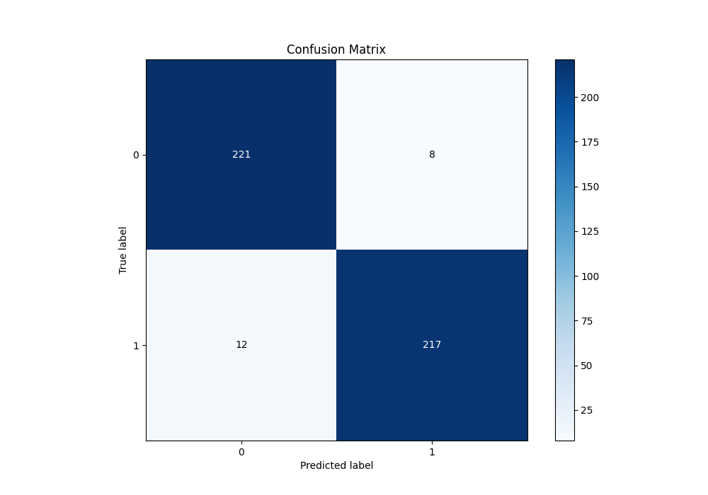
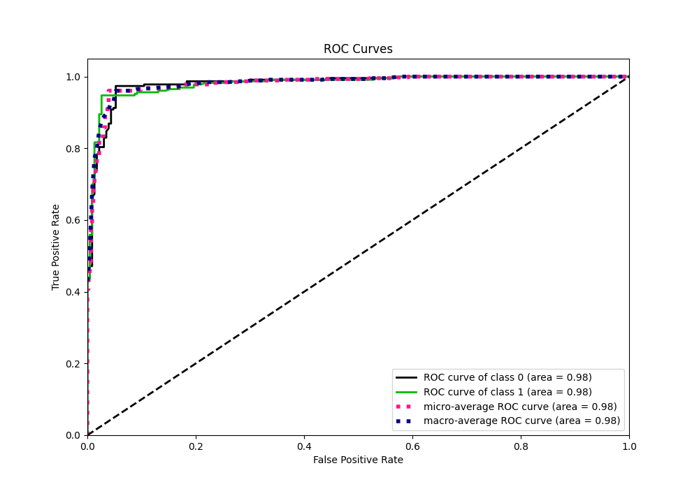
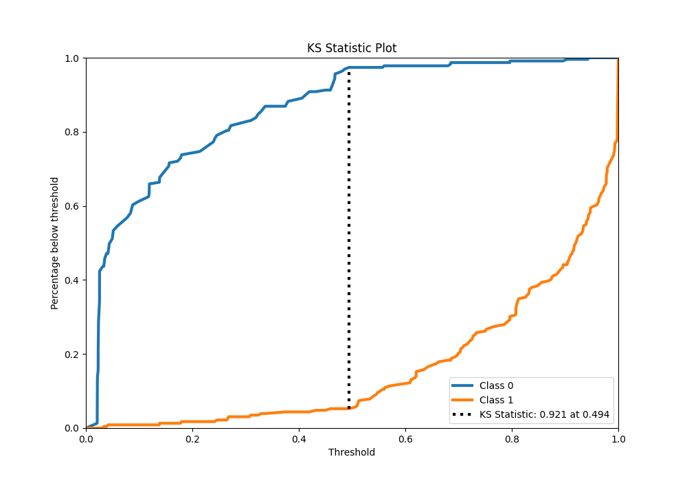
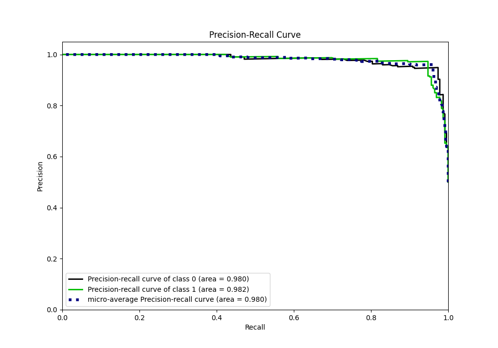
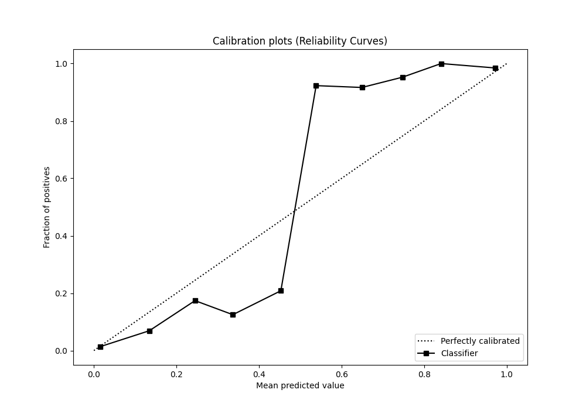
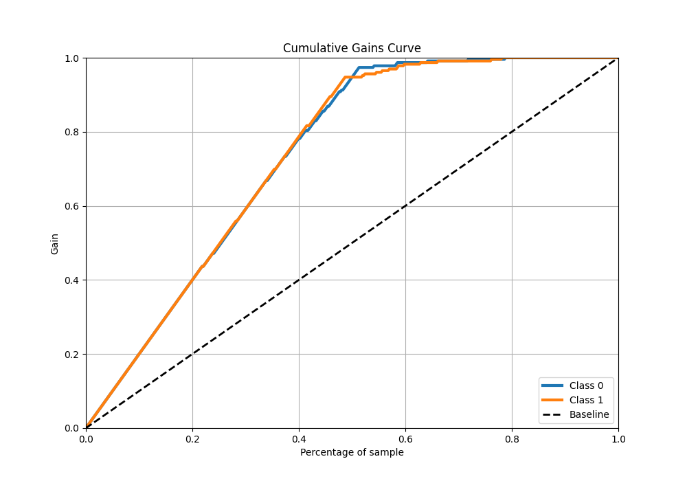
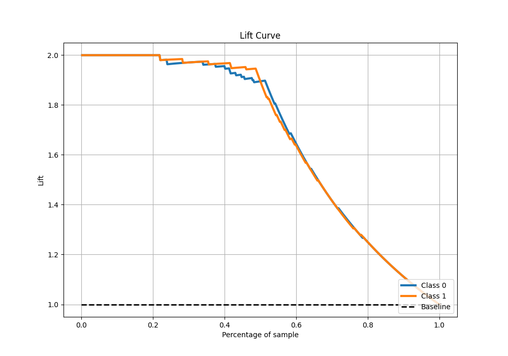

# Summary of 19_RandomForest

[<< Go back](../README.md)

## Random Forest
- **n_jobs**: -1
- **criterion**: gini
- **max_features**: 0.5
- **min_samples_split**: 20
- **max_depth**: 4
- **eval_metric_name**: accuracy
- **explain_level**: 1

## Validation
 - **validation_type**: kfold
 - **k_folds**: 5
 - **shuffle**: True
 - **stratify**: True

## Optimized metric
accuracy

## Training time

29.4 seconds

## Metric details
|           |    score |   threshold |
|:----------|---------:|------------:|
| logloss   | 0.209104 | nan         |
| auc       | 0.980826 | nan         |
| f1        | 0.955947 |   0.484429  |
| accuracy  | 0.956332 |   0.484429  |
| precision | 1        |   0.945715  |
| recall    | 1        |   0.0191015 |
| mcc       | 0.913221 |   0.510067  |

## Metric details with threshold from accuracy metric
|           |    score |   threshold |
|:----------|---------:|------------:|
| logloss   | 0.209104 |  nan        |
| auc       | 0.980826 |  nan        |
| f1        | 0.955947 |    0.484429 |
| accuracy  | 0.956332 |    0.484429 |
| precision | 0.964444 |    0.484429 |
| recall    | 0.947598 |    0.484429 |
| mcc       | 0.912803 |    0.484429 |

## Confusion matrix (at threshold=0.484429)
|              |   Predicted as 0 |   Predicted as 1 |
|:-------------|-----------------:|-----------------:|
| Labeled as 0 |              221 |                8 |
| Labeled as 1 |               12 |              217 |

## Learning curves

## Permutation-based Importance

## Confusion Matrix

## Normalized Confusion Matrix

## ROC Curve

## Kolmogorov-Smirnov Statistic

## Precision-Recall Curve

## Calibration Curve

## Cumulative Gains Curve

## Lift Curve

[<< Go back](../README.md)
