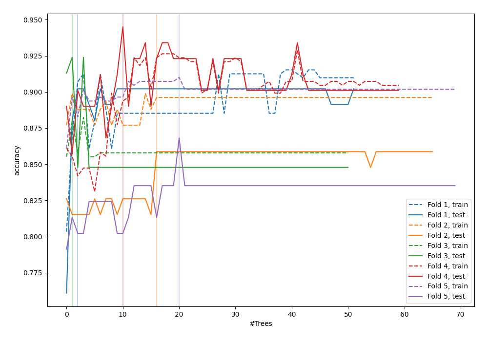
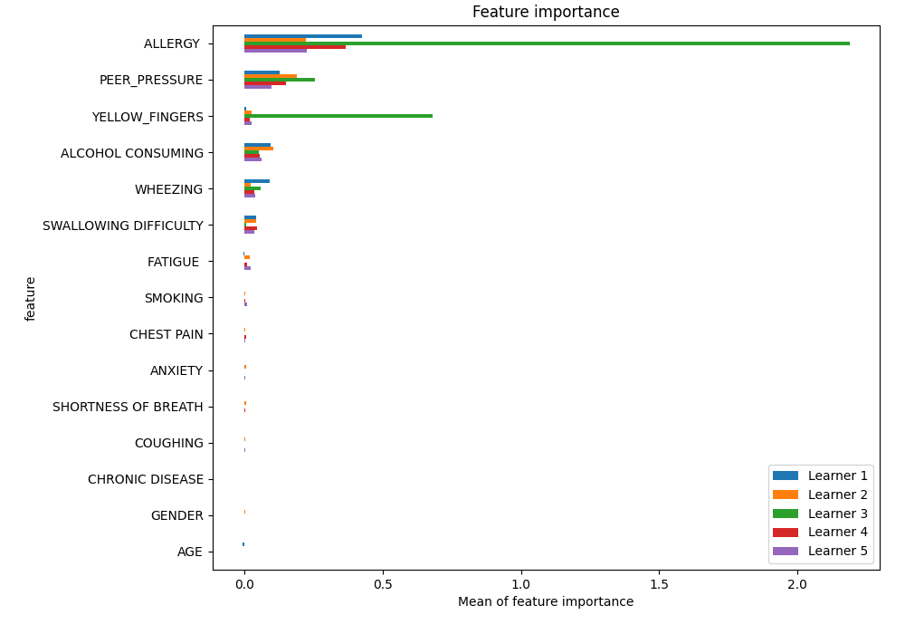
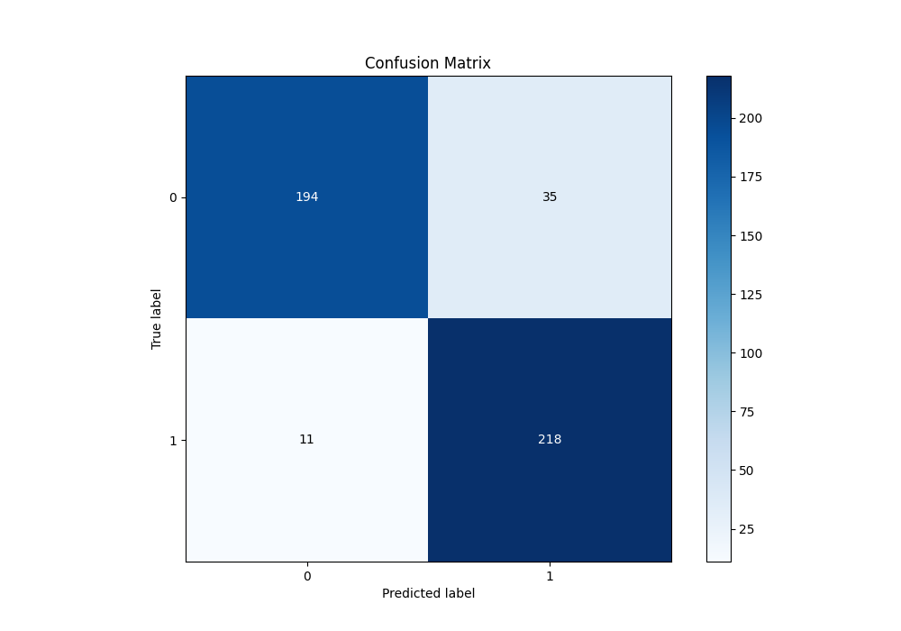
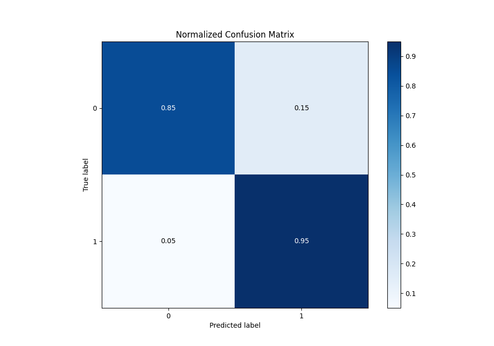
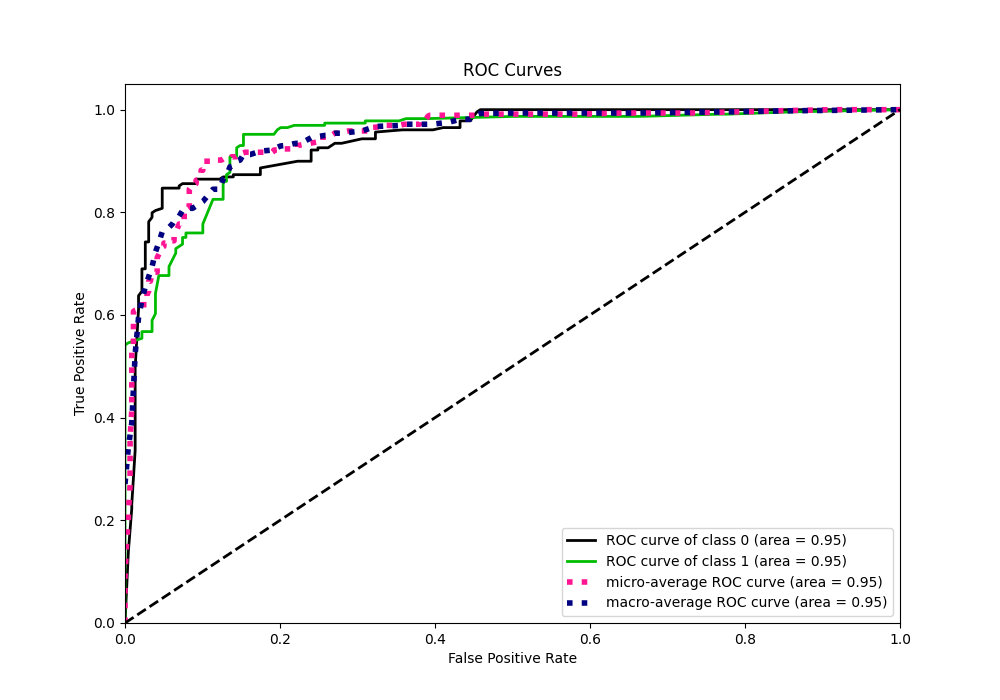
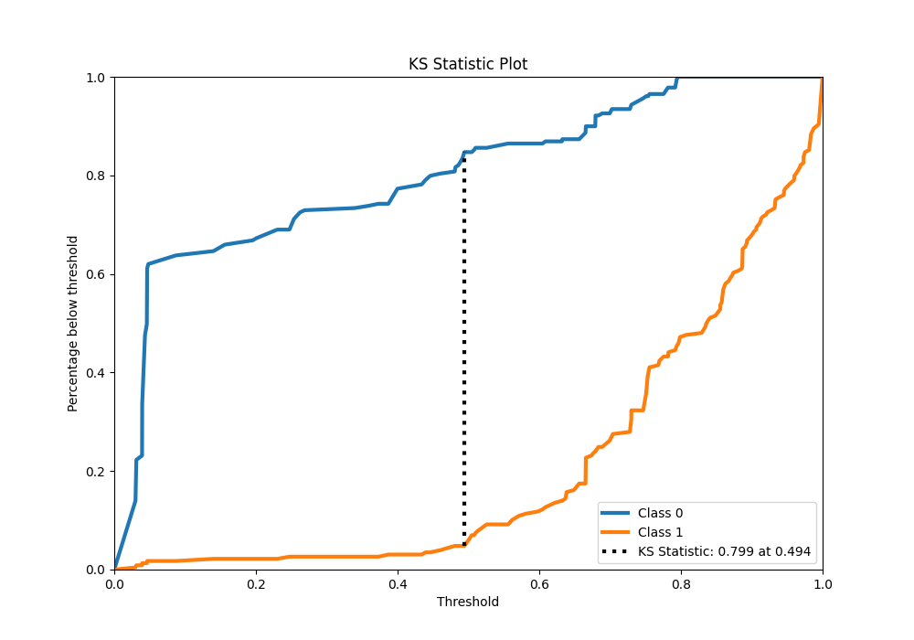
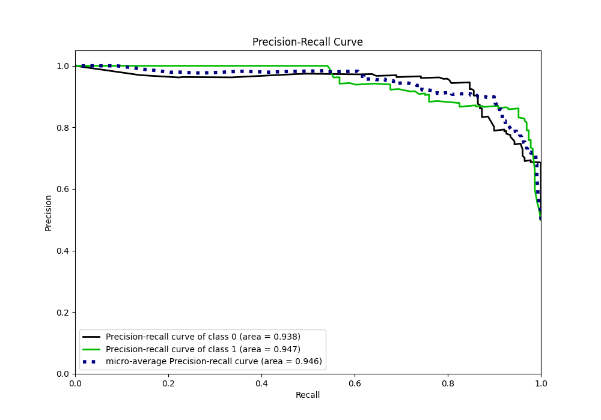
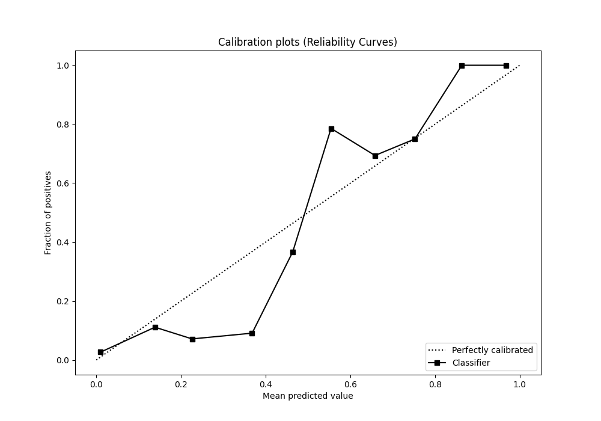
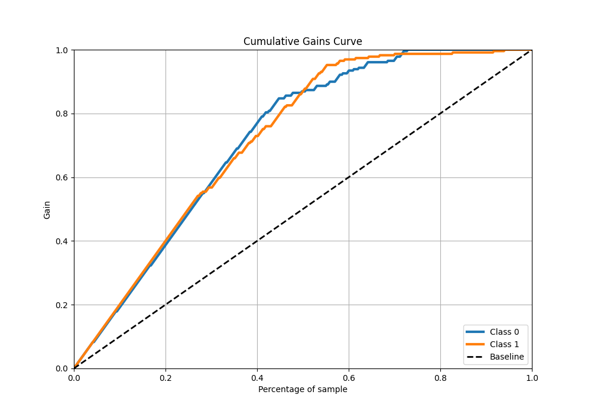
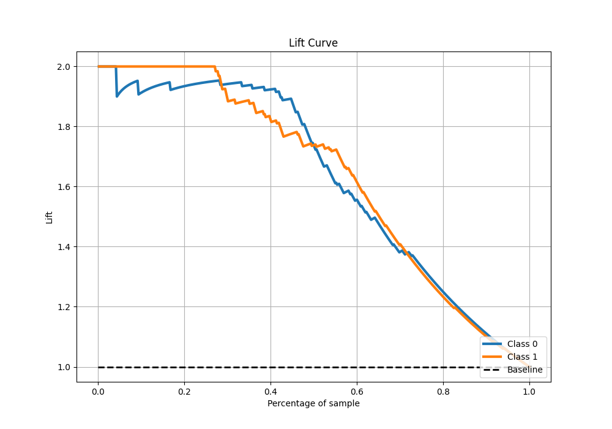

# Summary of 21_RandomForest

[<< Go back](../README.md)

## Random Forest
- **n_jobs**: -1
- **criterion**: gini
- **max_features**: 0.8
- **min_samples_split**: 40
- **max_depth**: 3
- **eval_metric_name**: accuracy
- **explain_level**: 1

## Validation
 - **validation_type**: kfold
 - **k_folds**: 5
 - **shuffle**: True
 - **stratify**: True

## Optimized metric
accuracy

## Training time

30.1 seconds

## Metric details
|           |    score |   threshold |
|:----------|---------:|------------:|
| logloss   | 0.299401 | nan         |
| auc       | 0.945415 | nan         |
| f1        | 0.904564 |   0.497505  |
| accuracy  | 0.899563 |   0.497505  |
| precision | 1        |   0.796151  |
| recall    | 1        |   0.0269788 |
| mcc       | 0.803552 |   0.497505  |

## Metric details with threshold from accuracy metric
|           |    score |   threshold |
|:----------|---------:|------------:|
| logloss   | 0.299401 |  nan        |
| auc       | 0.945415 |  nan        |
| f1        | 0.904564 |    0.497505 |
| accuracy  | 0.899563 |    0.497505 |
| precision | 0.86166  |    0.497505 |
| recall    | 0.951965 |    0.497505 |
| mcc       | 0.803552 |    0.497505 |

## Confusion matrix (at threshold=0.497505)
|              |   Predicted as 0 |   Predicted as 1 |
|:-------------|-----------------:|-----------------:|
| Labeled as 0 |              194 |               35 |
| Labeled as 1 |               11 |              218 |

## Learning curves

## Permutation-based Importance

## Confusion Matrix

## Normalized Confusion Matrix

## ROC Curve

## Kolmogorov-Smirnov Statistic

## Precision-Recall Curve

## Calibration Curve

## Cumulative Gains Curve

## Lift Curve

[<< Go back](../README.md)
