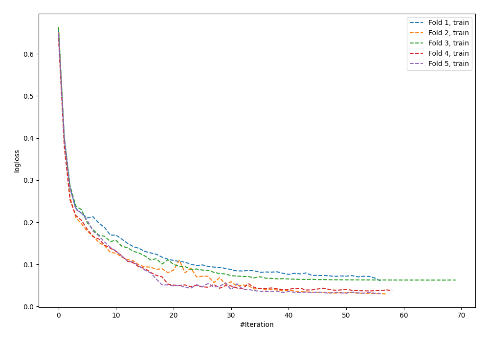
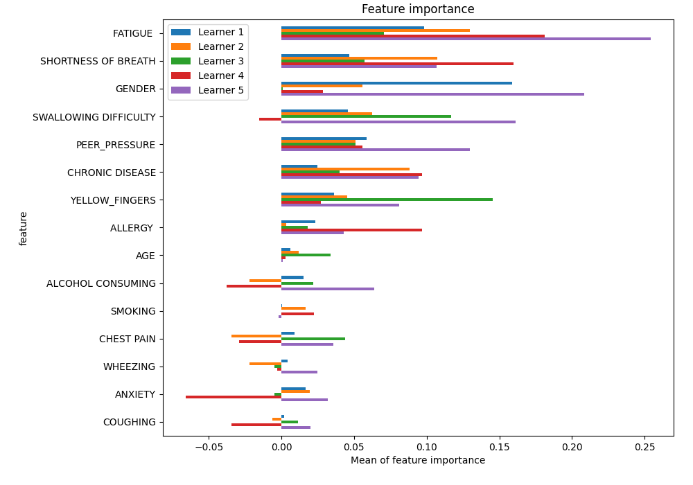
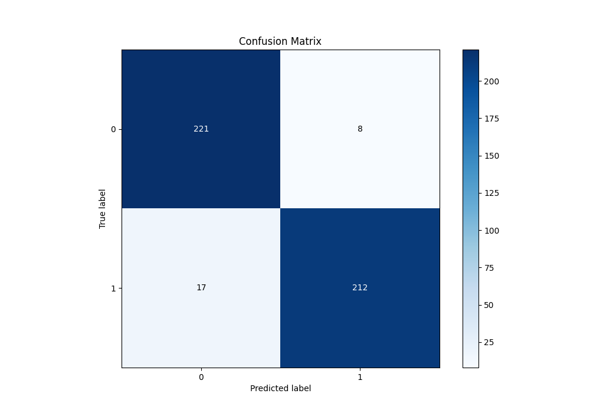
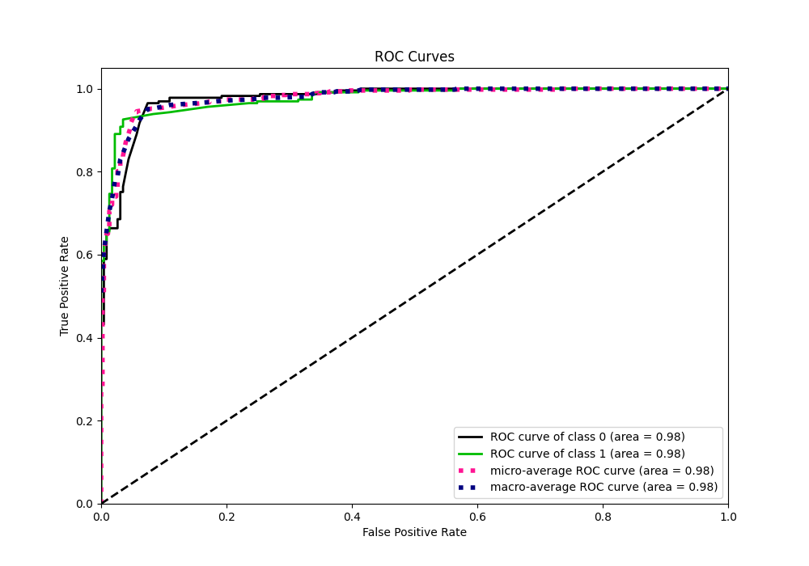
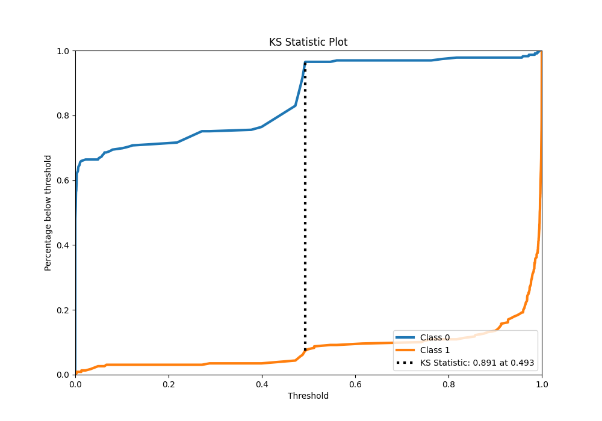
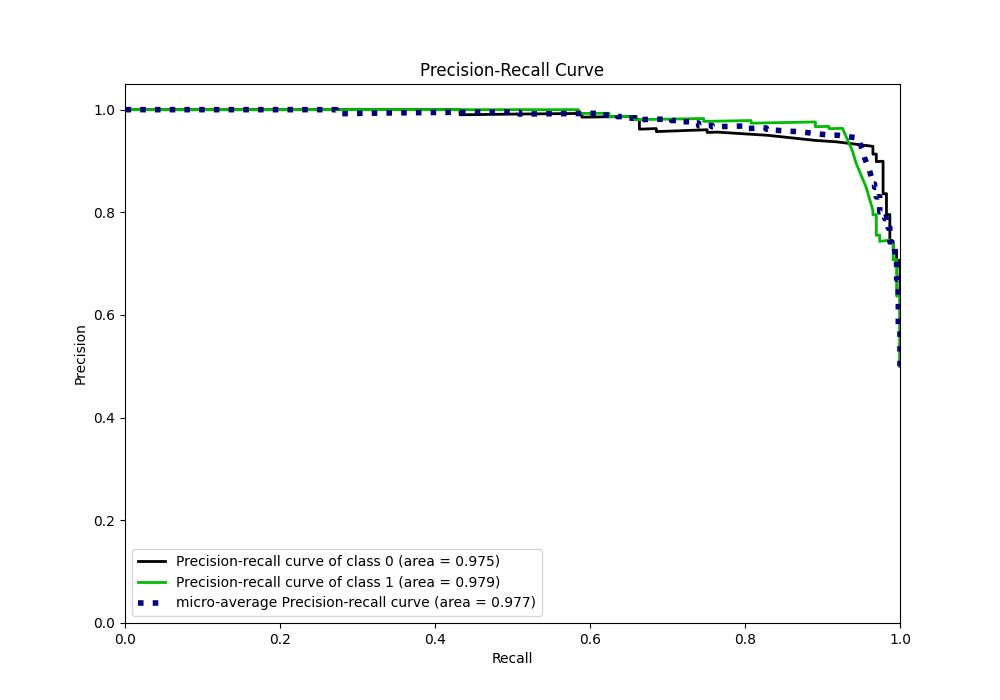
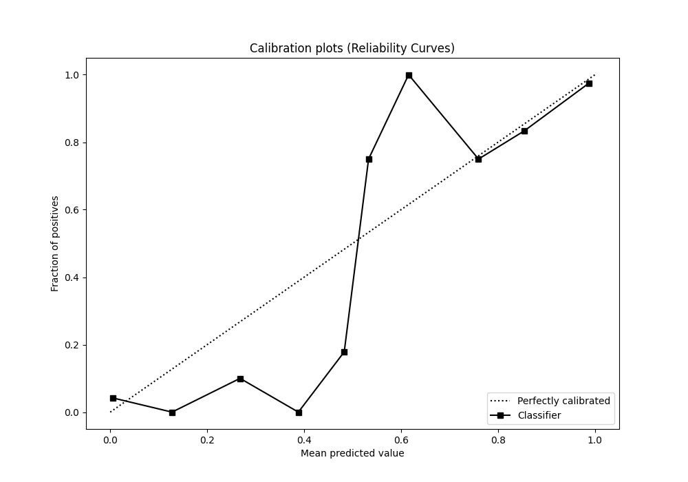
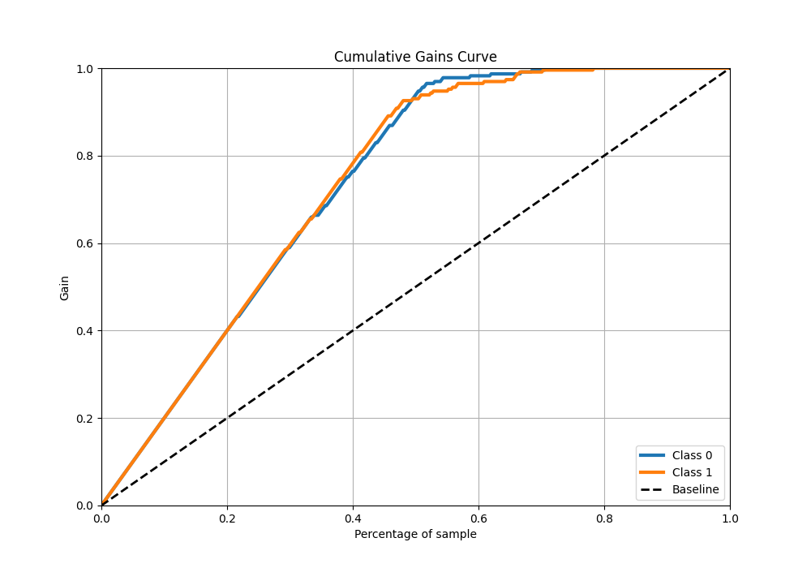
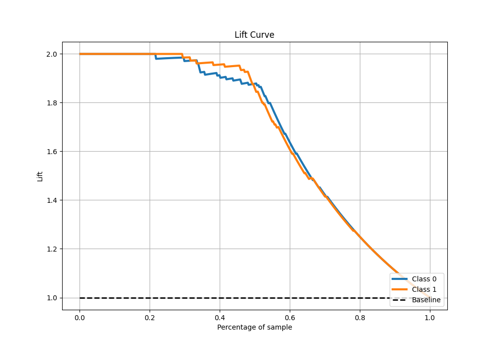

# Summary of 23_NeuralNetwork

[<< Go back](../README.md)

## Neural Network
- **n_jobs**: -1
- **dense_1_size**: 32
- **dense_2_size**: 4
- **learning_rate**: 0.05
- **explain_level**: 1

## Validation
 - **validation_type**: kfold
 - **k_folds**: 5
 - **shuffle**: True
 - **stratify**: True

## Optimized metric
accuracy

## Training time

27.0 seconds

## Metric details
|           |    score |     threshold |
|:----------|---------:|--------------:|
| logloss   | 0.232964 | nan           |
| auc       | 0.976917 | nan           |
| f1        | 0.944321 |   0.492837    |
| accuracy  | 0.945415 |   0.492837    |
| precision | 1        |   0.99338     |
| recall    | 1        |   6.41845e-12 |
| mcc       | 0.891518 |   0.492837    |

## Metric details with threshold from accuracy metric
|           |    score |   threshold |
|:----------|---------:|------------:|
| logloss   | 0.232964 |  nan        |
| auc       | 0.976917 |  nan        |
| f1        | 0.944321 |    0.492837 |
| accuracy  | 0.945415 |    0.492837 |
| precision | 0.963636 |    0.492837 |
| recall    | 0.925764 |    0.492837 |
| mcc       | 0.891518 |    0.492837 |

## Confusion matrix (at threshold=0.492837)
|              |   Predicted as 0 |   Predicted as 1 |
|:-------------|-----------------:|-----------------:|
| Labeled as 0 |              221 |                8 |
| Labeled as 1 |               17 |              212 |

## Learning curves

## Permutation-based Importance

## Confusion Matrix

## Normalized Confusion Matrix

## ROC Curve

## Kolmogorov-Smirnov Statistic

## Precision-Recall Curve

## Calibration Curve

## Cumulative Gains Curve

## Lift Curve

[<< Go back](../README.md)
