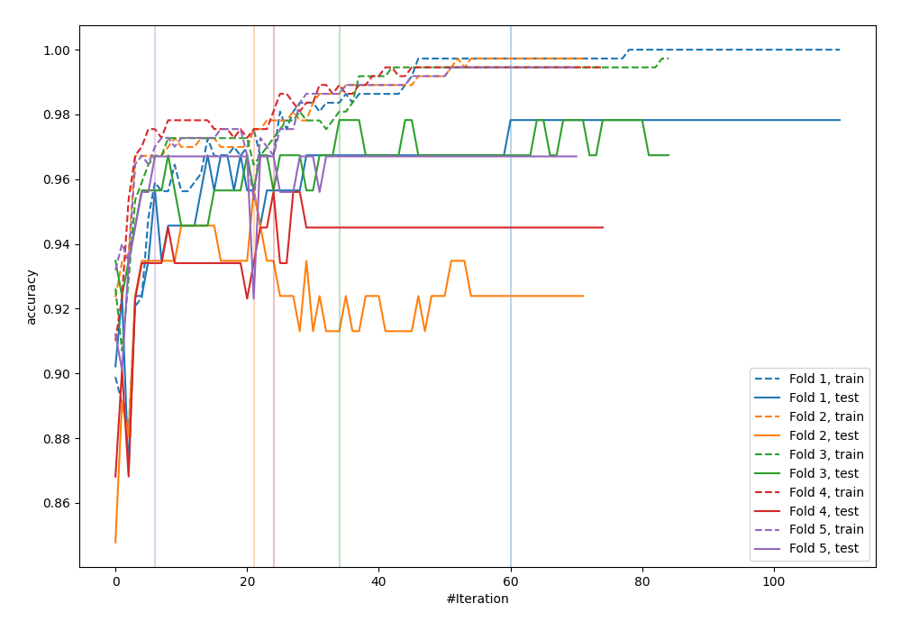
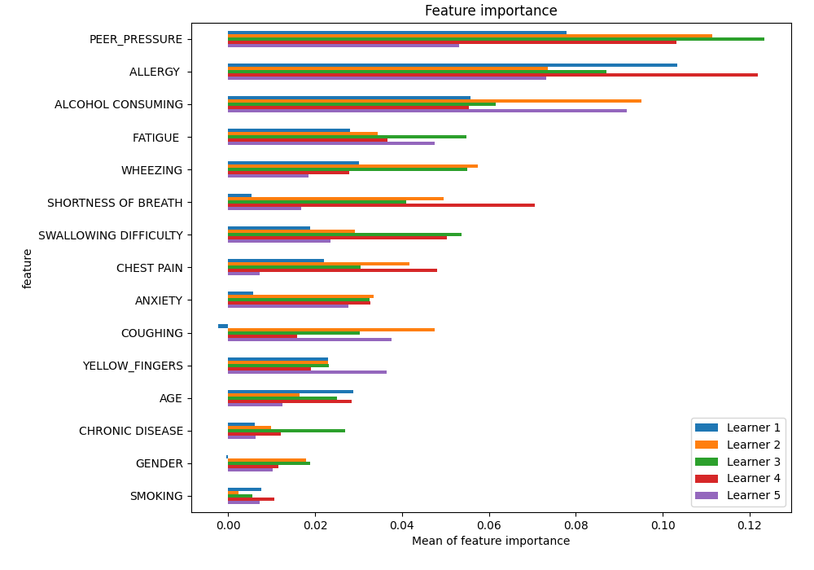
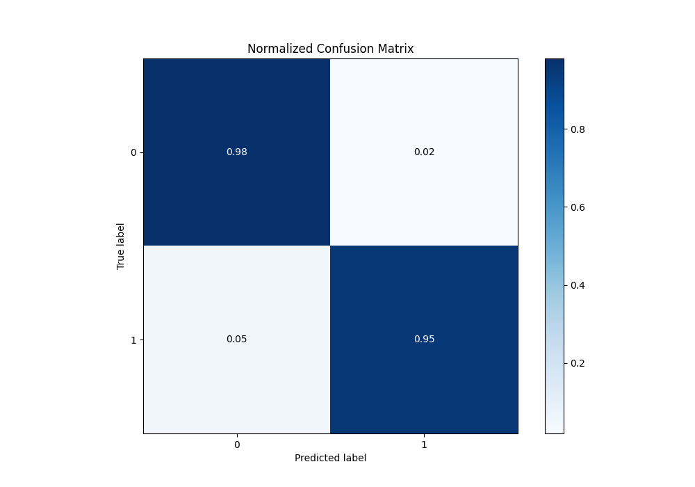
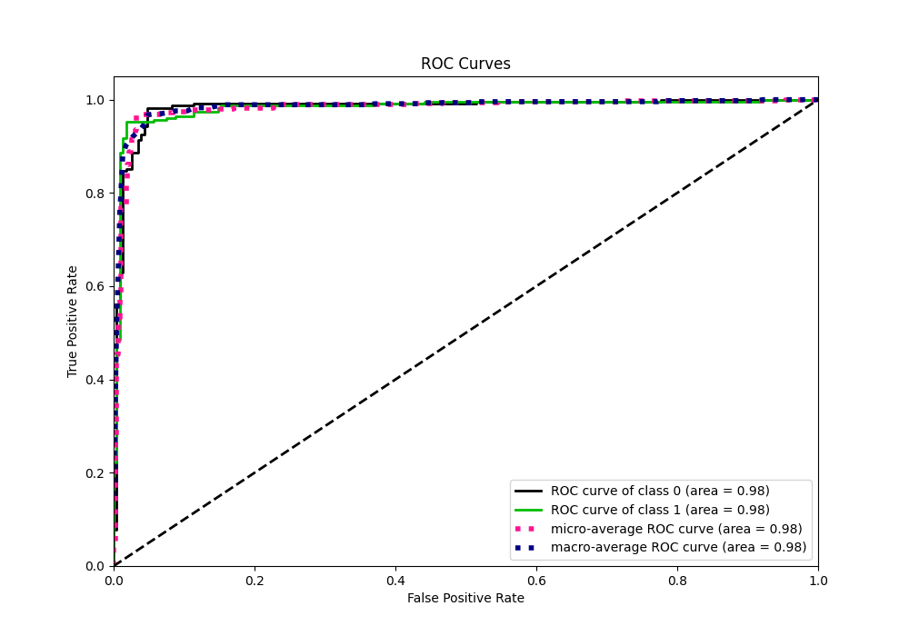
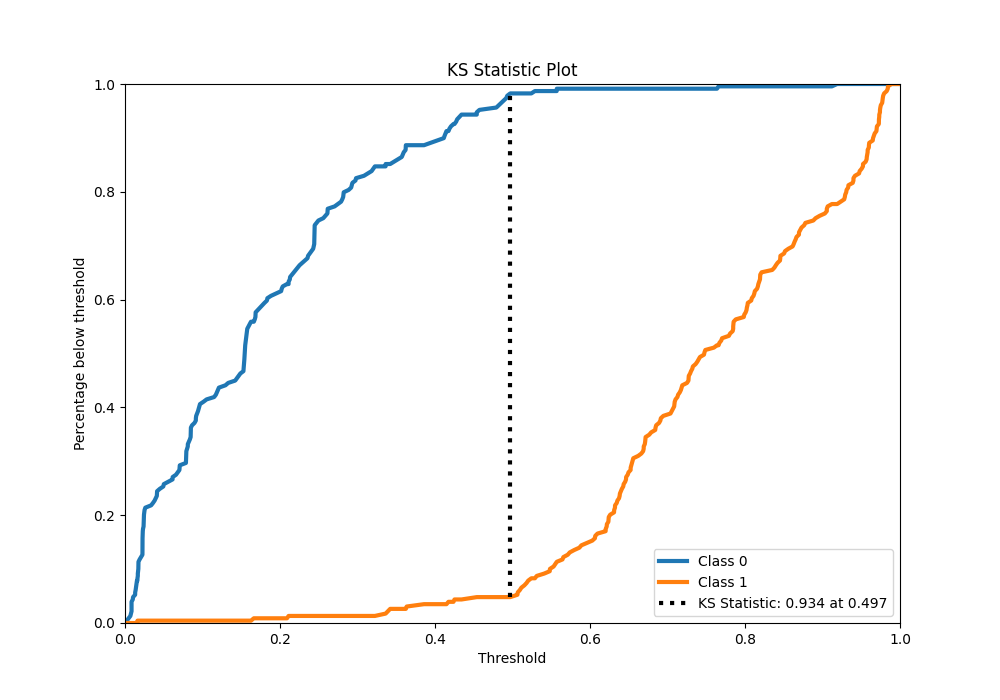
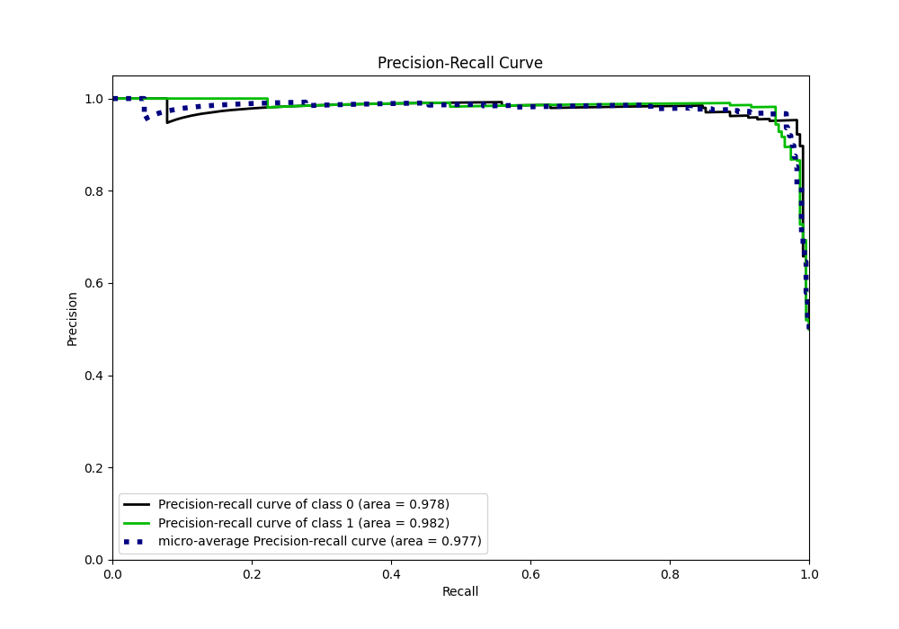
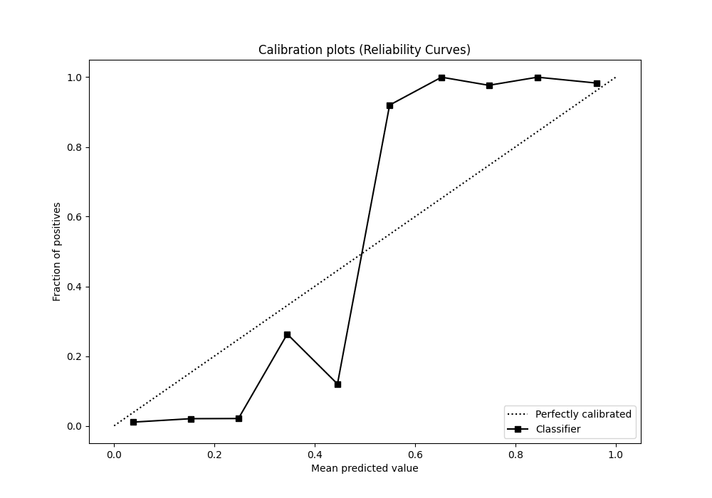
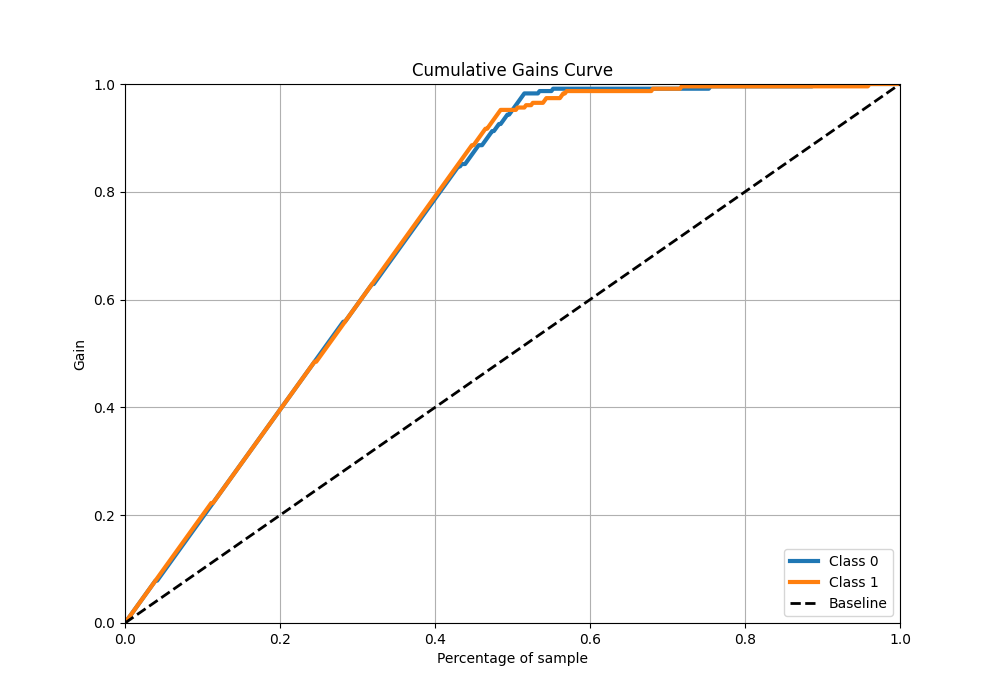
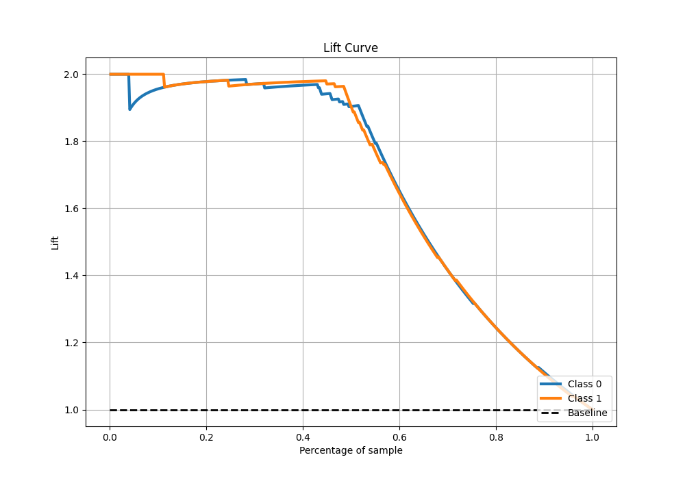

# Summary of 28_CatBoost

[<< Go back](../README.md)

## CatBoost
- **n_jobs**: -1
- **learning_rate**: 0.1
- **depth**: 7
- **rsm**: 0.9
- **loss_function**: Logloss
- **eval_metric**: Accuracy
- **explain_level**: 1

## Validation
 - **validation_type**: kfold
 - **k_folds**: 5
 - **shuffle**: True
 - **stratify**: True

## Optimized metric
accuracy

## Training time

29.8 seconds

## Metric details
|           |    score |    threshold |
|:----------|---------:|-------------:|
| logloss   | 0.274684 | nan          |
| auc       | 0.982857 | nan          |
| f1        | 0.964444 |   0.50655    |
| accuracy  | 0.965066 |   0.50655    |
| precision | 0.990826 |   0.774811   |
| recall    | 1        |   0.00625214 |
| mcc       | 0.930699 |   0.50655    |

## Metric details with threshold from accuracy metric
|           |    score |   threshold |
|:----------|---------:|------------:|
| logloss   | 0.274684 |   nan       |
| auc       | 0.982857 |   nan       |
| f1        | 0.964444 |     0.50655 |
| accuracy  | 0.965066 |     0.50655 |
| precision | 0.9819   |     0.50655 |
| recall    | 0.947598 |     0.50655 |
| mcc       | 0.930699 |     0.50655 |

## Confusion matrix (at threshold=0.50655)
|              |   Predicted as 0 |   Predicted as 1 |
|:-------------|-----------------:|-----------------:|
| Labeled as 0 |              225 |                4 |
| Labeled as 1 |               12 |              217 |

## Learning curves

## Permutation-based Importance

## Confusion Matrix

## Normalized Confusion Matrix

## ROC Curve

## Kolmogorov-Smirnov Statistic

## Precision-Recall Curve

## Calibration Curve

## Cumulative Gains Curve

## Lift Curve

[<< Go back](../README.md)
