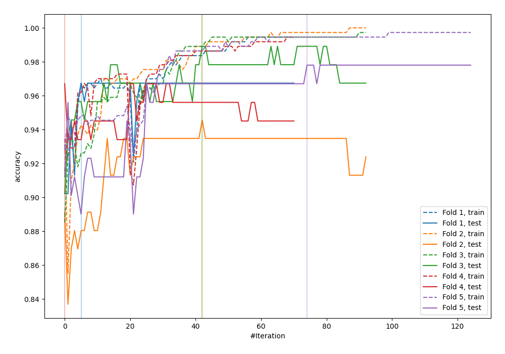
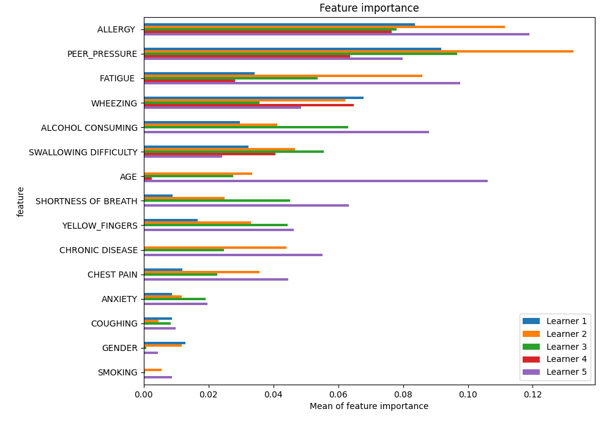
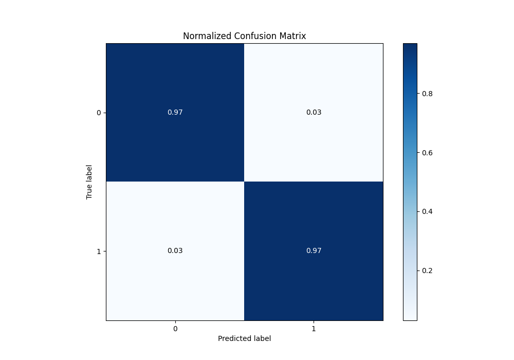
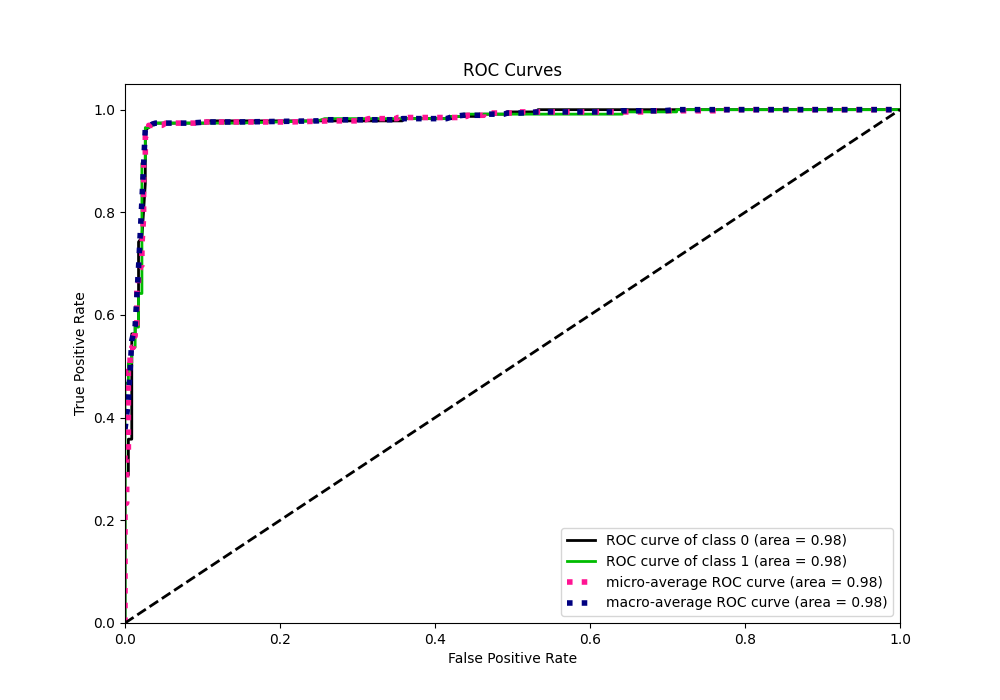
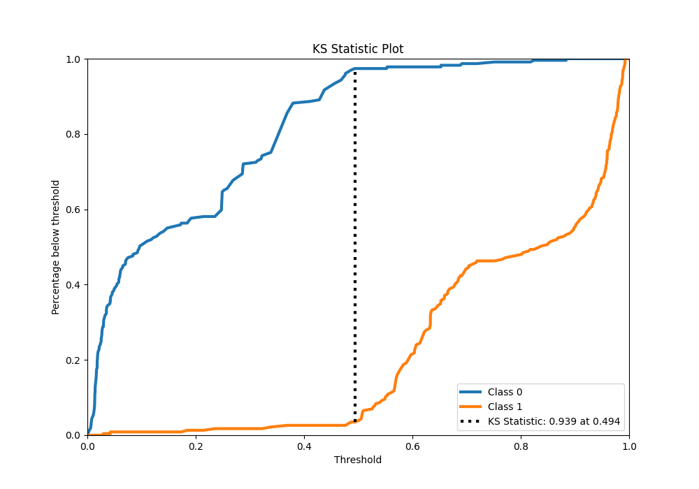
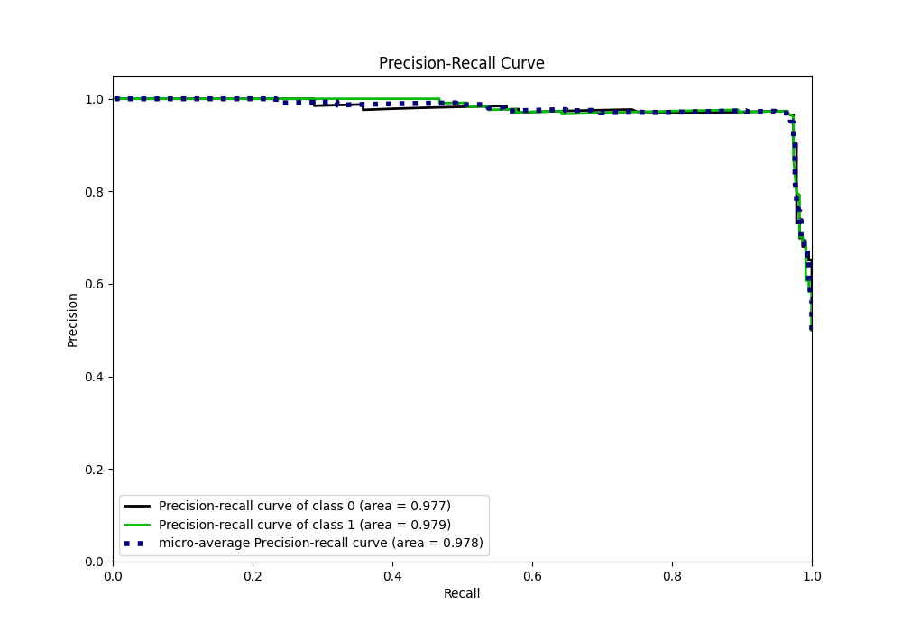
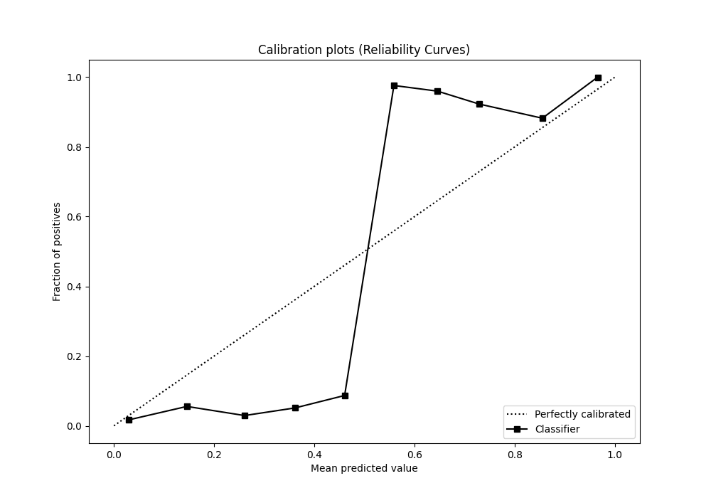
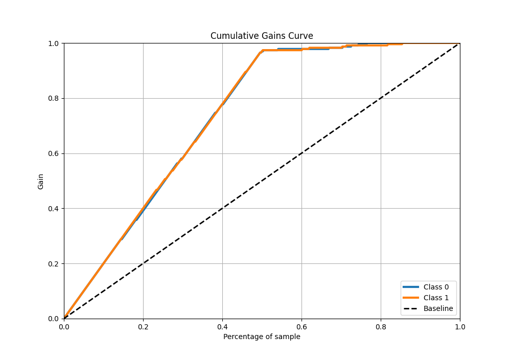
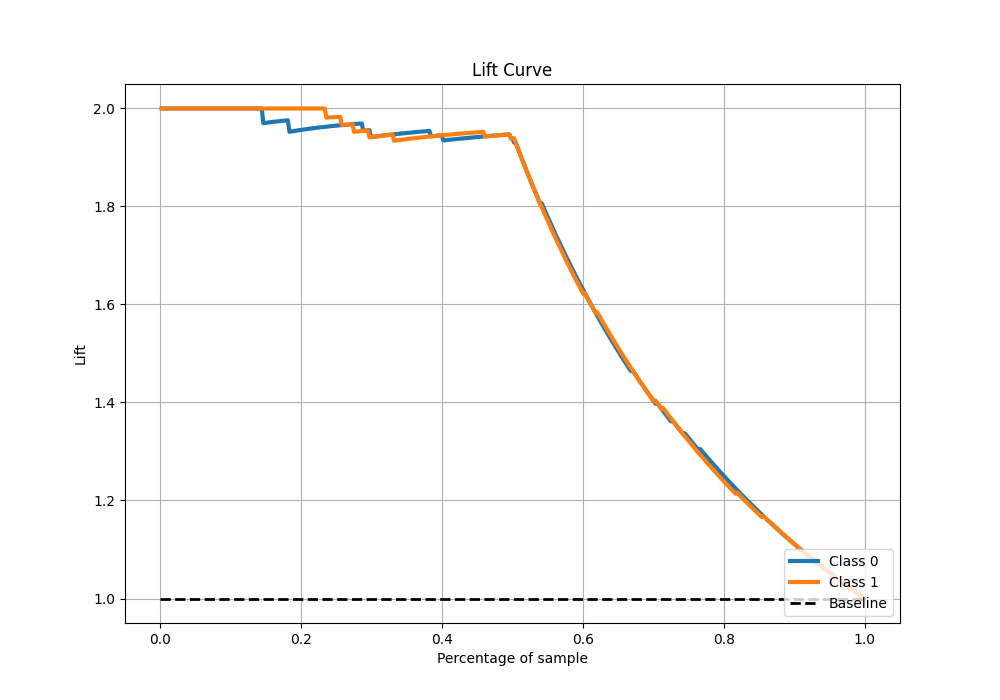

# Summary of 31_CatBoost

[<< Go back](../README.md)

## CatBoost
- **n_jobs**: -1
- **learning_rate**: 0.1
- **depth**: 6
- **rsm**: 0.9
- **loss_function**: Logloss
- **eval_metric**: Accuracy
- **explain_level**: 1

## Validation
 - **validation_type**: kfold
 - **k_folds**: 5
 - **shuffle**: True
 - **stratify**: True

## Optimized metric
accuracy

## Training time

29.3 seconds

## Metric details
|           |    score |   threshold |
|:----------|---------:|------------:|
| logloss   | 0.270426 | nan         |
| auc       | 0.978624 | nan         |
| f1        | 0.967177 |   0.486433  |
| accuracy  | 0.967249 |   0.486433  |
| precision | 1        |   0.895824  |
| recall    | 1        |   0.0031013 |
| mcc       | 0.934507 |   0.486433  |

## Metric details with threshold from accuracy metric
|           |    score |   threshold |
|:----------|---------:|------------:|
| logloss   | 0.270426 |  nan        |
| auc       | 0.978624 |  nan        |
| f1        | 0.967177 |    0.486433 |
| accuracy  | 0.967249 |    0.486433 |
| precision | 0.969298 |    0.486433 |
| recall    | 0.965066 |    0.486433 |
| mcc       | 0.934507 |    0.486433 |

## Confusion matrix (at threshold=0.486433)
|              |   Predicted as 0 |   Predicted as 1 |
|:-------------|-----------------:|-----------------:|
| Labeled as 0 |              222 |                7 |
| Labeled as 1 |                8 |              221 |

## Learning curves

## Permutation-based Importance

## Confusion Matrix

## Normalized Confusion Matrix

## ROC Curve

## Kolmogorov-Smirnov Statistic

## Precision-Recall Curve

## Calibration Curve

## Cumulative Gains Curve

## Lift Curve

[<< Go back](../README.md)
