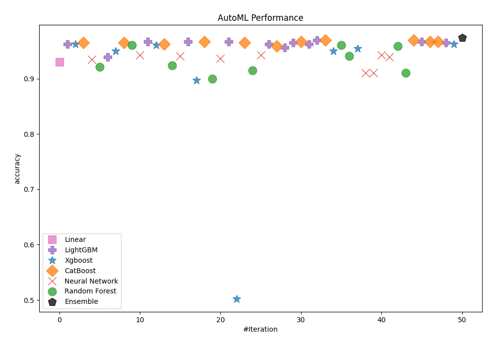
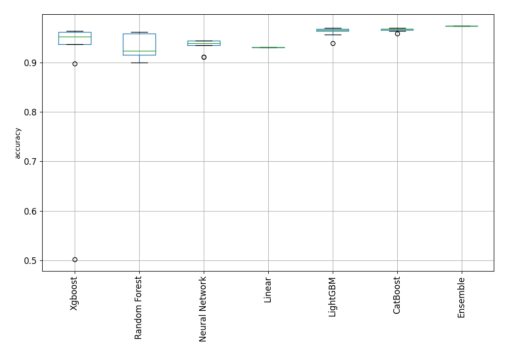
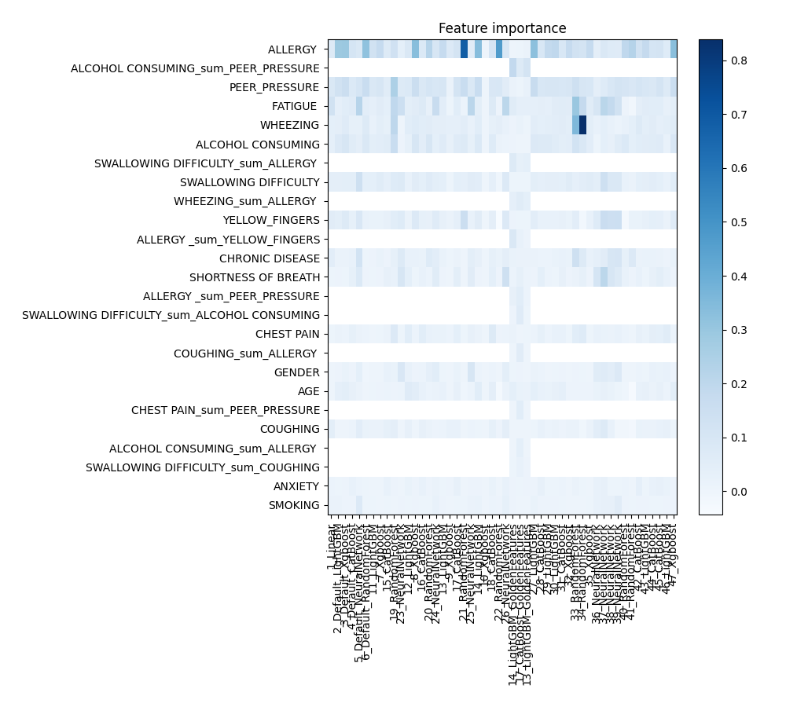
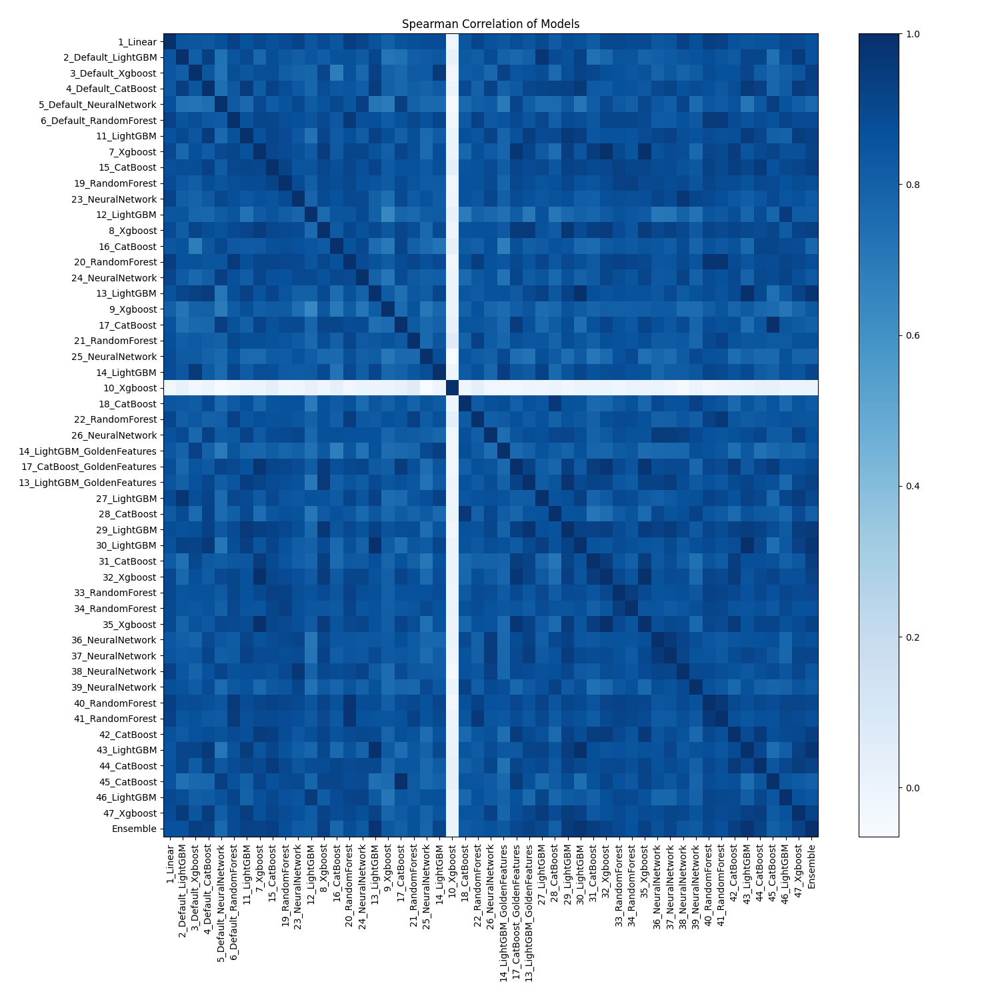

# AutoML Leaderboard

| Best model   | name                                                               | model_type     | metric_type   |   metric_value |   train_time |   single_prediction_time |
|:-------------|:-------------------------------------------------------------------|:---------------|:--------------|---------------:|-------------:|-------------------------:|
|              | [1_Linear](1_Linear/README.md)                                     | Linear         | accuracy      |       0.930131 |        30.25 |                   0.0319 |
|              | [2_Default_LightGBM](2_Default_LightGBM/README.md)                 | LightGBM       | accuracy      |       0.962882 |        27.45 |                   0.017  |
|              | [3_Default_Xgboost](3_Default_Xgboost/README.md)                   | Xgboost        | accuracy      |       0.962882 |        27.61 |                   0.0229 |
|              | [4_Default_CatBoost](4_Default_CatBoost/README.md)                 | CatBoost       | accuracy      |       0.965066 |        27.32 |                   0.0153 |
|              | [5_Default_NeuralNetwork](5_Default_NeuralNetwork/README.md)       | Neural Network | accuracy      |       0.934498 |        25.89 |                   0.0289 |
|              | [6_Default_RandomForest](6_Default_RandomForest/README.md)         | Random Forest  | accuracy      |       0.921397 |        30.07 |                   0.1462 |
|              | [11_LightGBM](11_LightGBM/README.md)                               | LightGBM       | accuracy      |       0.938865 |        27.36 |                   0.0119 |
|              | [7_Xgboost](7_Xgboost/README.md)                                   | Xgboost        | accuracy      |       0.949782 |        28.25 |                   0.0123 |
|              | [15_CatBoost](15_CatBoost/README.md)                               | CatBoost       | accuracy      |       0.965066 |        28.26 |                   0.019  |
|              | [19_RandomForest](19_RandomForest/README.md)                       | Random Forest  | accuracy      |       0.960699 |        30.18 |                   0.1544 |
|              | [23_NeuralNetwork](23_NeuralNetwork/README.md)                     | Neural Network | accuracy      |       0.943231 |        27.74 |                   0.0377 |
|              | [12_LightGBM](12_LightGBM/README.md)                               | LightGBM       | accuracy      |       0.967249 |        28.78 |                   0.0111 |
|              | [8_Xgboost](8_Xgboost/README.md)                                   | Xgboost        | accuracy      |       0.960699 |        28.64 |                   0.0159 |
|              | [16_CatBoost](16_CatBoost/README.md)                               | CatBoost       | accuracy      |       0.962882 |        29.26 |                   0.0209 |
|              | [20_RandomForest](20_RandomForest/README.md)                       | Random Forest  | accuracy      |       0.923581 |        31.19 |                   0.1406 |
|              | [24_NeuralNetwork](24_NeuralNetwork/README.md)                     | Neural Network | accuracy      |       0.941048 |        28.28 |                   0.0303 |
|              | [13_LightGBM](13_LightGBM/README.md)                               | LightGBM       | accuracy      |       0.967249 |        28.2  |                   0.0123 |
|              | [9_Xgboost](9_Xgboost/README.md)                                   | Xgboost        | accuracy      |       0.89738  |        28.24 |                   0.0169 |
|              | [17_CatBoost](17_CatBoost/README.md)                               | CatBoost       | accuracy      |       0.967249 |        29.14 |                   0.0165 |
|              | [21_RandomForest](21_RandomForest/README.md)                       | Random Forest  | accuracy      |       0.899563 |        30.84 |                   0.1379 |
|              | [25_NeuralNetwork](25_NeuralNetwork/README.md)                     | Neural Network | accuracy      |       0.936681 |        28.97 |                   0.0396 |
|              | [14_LightGBM](14_LightGBM/README.md)                               | LightGBM       | accuracy      |       0.967249 |        30.63 |                   0.0116 |
|              | [10_Xgboost](10_Xgboost/README.md)                                 | Xgboost        | accuracy      |       0.502183 |        29.14 |                   0.0131 |
|              | [18_CatBoost](18_CatBoost/README.md)                               | CatBoost       | accuracy      |       0.965066 |        29.87 |                   0.0129 |
|              | [22_RandomForest](22_RandomForest/README.md)                       | Random Forest  | accuracy      |       0.914847 |        31.49 |                   0.1518 |
|              | [26_NeuralNetwork](26_NeuralNetwork/README.md)                     | Neural Network | accuracy      |       0.943231 |        28.93 |                   0.0357 |
|              | [14_LightGBM_GoldenFeatures](14_LightGBM_GoldenFeatures/README.md) | LightGBM       | accuracy      |       0.962882 |        31.65 |                   0.0362 |
|              | [17_CatBoost_GoldenFeatures](17_CatBoost_GoldenFeatures/README.md) | CatBoost       | accuracy      |       0.958515 |        30.24 |                   0.0339 |
|              | [13_LightGBM_GoldenFeatures](13_LightGBM_GoldenFeatures/README.md) | LightGBM       | accuracy      |       0.956332 |        30.79 |                   0.0323 |
|              | [27_LightGBM](27_LightGBM/README.md)                               | LightGBM       | accuracy      |       0.965066 |        31.37 |                   0.0126 |
|              | [28_CatBoost](28_CatBoost/README.md)                               | CatBoost       | accuracy      |       0.967249 |        30.62 |                   0.0184 |
|              | [29_LightGBM](29_LightGBM/README.md)                               | LightGBM       | accuracy      |       0.962882 |        30    |                   0.0174 |
|              | [30_LightGBM](30_LightGBM/README.md)                               | LightGBM       | accuracy      |       0.969432 |        30.53 |                   0.0111 |
|              | [31_CatBoost](31_CatBoost/README.md)                               | CatBoost       | accuracy      |       0.969432 |        30.15 |                   0.0143 |
|              | [32_Xgboost](32_Xgboost/README.md)                                 | Xgboost        | accuracy      |       0.949782 |        31.02 |                   0.0128 |
|              | [33_RandomForest](33_RandomForest/README.md)                       | Random Forest  | accuracy      |       0.960699 |        32.4  |                   0.1572 |
|              | [34_RandomForest](34_RandomForest/README.md)                       | Random Forest  | accuracy      |       0.941048 |        32.84 |                   0.1487 |
|              | [35_Xgboost](35_Xgboost/README.md)                                 | Xgboost        | accuracy      |       0.954148 |        31.76 |                   0.0137 |
|              | [36_NeuralNetwork](36_NeuralNetwork/README.md)                     | Neural Network | accuracy      |       0.91048  |        31.56 |                   0.0285 |
|              | [37_NeuralNetwork](37_NeuralNetwork/README.md)                     | Neural Network | accuracy      |       0.91048  |        30.74 |                   0.0369 |
|              | [38_NeuralNetwork](38_NeuralNetwork/README.md)                     | Neural Network | accuracy      |       0.943231 |        31.05 |                   0.029  |
|              | [39_NeuralNetwork](39_NeuralNetwork/README.md)                     | Neural Network | accuracy      |       0.938865 |        30.66 |                   0.049  |
|              | [40_RandomForest](40_RandomForest/README.md)                       | Random Forest  | accuracy      |       0.958515 |        33.89 |                   0.1399 |
|              | [41_RandomForest](41_RandomForest/README.md)                       | Random Forest  | accuracy      |       0.91048  |        33.33 |                   0.1298 |
|              | [42_CatBoost](42_CatBoost/README.md)                               | CatBoost       | accuracy      |       0.969432 |        32.63 |                   0.0163 |
|              | [43_LightGBM](43_LightGBM/README.md)                               | LightGBM       | accuracy      |       0.967249 |        31.89 |                   0.0117 |
|              | [44_CatBoost](44_CatBoost/README.md)                               | CatBoost       | accuracy      |       0.967249 |        31.59 |                   0.0151 |
|              | [45_CatBoost](45_CatBoost/README.md)                               | CatBoost       | accuracy      |       0.967249 |        31.68 |                   0.0192 |
|              | [46_LightGBM](46_LightGBM/README.md)                               | LightGBM       | accuracy      |       0.965066 |        31.68 |                   0.0136 |
|              | [47_Xgboost](47_Xgboost/README.md)                                 | Xgboost        | accuracy      |       0.962882 |        32.56 |                   0.0131 |
| **the best** | [Ensemble](Ensemble/README.md)                                     | Ensemble       | accuracy      |       0.973799 |         2.86 |                   0.0381 |

### AutoML Performance

### AutoML Performance Boxplot

### Features Importance

### Spearman Correlation of Models

