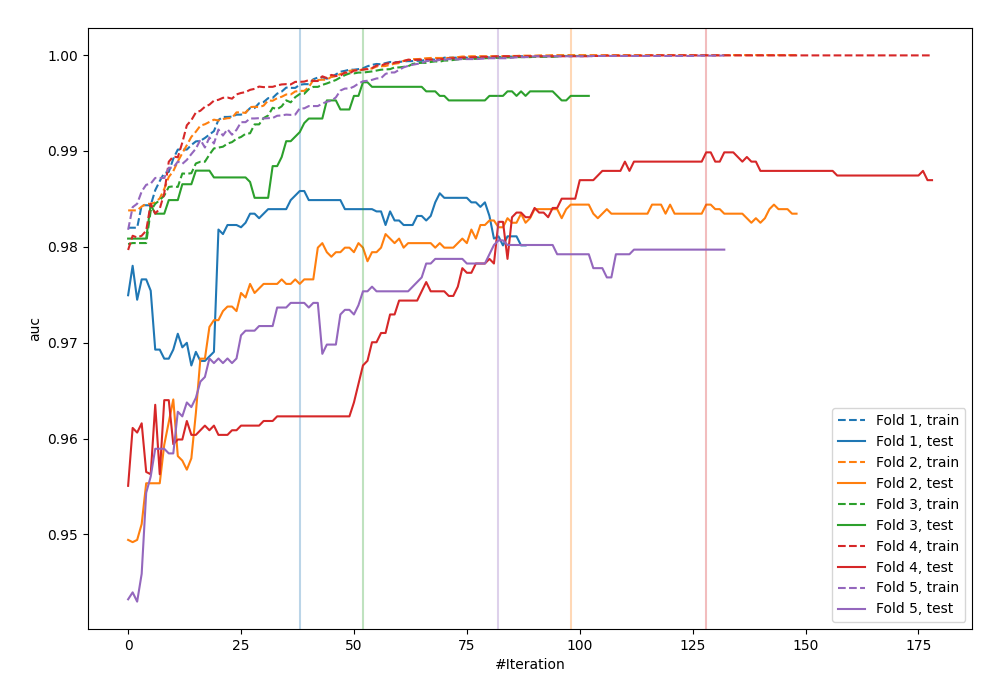
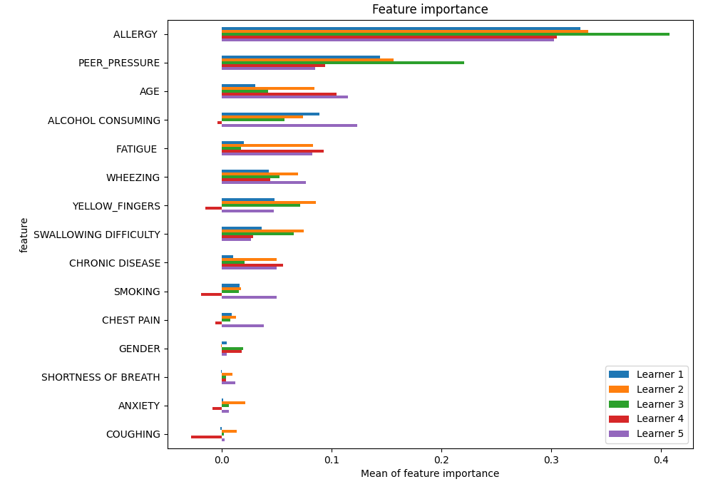
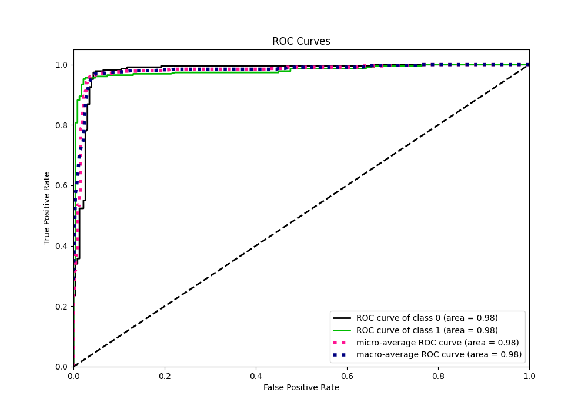
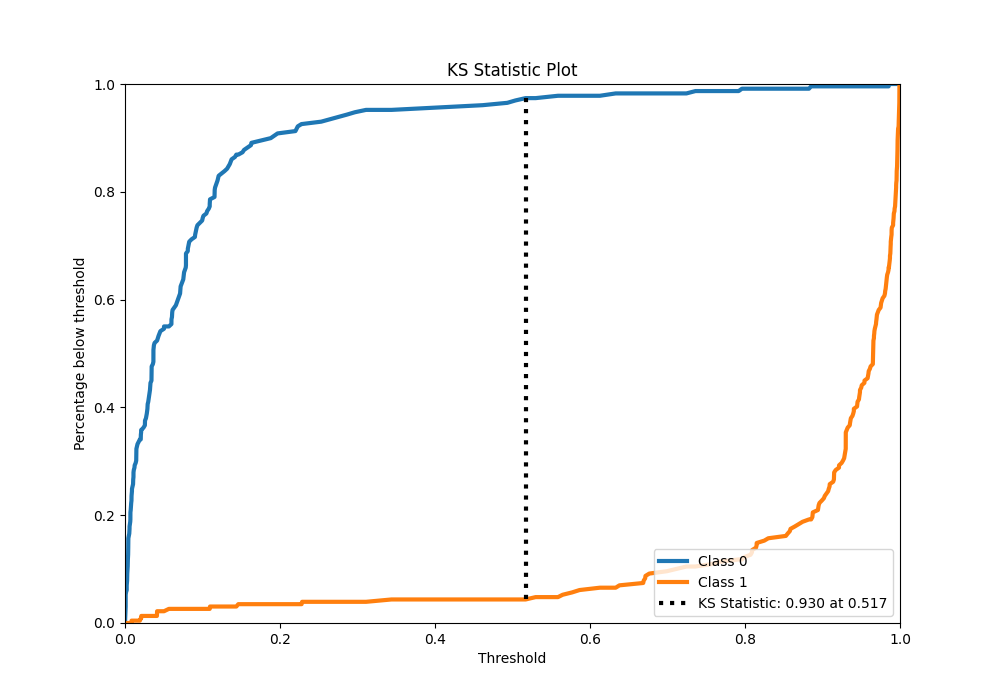
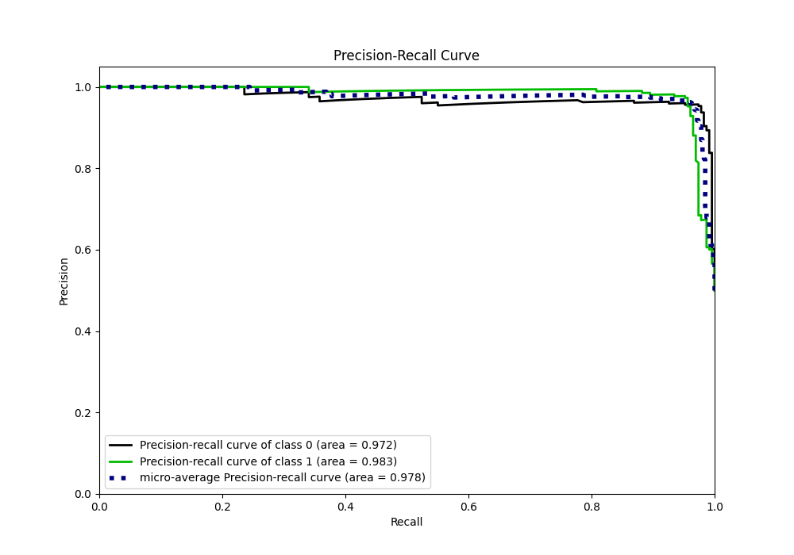
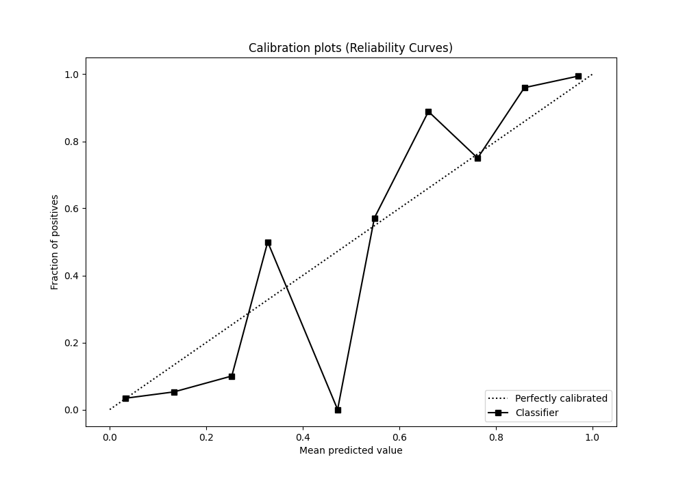
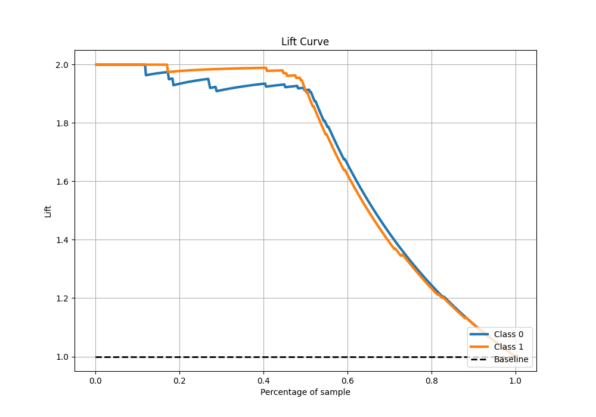

# Summary of 14_LightGBM

[<< Go back](../README.md)

## LightGBM
- **n_jobs**: -1
- **objective**: binary
- **num_leaves**: 95
- **learning_rate**: 0.05
- **feature_fraction**: 1.0
- **bagging_fraction**: 1.0
- **min_data_in_leaf**: 10
- **metric**: auc
- **custom_eval_metric_name**: None
- **explain_level**: 1

## Validation
 - **validation_type**: kfold
 - **k_folds**: 5
 - **shuffle**: True
 - **stratify**: True

## Optimized metric
auc

## Training time

29.1 seconds

## Metric details
|           |    score |    threshold |
|:----------|---------:|-------------:|
| logloss   | 0.160448 | nan          |
| auc       | 0.978757 | nan          |
| f1        | 0.964758 |   0.523377   |
| accuracy  | 0.965066 |   0.523377   |
| precision | 1        |   0.986192   |
| recall    | 1        |   0.00049015 |
| mcc       | 0.930273 |   0.523377   |

## Metric details with threshold from accuracy metric
|           |    score |   threshold |
|:----------|---------:|------------:|
| logloss   | 0.160448 |  nan        |
| auc       | 0.978757 |  nan        |
| f1        | 0.964758 |    0.523377 |
| accuracy  | 0.965066 |    0.523377 |
| precision | 0.973333 |    0.523377 |
| recall    | 0.956332 |    0.523377 |
| mcc       | 0.930273 |    0.523377 |

## Confusion matrix (at threshold=0.523377)
|              |   Predicted as 0 |   Predicted as 1 |
|:-------------|-----------------:|-----------------:|
| Labeled as 0 |              223 |                6 |
| Labeled as 1 |               10 |              219 |

## Learning curves

## Permutation-based Importance

## Confusion Matrix

## Normalized Confusion Matrix

## ROC Curve

## Kolmogorov-Smirnov Statistic

## Precision-Recall Curve

## Calibration Curve

## Cumulative Gains Curve

## Lift Curve

[<< Go back](../README.md)
