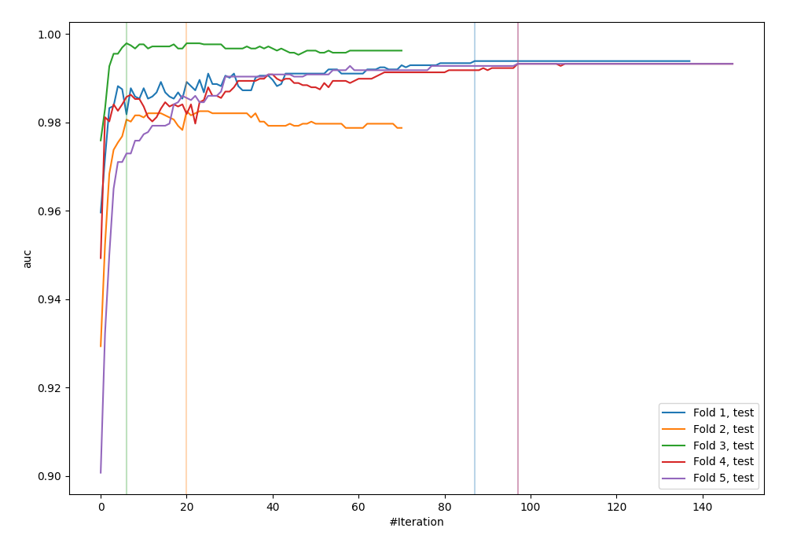
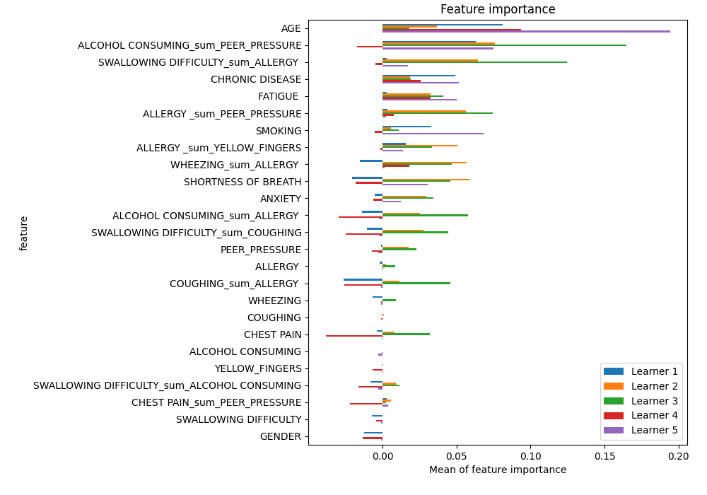
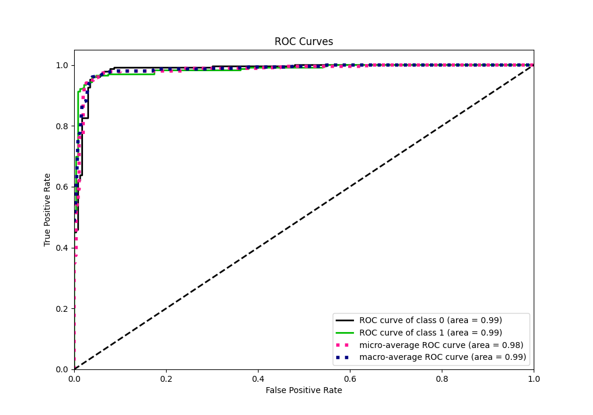
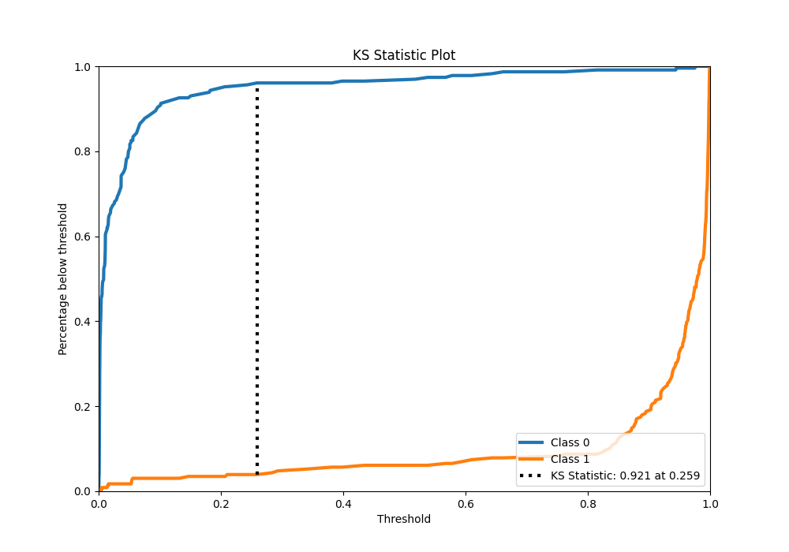
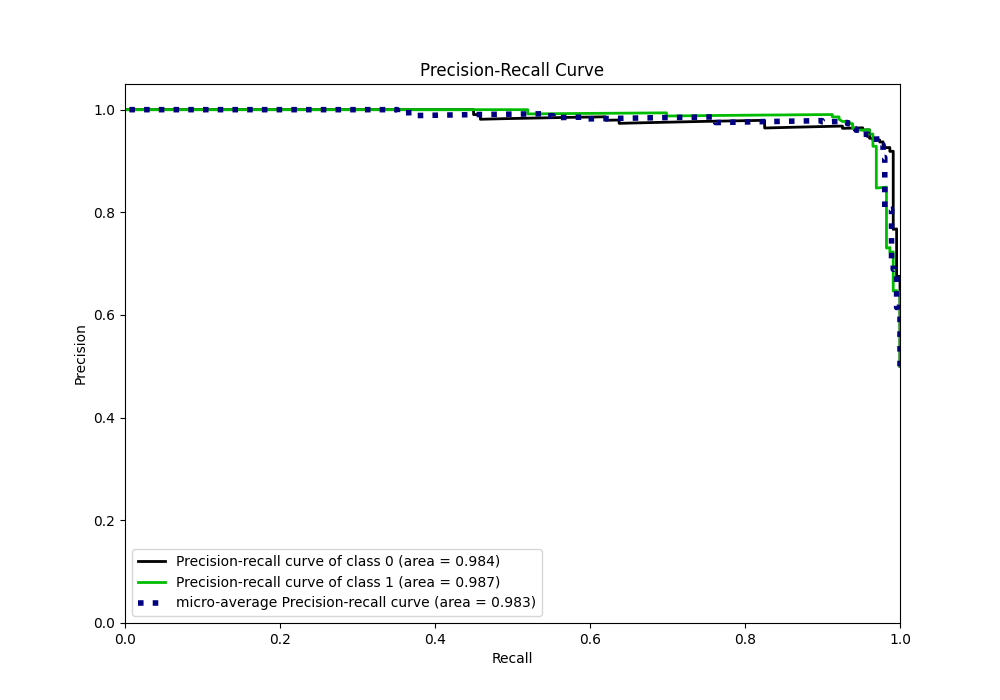
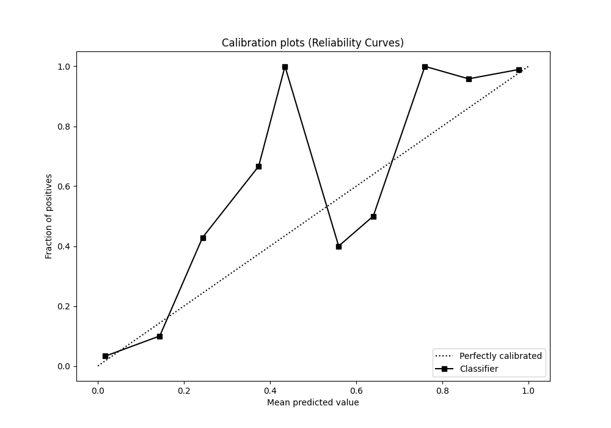
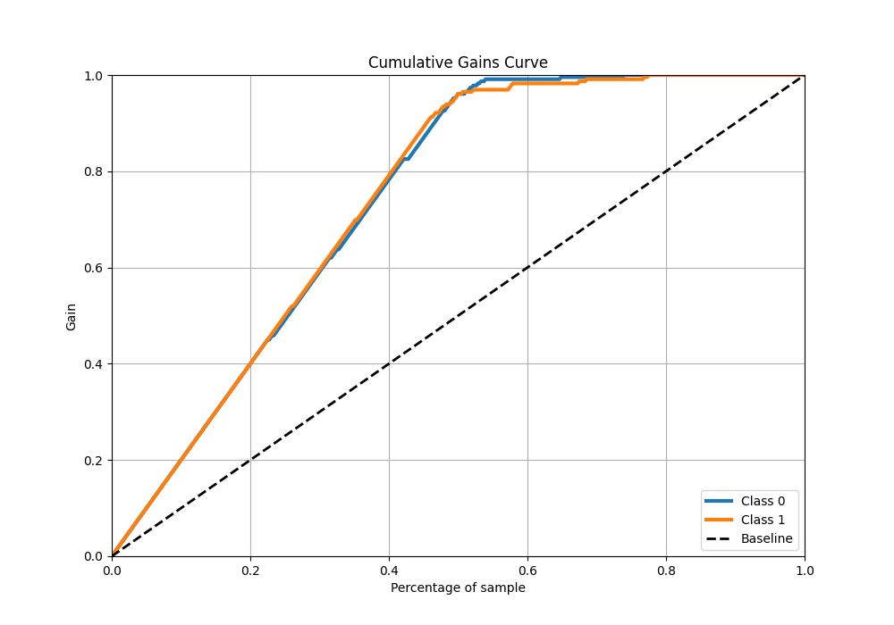
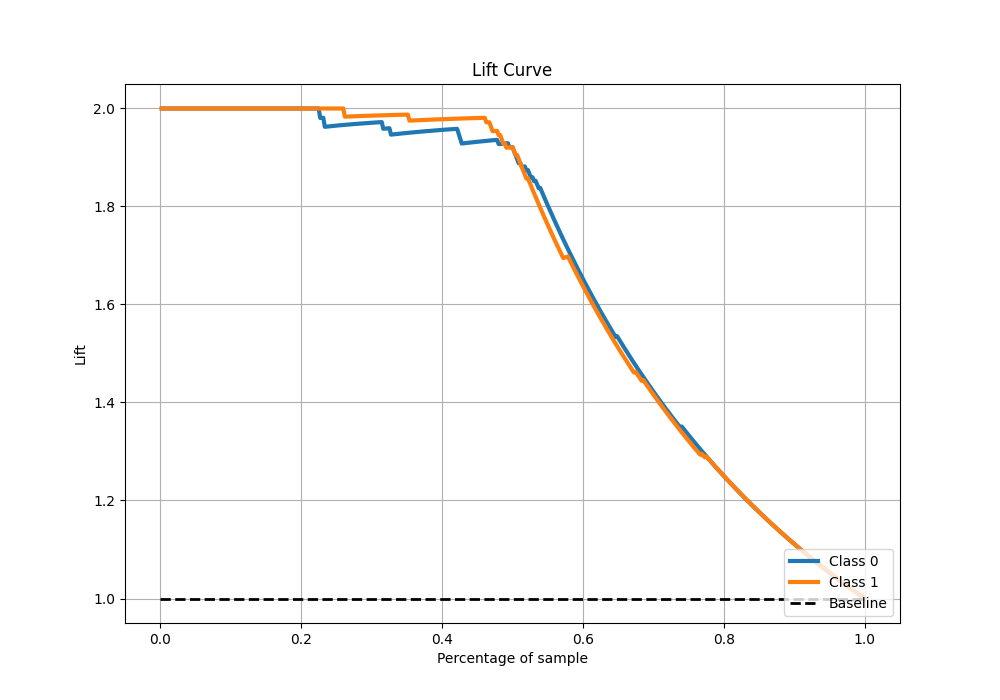

# Summary of 18_CatBoost_GoldenFeatures

[<< Go back](../README.md)

## CatBoost
- **n_jobs**: -1
- **learning_rate**: 0.2
- **depth**: 8
- **rsm**: 1.0
- **loss_function**: Logloss
- **eval_metric**: AUC
- **explain_level**: 1

## Validation
 - **validation_type**: kfold
 - **k_folds**: 5
 - **shuffle**: True
 - **stratify**: True

## Optimized metric
auc

## Training time

30.4 seconds

## Metric details
|           |    score |     threshold |
|:----------|---------:|--------------:|
| logloss   | 0.145194 | nan           |
| auc       | 0.985174 | nan           |
| f1        | 0.960699 |   0.271299    |
| accuracy  | 0.960699 |   0.271299    |
| precision | 1        |   0.977599    |
| recall    | 1        |   0.000405224 |
| mcc       | 0.921397 |   0.271299    |

## Metric details with threshold from accuracy metric
|           |    score |   threshold |
|:----------|---------:|------------:|
| logloss   | 0.145194 |  nan        |
| auc       | 0.985174 |  nan        |
| f1        | 0.960699 |    0.271299 |
| accuracy  | 0.960699 |    0.271299 |
| precision | 0.960699 |    0.271299 |
| recall    | 0.960699 |    0.271299 |
| mcc       | 0.921397 |    0.271299 |

## Confusion matrix (at threshold=0.271299)
|              |   Predicted as 0 |   Predicted as 1 |
|:-------------|-----------------:|-----------------:|
| Labeled as 0 |              220 |                9 |
| Labeled as 1 |                9 |              220 |

## Learning curves

## Permutation-based Importance

## Confusion Matrix

## Normalized Confusion Matrix

## ROC Curve

## Kolmogorov-Smirnov Statistic

## Precision-Recall Curve

## Calibration Curve

## Cumulative Gains Curve

## Lift Curve

[<< Go back](../README.md)
