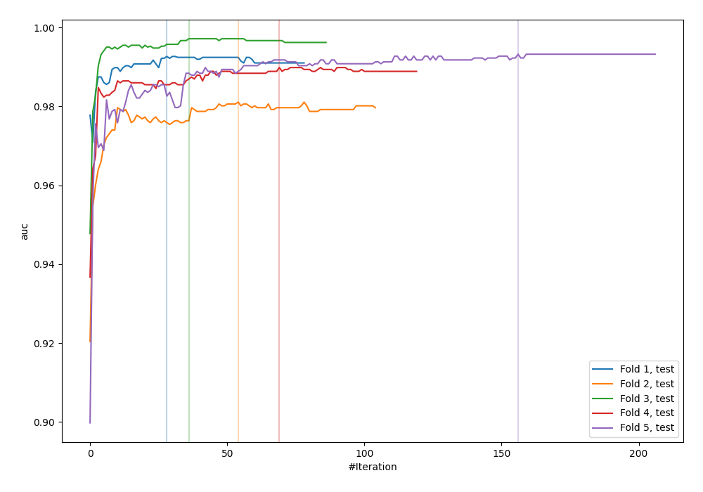
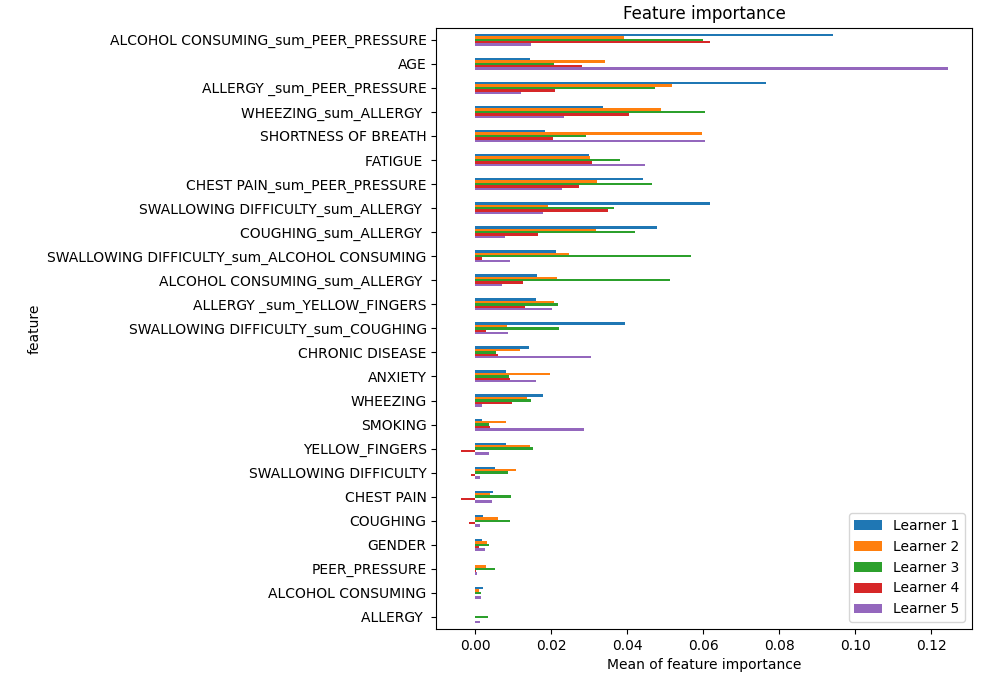
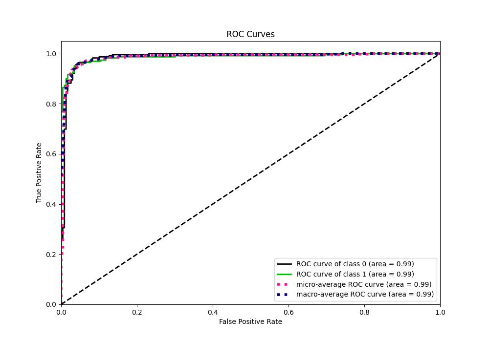
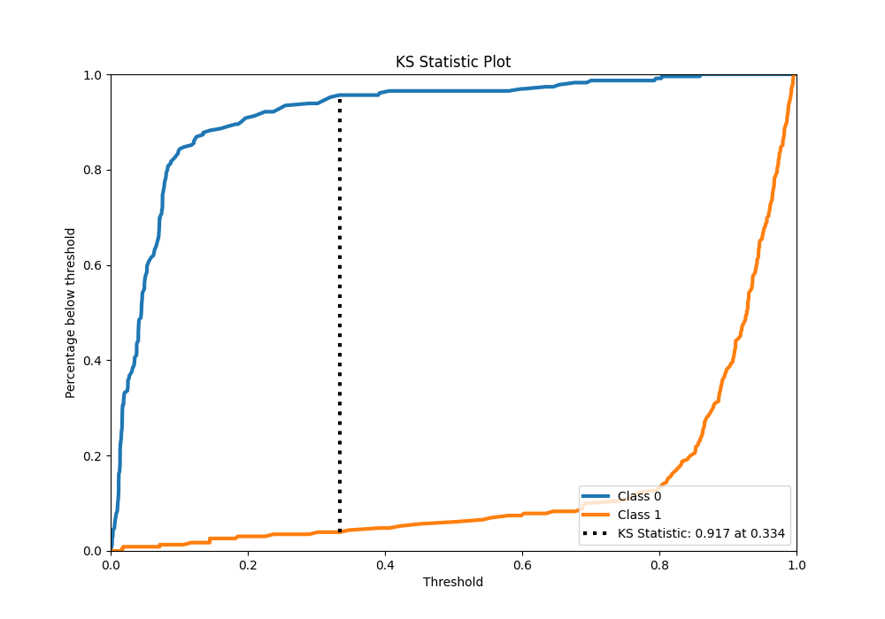
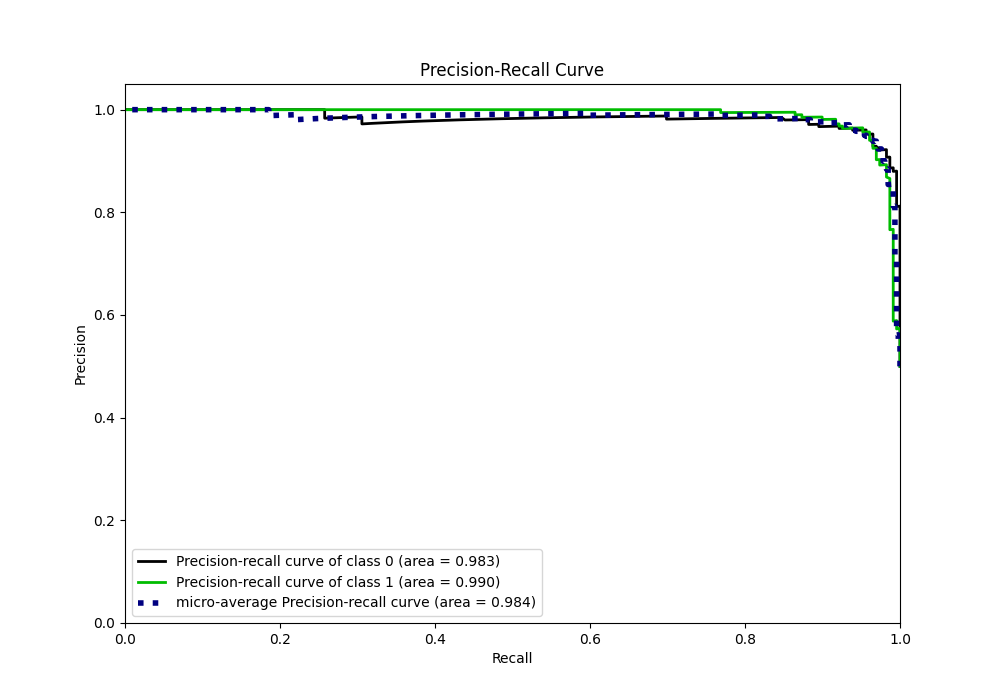
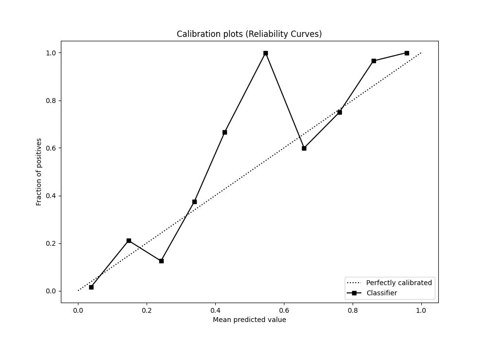
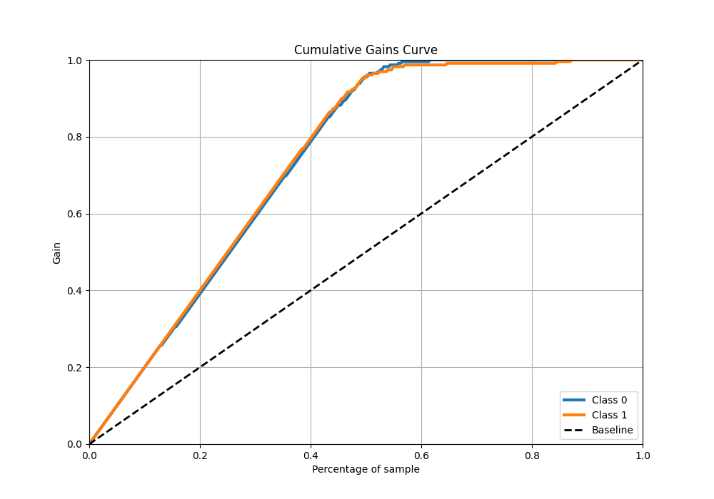
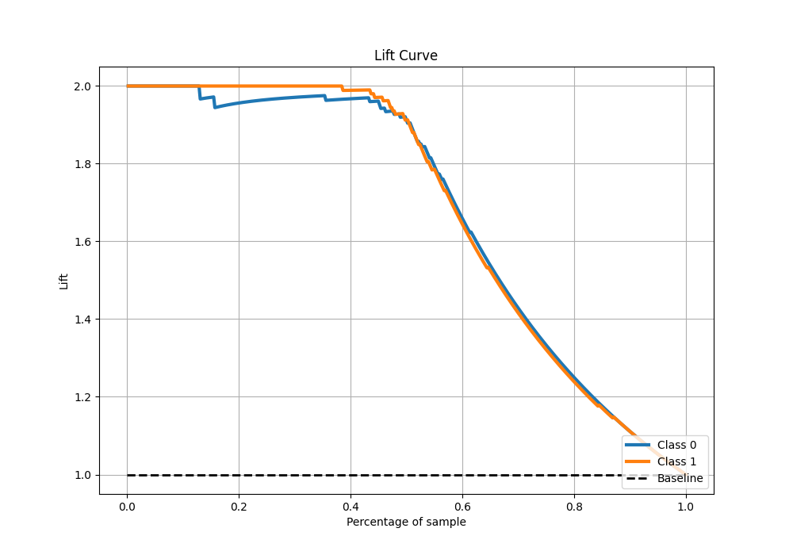

# Summary of 30_CatBoost_GoldenFeatures

[<< Go back](../README.md)

## CatBoost
- **n_jobs**: -1
- **learning_rate**: 0.05
- **depth**: 8
- **rsm**: 0.9
- **loss_function**: Logloss
- **eval_metric**: AUC
- **explain_level**: 1

## Validation
 - **validation_type**: kfold
 - **k_folds**: 5
 - **shuffle**: True
 - **stratify**: True

## Optimized metric
auc

## Training time

25.2 seconds

## Metric details
|           |    score |    threshold |
|:----------|---------:|-------------:|
| logloss   | 0.157187 | nan          |
| auc       | 0.986966 | nan          |
| f1        | 0.956332 |   0.368843   |
| accuracy  | 0.956332 |   0.368843   |
| precision | 1        |   0.862884   |
| recall    | 1        |   0.00186637 |
| mcc       | 0.912803 |   0.437405   |

## Metric details with threshold from accuracy metric
|           |    score |   threshold |
|:----------|---------:|------------:|
| logloss   | 0.157187 |  nan        |
| auc       | 0.986966 |  nan        |
| f1        | 0.956332 |    0.368843 |
| accuracy  | 0.956332 |    0.368843 |
| precision | 0.956332 |    0.368843 |
| recall    | 0.956332 |    0.368843 |
| mcc       | 0.912664 |    0.368843 |

## Confusion matrix (at threshold=0.368843)
|              |   Predicted as 0 |   Predicted as 1 |
|:-------------|-----------------:|-----------------:|
| Labeled as 0 |              219 |               10 |
| Labeled as 1 |               10 |              219 |

## Learning curves

## Permutation-based Importance

## Confusion Matrix

## Normalized Confusion Matrix

## ROC Curve

## Kolmogorov-Smirnov Statistic

## Precision-Recall Curve

## Calibration Curve

## Cumulative Gains Curve

## Lift Curve

[<< Go back](../README.md)
