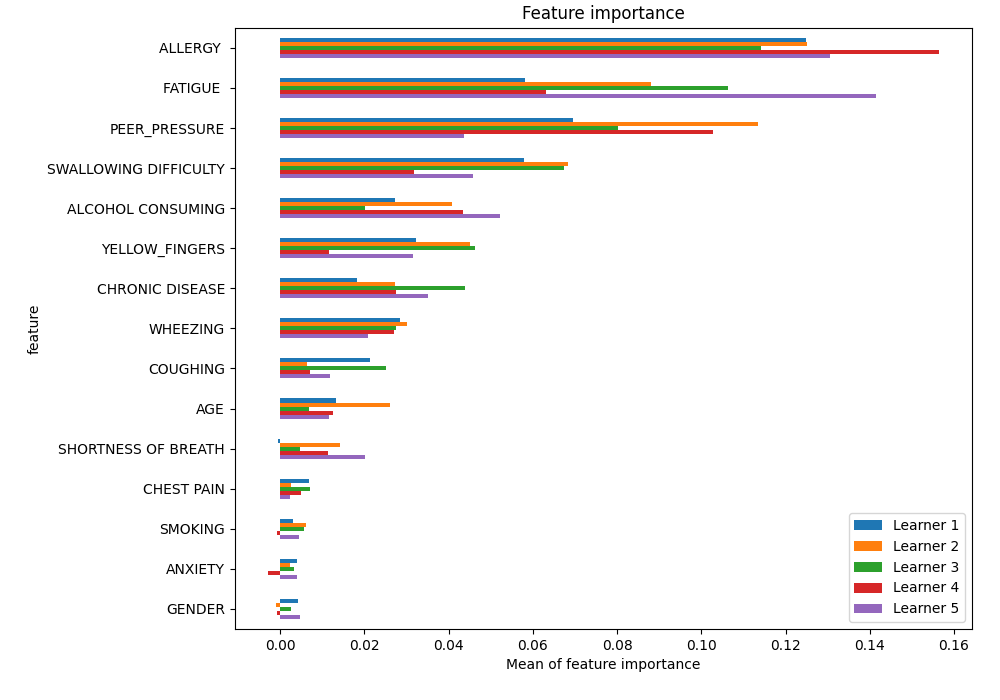
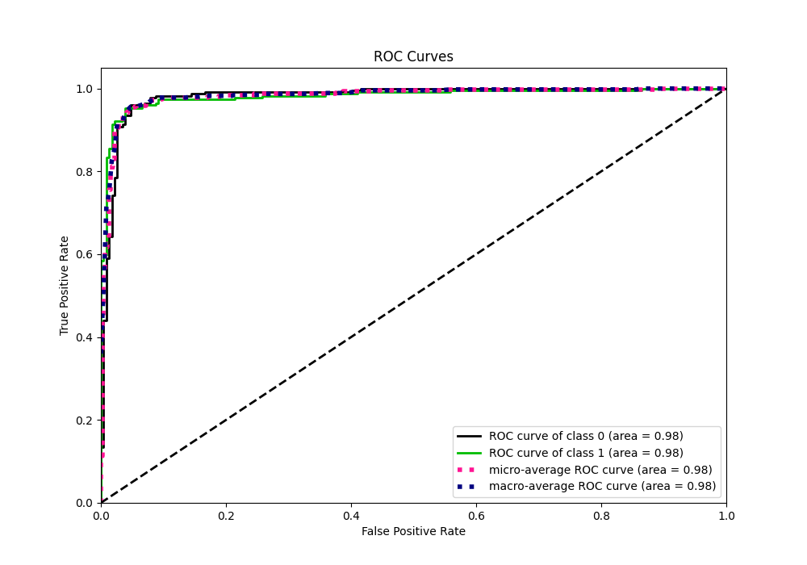
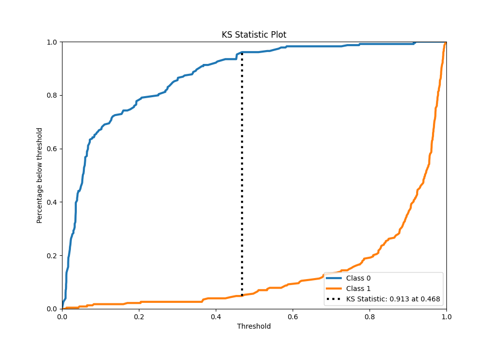
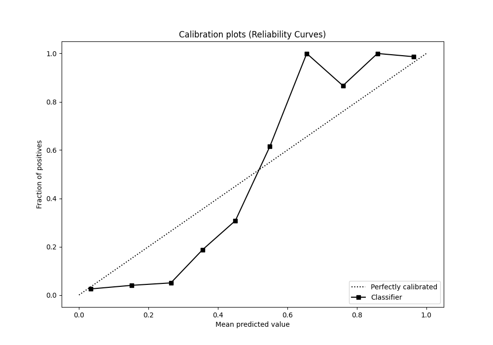
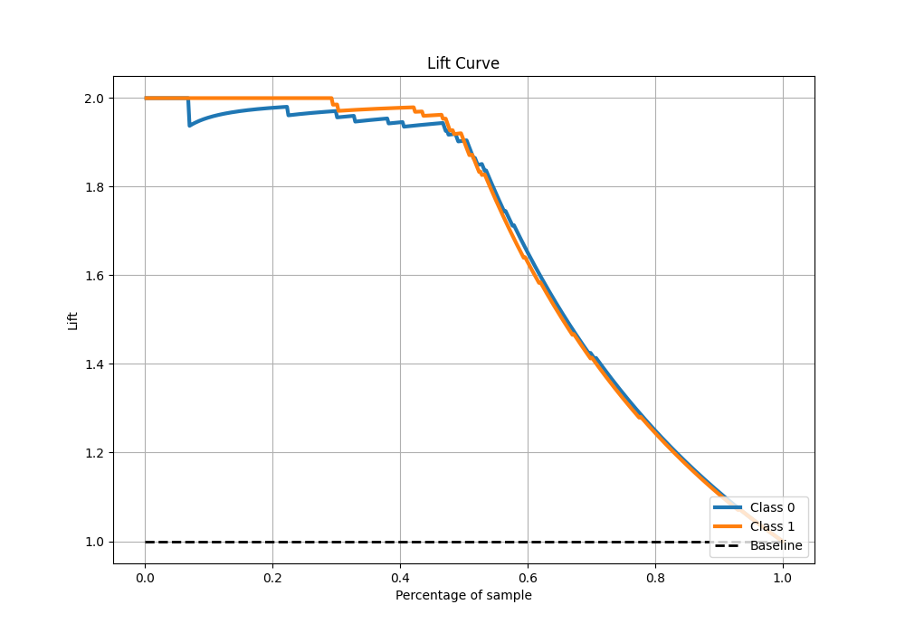

# Summary of 35_LightGBM

[<< Go back](../README.md)

## LightGBM
- **n_jobs**: -1
- **objective**: binary
- **num_leaves**: 15
- **learning_rate**: 0.05
- **feature_fraction**: 0.5
- **bagging_fraction**: 0.5
- **min_data_in_leaf**: 50
- **metric**: auc
- **custom_eval_metric_name**: None
- **explain_level**: 1

## Validation
 - **validation_type**: kfold
 - **k_folds**: 5
 - **shuffle**: True
 - **stratify**: True

## Optimized metric
auc

## Training time

24.7 seconds

## Metric details
|           |    score |    threshold |
|:----------|---------:|-------------:|
| logloss   | 0.185302 | nan          |
| auc       | 0.981865 | nan          |
| f1        | 0.951965 |   0.458253   |
| accuracy  | 0.951965 |   0.458253   |
| precision | 1        |   0.921568   |
| recall    | 1        |   0.00311882 |
| mcc       | 0.904068 |   0.503278   |

## Metric details with threshold from accuracy metric
|           |    score |   threshold |
|:----------|---------:|------------:|
| logloss   | 0.185302 |  nan        |
| auc       | 0.981865 |  nan        |
| f1        | 0.951965 |    0.458253 |
| accuracy  | 0.951965 |    0.458253 |
| precision | 0.951965 |    0.458253 |
| recall    | 0.951965 |    0.458253 |
| mcc       | 0.90393  |    0.458253 |

## Confusion matrix (at threshold=0.458253)
|              |   Predicted as 0 |   Predicted as 1 |
|:-------------|-----------------:|-----------------:|
| Labeled as 0 |              218 |               11 |
| Labeled as 1 |               11 |              218 |

## Learning curves

## Permutation-based Importance

## Confusion Matrix

## Normalized Confusion Matrix

## ROC Curve

## Kolmogorov-Smirnov Statistic

## Precision-Recall Curve

## Calibration Curve

## Cumulative Gains Curve

## Lift Curve

[<< Go back](../README.md)
