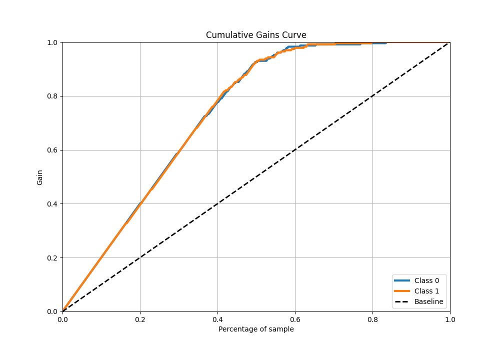

# Summary of 39_NeuralNetwork

[<< Go back](../README.md)

## Neural Network
- **n_jobs**: -1
- **dense_1_size**: 32
- **dense_2_size**: 32
- **learning_rate**: 0.01
- **explain_level**: 1

## Validation
 - **validation_type**: kfold
 - **k_folds**: 5
 - **shuffle**: True
 - **stratify**: True

## Optimized metric
auc

## Training time

24.1 seconds

## Metric details
|           |    score |     threshold |
|:----------|---------:|--------------:|
| logloss   | 0.24037  | nan           |
| auc       | 0.973742 | nan           |
| f1        | 0.926407 |   0.540293    |
| accuracy  | 0.925764 |   0.540293    |
| precision | 1        |   0.983783    |
| recall    | 1        |   1.60164e-05 |
| mcc       | 0.851658 |   0.540293    |

## Metric details with threshold from accuracy metric
|           |    score |   threshold |
|:----------|---------:|------------:|
| logloss   | 0.24037  |  nan        |
| auc       | 0.973742 |  nan        |
| f1        | 0.926407 |    0.540293 |
| accuracy  | 0.925764 |    0.540293 |
| precision | 0.918455 |    0.540293 |
| recall    | 0.934498 |    0.540293 |
| mcc       | 0.851658 |    0.540293 |

## Confusion matrix (at threshold=0.540293)
|              |   Predicted as 0 |   Predicted as 1 |
|:-------------|-----------------:|-----------------:|
| Labeled as 0 |              210 |               19 |
| Labeled as 1 |               15 |              214 |

## Learning curves

## Permutation-based Importance

## Confusion Matrix

## Normalized Confusion Matrix

## ROC Curve

## Kolmogorov-Smirnov Statistic

## Precision-Recall Curve

## Calibration Curve

## Cumulative Gains Curve

## Lift Curve

[<< Go back](../README.md)
