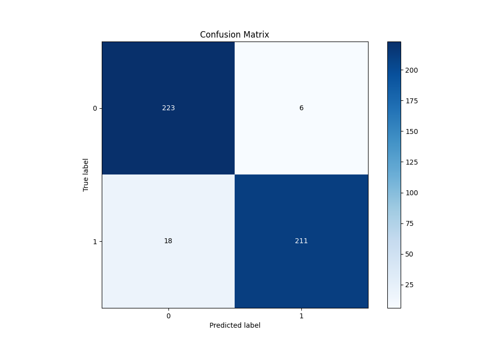

# Summary of 42_Xgboost

[<< Go back](../README.md)

## Extreme Gradient Boosting (Xgboost)
- **n_jobs**: -1
- **objective**: binary:logistic
- **eta**: 0.075
- **max_depth**: 8
- **min_child_weight**: 10
- **subsample**: 1.0
- **colsample_bytree**: 1.0
- **eval_metric**: auc
- **explain_level**: 1

## Validation
 - **validation_type**: kfold
 - **k_folds**: 5
 - **shuffle**: True
 - **stratify**: True

## Optimized metric
auc

## Training time

24.3 seconds

## Metric details
|           |    score |   threshold |
|:----------|---------:|------------:|
| logloss   | 0.217621 | nan         |
| auc       | 0.982113 | nan         |
| f1        | 0.946188 |   0.587071  |
| accuracy  | 0.947598 |   0.587071  |
| precision | 1        |   0.849827  |
| recall    | 1        |   0.0153814 |
| mcc       | 0.89739  |   0.592292  |

## Metric details with threshold from accuracy metric
|           |    score |   threshold |
|:----------|---------:|------------:|
| logloss   | 0.217621 |  nan        |
| auc       | 0.982113 |  nan        |
| f1        | 0.946188 |    0.587071 |
| accuracy  | 0.947598 |    0.587071 |
| precision | 0.97235  |    0.587071 |
| recall    | 0.921397 |    0.587071 |
| mcc       | 0.896428 |    0.587071 |

## Confusion matrix (at threshold=0.587071)
|              |   Predicted as 0 |   Predicted as 1 |
|:-------------|-----------------:|-----------------:|
| Labeled as 0 |              223 |                6 |
| Labeled as 1 |               18 |              211 |

## Learning curves

## Permutation-based Importance

## Confusion Matrix

## Normalized Confusion Matrix

## ROC Curve

## Kolmogorov-Smirnov Statistic

## Precision-Recall Curve

## Calibration Curve

## Cumulative Gains Curve

## Lift Curve

[<< Go back](../README.md)
