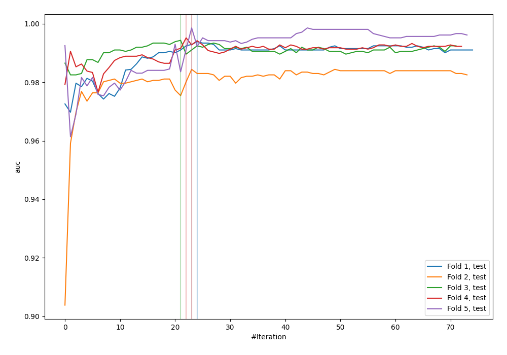
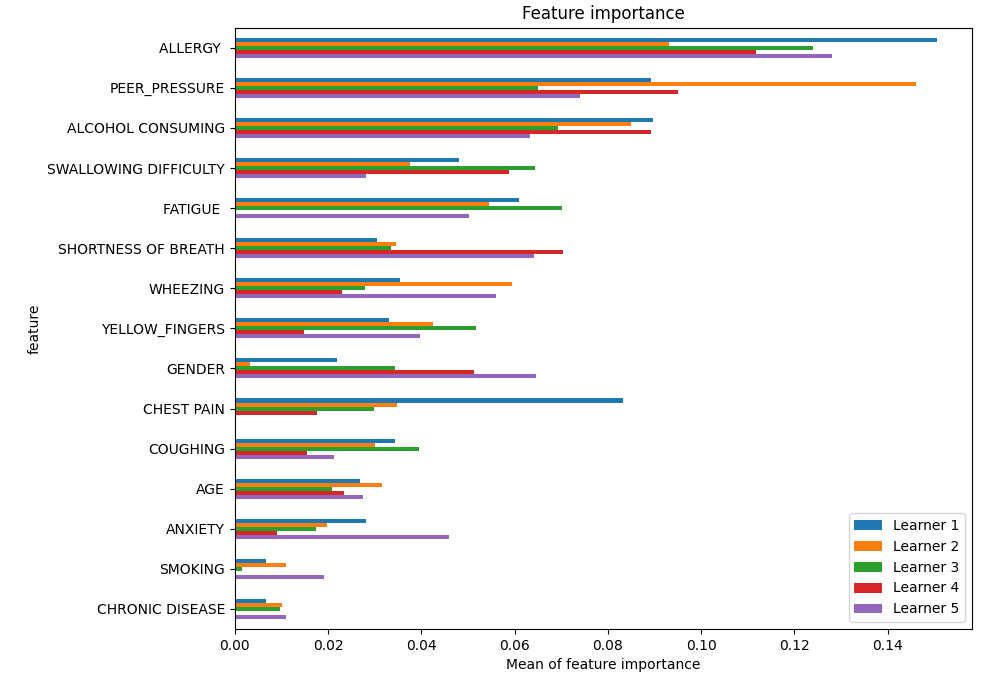
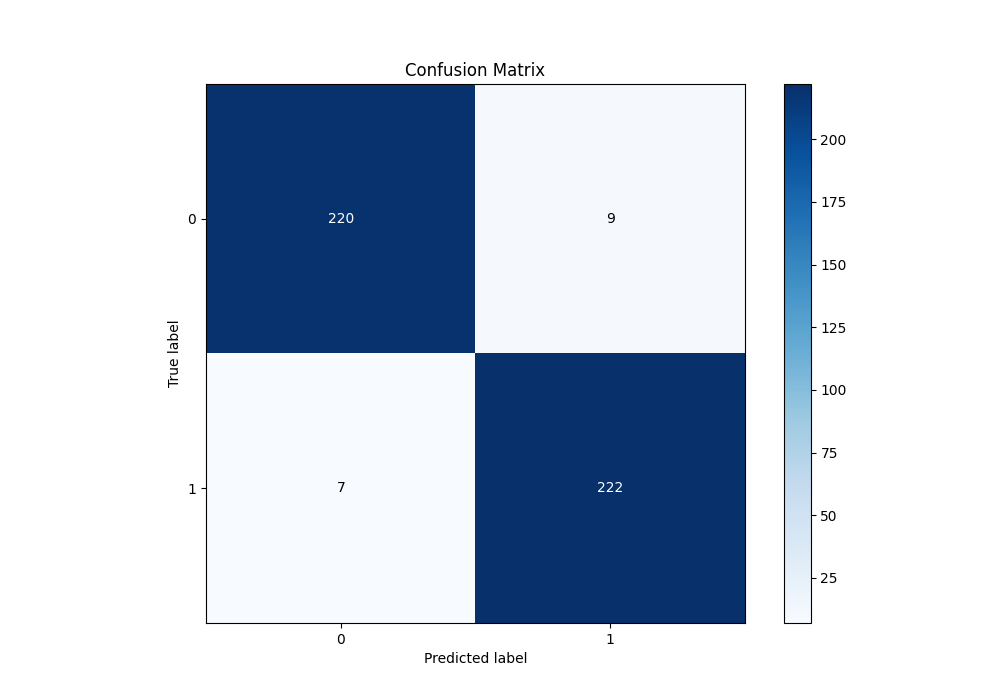
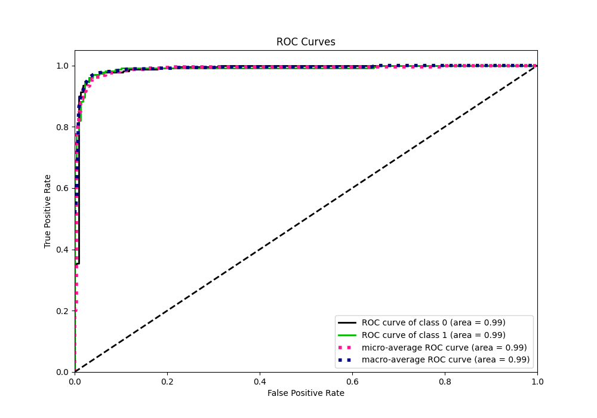
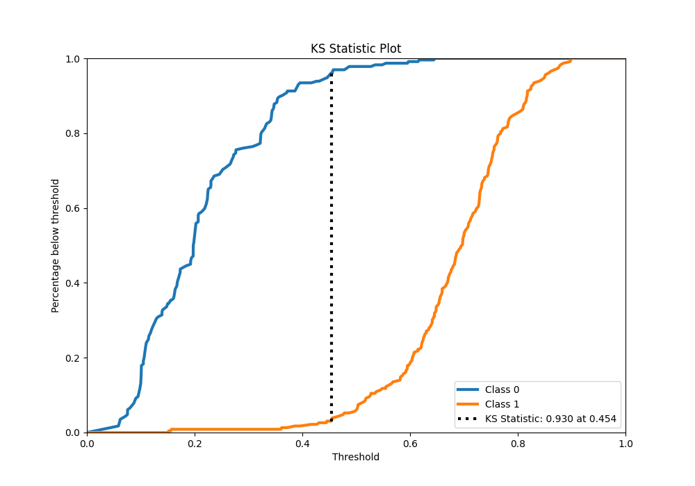
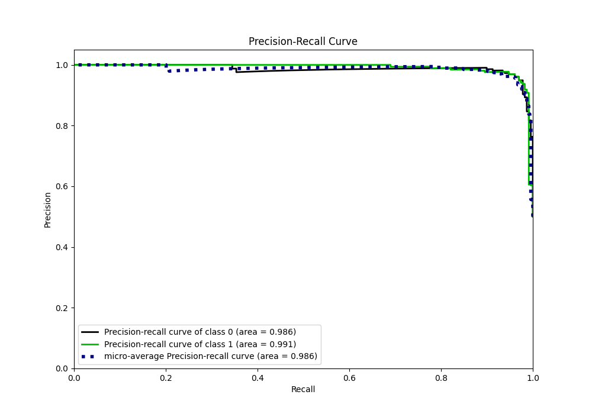
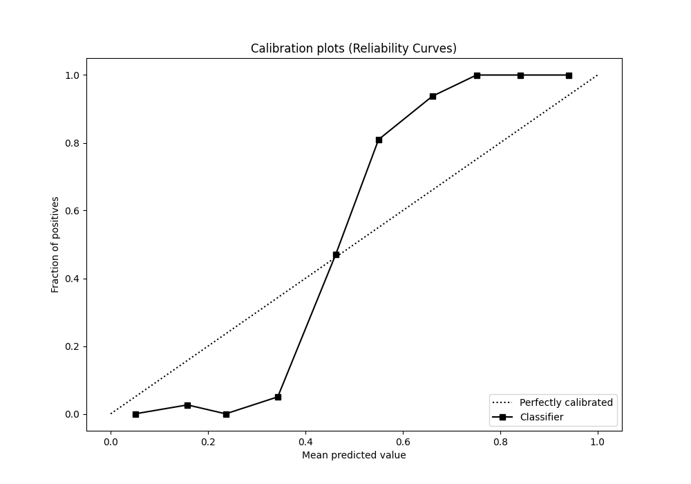
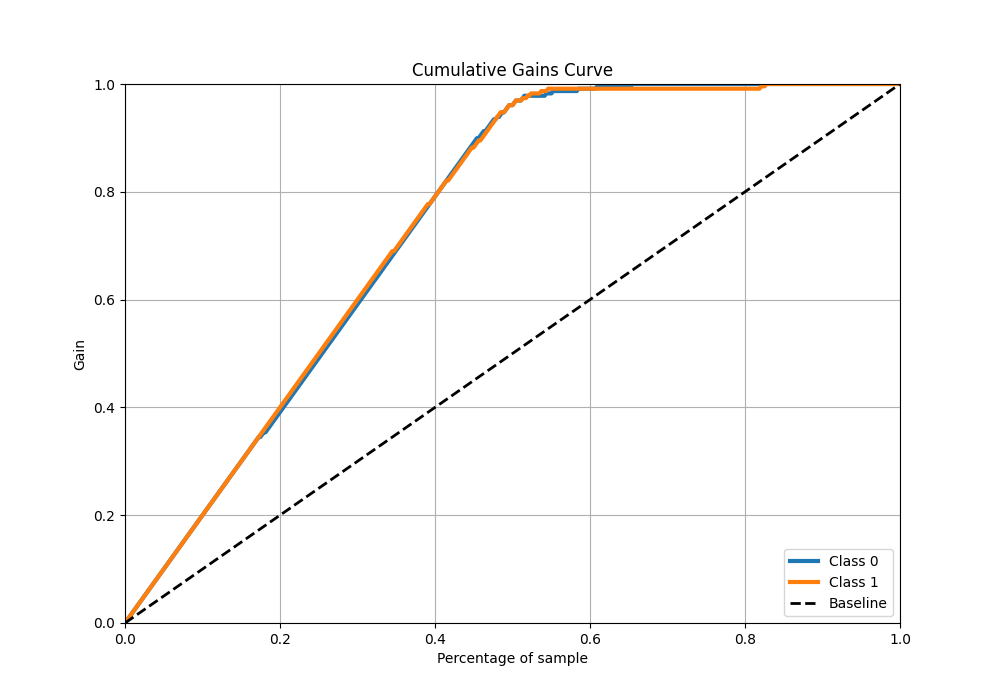
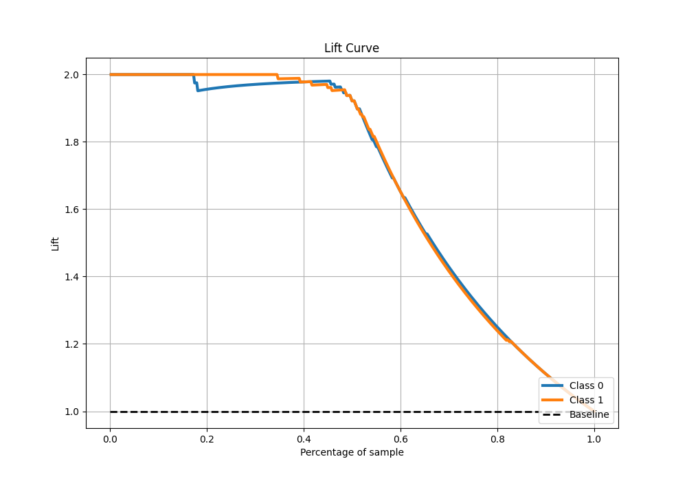

# Summary of 45_CatBoost

[<< Go back](../README.md)

## CatBoost
- **n_jobs**: -1
- **learning_rate**: 0.1
- **depth**: 8
- **rsm**: 0.9
- **loss_function**: Logloss
- **eval_metric**: AUC
- **explain_level**: 1

## Validation
 - **validation_type**: kfold
 - **k_folds**: 5
 - **shuffle**: True
 - **stratify**: True

## Optimized metric
auc

## Training time

26.0 seconds

## Metric details
|           |    score |   threshold |
|:----------|---------:|------------:|
| logloss   | 0.328034 | nan         |
| auc       | 0.989035 | nan         |
| f1        | 0.965217 |   0.453659  |
| accuracy  | 0.965066 |   0.453659  |
| precision | 1        |   0.645308  |
| recall    | 1        |   0.0526449 |
| mcc       | 0.930166 |   0.453659  |

## Metric details with threshold from accuracy metric
|           |    score |   threshold |
|:----------|---------:|------------:|
| logloss   | 0.328034 |  nan        |
| auc       | 0.989035 |  nan        |
| f1        | 0.965217 |    0.453659 |
| accuracy  | 0.965066 |    0.453659 |
| precision | 0.961039 |    0.453659 |
| recall    | 0.969432 |    0.453659 |
| mcc       | 0.930166 |    0.453659 |

## Confusion matrix (at threshold=0.453659)
|              |   Predicted as 0 |   Predicted as 1 |
|:-------------|-----------------:|-----------------:|
| Labeled as 0 |              220 |                9 |
| Labeled as 1 |                7 |              222 |

## Learning curves

## Permutation-based Importance

## Confusion Matrix

## Normalized Confusion Matrix

## ROC Curve

## Kolmogorov-Smirnov Statistic

## Precision-Recall Curve

## Calibration Curve

## Cumulative Gains Curve

## Lift Curve

[<< Go back](../README.md)
