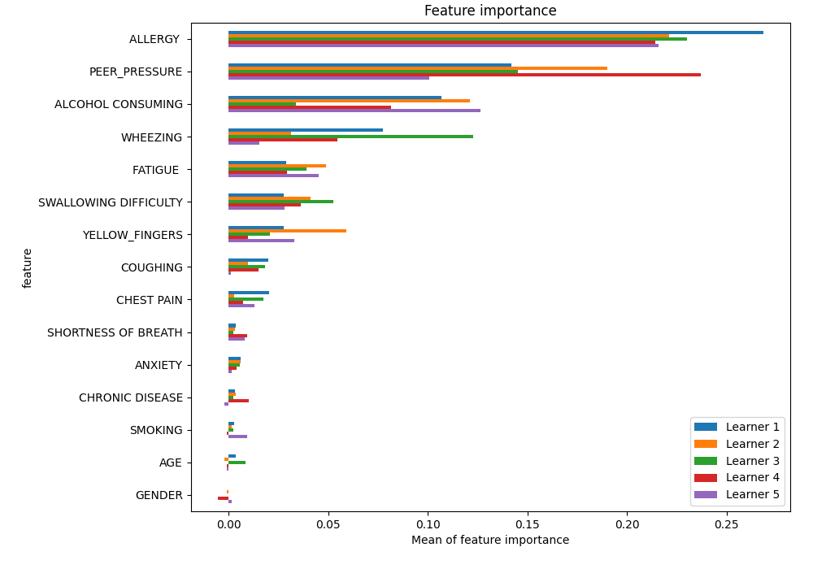
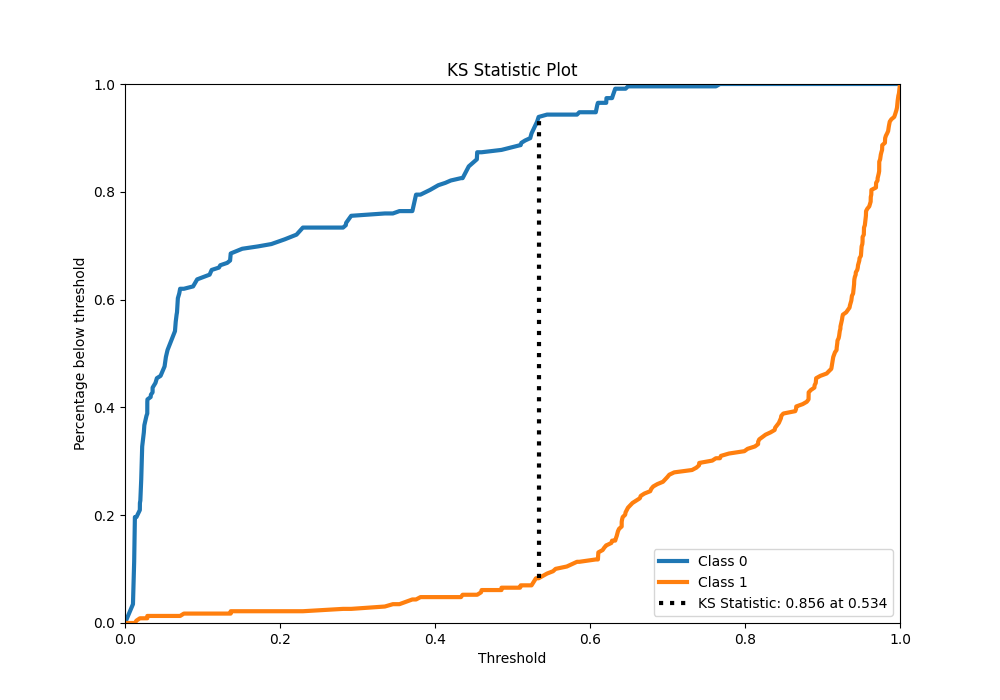
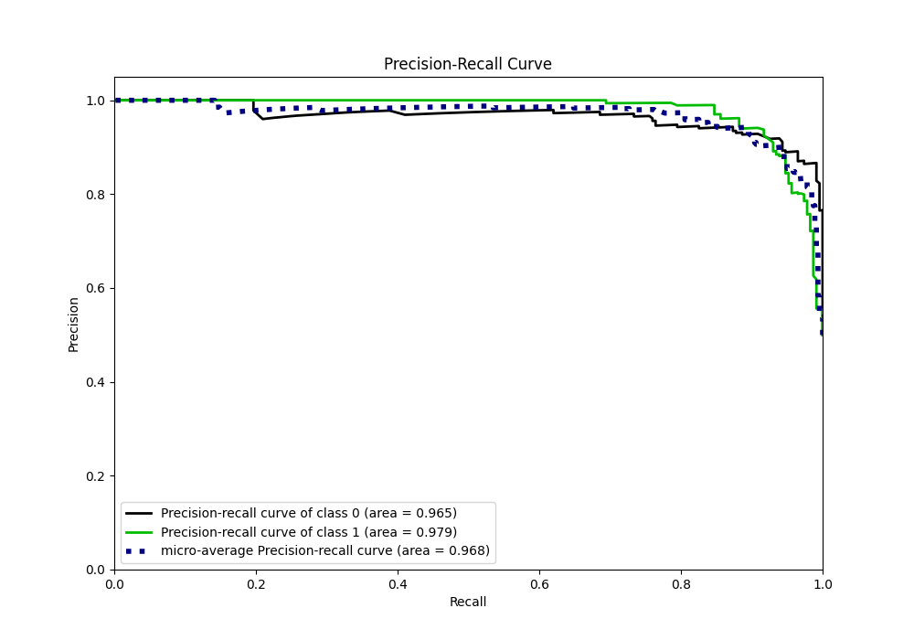

# Summary of 6_Default_RandomForest

[<< Go back](../README.md)

## Random Forest
- **n_jobs**: -1
- **criterion**: gini
- **max_features**: 0.9
- **min_samples_split**: 30
- **max_depth**: 4
- **eval_metric_name**: auc
- **explain_level**: 1

## Validation
 - **validation_type**: kfold
 - **k_folds**: 5
 - **shuffle**: True
 - **stratify**: True

## Optimized metric
auc

## Training time

33.7 seconds

## Metric details
|           |    score |    threshold |
|:----------|---------:|-------------:|
| logloss   | 0.24406  | nan          |
| auc       | 0.973103 | nan          |
| f1        | 0.927152 |   0.533695   |
| accuracy  | 0.927948 |   0.533695   |
| precision | 1        |   0.789259   |
| recall    | 1        |   0.00924381 |
| mcc       | 0.856099 |   0.533695   |

## Metric details with threshold from accuracy metric
|           |    score |   threshold |
|:----------|---------:|------------:|
| logloss   | 0.24406  |  nan        |
| auc       | 0.973103 |  nan        |
| f1        | 0.927152 |    0.533695 |
| accuracy  | 0.927948 |    0.533695 |
| precision | 0.9375   |    0.533695 |
| recall    | 0.917031 |    0.533695 |
| mcc       | 0.856099 |    0.533695 |

## Confusion matrix (at threshold=0.533695)
|              |   Predicted as 0 |   Predicted as 1 |
|:-------------|-----------------:|-----------------:|
| Labeled as 0 |              215 |               14 |
| Labeled as 1 |               19 |              210 |

## Learning curves

## Permutation-based Importance

## Confusion Matrix

## Normalized Confusion Matrix

## ROC Curve

## Kolmogorov-Smirnov Statistic

## Precision-Recall Curve

## Calibration Curve

## Cumulative Gains Curve

## Lift Curve

[<< Go back](../README.md)
