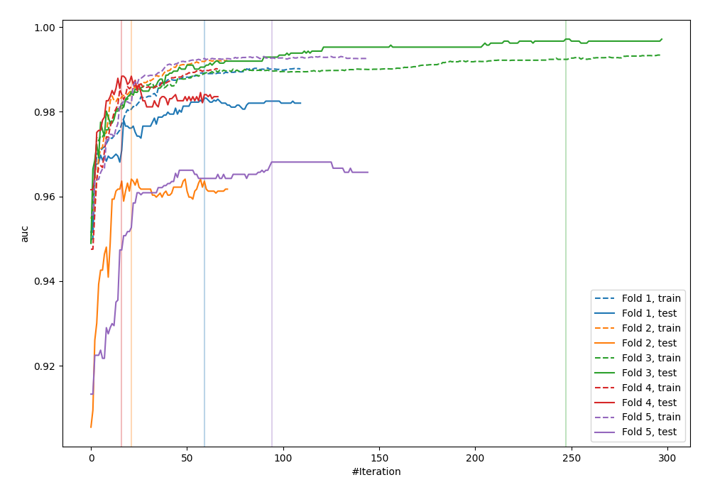
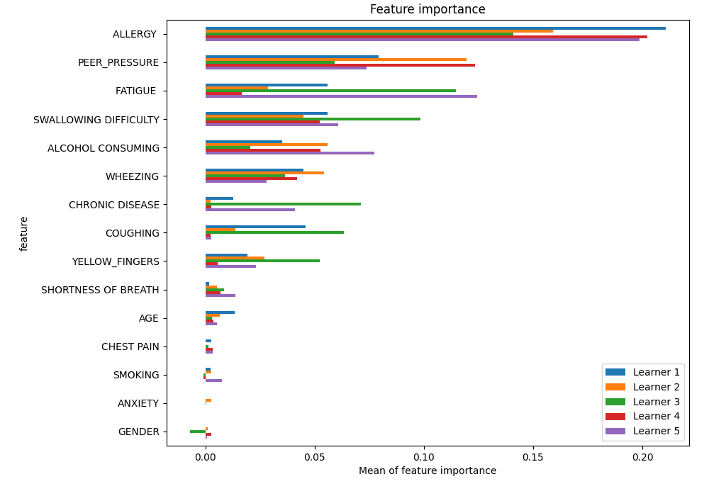

# Summary of 7_Xgboost

[<< Go back](../README.md)

## Extreme Gradient Boosting (Xgboost)
- **n_jobs**: -1
- **objective**: binary:logistic
- **eta**: 0.075
- **max_depth**: 8
- **min_child_weight**: 5
- **subsample**: 1.0
- **colsample_bytree**: 1.0
- **eval_metric**: auc
- **explain_level**: 1

## Validation
 - **validation_type**: kfold
 - **k_folds**: 5
 - **shuffle**: True
 - **stratify**: True

## Optimized metric
auc

## Training time

33.2 seconds

## Metric details
|           |    score |    threshold |
|:----------|---------:|-------------:|
| logloss   | 0.231259 | nan          |
| auc       | 0.977909 | nan          |
| f1        | 0.944206 |   0.446865   |
| accuracy  | 0.943231 |   0.446865   |
| precision | 1        |   0.914193   |
| recall    | 1        |   0.00285144 |
| mcc       | 0.887004 |   0.446865   |

## Metric details with threshold from accuracy metric
|           |    score |   threshold |
|:----------|---------:|------------:|
| logloss   | 0.231259 |  nan        |
| auc       | 0.977909 |  nan        |
| f1        | 0.944206 |    0.446865 |
| accuracy  | 0.943231 |    0.446865 |
| precision | 0.92827  |    0.446865 |
| recall    | 0.960699 |    0.446865 |
| mcc       | 0.887004 |    0.446865 |

## Confusion matrix (at threshold=0.446865)
|              |   Predicted as 0 |   Predicted as 1 |
|:-------------|-----------------:|-----------------:|
| Labeled as 0 |              212 |               17 |
| Labeled as 1 |                9 |              220 |

## Learning curves

## Permutation-based Importance

## Confusion Matrix

## Normalized Confusion Matrix

## ROC Curve

## Kolmogorov-Smirnov Statistic

## Precision-Recall Curve

## Calibration Curve

## Cumulative Gains Curve

## Lift Curve

[<< Go back](../README.md)
