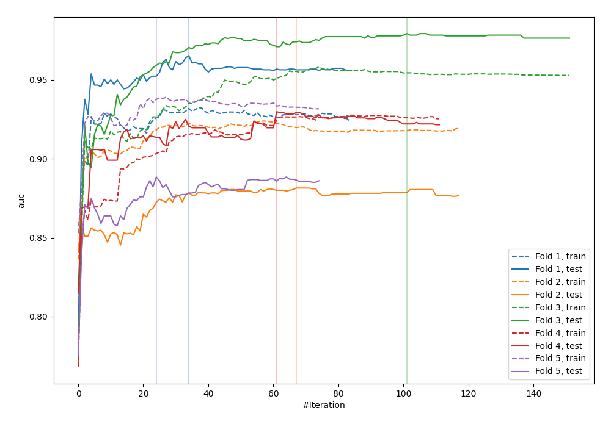
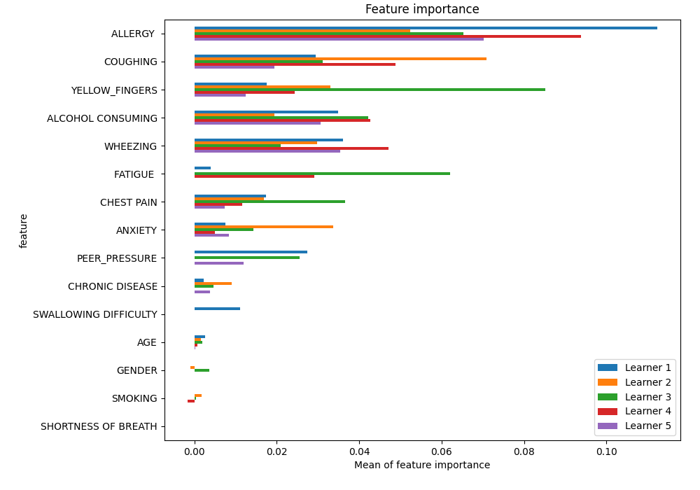
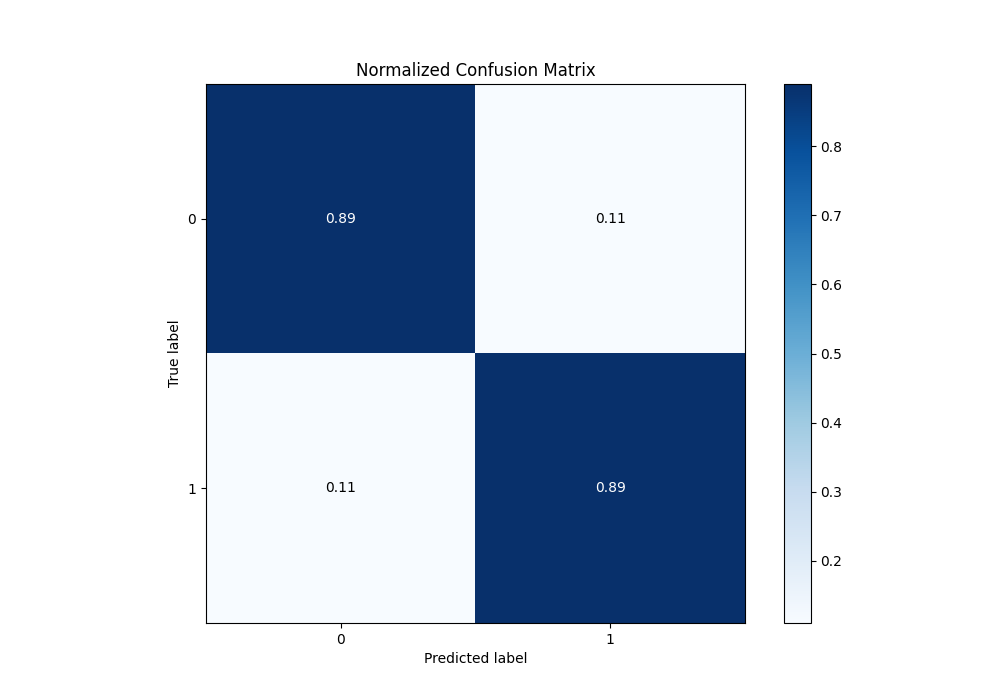
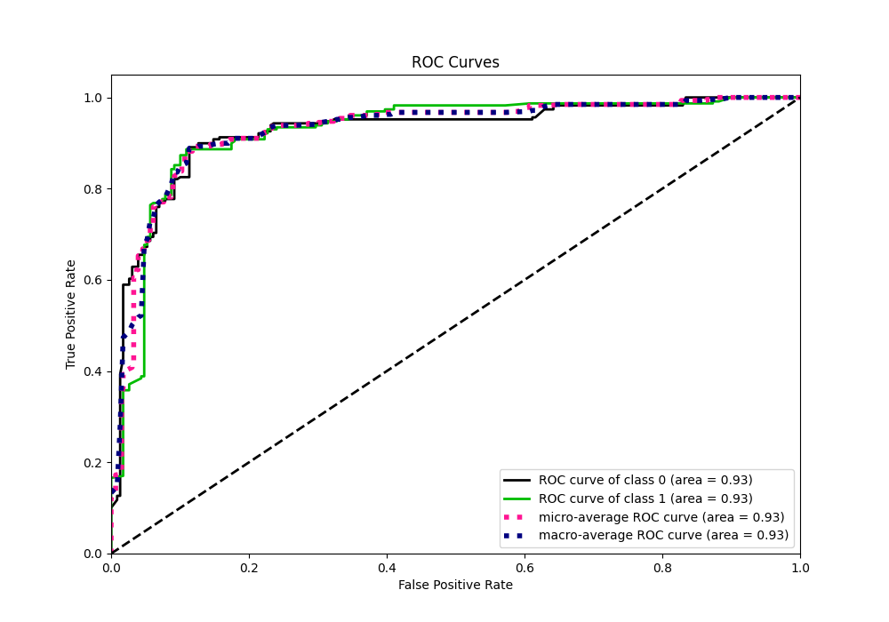
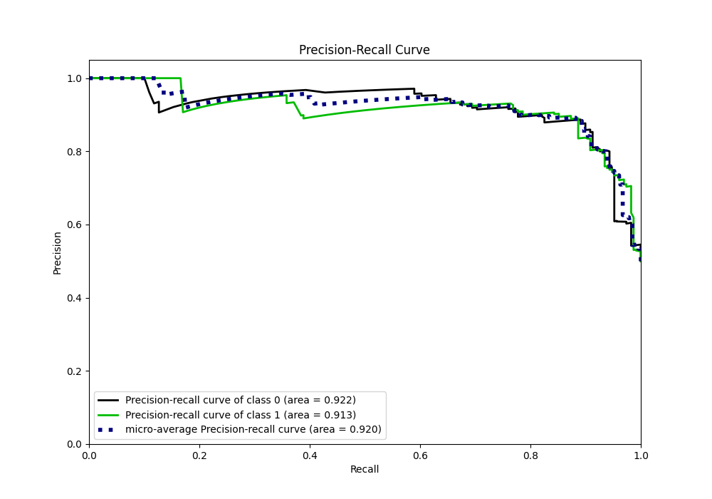
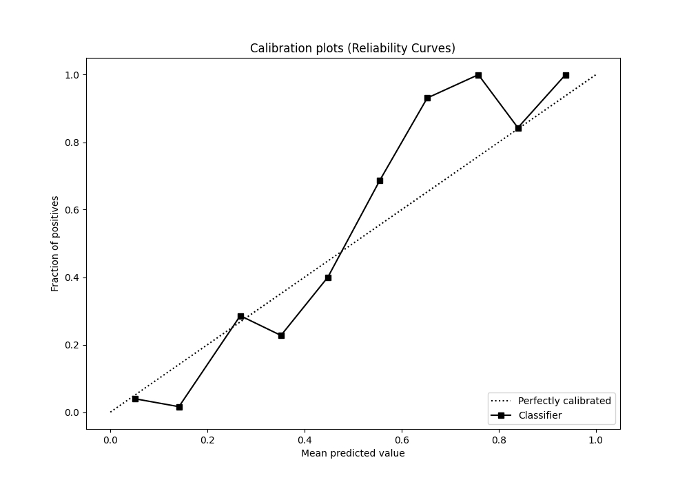
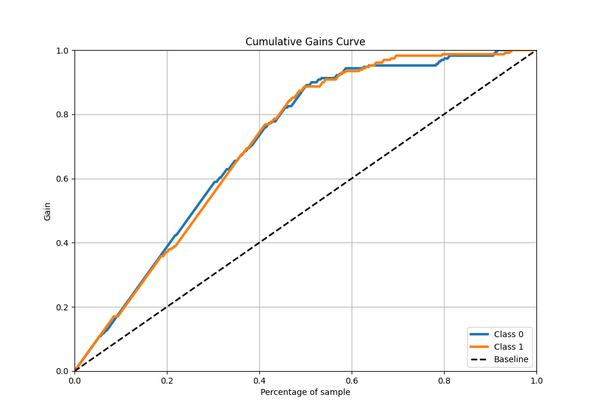
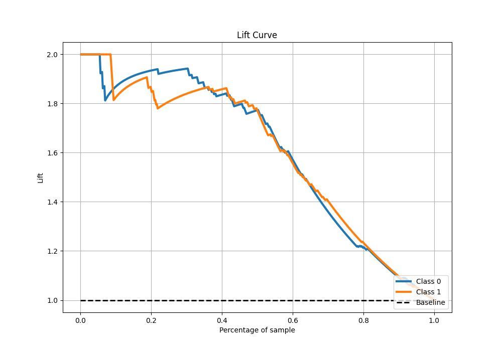

# Summary of 9_Xgboost

[<< Go back](../README.md)

## Extreme Gradient Boosting (Xgboost)
- **n_jobs**: -1
- **objective**: binary:logistic
- **eta**: 0.1
- **max_depth**: 7
- **min_child_weight**: 25
- **subsample**: 0.9
- **colsample_bytree**: 0.6
- **eval_metric**: auc
- **explain_level**: 1

## Validation
 - **validation_type**: kfold
 - **k_folds**: 5
 - **shuffle**: True
 - **stratify**: True

## Optimized metric
auc

## Training time

26.1 seconds

## Metric details
|           |    score |   threshold |
|:----------|---------:|------------:|
| logloss   | 0.395501 | nan         |
| auc       | 0.92502  | nan         |
| f1        | 0.886463 |   0.492004  |
| accuracy  | 0.886463 |   0.492004  |
| precision | 0.952941 |   0.795436  |
| recall    | 1        |   0.0838541 |
| mcc       | 0.772926 |   0.492004  |

## Metric details with threshold from accuracy metric
|           |    score |   threshold |
|:----------|---------:|------------:|
| logloss   | 0.395501 |  nan        |
| auc       | 0.92502  |  nan        |
| f1        | 0.886463 |    0.492004 |
| accuracy  | 0.886463 |    0.492004 |
| precision | 0.886463 |    0.492004 |
| recall    | 0.886463 |    0.492004 |
| mcc       | 0.772926 |    0.492004 |

## Confusion matrix (at threshold=0.492004)
|              |   Predicted as 0 |   Predicted as 1 |
|:-------------|-----------------:|-----------------:|
| Labeled as 0 |              203 |               26 |
| Labeled as 1 |               26 |              203 |

## Learning curves

## Permutation-based Importance

## Confusion Matrix

## Normalized Confusion Matrix

## ROC Curve

## Kolmogorov-Smirnov Statistic

## Precision-Recall Curve

## Calibration Curve

## Cumulative Gains Curve

## Lift Curve

[<< Go back](../README.md)
