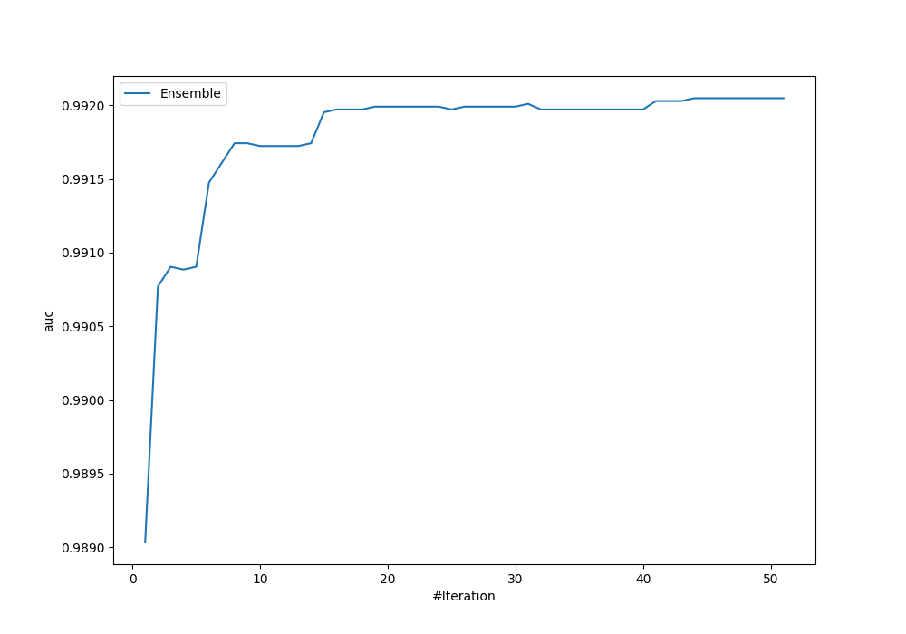
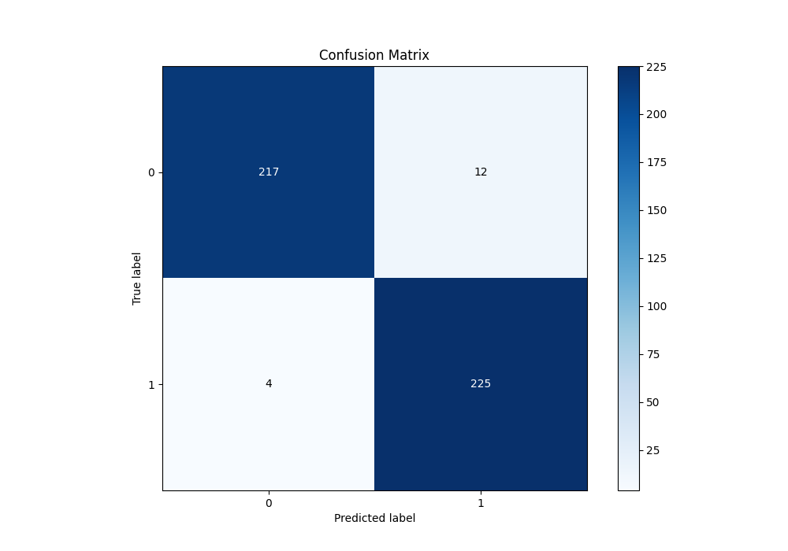
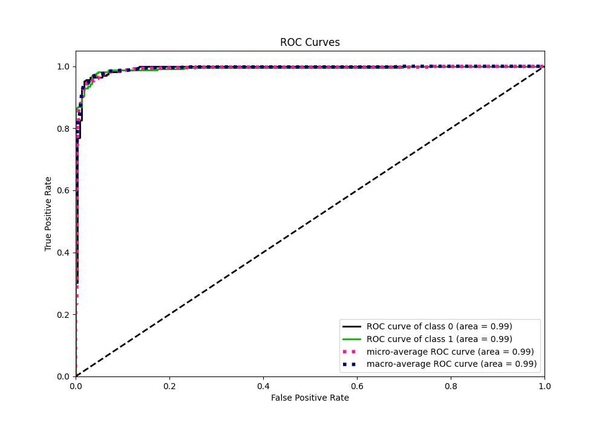
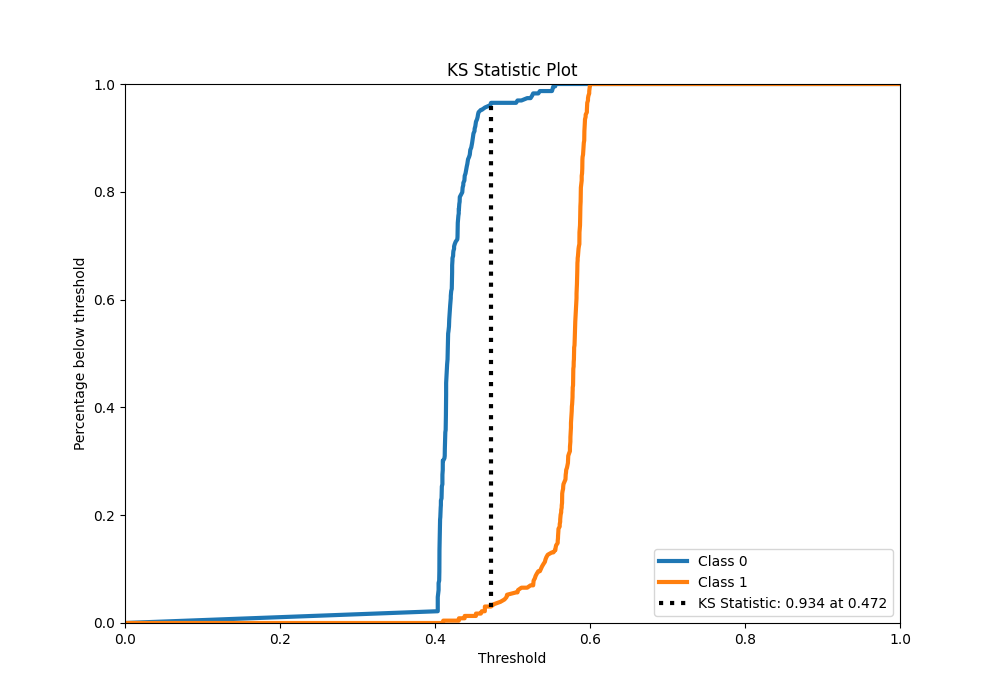
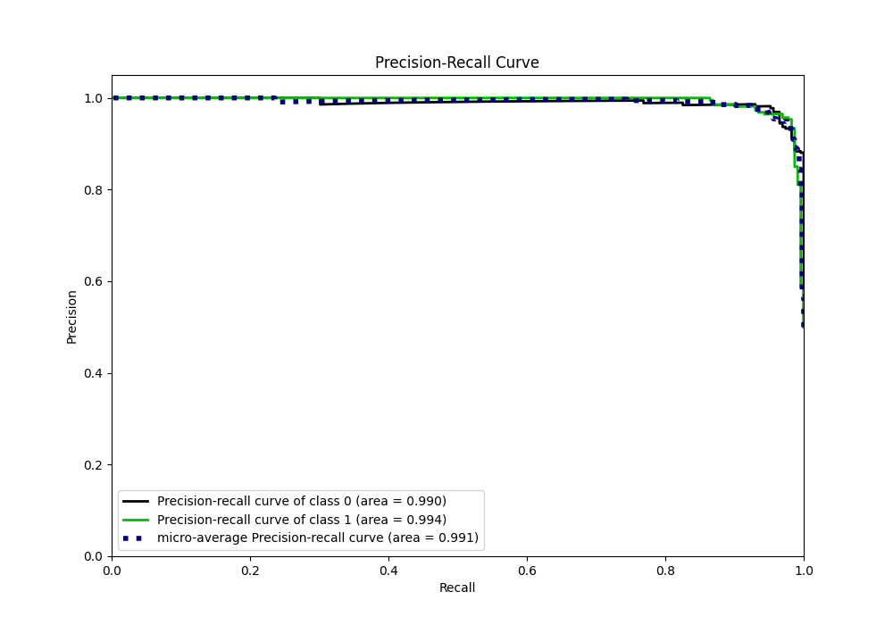
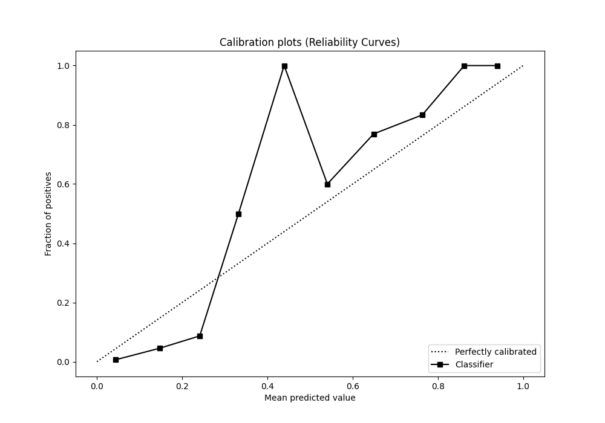
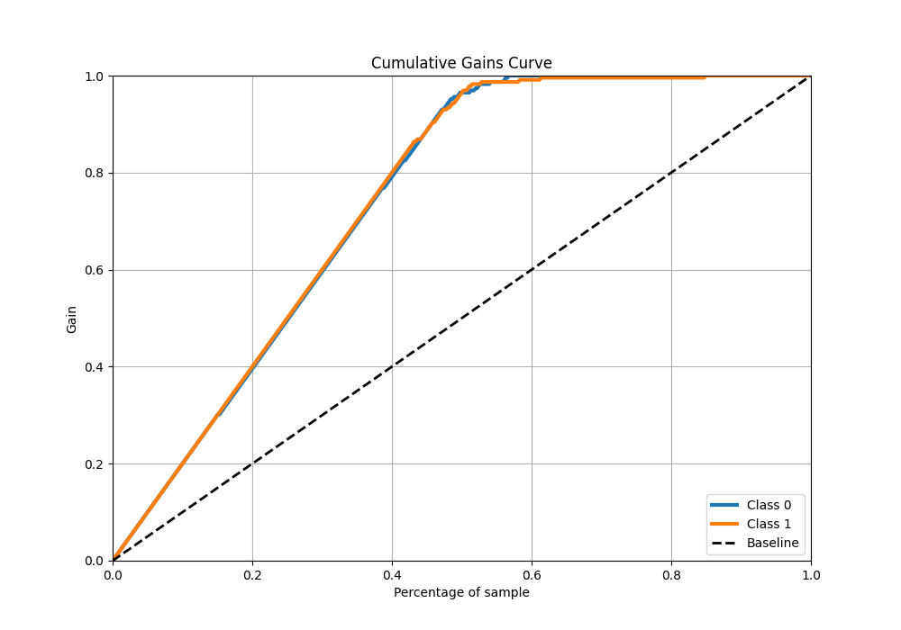
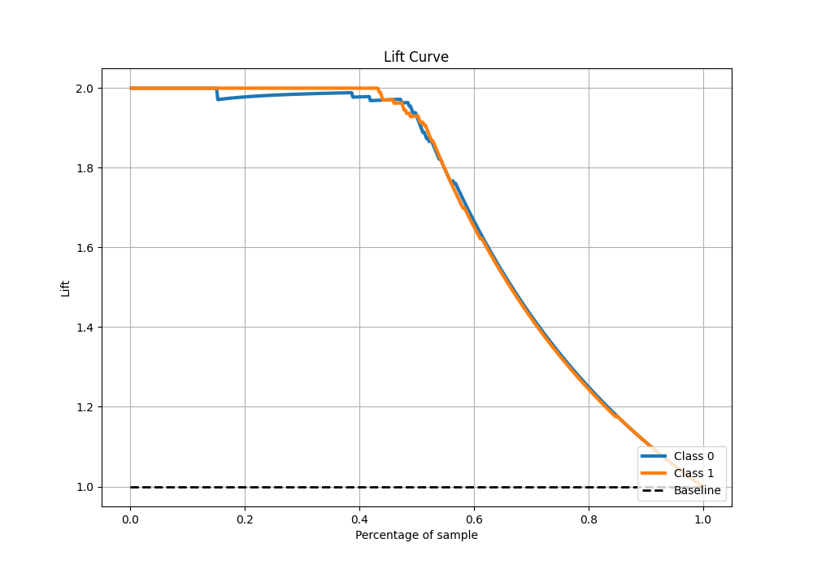

# Summary of Ensemble

[<< Go back](../README.md)

## Ensemble structure
| Model                             |   Weight |
|:----------------------------------|---------:|
| 10_Xgboost                        |       38 |
| 14_LightGBM                       |        1 |
| 18_CatBoost_GoldenFeatures        |        1 |
| 30_CatBoost_GoldenFeatures        |        1 |
| 45_CatBoost                       |        5 |
| 4_Default_CatBoost_GoldenFeatures |        1 |
| 5_Default_NeuralNetwork           |        2 |

## Metric details
|           |    score |   threshold |
|:----------|---------:|------------:|
| logloss   | 0.558281 |  nan        |
| auc       | 0.992048 |  nan        |
| f1        | 0.965665 |    0.457701 |
| accuracy  | 0.965066 |    0.457701 |
| precision | 1        |    0.555966 |
| recall    | 1        |    0.363202 |
| mcc       | 0.930699 |    0.457701 |

## Metric details with threshold from accuracy metric
|           |    score |   threshold |
|:----------|---------:|------------:|
| logloss   | 0.558281 |  nan        |
| auc       | 0.992048 |  nan        |
| f1        | 0.965665 |    0.457701 |
| accuracy  | 0.965066 |    0.457701 |
| precision | 0.949367 |    0.457701 |
| recall    | 0.982533 |    0.457701 |
| mcc       | 0.930699 |    0.457701 |

## Confusion matrix (at threshold=0.457701)
|              |   Predicted as 0 |   Predicted as 1 |
|:-------------|-----------------:|-----------------:|
| Labeled as 0 |              217 |               12 |
| Labeled as 1 |                4 |              225 |

## Learning curves

## Confusion Matrix

## Normalized Confusion Matrix

## ROC Curve

## Kolmogorov-Smirnov Statistic

## Precision-Recall Curve

## Calibration Curve

## Cumulative Gains Curve

## Lift Curve

[<< Go back](../README.md)
