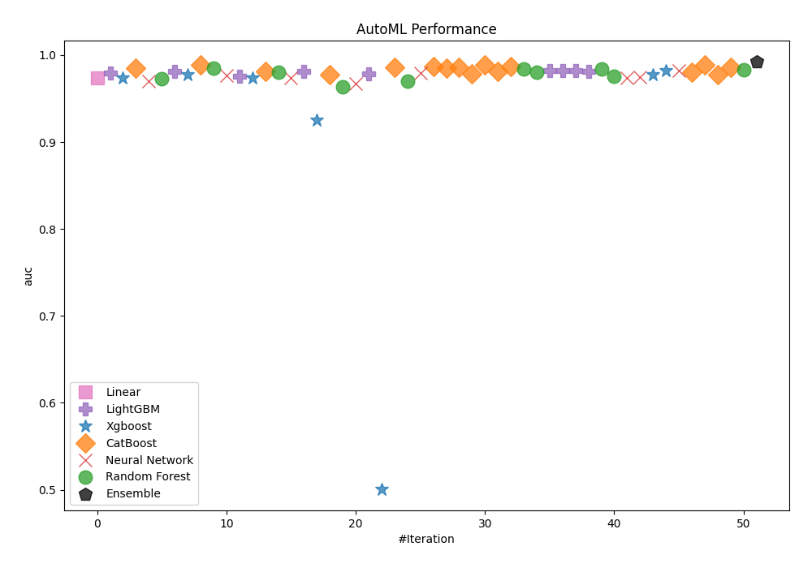
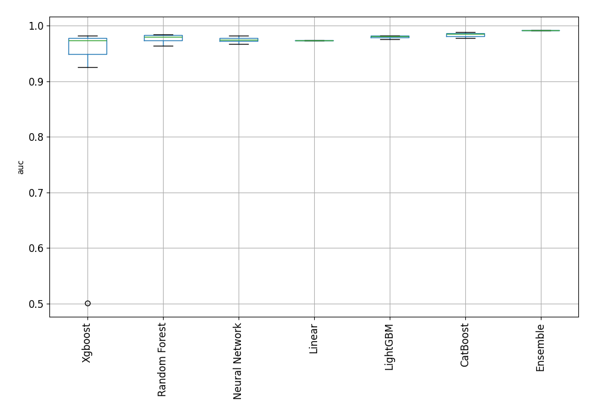
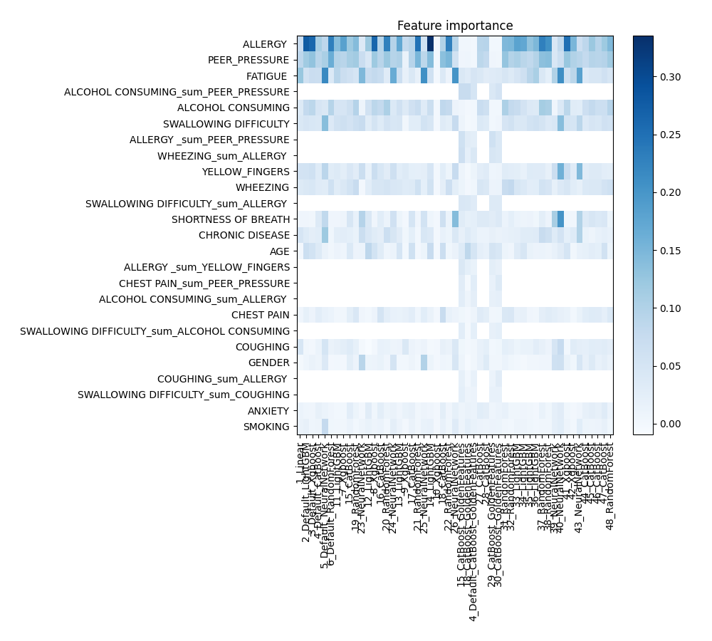
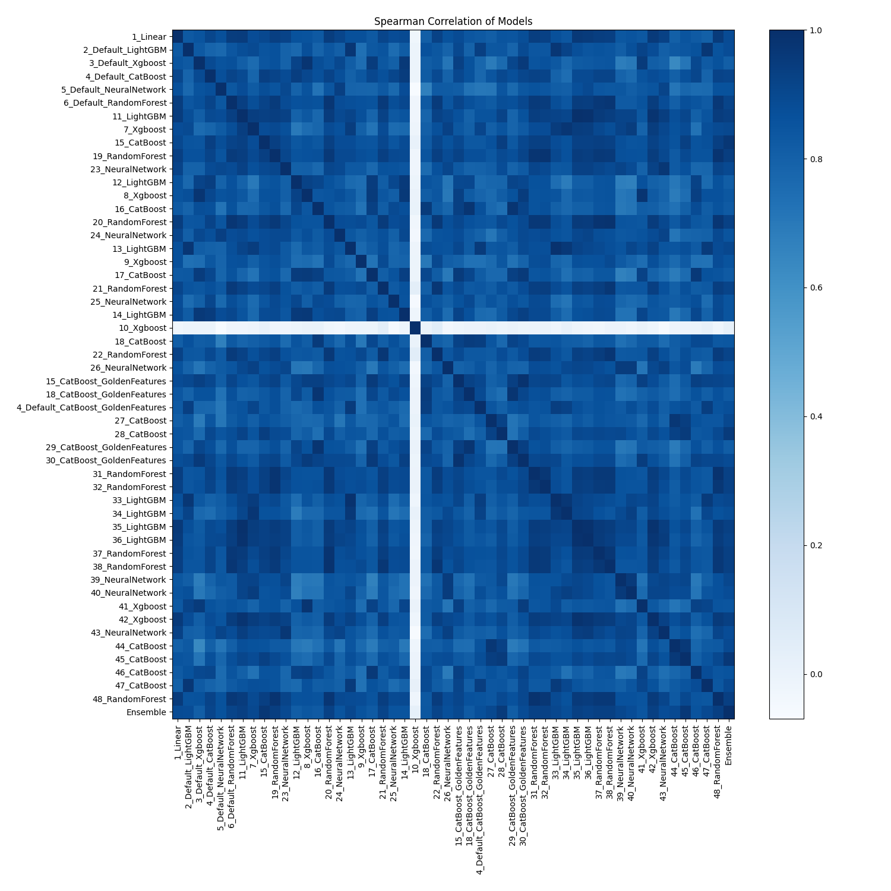

# AutoML Leaderboard

| Best model   | name                                                                             | model_type     | metric_type   |   metric_value |   train_time |   single_prediction_time |
|:-------------|:---------------------------------------------------------------------------------|:---------------|:--------------|---------------:|-------------:|-------------------------:|
|              | [1_Linear](1_Linear/README.md)                                                   | Linear         | auc           |       0.974028 |        39.39 |                   0.0305 |
|              | [2_Default_LightGBM](2_Default_LightGBM/README.md)                               | LightGBM       | auc           |       0.979291 |        28.3  |                   0.0166 |
|              | [3_Default_Xgboost](3_Default_Xgboost/README.md)                                 | Xgboost        | auc           |       0.973694 |        27.25 |                   0.0522 |
|              | [4_Default_CatBoost](4_Default_CatBoost/README.md)                               | CatBoost       | auc           |       0.985145 |        29.47 |                   0.032  |
|              | [5_Default_NeuralNetwork](5_Default_NeuralNetwork/README.md)                     | Neural Network | auc           |       0.969814 |        25.24 |                   0.0436 |
|              | [6_Default_RandomForest](6_Default_RandomForest/README.md)                       | Random Forest  | auc           |       0.973103 |        34.72 |                   0.4096 |
|              | [11_LightGBM](11_LightGBM/README.md)                                             | LightGBM       | auc           |       0.980817 |        27.84 |                   0.0151 |
|              | [7_Xgboost](7_Xgboost/README.md)                                                 | Xgboost        | auc           |       0.977909 |        34.37 |                   0.0211 |
|              | [15_CatBoost](15_CatBoost/README.md)                                             | CatBoost       | auc           |       0.988635 |        28.05 |                   0.0286 |
|              | [19_RandomForest](19_RandomForest/README.md)                                     | Random Forest  | auc           |       0.984726 |        33.73 |                   0.2163 |
|              | [23_NeuralNetwork](23_NeuralNetwork/README.md)                                   | Neural Network | auc           |       0.976917 |        24.98 |                   0.0343 |
|              | [12_LightGBM](12_LightGBM/README.md)                                             | LightGBM       | auc           |       0.97603  |        30.46 |                   0.0146 |
|              | [8_Xgboost](8_Xgboost/README.md)                                                 | Xgboost        | auc           |       0.974095 |        28.99 |                   0.0154 |
|              | [16_CatBoost](16_CatBoost/README.md)                                             | CatBoost       | auc           |       0.981064 |        27.86 |                   0.024  |
|              | [20_RandomForest](20_RandomForest/README.md)                                     | Random Forest  | auc           |       0.980073 |        33.44 |                   0.1226 |
|              | [24_NeuralNetwork](24_NeuralNetwork/README.md)                                   | Neural Network | auc           |       0.974066 |        30.74 |                   0.0395 |
|              | [13_LightGBM](13_LightGBM/README.md)                                             | LightGBM       | auc           |       0.981694 |        34.59 |                   0.0144 |
|              | [9_Xgboost](9_Xgboost/README.md)                                                 | Xgboost        | auc           |       0.92502  |        26.99 |                   0.0215 |
|              | [17_CatBoost](17_CatBoost/README.md)                                             | CatBoost       | auc           |       0.977537 |        25.68 |                   0.0187 |
|              | [21_RandomForest](21_RandomForest/README.md)                                     | Random Forest  | auc           |       0.963807 |        32.83 |                   0.147  |
|              | [25_NeuralNetwork](25_NeuralNetwork/README.md)                                   | Neural Network | auc           |       0.966877 |        28.99 |                   0.0331 |
|              | [14_LightGBM](14_LightGBM/README.md)                                             | LightGBM       | auc           |       0.978757 |        30.05 |                   0.0191 |
|              | [10_Xgboost](10_Xgboost/README.md)                                               | Xgboost        | auc           |       0.500868 |        29.36 |                   0.0173 |
|              | [18_CatBoost](18_CatBoost/README.md)                                             | CatBoost       | auc           |       0.985651 |        41.41 |                   0.024  |
|              | [22_RandomForest](22_RandomForest/README.md)                                     | Random Forest  | auc           |       0.969623 |        35.12 |                   0.2364 |
|              | [26_NeuralNetwork](26_NeuralNetwork/README.md)                                   | Neural Network | auc           |       0.979119 |        25.98 |                   0.0387 |
|              | [15_CatBoost_GoldenFeatures](15_CatBoost_GoldenFeatures/README.md)               | CatBoost       | auc           |       0.986785 |        34.02 |                   0.0374 |
|              | [18_CatBoost_GoldenFeatures](18_CatBoost_GoldenFeatures/README.md)               | CatBoost       | auc           |       0.985174 |        31.45 |                   0.0385 |
|              | [4_Default_CatBoost_GoldenFeatures](4_Default_CatBoost_GoldenFeatures/README.md) | CatBoost       | auc           |       0.986251 |        32    |                   0.0494 |
|              | [27_CatBoost](27_CatBoost/README.md)                                             | CatBoost       | auc           |       0.978795 |        34.5  |                   0.0844 |
|              | [28_CatBoost](28_CatBoost/README.md)                                             | CatBoost       | auc           |       0.989007 |        29.75 |                   0.0192 |
|              | [29_CatBoost_GoldenFeatures](29_CatBoost_GoldenFeatures/README.md)               | CatBoost       | auc           |       0.981675 |        26.7  |                   0.0404 |
|              | [30_CatBoost_GoldenFeatures](30_CatBoost_GoldenFeatures/README.md)               | CatBoost       | auc           |       0.986966 |        26.06 |                   0.037  |
|              | [31_RandomForest](31_RandomForest/README.md)                                     | Random Forest  | auc           |       0.983591 |        27.86 |                   0.175  |
|              | [32_RandomForest](32_RandomForest/README.md)                                     | Random Forest  | auc           |       0.98014  |        29.42 |                   0.1273 |
|              | [33_LightGBM](33_LightGBM/README.md)                                             | LightGBM       | auc           |       0.982275 |        25.12 |                   0.0123 |
|              | [34_LightGBM](34_LightGBM/README.md)                                             | LightGBM       | auc           |       0.982628 |        25.38 |                   0.011  |
|              | [35_LightGBM](35_LightGBM/README.md)                                             | LightGBM       | auc           |       0.981865 |        25.48 |                   0.0112 |
|              | [36_LightGBM](36_LightGBM/README.md)                                             | LightGBM       | auc           |       0.980979 |        25.31 |                   0.0144 |
|              | [37_RandomForest](37_RandomForest/README.md)                                     | Random Forest  | auc           |       0.983944 |        29.01 |                   0.1524 |
|              | [38_RandomForest](38_RandomForest/README.md)                                     | Random Forest  | auc           |       0.97604  |        28.58 |                   0.131  |
|              | [39_NeuralNetwork](39_NeuralNetwork/README.md)                                   | Neural Network | auc           |       0.973742 |        24.81 |                   0.0278 |
|              | [40_NeuralNetwork](40_NeuralNetwork/README.md)                                   | Neural Network | auc           |       0.974829 |        25.08 |                   0.0307 |
|              | [41_Xgboost](41_Xgboost/README.md)                                               | Xgboost        | auc           |       0.977212 |        25.37 |                   0.0142 |
|              | [42_Xgboost](42_Xgboost/README.md)                                               | Xgboost        | auc           |       0.982113 |        25.04 |                   0.0125 |
|              | [43_NeuralNetwork](43_NeuralNetwork/README.md)                                   | Neural Network | auc           |       0.982418 |        25.26 |                   0.0337 |
|              | [44_CatBoost](44_CatBoost/README.md)                                             | CatBoost       | auc           |       0.980674 |        25.63 |                   0.0148 |
|              | [45_CatBoost](45_CatBoost/README.md)                                             | CatBoost       | auc           |       0.989035 |        26.76 |                   0.0188 |
|              | [46_CatBoost](46_CatBoost/README.md)                                             | CatBoost       | auc           |       0.977537 |        28.33 |                   0.016  |
|              | [47_CatBoost](47_CatBoost/README.md)                                             | CatBoost       | auc           |       0.986251 |        27.24 |                   0.0216 |
|              | [48_RandomForest](48_RandomForest/README.md)                                     | Random Forest  | auc           |       0.983372 |        30.78 |                   0.1675 |
| **the best** | [Ensemble](Ensemble/README.md)                                                   | Ensemble       | auc           |       0.992048 |         7.78 |                   0.1767 |

### AutoML Performance

### AutoML Performance Boxplot

### Features Importance

### Spearman Correlation of Models

