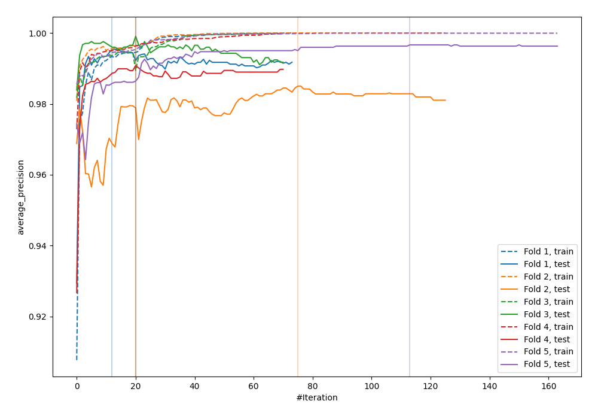
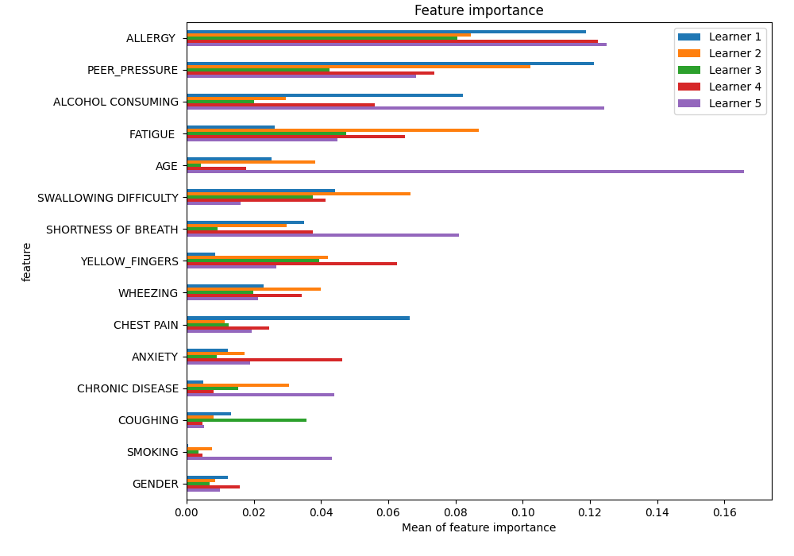
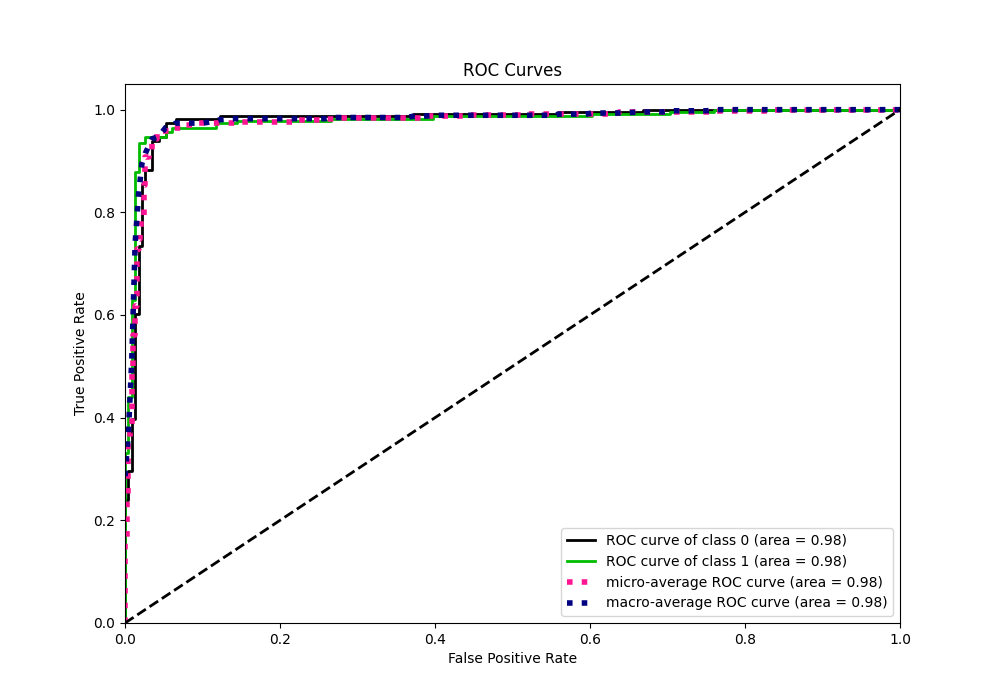
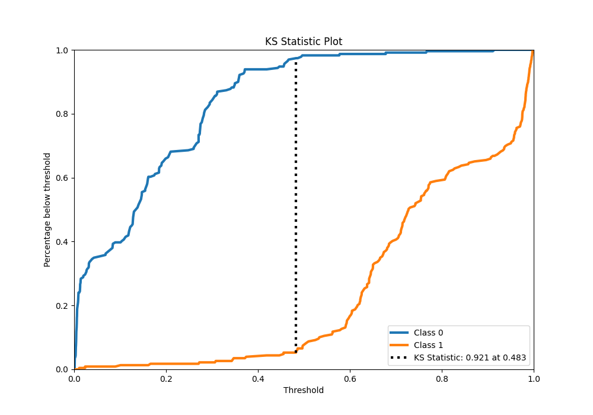
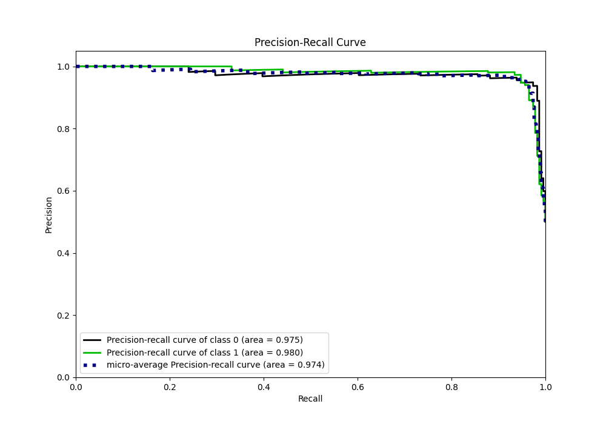
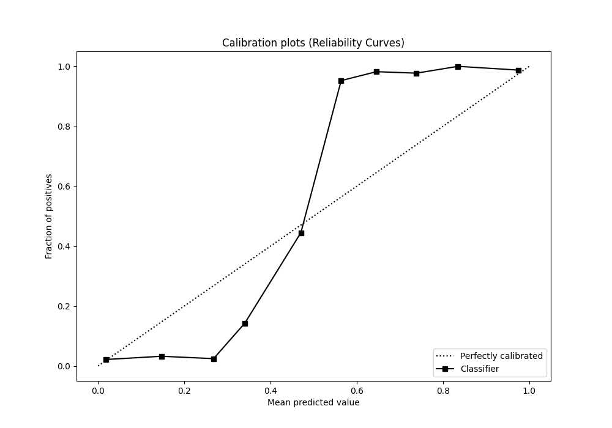
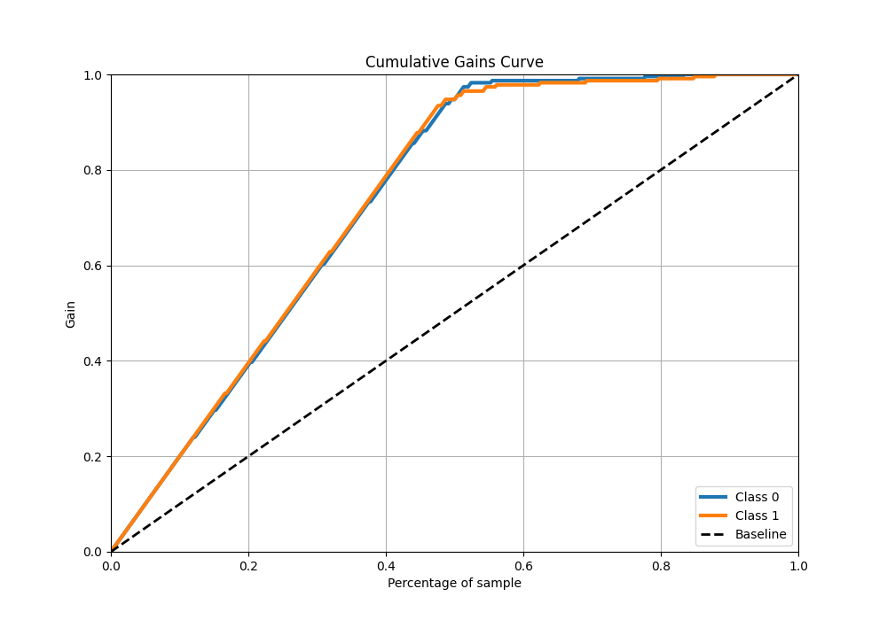
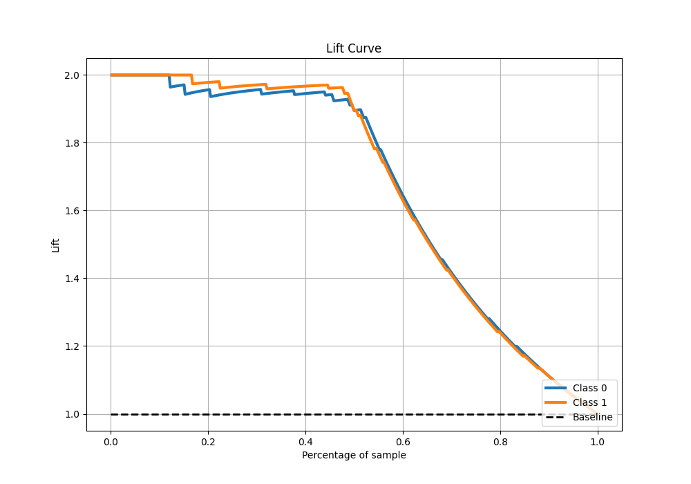

# Summary of 17_CatBoost

[<< Go back](../README.md)

## CatBoost
- **n_jobs**: -1
- **learning_rate**: 0.1
- **depth**: 7
- **rsm**: 1.0
- **loss_function**: Logloss
- **eval_metric**: average_precision
- **explain_level**: 1

## Validation
 - **validation_type**: kfold
 - **k_folds**: 5
 - **shuffle**: True
 - **stratify**: True

## Optimized metric
average_precision

## Training time

35.6 seconds

## Metric details
|           |    score |     threshold |
|:----------|---------:|--------------:|
| logloss   | 0.270773 | nan           |
| auc       | 0.978719 | nan           |
| f1        | 0.955947 |   0.465674    |
| accuracy  | 0.956332 |   0.465674    |
| precision | 1        |   0.930674    |
| recall    | 1        |   0.000994834 |
| mcc       | 0.913919 |   0.497215    |

## Metric details with threshold from accuracy metric
|           |    score |   threshold |
|:----------|---------:|------------:|
| logloss   | 0.270773 |  nan        |
| auc       | 0.978719 |  nan        |
| f1        | 0.955947 |    0.465674 |
| accuracy  | 0.956332 |    0.465674 |
| precision | 0.964444 |    0.465674 |
| recall    | 0.947598 |    0.465674 |
| mcc       | 0.912803 |    0.465674 |

## Confusion matrix (at threshold=0.465674)
|              |   Predicted as 0 |   Predicted as 1 |
|:-------------|-----------------:|-----------------:|
| Labeled as 0 |              221 |                8 |
| Labeled as 1 |               12 |              217 |

## Learning curves

## Permutation-based Importance

## Confusion Matrix

## Normalized Confusion Matrix

## ROC Curve

## Kolmogorov-Smirnov Statistic

## Precision-Recall Curve

## Calibration Curve

## Cumulative Gains Curve

## Lift Curve

[<< Go back](../README.md)
