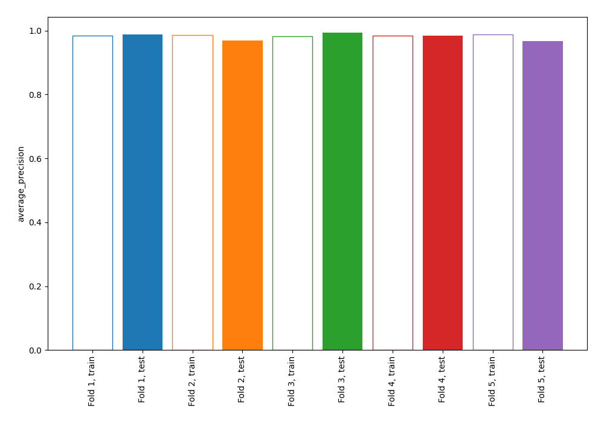
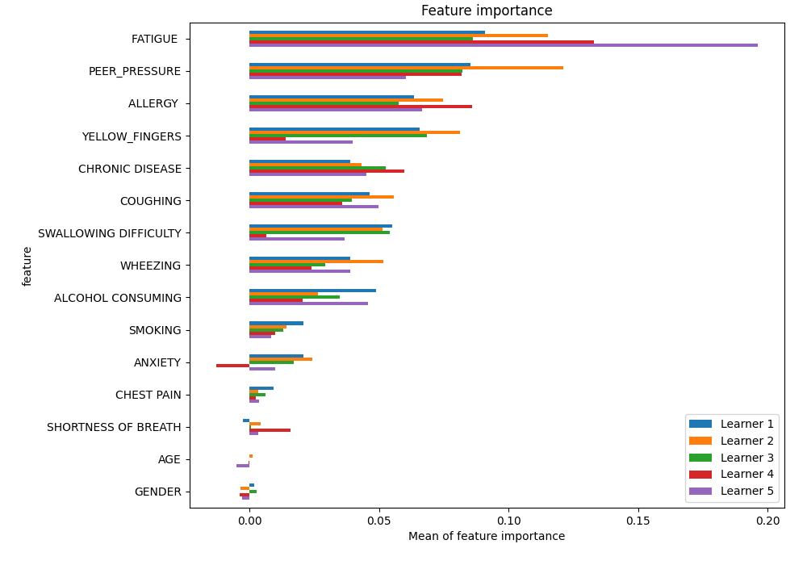
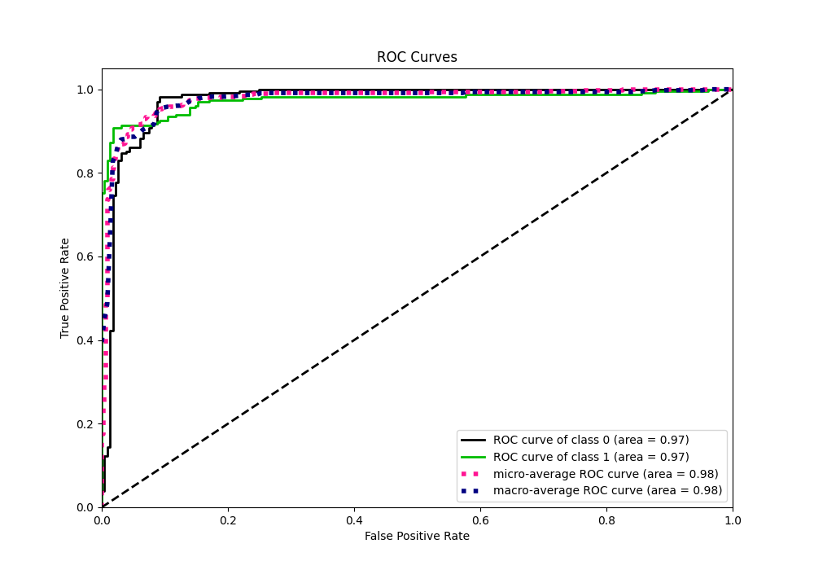
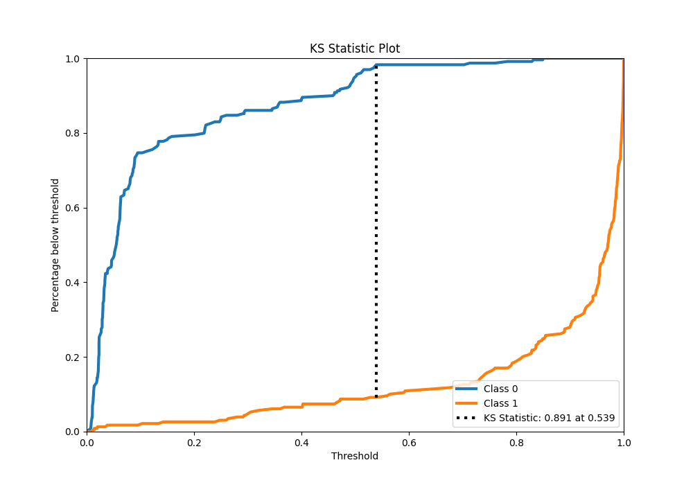
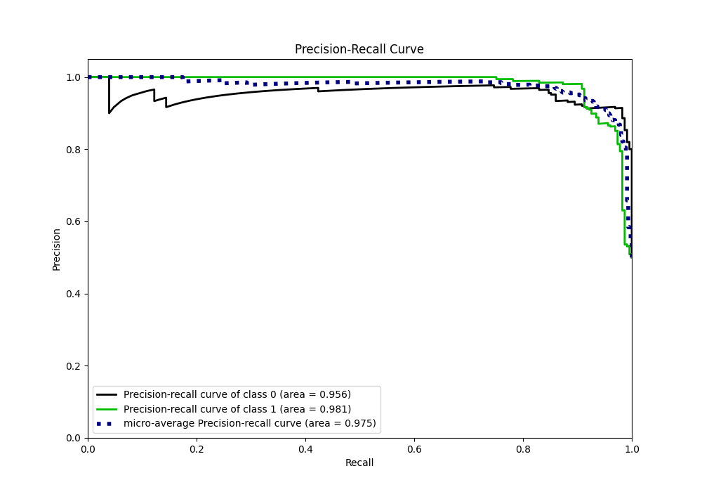
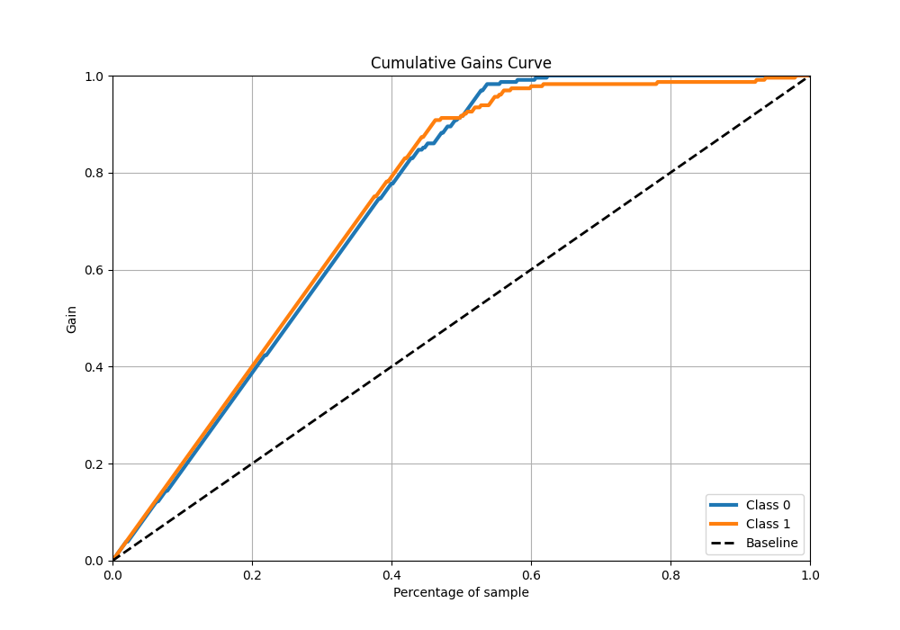
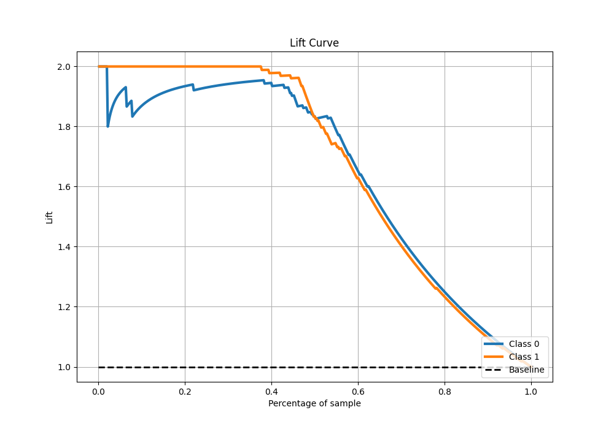

# Summary of 1_Linear

[<< Go back](../README.md)

## Logistic Regression (Linear)
- **n_jobs**: -1
- **explain_level**: 1

## Validation
 - **validation_type**: kfold
 - **k_folds**: 5
 - **shuffle**: True
 - **stratify**: True

## Optimized metric
average_precision

## Training time

36.4 seconds

## Metric details
|           |    score |    threshold |
|:----------|---------:|-------------:|
| logloss   | 0.192042 | nan          |
| auc       | 0.974028 | nan          |
| f1        | 0.941176 |   0.538017   |
| accuracy  | 0.943231 |   0.538017   |
| precision | 1        |   0.88594    |
| recall    | 1        |   0.00697453 |
| mcc       | 0.888635 |   0.538017   |

## Metric details with threshold from accuracy metric
|           |    score |   threshold |
|:----------|---------:|------------:|
| logloss   | 0.192042 |  nan        |
| auc       | 0.974028 |  nan        |
| f1        | 0.941176 |    0.538017 |
| accuracy  | 0.943231 |    0.538017 |
| precision | 0.976526 |    0.538017 |
| recall    | 0.908297 |    0.538017 |
| mcc       | 0.888635 |    0.538017 |

## Confusion matrix (at threshold=0.538017)
|              |   Predicted as 0 |   Predicted as 1 |
|:-------------|-----------------:|-----------------:|
| Labeled as 0 |              224 |                5 |
| Labeled as 1 |               21 |              208 |

## Learning curves

## Coefficients
| feature               |   Learner_1 |   Learner_2 |   Learner_3 |   Learner_4 |   Learner_5 |
|:----------------------|------------:|------------:|------------:|------------:|------------:|
| PEER_PRESSURE         |   2.09855   |   1.97751   |   2.10596   |   2.24214   |    2.11845  |
| ALLERGY               |   1.71851   |   1.8115    |   1.80494   |   1.6434    |    1.99987  |
| CHRONIC DISEASE       |   1.87657   |   1.63242   |   1.72145   |   1.71654   |    1.80335  |
| YELLOW_FINGERS        |   1.60769   |   1.59401   |   1.57961   |   1.70178   |    1.69653  |
| SWALLOWING DIFFICULTY |   1.54115   |   1.39416   |   1.52935   |   1.57504   |    1.50732  |
| COUGHING              |   1.6269    |   1.44695   |   1.61924   |   1.30983   |    1.45889  |
| WHEEZING              |   1.39098   |   1.33944   |   1.35351   |   1.6218    |    1.23305  |
| ALCOHOL CONSUMING     |   1.2172    |   1.51097   |   1.01974   |   1.43756   |    1.6208   |
| FATIGUE               |   1.22949   |   1.23666   |   1.24562   |   1.05542   |    1.27239  |
| ANXIETY               |   0.676465  |   1.11655   |   0.820949  |   1.03973   |    0.927658 |
| CHEST PAIN            |   0.451082  |   0.609851  |   0.301484  |   0.389733  |    0.68452  |
| SMOKING               |   0.404751  |   0.352542  |   0.398707  |   0.489795  |    0.317827 |
| SHORTNESS OF BREATH   |   0.222579  |   0.360146  |   0.254631  |   0.399099  |    0.113896 |
| AGE                   |  -0.0683001 |   0.0651653 |   0.0293103 |  -0.0196802 |    0.14053  |
| GENDER                |  -0.0705105 |  -0.180772  |  -0.240995  |  -0.128562  |    0.147742 |
| intercept             |  -4.88958   |  -5.06286   |  -4.78165   |  -5.16035   |   -5.28215  |

## Permutation-based Importance

## Confusion Matrix

## Normalized Confusion Matrix

## ROC Curve

## Kolmogorov-Smirnov Statistic

## Precision-Recall Curve

## Calibration Curve

## Cumulative Gains Curve

## Lift Curve

[<< Go back](../README.md)
