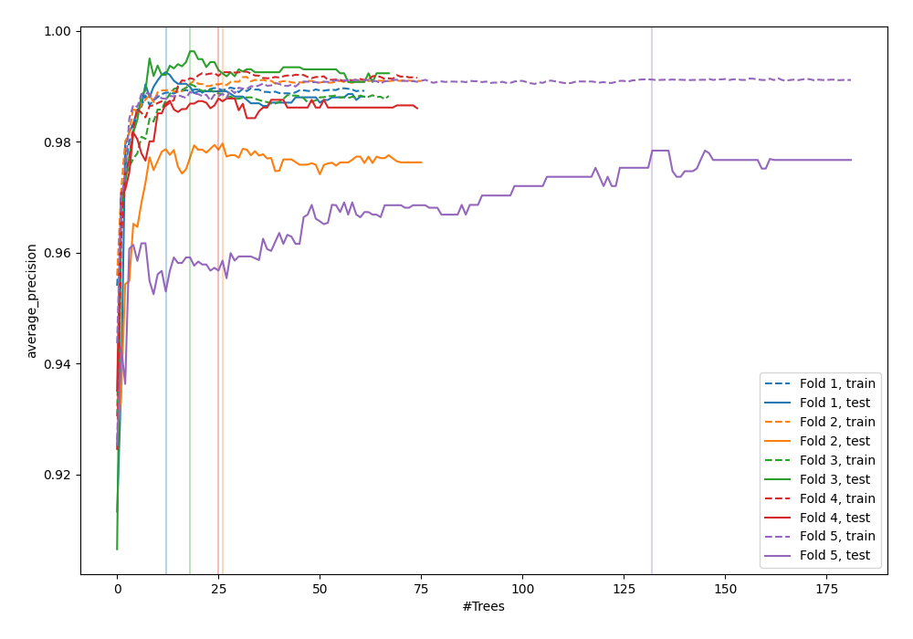
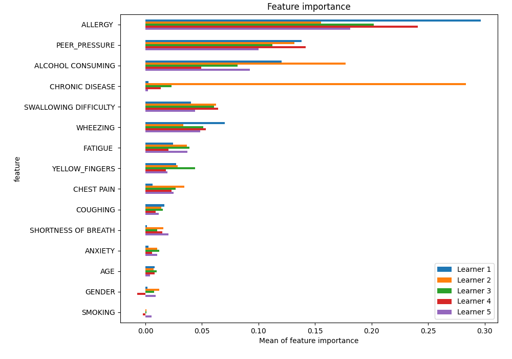
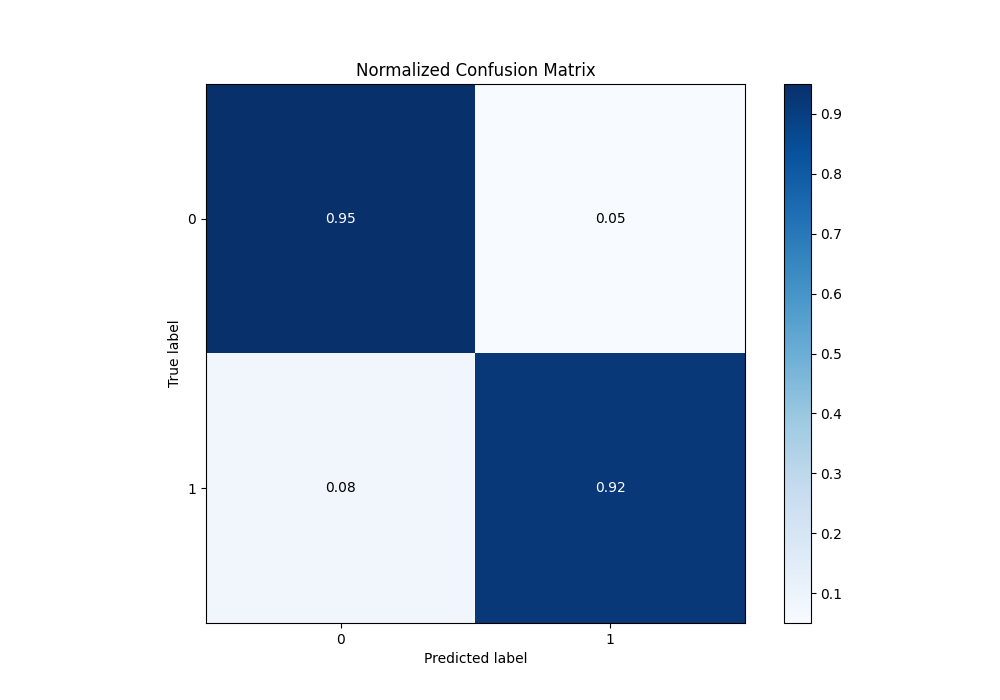
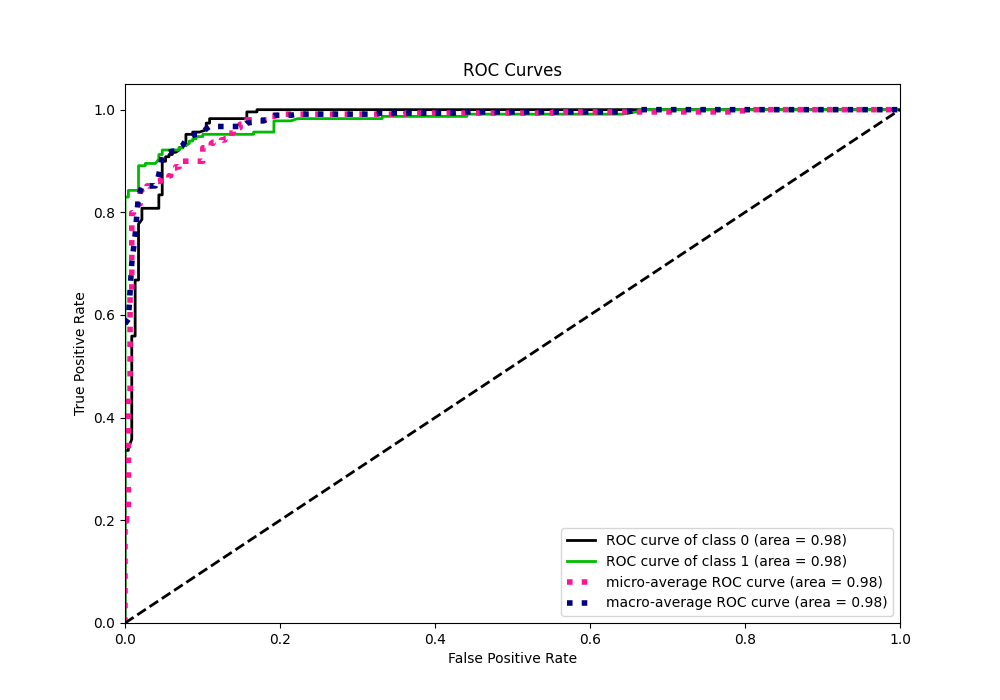
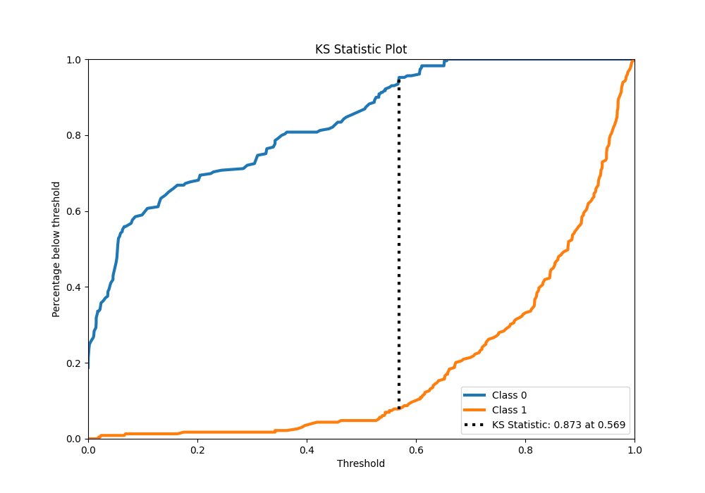
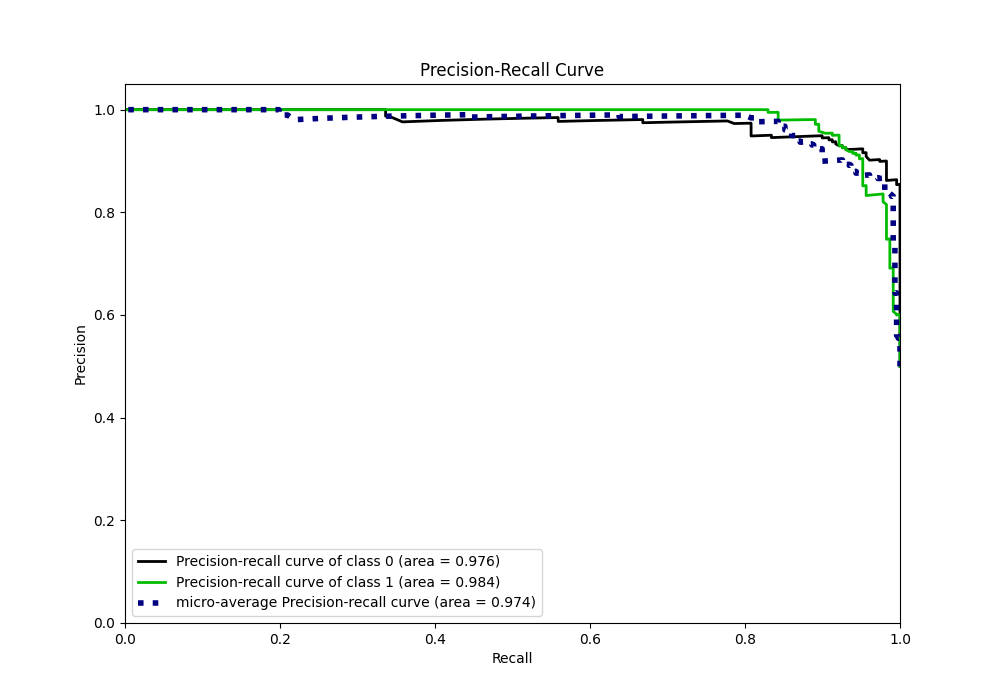
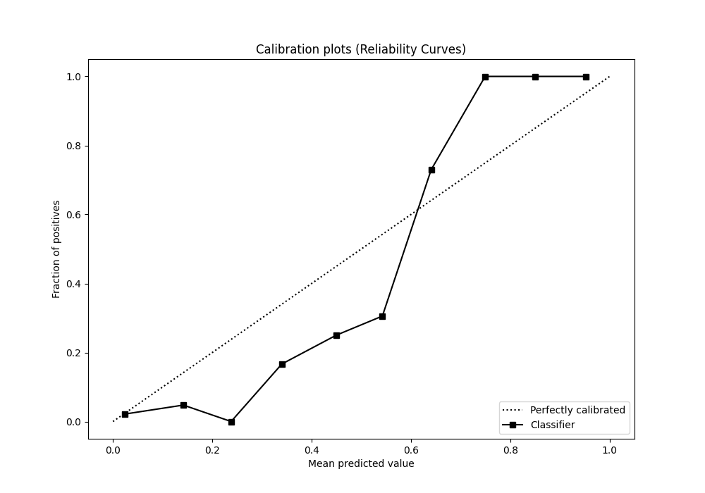
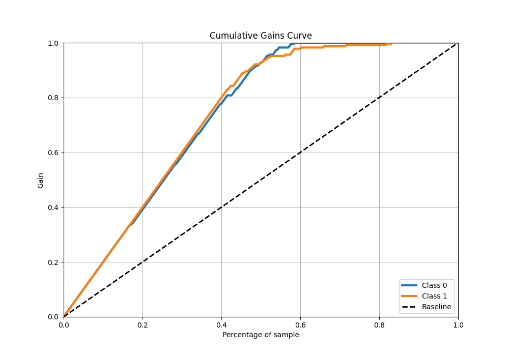
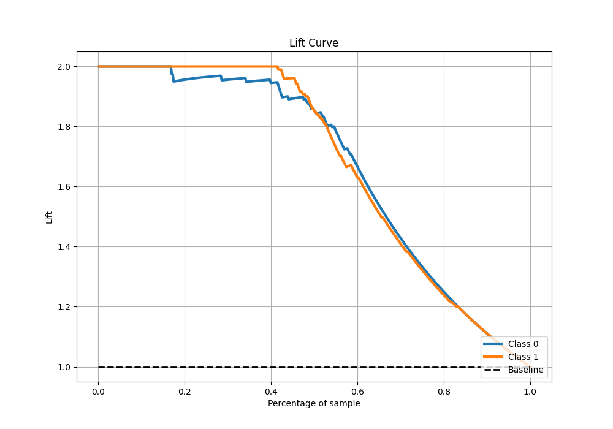

# Summary of 20_RandomForest

[<< Go back](../README.md)

## Random Forest
- **n_jobs**: -1
- **criterion**: gini
- **max_features**: 0.7
- **min_samples_split**: 30
- **max_depth**: 7
- **eval_metric_name**: average_precision
- **explain_level**: 1

## Validation
 - **validation_type**: kfold
 - **k_folds**: 5
 - **shuffle**: True
 - **stratify**: True

## Optimized metric
average_precision

## Training time

36.5 seconds

## Metric details
|           |    score |   threshold |
|:----------|---------:|------------:|
| logloss   | 0.239429 |  nan        |
| auc       | 0.980273 |  nan        |
| f1        | 0.933628 |    0.568717 |
| accuracy  | 0.934498 |    0.568717 |
| precision | 1        |    0.659086 |
| recall    | 1        |    0        |
| mcc       | 0.872329 |    0.610506 |

## Metric details with threshold from accuracy metric
|           |    score |   threshold |
|:----------|---------:|------------:|
| logloss   | 0.239429 |  nan        |
| auc       | 0.980273 |  nan        |
| f1        | 0.933628 |    0.568717 |
| accuracy  | 0.934498 |    0.568717 |
| precision | 0.946188 |    0.568717 |
| recall    | 0.921397 |    0.568717 |
| mcc       | 0.869294 |    0.568717 |

## Confusion matrix (at threshold=0.568717)
|              |   Predicted as 0 |   Predicted as 1 |
|:-------------|-----------------:|-----------------:|
| Labeled as 0 |              217 |               12 |
| Labeled as 1 |               18 |              211 |

## Learning curves

## Permutation-based Importance

## Confusion Matrix

## Normalized Confusion Matrix

## ROC Curve

## Kolmogorov-Smirnov Statistic

## Precision-Recall Curve

## Calibration Curve

## Cumulative Gains Curve

## Lift Curve

[<< Go back](../README.md)
