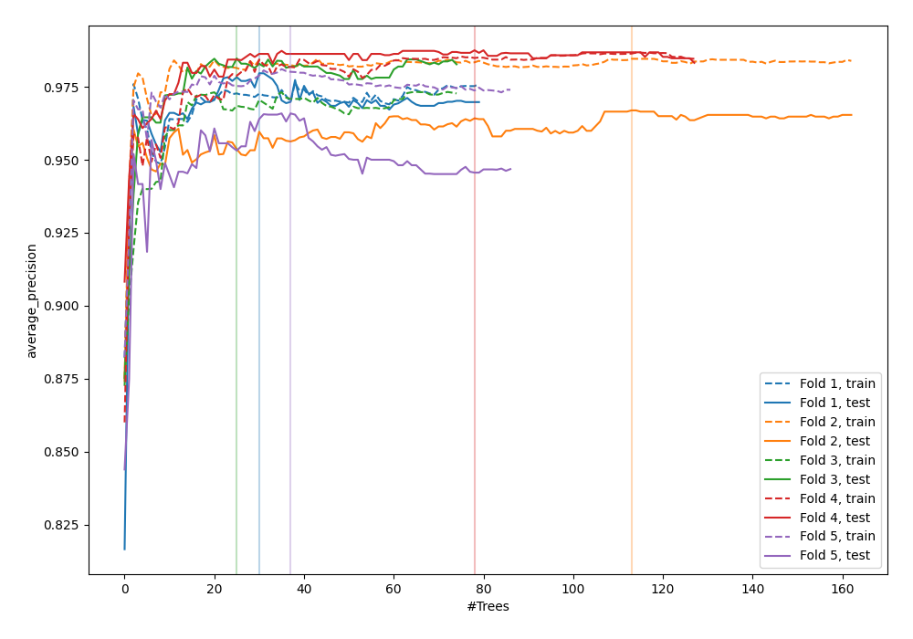
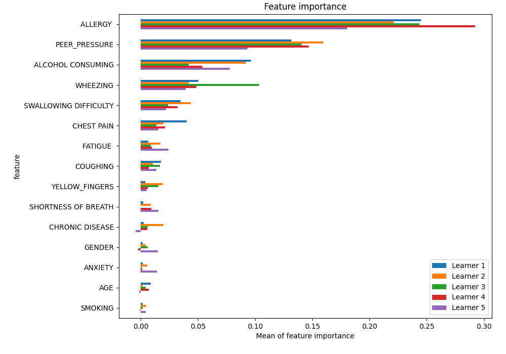
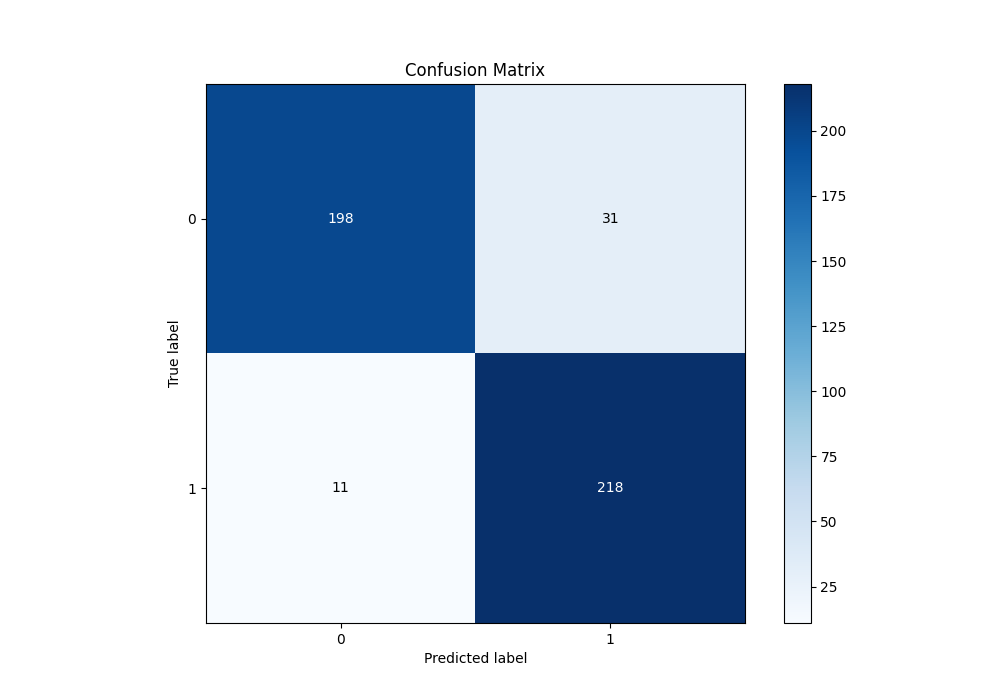
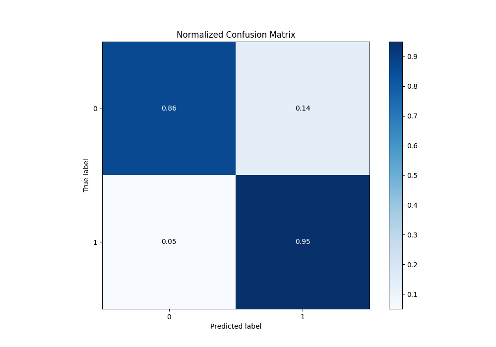
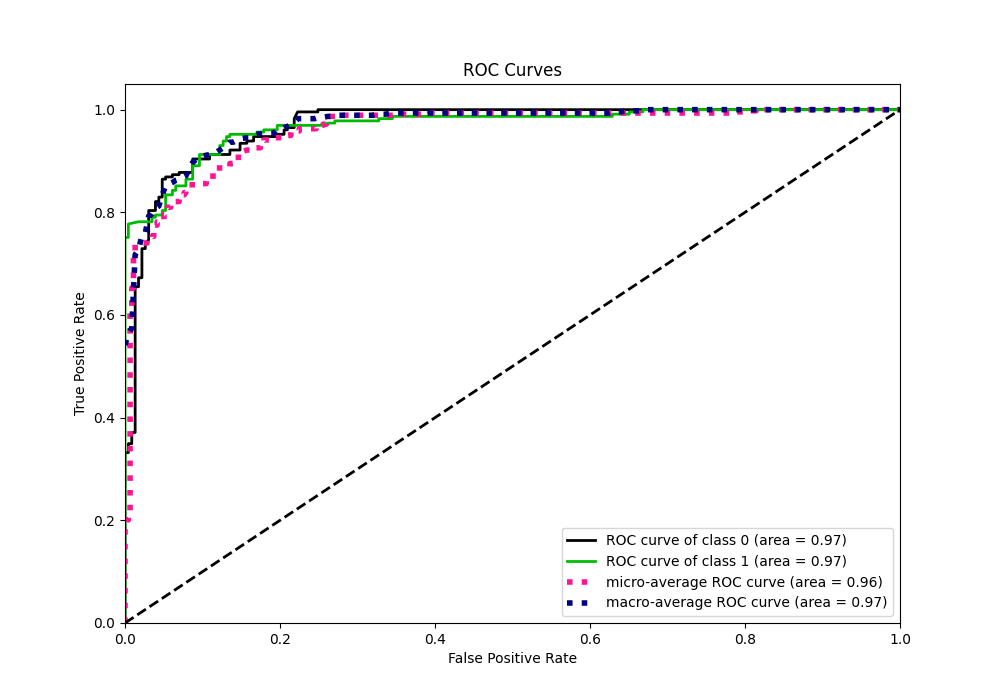
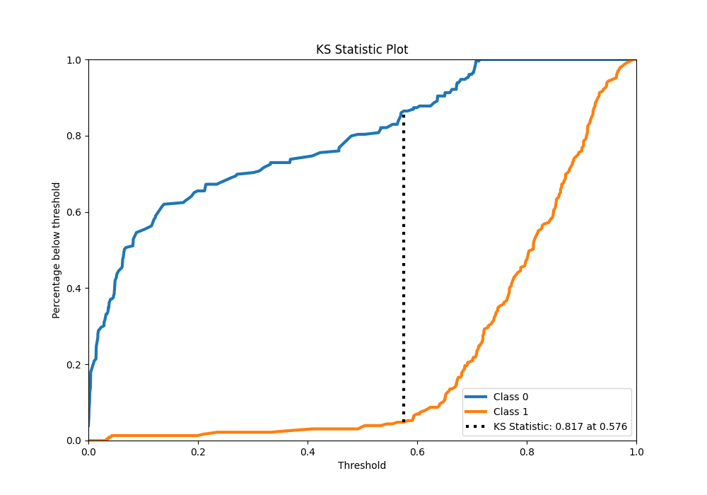
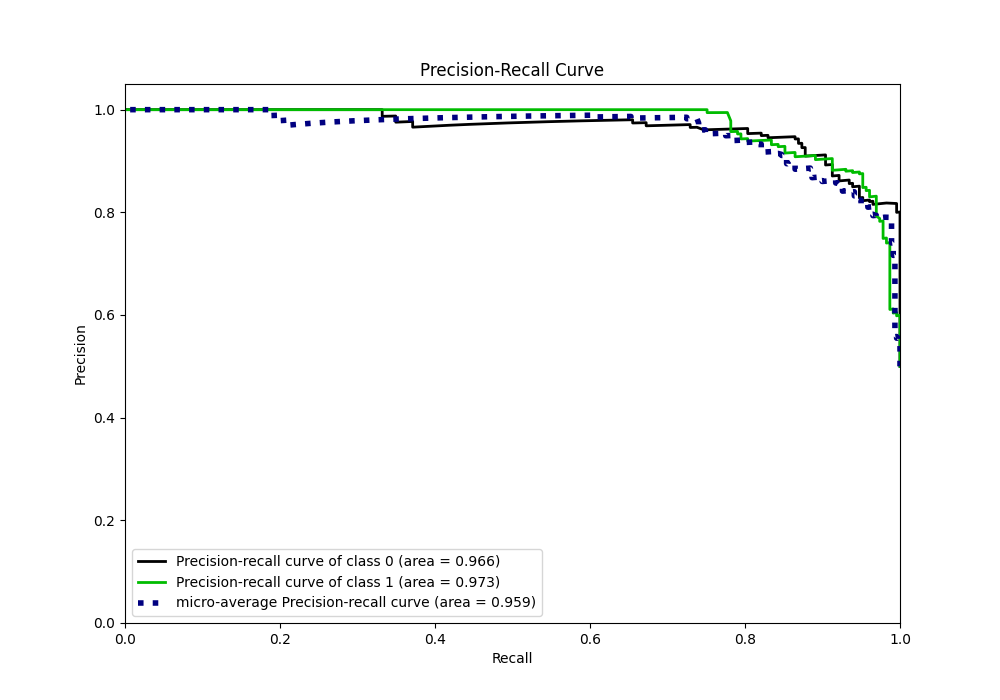
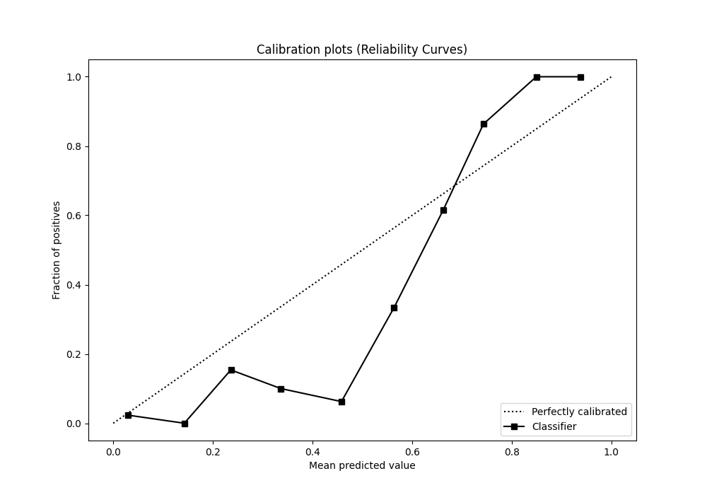
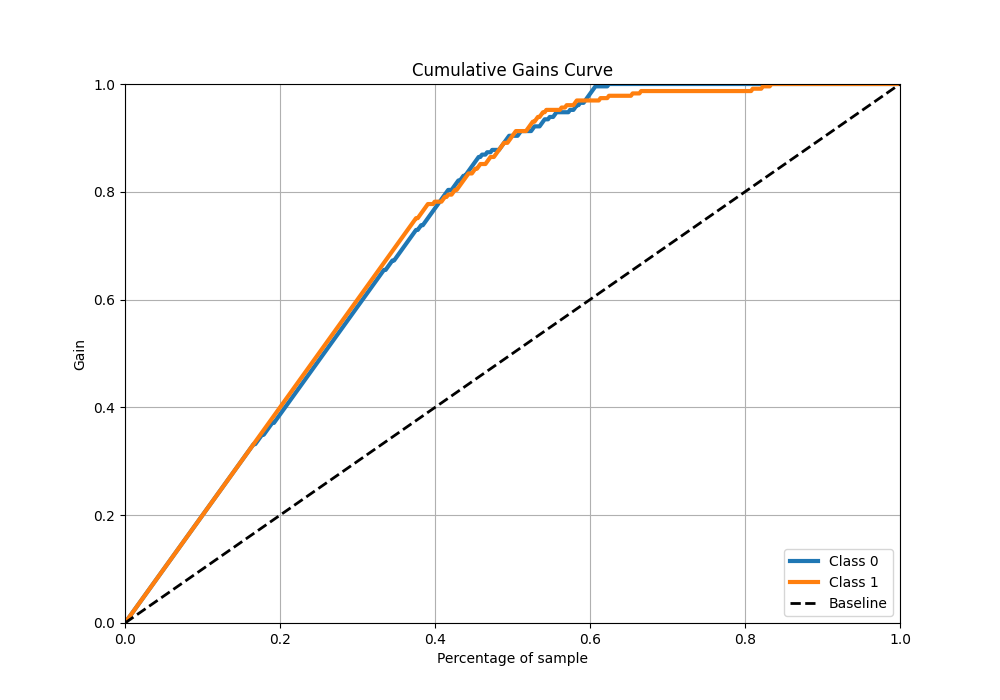
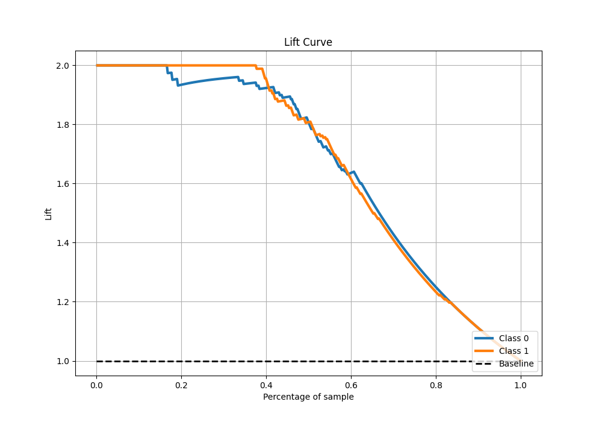

# Summary of 22_RandomForest

[<< Go back](../README.md)

## Random Forest
- **n_jobs**: -1
- **criterion**: entropy
- **max_features**: 0.6
- **min_samples_split**: 50
- **max_depth**: 6
- **eval_metric_name**: average_precision
- **explain_level**: 1

## Validation
 - **validation_type**: kfold
 - **k_folds**: 5
 - **shuffle**: True
 - **stratify**: True

## Optimized metric
average_precision

## Training time

37.4 seconds

## Metric details
|           |    score |   threshold |
|:----------|---------:|------------:|
| logloss   | 0.292899 |  nan        |
| auc       | 0.968851 |  nan        |
| f1        | 0.912134 |    0.579257 |
| accuracy  | 0.908297 |    0.579257 |
| precision | 1        |    0.719996 |
| recall    | 1        |    0        |
| mcc       | 0.819726 |    0.579257 |

## Metric details with threshold from accuracy metric
|           |    score |   threshold |
|:----------|---------:|------------:|
| logloss   | 0.292899 |  nan        |
| auc       | 0.968851 |  nan        |
| f1        | 0.912134 |    0.579257 |
| accuracy  | 0.908297 |    0.579257 |
| precision | 0.875502 |    0.579257 |
| recall    | 0.951965 |    0.579257 |
| mcc       | 0.819726 |    0.579257 |

## Confusion matrix (at threshold=0.579257)
|              |   Predicted as 0 |   Predicted as 1 |
|:-------------|-----------------:|-----------------:|
| Labeled as 0 |              198 |               31 |
| Labeled as 1 |               11 |              218 |

## Learning curves

## Permutation-based Importance

## Confusion Matrix

## Normalized Confusion Matrix

## ROC Curve

## Kolmogorov-Smirnov Statistic

## Precision-Recall Curve

## Calibration Curve

## Cumulative Gains Curve

## Lift Curve

[<< Go back](../README.md)
